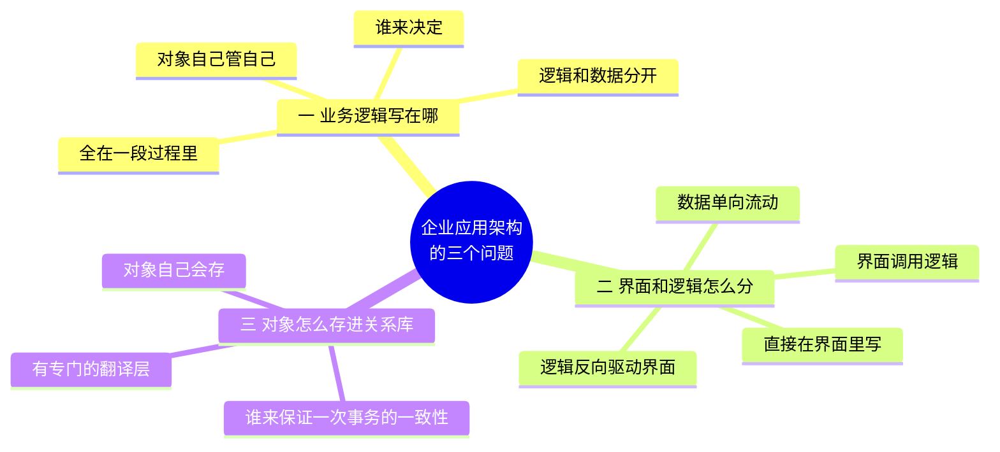

# 企业应用架构总纲：三个问题与一张地图

> 系列：企业应用架构。跨语言对比，语言版本在各自篇章标注。

## 生活比喻：街边小馆和米其林后厨

同样叫「餐厅」，后厨的组织方式可以差出十万八千里：

| | 街边小馆 | 米其林后厨 |
|---|---------|-----------|
| **谁做菜** | 老板一个人，从切菜到出锅 | 分工：切配、灶台、摆盘各有人 |
| **怎么点单** | 客人朝后厨喊一嗓子 | 前台写单 → 传菜员递进厨房 |
| **食材从哪来** | 老板自己去菜市场 | 库管统一管理，有台账有保质期 |
| **一道菜的流程** | 全在老板脑子里 | 标准化 SOP，每步可追溯 |

**注意：这不是「米其林更先进」的故事。** 街边小馆一天做 30 碗面，硬上米其林那套分工——切配、灶台、摆盘三个岗位——只会更慢、更乱、成本更高。

**你的规模决定你该怎么分工。** 这就是整个企业应用架构系列唯一的主线。

## 三个问题

把「餐厅怎么分工」翻译成软件，就是企业应用架构要回答的三个问题：

用后厨类比：

- **问题一**（领域逻辑）：后厨是一个人全包，还是分成岗位？
- **问题二**（表现层）：前台和后厨之间怎么传话？
- **问题三**（数据访问）：食材由厨师自己去仓库拿，还是有专门的库管？

**这三件事互相纠缠。** 你把业务逻辑放进对象里（问题一），数据访问就得跟着变（问题三）；你把界面和逻辑彻底分开（问题二），业务逻辑的入口就多了一层（问题一）。架构模式从来没有「单独正确」的选项。

## 一张地图：这些模式都在哪

这个系列要讲的模式，全部落在三个问题 × 复杂度的网格里：

```mermaid
flowchart TB
    subgraph Q1["问题一：业务逻辑写在哪"]
        direction LR
        T1["事务脚本<br/>简单直白"] --> T2["活动记录<br/>对象管自己"]
        T2 --> T3["数据映射器<br/>逻辑与存储解耦"]
        T3 --> T4["领域模型<br/>复杂业务"]
    end

    subgraph Q2["问题二：界面和逻辑怎么分"]
        direction LR
        V1["MVC"] --> V2["MVP"]
        V2 --> V3["MVVM"]
        V3 --> V4["Flux / Redux"]
    end

    subgraph Q3["问题三：对象怎么存"]
        direction LR
        D1["手写 SQL"] --> D2["DAO"]
        D2 --> D3["仓储"]
        D3 --> D4["工作单元"]
    end

    subgraph CROSS["横切：横向分几层"]
        direction LR
        L1["三层架构"] --> L2["服务层"] --> L3["六边形 / Clean"]
    end

    T1 -.->|"规模变大<br/>复杂度上升"| T4
    V1 -.->|"平台变迁"| V4
    D1 -.->|"规模变大"| D4

    style T1 fill:#16213e,stroke:#e94560,color:#fff
    style T2 fill:#0f3460,stroke:#e94560,color:#fff
    style T3 fill:#533483,stroke:#e94560,color:#fff
    style T4 fill:#1a2e1b,stroke:#53d769,color:#fff
    style V1 fill:#16213e,stroke:#e94560,color:#fff
    style V2 fill:#0f3460,stroke:#e94560,color:#fff
    style V3 fill:#533483,stroke:#e94560,color:#fff
    style V4 fill:#1a2e1b,stroke:#53d769,color:#fff
    style D1 fill:#16213e,stroke:#e94560,color:#fff
    style D2 fill:#0f3460,stroke:#e94560,color:#fff
    style D3 fill:#533483,stroke:#e94560,color:#fff
    style D4 fill:#1a2e1b,stroke:#53d769,color:#fff
    style L1 fill:#3e1a1a,stroke:#e94560,color:#fff
    style L2 fill:#3e1a1a,stroke:#e94560,color:#fff
    style L3 fill:#3e1a1a,stroke:#e94560,color:#fff
```

**这张图的读法是「从左上到右下」**：越靠上越简单，越靠下越适合复杂系统。**每一个箭头都是「上一个方案在什么情况下撑不住了」**，而不是「新方案更高级」。

## 一条主线贯穿全系列

这个系列里每一个模式，都要回答同一个句式的问题：

> **上一个方案在什么情况下会崩？**

举几个例子，你会在后面的文章里反复看到这个结构：

| 模式 | 它回答的「上一个方案的崩溃点」 |
|------|------------------------------|
| 活动记录 | 事务脚本里同一段业务逻辑，在 5 个地方重复了 |
| 数据映射器 | 业务对象继承了数据库基类，换个库要重写整个领域层 |
| MVP | View 里塞满了逻辑，一条测试都写不出来 |
| MVVM | Presenter 里 80% 的代码在手工同步 View 状态 |
| Flux | 双向绑定的数据流成环，一个计数器 bug 查了两天 |
| 仓储 | 业务代码里到处是 `SELECT * FROM`，换个 ORM 全炸 |
| 聚合根 | 一次订单修改锁了 200 行，并发直接崩 |
| 限界上下文 | 同一个「用户」在营销和风控里是两回事，硬合并成一个模型 |

**没有一条是「因为它更好」。** 全是「因为旧的在这个场景下不行了」。

## 四个必须提前说清的立场

在开始之前，有四句话得说在前面，否则后面每一篇都会读歪：

**① 架构模式是特定约束下的产物，不是普适真理**

MVC 诞生于 1979 年的 Smalltalk——那时候 GUI 刚出现，一个画布要保持和数据同步是全新问题。今天你用 React，框架已经把「数据变了视图怎么更新」这件事接管了。**你不需要「实现 MVC」，你只需要理解它为什么那样设计。**

这和 [设计模式：Rust 视角](../design-patterns/index.md) 里那条主线是同一件事：

> **架构模式从「你手写的结构」变成「框架内建的约束」——正如设计模式从「你手写的样板」变成「语言内建的特性」。**

**② 同名不同物比想象中严重**

「MVC」这个词在 Smalltalk、Rails、iOS、Backbone 里指的是**四种不同的东西**。几乎所有人第一次学 MVC 时的困惑，都来自把其中一个当成了标准答案。

所以本系列每讲一个模式，都要先问：**说的是谁家的版本？**

**③ 复杂度决定选型，不是先进程度决定选型**

这是本文开头那个比喻的落点。给一个 CRUD 后台管理系统上 Clean Architecture + DDD 聚合根，和给街边小馆配三个厨师岗位，是同一种错误。

**④ 每个模式都要配一个反例**

尤其到 DDD 那几篇——「聚合根」「限界上下文」这类词天然带光圈，特别容易写成布道文。所以从第 14 篇起，每篇都会带上「划错了会怎样」的具体后果。

## 怎么读这个系列

**按顺序读**：从第 1 篇到第 19 篇是一条连续的复杂度递进线。

**跳读**：三个问题各自独立，可以只看你关心的那条线：

```mermaid
flowchart LR
    subgraph L1["只想懂业务逻辑怎么写"]
        A1["01 事务脚本"] --> A2["02 活动记录"] --> A3["03 数据映射器"] --> A4["04 贫血 vs 充血"]
    end

    subgraph L2["只想懂界面怎么分层"]
        B1["05 MVC"] --> B2["06 MVP"] --> B3["07 MVVM"] --> B4["08 Flux"]
    end

    subgraph L3["只想懂分层和依赖"]
        C1["09 三层"] --> C2["10 六边形/Clean"] --> C3["11 服务层"]
    end

    subgraph L4["在做复杂业务系统"]
        D1["14 实体/值对象"] --> D2["15 聚合根"] --> D3["16 限界上下文"] --> D4["17 防腐层"]
    end

    style A1 fill:#16213e,stroke:#e94560,color:#fff
    style A2 fill:#16213e,stroke:#e94560,color:#fff
    style A3 fill:#16213e,stroke:#e94560,color:#fff
    style A4 fill:#1a2e1b,stroke:#53d769,color:#fff
    style B1 fill:#0f3460,stroke:#e94560,color:#fff
    style B2 fill:#0f3460,stroke:#e94560,color:#fff
    style B3 fill:#0f3460,stroke:#e94560,color:#fff
    style B4 fill:#1a2e1b,stroke:#53d769,color:#fff
    style C1 fill:#533483,stroke:#e94560,color:#fff
    style C2 fill:#533483,stroke:#e94560,color:#fff
    style C3 fill:#1a2e1b,stroke:#53d769,color:#fff
    style D1 fill:#3e1a1a,stroke:#e94560,color:#fff
    style D2 fill:#3e1a1a,stroke:#e94560,color:#fff
    style D3 fill:#3e1a1a,stroke:#e94560,color:#fff
    style D4 fill:#1a2e1b,stroke:#53d769,color:#fff
```

**先看第 19 篇**：如果你时间有限，直接跳到最后一篇《什么时候这些全是过度设计》——知道什么时候**不**用，比知道怎么用更值钱。

## 这个系列从哪来的

主要参考 **Martin Fowler《Patterns of Enterprise Application Architecture》**（2002）。这本书 20 多年后依然是最准确的坐标系，因为它不是罗列模式，而是**先切出问题，再给答案**。

需要说明的是：**书里并不是「三分法」**。它是一本 duplex book——前半是叙述（讲分层、怎么组织领域逻辑、怎么映射到关系库、Web 表现层……），后半是模式参考，四十来个模式分成 **10 类**（领域逻辑、数据源架构、对象-关系行为/结构/元数据映射、Web 表现、分布式、离线并发、会话状态、基础模式）。

**本系列借用了其中三类作为骨架**——领域逻辑、表现层（书里叫 Web Presentation）、数据源。这是为了组织内容的取舍，不是 Fowler 的原结构。

DDD 部分参考 **Eric Evans《Domain-Driven Design》**（2003）和后续的实践修正。

但这两本书都有个共同问题：**例子是 Java/C# 的，场景是 2000 年代的企业应用。** 这个系列会补上 20 年后的部分——那些模式今天变成什么样了，哪些已经被框架吃掉，哪些依然得自己写。

---

**系列进度：0/19。**下一篇进入第一个问题：[事务脚本](01-transaction-script.md)——最直白也最被低估的写法。
