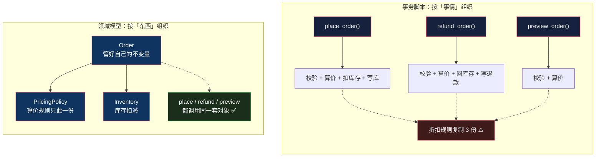

# 事务脚本：最直白也最被低估的写法

> 系列：企业应用架构（1/19）。代码用 Python 3.12 演示，末尾附其他语言对照。

## 生活比喻：小馆老板的脑子

回到[总纲](00-overview.md)那个比喻。街边小馆的老板是怎么做菜的？

**他脑子里装的是一条条流程**：「客人点了牛肉面 → 烧水 → 下面 → 加牛肉 → 端出去」。他不会先抽象出一个「面」的对象，再给它设计一套「烹饪方法」。

这就是事务脚本：**按「事情」组织代码**，而不是按「东西」。

## 什么是事务脚本

名字里的「事务」不是数据库事务，而是**业务事务**——一次完整的业务操作。

> **一个业务用例 = 一个函数，从入口一路写到落库。**

最典型的形态就是框架里的路由处理函数：

```python
@app.route("/orders", methods=["POST"])
def create_order():
    # 校验 → 算钱 → 扣库存 → 写库
    ...
```

**注意：这不是「新手才会写的东西」。** Django 的 view function、Flask 的 route handler、Spring 的 `@Transactional` service 方法——这些框架默认鼓励的形态，全都是事务脚本。

## 完整的样子

场景是后面几篇都会复用的同一个：**下单**。要校验用户、查库存、算折扣、扣库存、写订单。

```python
def place_order(conn, user_id: int, items: list[dict]) -> dict:
    """items: [{"sku": "A001", "qty": 2}]"""
    # ① 校验用户
    row = conn.execute("SELECT vip_level FROM users WHERE id = ?", (user_id,)).fetchone()
    if row is None:
        raise ValueError("用户不存在")
    vip_level = row[0]

    # ② 算钱 + 查库存
    total = 0.0
    for item in items:
        sku, qty = item["sku"], item["qty"]
        row = conn.execute("SELECT price, stock FROM products WHERE sku = ?", (sku,)).fetchone()
        if row is None:
            raise ValueError(f"商品不存在: {sku}")
        price, stock = row
        if stock < qty:
            raise ValueError(f"库存不足: {sku}")
        total += price * qty

    # ③ 折扣规则
    if vip_level >= 3:
        total *= 0.9
    elif vip_level >= 1:
        total *= 0.95
    if total > 1000:
        total -= 50

    # ④ 扣库存 + 写订单
    for item in items:
        conn.execute("UPDATE products SET stock = stock - ? WHERE sku = ?",
                     (item["qty"], item["sku"]))
    cur = conn.execute(
        "INSERT INTO orders (user_id, total, status) VALUES (?, ?, 'created')",
        (user_id, total))
    order_id = cur.lastrowid
    for item in items:
        conn.execute("INSERT INTO order_items (order_id, sku, qty) VALUES (?, ?, ?)",
                     (order_id, item["sku"], item["qty"]))
    conn.commit()
    return {"order_id": order_id, "total": round(total, 2)}
```

跑起来：

```console
$ python3 ts.py
下单前 B002 库存: 5
订单: {'order_id': 1, 'total': 540.0}        # VIP3：600 × 0.9
下单后 B002 库存: 3
订单: {'order_id': 2, 'total': 1050.0}       # 1100 满减 50
预期失败: 库存不足: A001
```

**从上往下读一遍，你就完全理解这个系统怎么下单了。** 这是事务脚本最大的优点，也是它最容易被忽略的优点。


**代码结构和业务流程图是同构的。** 这是判断一个系统该不该用事务脚本最实用的标准：如果你的业务能用一张流程图说完，事务脚本就是最合适的表达。

## 三个被低估的优点

事务脚本在「架构圈」里的名声很差，经常被当成「需要被重构掉的遗留代码」。这不公平。它有三个真实优势：

**① 可读性和业务流程图同构**

上面那张图。业务人员画一张流程图，你能直接对着写出函数。反过来，从函数也能画出流程图。**换成领域模型，这层对应关系就断了**——你得先理解对象之间的协作，才能还原出业务流程。

**② 没有对象-关系映射的开销**

没有 ORM、没有延迟加载、没有 N+1、没有「这个对象为什么是代理类」。**你写什么 SQL 就是什么 SQL**，性能完全可控。

这一点在报表、批处理、数据迁移场景里是决定性的——那些场景里 ORM 生成的东西你一眼都不想看。

**③ 调试链条短**

一个 HTTP 请求进来，你知道所有逻辑都在 `place_order` 里。打断点、加日志，位置是确定的。

领域模型里，「为什么这个订单总价不对」可能要追过 `Order` → `PricingPolicy` → `DiscountRule` → `VipLevel` 四个对象——好处是每个都小，坏处是**你得多跳几次才能拼出全貌**。

## 它什么时候崩

事务脚本不是「低级」，它是**在大规模复杂业务下会崩**。崩溃信号很具体，不是感觉：

### 信号一：同一段业务规则出现在多个事务里

最经典的翻车现场。系统上线三个月后，产品提了三个需求：

- 「加个退款功能」→ 写 `refund_order()`
- 「下单前要给用户看价格预览」→ 写 `preview_order()`
- 「购物车要显示优惠后价格」→ 写 `calc_cart_total()`

于是那段折扣规则被复制了三份：

```python
# place_order() 里
if vip_level >= 3:   total *= 0.9
elif vip_level >= 1: total *= 0.95
if total > 1000:     total -= 50

# refund_order() 里 —— 一模一样
if vip_level >= 3:   total *= 0.9
elif vip_level >= 1: total *= 0.95
if total > 1000:     total -= 50

# preview_order() 里 —— 还是一模一样
...
```

**然后产品说「满减改成满 800 减 50」。** 你搜了一遍，改了 3 个地方，上线后发现漏了第 4 个——那是两年前实习生写的 `admin_recalc()`。

**这是事务脚本的头号死因，而且它和「代码行数」无关。** 一个 50 行的函数，只要那段规则被复制了 4 份，就已经在崩了。

### 信号二：事务之间需要共享中间状态

下单要算价，退款要算价，改单也要算价。三个事务都需要「算价」这个中间产物。

事务脚本的解法是：**再写一个函数**。

```python
def calc_total(conn, user_id, items) -> float: ...
def calc_total_with_vip(conn, user_id, items) -> float: ...
def calc_total_for_preview(conn, user_id, items) -> float: ...   # 微妙的差异
```

到这里为止还行。但当「算价」本身开始有状态——比如需要记住用了哪条优惠券、哪个赠品被触发、哪个门槛刚好卡住——**这些状态没地方放**。函数只能返回一个 `float`，你无处寄存「过程中发生了什么」。

**领域模型的解法正好相反**：把「算价」变成一个对象的能力，过程的中间状态自然就成了对象的字段。

### 信号三：业务规则开始互相冲突

「VIP 折扣」和「满减」谁先算？「优惠券」能不能和「满减」叠加？「退货时赠品要不要退」？

在事务脚本里，这些冲突表现为**一堆 `if` 的嵌套**：

```python
if vip_level >= 3:
    if coupon and not is_promotion:
        ...
    elif is_promotion and stock_clearance:
        ...
```

到这一步，**规则之间的关系已经比规则本身更复杂了**——你需要一个能表达「规则之间怎么组合」的结构，而 `if/else` 表达不了。

## 第一个岔路口：按「事情」还是按「东西」

这是整个系列的第一个分水岭，也是后面 18 篇的基础。



一句话概括这条分水岭：

> **事务脚本的边界是「事情」（业务用例），领域模型的边界是「东西」（业务概念）。**

两种都对。**区别在于「同一段业务逻辑会被几个业务用例用到」。**

- 一个用例用到 → 事务脚本，代码离用例最近，最直白
- 三个以上用例用到 → 领域模型，逻辑必须有个「家」

## 反过来说：什么时候事务脚本是正解

如果你读到这里觉得「那赶紧上领域模型」，那就读反了。事务脚本在这几类场景里**是正确选择，不是妥协**：

| 场景 | 为什么事务脚本更合适 |
|------|---------------------|
| **CRUD 后台管理** | 业务逻辑约等于零，领域模型会把「改个字段」变成五个类 |
| **报表 / 数据导出** | 本质是 SQL 查询，用对象包装只会挡住 SQL |
| **批处理 / 定时任务** | 一条流程跑到底，没有复用的业务规则 |
| **数据迁移 / 一次性脚本** | 生命周期只有一次，投在架构上的时间回不来 |
| **原型 / MVP 阶段** | 业务规则还没稳定，过早抽象等于给错误的假设上保险 |

**判断标准还是那个比喻**：街边小馆一天做 30 碗面，就该老板一个人干。**问题不在于你用了事务脚本，而在于你的业务已经从「小馆」长成「米其林」，代码还停在原地。**

## 骨架代码

```python
# ========== 1. 事务脚本的基本形 ==========
def business_transaction(conn, ...):
    # ① 校验输入与前置条件
    # ② 读数据 —— 明确列出要什么，不搞懒加载
    # ③ 业务规则 —— 出现第二遍就该提出来
    # ④ 写数据 + 提交
    # ⑤ 返回结果

# ========== 2. 什么时候该把规则提出来 ==========
# 规则第一次出现：写在事务里
# 规则第二次出现：复制粘贴（先忍）
# 规则第三次出现：抽成函数 —— 三次法则
def calculate_discount(vip_level: int, subtotal: float) -> float:
    """被 3 个以上事务用到的东西，必须有名字"""
    ...

# ========== 3. 从困惑中识别重构时机 ==========
# 开始出现 calc_xxx / calc_xxx_v2 / calc_xxx_for_yyy
#   → 规则正在分裂，该给它一个对象了
# 开始出现 is_promotion and not coupon or stock_clearance
#   → 规则之间的关系比规则本身复杂了，该建模了
# 一个函数超过 100 行且 if 嵌套超过 3 层
#   → 该按业务概念拆了
```

## 总结

| 维度 | 事务脚本 |
|------|---------|
| 组织原则 | 按**事情**（业务用例） |
| 代码结构 | 和业务流程图同构 |
| 数据访问 | 直接 SQL，无映射层 |
| 优势 | 直白、可调试、性能可控、上手成本接近零 |
| 头号死因 | 同一段业务规则在多个事务里重复 |
| 崩溃信号 | 规则复制 ≥ 3 处；事务间要共享中间状态；规则之间的关系比规则本身复杂 |
| 适用 | CRUD、报表、批处理、迁移脚本、原型期 |
| 不适用 | 同一套业务规则被多个用例复用、规则需要组合 |

**一句话**：事务脚本不是「没设计」，它是最直接的设计。**它的崩溃从来不是因为「不够优雅」，而是因为业务规则长出了复用的需求，而函数给不了这些规则一个家。**

下一篇讲[活动记录](02-active-record.md)——当规则第一次有了「家」，会发生什么，代价是什么。

---

**相关文章：** [总纲](00-overview.md) · [设计模式：Rust 视角](../design-patterns/index.md) · [System Design 架构地图](../system-design/index.md)
