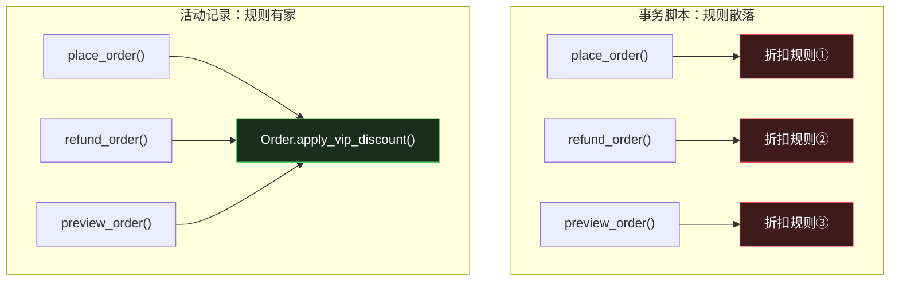

# 活动记录：让对象自己管自己

> 系列：企业应用架构（2/19）。代码用 Python 3.12 演示，附 Rails / Django 对照。

## 生活比喻：中等规模的店

[事务脚本](01-transaction-script.md)是街边小馆——老板脑子里装一条条流程。**活动记录是那种开了三五年的店**：客人多了，老板忙不过来，于是给每道菜配一个专属厨师。

**「牛肉面师傅」负责牛肉面的全部：** 他知道要多少面、多少牛肉、火候怎么控。你不用每次跟他讲一遍流程——**流程长在他身上了**。

这就是活动记录的核心：**把「做这道菜的规则」和「这道菜的食材」绑在同一个地方。**

## 什么是活动记录

一句话定义：

> **一个对象 = 数据库的一行 + 操作这一行的方法。**

这个模式最著名的实现是 Ruby on Rails 的 ActiveRecord（模式也因此得名），Python 的 Django ORM、PHP 的 Eloquent、Go 的 GORM 都是它的变体。

在 Rails 里长这样，你大概见过：

```ruby
class Order < ApplicationRecord
  def apply_vip_discount(vip_level)
    # 业务逻辑直接写在模型上
  end
end

order = Order.find(1)
order.apply_vip_discount(3)
order.save          # 对象自己知道怎么存自己
```

**注意 `order.save` 这一句。** 对象既持有数据、又持有业务规则、还知道怎么把自己写回数据库——三合一。这就是活动记录的定义性特征。

## 完整的样子

还是[下单那个场景](01-transaction-script.md#完整的样子)，换成活动记录：

```python
# ---------- 活动记录基类：对象自己知道怎么存自己 ----------
class ActiveRecord:
    table: str = ""
    columns: tuple[str, ...] = ()

    def save(self, conn):
        if self.id is None:
            cols = ", ".join(self.columns)
            ph = ", ".join("?" * len(self.columns))
            cur = conn.execute(
                f"INSERT INTO {self.table} ({cols}) VALUES ({ph})",
                tuple(getattr(self, c) for c in self.columns))
            self.id = cur.lastrowid
        else:
            sets = ", ".join(f"{c} = ?" for c in self.columns)
            conn.execute(f"UPDATE {self.table} SET {sets} WHERE id = ?",
                         (*[getattr(self, c) for c in self.columns], self.id))
        return self

    @classmethod
    def find_by(cls, conn, **kw):
        cond = " AND ".join(f"{k} = ?" for k in kw)
        row = conn.execute(f"SELECT * FROM {cls.table} WHERE {cond}",
                           tuple(kw.values())).fetchone()
        return None if row is None else cls(**dict(zip(("id",) + cls.columns, row)))


# ---------- 领域对象：数据 + 逻辑 + 持久化 ----------
class Product(ActiveRecord):
    table = "products"
    columns = ("sku", "price", "stock")

    def take(self, qty: int):
        """从库存里拿出来。不变量由对象自己守。"""
        if self.stock < qty:
            raise ValueError(f"库存不足: {self.sku}")
        self.stock -= qty
        return self


class Order(ActiveRecord):
    table = "orders"
    columns = ("user_id", "total", "status")

    # ★ 折扣规则住在 Order 上，不再是散落在各处的 if
    def apply_vip_discount(self, vip_level: int):
        if vip_level >= 3:
            self.total *= 0.9
        elif vip_level >= 1:
            self.total *= 0.95
        if self.total > 1000:
            self.total -= 50
        return self


def place_order(conn, user_id: int, items: list[dict]) -> dict:
    user = conn.execute("SELECT * FROM users WHERE id = ?", (user_id,)).fetchone()
    if user is None:
        raise ValueError("用户不存在")

    order = Order(user_id=user_id)

    for item in items:
        p = Product.find_by(conn, sku=item["sku"])
        if p is None:
            raise ValueError(f"商品不存在: {item['sku']}")
        p.take(item["qty"])                  # 对象自己校验并扣减
        order.total += p.price * item["qty"]
        p.save(conn)                         # 对象自己持久化

    order.apply_vip_discount(user[1])        # 规则在对象上
    order.save(conn)
    conn.commit()
    return {"order_id": order.id, "total": round(order.total, 2)}
```

跑起来：

```console
$ python3 ar.py
下单前 B002 库存: 5
订单: {'order_id': 1, 'total': 540.0}
下单后 B002 库存: 3
订单: {'order_id': 2, 'total': 1050.0}
预期失败: 库存不足: A001
```

**输出和事务脚本版本一字不差。** 这正是重点——**行为完全相同，组织方式不同**。

## 它治好了什么

回到事务脚本的三个崩溃信号，看看活动记录治好了哪个：

| 事务脚本的崩溃信号 | 活动记录 |
|-------------------|---------|
| 同一段规则在多个事务里重复 | ✅ **治好了**——`apply_vip_discount` 在 `Order` 上，只有一个地方 |
| 事务之间要共享中间状态 | ⚠️ **部分治好**——中间状态变成了对象字段，但对象的边界决定了能装多少 |
| 业务规则开始互相冲突 | ❌ **没治**——`if` 嵌套只是从函数搬到了方法里 |

**第一个信号是活动记录的主要战绩。** 那段折扣规则从「复制三份」变成了「一个方法」——任何用到折扣的地方都调 `order.apply_vip_discount()`。



**规则从「按调用者组织」变成了「按数据组织」。** 这是从问题一（业务逻辑写在哪）的角度看，真正发生的变化。

## 代价：一个假设，三个后果

活动记录的所有问题，都源于同一个隐含假设：

> **一个业务概念 = 一张表。**

这个假设在简单场景下成立，于是活动记录好用得不得了。当它不成立，问题就来了。

### 后果一：跨表逻辑没有地方放

产品说：「VIP 等级要根据**历史累计消费**动态计算」。

现在 `apply_vip_discount` 需要知道用户的历史订单总额——但 `Order` 对象够不着 `User` 的历史，`User` 也不该知道所有订单。

**这个逻辑不属于任何一个活动记录对象。** 于是它只能回到事务脚本里：

```python
# 又回到了函数式
def calc_vip_level(conn, user_id) -> int:
    total = conn.execute("SELECT SUM(total) FROM orders WHERE user_id = ?",
                         (user_id,)).fetchone()[0]
    ...
```

**注意发生了什么**：你已经有了活动记录，但规则又长回了外面。**系统变成了两套组织方式的混合体**——一部分逻辑在对象上，一部分在函数里，新人要花很久才能搞清楚哪部分该写在哪。

### 后果二：对象网络失控

活动记录对象之间是**互相可达**的。`Order` 能拿到 `Product`，`Product` 能拿到 `Category`，`Category` 能拿到……

```python
order.items[0].product.category.parent.name   # 一路摸上去
```

**没有边界。** 这意味着任何一段代码都可能触发任意多的数据库查询——这就是 N+1 的温床（第 13 篇会专门讲）。

活动记录不提供「聚合边界」这种概念，因为它的世界里只有表。

### 后果三：领域层被数据库绑架

这是最深远的一个。

```python
class Order(ActiveRecord):       # ← Order 继承自数据库框架
    table = "orders"             # ← 领域对象知道自己的表名
    columns = ("user_id", ...)   # ← 领域对象知道自己的列名
```

`Order` 现在**明确知道**自己存在数据库里、表叫什么、有哪些列。

三个直接后果：

- **测试必须连数据库。** 你想测 `apply_vip_discount` 这个纯计算，得先造一个 `Order`——而 `Order` 的基类需要 `conn`。**业务逻辑的测试被数据库绑架了。**
- **换存储要重写领域层。** 从 MySQL 换到 MongoDB、或者要把订单存进事件日志，`Order` 整个要重构。
- **领域模型被表结构锁死。** 表结构怎么设计，领域对象就长什么样——**是数据库在决定领域模型的形状**，而不是反过来。

**这正是[数据映射器](03-data-mapper.md)要解决的问题**：把领域对象从「知道自己是数据库的一行」中解放出来。

## 什么时候崩

三个具体信号：

**① 开始出现「服务类」来放跨表逻辑**

这是最明确的信号。你原本用活动记录，现在却写了一个 `OrderService` 来放「订单 + 用户 + 库存」的逻辑——**说明这些逻辑在活动记录里找不到家。**

系统变成「活动记录 + 服务层」的混合，但活动记录的那部分开始退化成**贫血模型**（只有字段和 save，没有业务方法）。下一篇文章会专门讲这个现象。

**② 同一个业务概念需要多张表**

「订单」在数据库里是 `orders` + `order_items` + `order_discounts` 三张表。活动记录里对应三个类，但业务上它是**一个**订单。

改一个订单要同时改三个对象，**没有任何一个地方能保证它们的一致性**——因为「订单的完整性」这个概念在活动记录里不存在。

**③ 测试越来越难写**

当你的单元测试需要 `sqlite:///:memory:` 和一堆 seed 数据才能跑，说明业务逻辑和持久化已经纠缠到分不开了。

## 和事务脚本的正面比较

| 维度 | 事务脚本 | 活动记录 |
|------|---------|---------|
| 组织原则 | 按**事情** | 按**东西**（= 按表） |
| 代码结构 | 和业务流程图同构 | 和数据模型同构 |
| 业务规则的归属 | 无家，靠复制或抽函数 | 住在对象上 |
| 数据访问 | 直接 SQL | 对象自带 `save` / `find` |
| 上手成本 | 最低 | 低（ORM 框架代劳） |
| 测试 | 需要数据库 | **需要数据库** |
| 头号死因 | 规则在多个事务里重复 | 跨表逻辑没地方放 |
| 典型代表 | Django view、Servlet、存储过程 | Rails、Django ORM、GORM、Eloquent |

**关键区别在这行**：事务脚本里，业务规则是**无家可归的**；活动记录里，规则有一个**可能不合适**的家。

「可能不合适」是关键——**当规则的归属和表的边界一致时，活动记录非常好用；当两者不一致时，你会开始在各种地方打补丁。**

## 骨架代码

```python
# ========== 1. 活动记录的三个特征 ==========
class Model(ActiveRecord):
    table = "xxx"                    # ① 对象知道自己对应哪张表
    columns = ("a", "b")

    def business_rule(self):         # ② 业务逻辑住在对象上
        ...

    # ③ 对象自带持久化：save / find / delete 来自基类

# ========== 2. 判断该不该用活动记录 ==========
# ✅ 适合：
#    - 表结构和业务概念一一对应（用户、文章、标签）
#    - 业务规则只依赖自己这一行（"标题不能为空"）
#    - CRUD 为主，跨表逻辑少
#
# ❌ 不适合：
#    - 一个业务概念跨多张表（订单 = orders + items + discounts）
#    - 规则需要访问别的聚合（"VIP 等级看历史消费"）
#    - 需要把领域逻辑和存储解耦（换库、加事件日志）

# ========== 3. 从混合体中识别崩溃 ==========
# 症状：XxxService 里放的全是本该属于模型、但模型够不着的逻辑
# 症状：模型退化成只有字段 + save()，没有业务方法  → 贫血模型
# 症状：改一个业务概念要同时改三个对象，且没有事务保证
```

## 总结

**活动记录是「表驱动」的设计**——它假设一个业务概念对应一张表，然后把数据、逻辑、持久化绑在同一个对象上。

这个假设成立时，它是最省心的方案：不用写映射层、不用管对象图、框架全帮你做了。**Rails 能让一个人干十个人的活，靠的就是这个假设在 Web 应用里通常成立。**

假设不成立时，你会遇到三个绕不过去的问题：跨表逻辑没地方放、对象之间没有边界、领域层被数据库绑架。

**而这三个问题的解法都指向同一个方向：把「业务逻辑」和「怎么存」拆开。**

下一篇：[数据映射器](03-data-mapper.md)。

---

**相关文章：** [事务脚本](01-transaction-script.md) · [数据映射器](03-data-mapper.md) · [贫血模型 vs 充血模型](04-anemic-vs-rich.md) · [总纲](00-overview.md)
