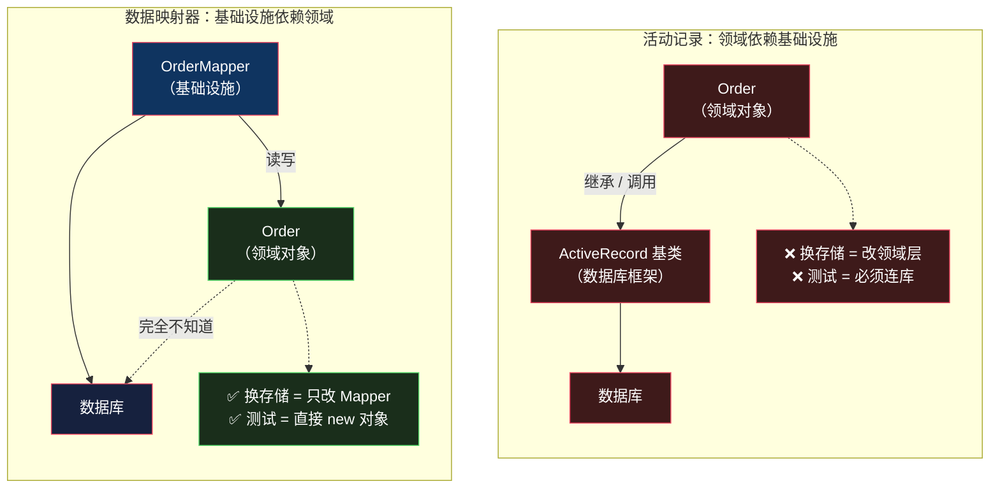

# 数据映射器：业务对象凭什么要知道数据库

> 系列：企业应用架构（3/19）。代码用 Python 3.12 演示，附 Hibernate / SQLAlchemy 对照。

## 生活比喻：专门的库管员

[活动记录](02-active-record.md)里，每个厨师自己跑仓库拿食材——**「牛肉面师傅」同时知道怎么做面，也知道食材放在哪个货架第几层**。

**数据映射器是请一个库管员。** 厨师只管做菜，需要食材就报单；库管员负责去仓库取、负责记录台账、负责把新到的货上架。

厨师**完全不知道仓库长什么样**——他甚至不需要知道有没有仓库。哪天仓库从冷库改成常温库，厨师那边一行代码都不用动。

这个「完全不知道」就是数据映射器的全部意义。

## 什么是数据映射器

一句话定义：

> **领域对象完全不认识数据库；由一个独立的映射层负责在「对象」和「表」之间双向翻译。**

对比一下两个版本里 `Order` 的样子，差异一目了然：

```python
# 活动记录：Order 知道自己的表名和列名
class Order(ActiveRecord):
    table = "orders"                      # ← 领域对象知道表
    columns = ("user_id", "total", "status")   # ← 领域对象知道列
    def save(self, conn): ...             # ← 领域对象会写库

# 数据映射器：Order 是一段纯数据 + 纯逻辑
@dataclass
class Order:
    user_id: int
    items: list[OrderItem] = field(default_factory=list)
    status: str = "created"
    id: int | None = None
    total: float = 0.0
    # 没有 table、没有 columns、没有 save、没有 conn
```

**注意 `Order` 里没有 `import sqlite3`。** 整个领域层不知道数据库的存在——这是个可以机械检查的硬指标。

## 完整的样子

还是[下单那个场景](01-transaction-script.md#完整的样子)，第三次实现：

```python
# ============ 领域层：纯对象，不知道表的存在 ============
@dataclass
class OrderItem:
    sku: str
    qty: int
    price: float

    @property
    def subtotal(self) -> float:
        return self.price * self.qty


@dataclass
class Order:
    user_id: int
    items: list[OrderItem] = field(default_factory=list)
    status: str = "created"
    id: int | None = None
    total: float = 0.0

    # 纯业务逻辑 —— 没有 conn，纯计算，可以直接单测
    def price(self, vip_level: int) -> "Order":
        self.total = sum(i.subtotal for i in self.items)
        if vip_level >= 3:
            self.total *= 0.9
        elif vip_level >= 1:
            self.total *= 0.95
        if self.total > 1000:
            self.total -= 50
        self.total = round(self.total, 2)
        return self


# ============ 基础设施层：映射器负责双向翻译 ============
class OrderMapper:
    """唯一知道 orders/order_items 表结构的地方"""

    def __init__(self, conn):
        self.conn = conn

    def insert(self, order: Order) -> Order:
        cur = self.conn.execute(
            "INSERT INTO orders (user_id, total, status) VALUES (?, ?, ?)",
            (order.user_id, order.total, order.status))
        order.id = cur.lastrowid
        for it in order.items:
            self.conn.execute(
                "INSERT INTO order_items (order_id, sku, qty, price) VALUES (?, ?, ?, ?)",
                (order.id, it.sku, it.qty, it.price))
        return order

    def find(self, order_id: int) -> Order | None:
        row = self.conn.execute(
            "SELECT id, user_id, total, status FROM orders WHERE id = ?",
            (order_id,)).fetchone()
        if row is None:
            return None
        rows = self.conn.execute(
            "SELECT sku, qty, price FROM order_items WHERE order_id = ?",
            (order_id,)).fetchall()
        # ★ 装配：把两段查询拼成一个对象图
        return Order(id=row[0], user_id=row[1], total=row[2], status=row[3],
                     items=[OrderItem(sku=r[0], qty=r[1], price=r[2]) for r in rows])
```

跑起来：

```console
$ python3 dm.py
订单: {'order_id': 1, 'total': 540.0}
订单: {'order_id': 2, 'total': 1050.0}
预期失败: 库存不足: A001

--- 不连数据库的单测 ---
VIP3 打 9 折: 540.0
1500 满减后: 1450.0
```

**前三行和事务脚本、活动记录一字不差。** 但最后三行是新的——**业务逻辑可以在完全不碰数据库的情况下测试**：

```python
o = Order(user_id=1, items=[OrderItem("X", 2, 300.0)])   # 600
assert o.price(vip_level=3).total == 540.0               # 不需要 conn
```

在活动记录版本里，同样的测试得先造一个 `ActiveRecord` 子类实例，而它的基类要求 `conn`。

## 真正发生了什么：依赖方向翻转了

三个版本业务结果一样，差别**不在行为，在耦合方向**：



**这是「依赖倒置」在持久化上的具体应用**：让领域层不依赖基础设施，而是基础设施依赖领域层。

箭头方向反过来了——**这一条就是数据映射器的全部价值，其他都是它的代价。**

## 代价：映射不会自己写

依赖倒置不是免费的。**你要为这个方向翻转付出的第一笔钱，就是映射代码。**

上面 `OrderMapper` 里的 `insert` / `find` 是**手写**的——把行拆成对象、把对象拼成行，一行行来。这套代码：

- **没有业务价值**，纯粹是搬运
- **字段一改就要同步改**，而且编译器不会提醒你（Python 里更是运行时才炸）
- **对象图越复杂，代码越长**——订单带商品、商品带分类、分类带父分类……映射代码会指数级膨胀

**这正是 ORM 存在的原因。** Hibernate、SQLAlchemy、MyBatis 本质都是**数据映射器的框架化实现**——用元数据（注解 / 声明式映射）把这段搬运代码自动生成掉。

| 框架 | 类型 | 映射方式 |
|------|------|---------|
| Hibernate / JPA | 数据映射器 | 注解 + 元数据 |
| SQLAlchemy（declarative） | 数据映射器 | 类声明 + 元数据 |
| MyBatis | 数据映射器 | XML / 注解写 SQL，手控映射 |
| Rails ActiveRecord | **活动记录** | 约定优于配置 |
| Django ORM | **活动记录** | 模型类即表 |

**注意最后两行。** 名字里带 "ActiveRecord" 的 Rails 是活动记录；Django ORM 虽然叫 ORM，形态也是活动记录。**判断标准不是名字，是「领域对象认不认识数据库」。**

## 代价二：对象图加载

手写映射时，「装配」这一步是显式的——上面 `find` 里两次查询、拼成对象图，你一眼能看清代价。

**ORM 把这步自动化之后，代价就藏起来了：**

```python
order = repo.find(order_id)
print(order.items[0].product.category.name)   # 背后可能又发了 3 条 SQL
```

这就是 **N+1 查询**和**延迟加载**问题的来源（第 13 篇会专门拆）。活动记录同样有这个问题，但数据映射器把「装配」这一步自动化得更彻底，所以问题也更容易被藏起来。

## 代价三：复杂度陡增

三个版本的代码量对比：

| 版本 | 核心代码行数 | 文件数 |
|------|------------|-------|
| 事务脚本 | ~35 行 | 1 个函数 |
| 活动记录 | ~70 行 | 4 个类 |
| 数据映射器 | ~110 行 | 2 层 6 个类 |

**数据映射器是三个里最"重"的。** 多出来的成本是持续的——每加一个领域概念，你就要多写一个 Mapper。

## 什么时候值得

| 场景 | 选谁 |
|------|------|
| 表结构稳定、CRUD 为主 | **活动记录**——映射层是纯浪费 |
| 业务规则复杂、需要大量单测 | **数据映射器**——可测试性是刚需 |
| 领域模型和表结构不一致 | **数据映射器**——活动记录在这里没地方放逻辑 |
| 可能要换存储 / 加事件日志 | **数据映射器**——领域层不绑死 |
| 报表 / 批处理 | **都不用**——直接 SQL |
| 原型阶段 | **事务脚本**——先跑通再说 |

**判断标准可以收成一句**：

> **如果「这个对象的业务规则测试」需要启动数据库，那领域层就已经被绑住了。**

在活动记录里这几乎是必然的。在数据映射器里，这是你自己可以选的——把纯逻辑写进领域对象，把搬运留给 Mapper。

## 骨架代码

```python
# ========== 1. 领域层：立即可测 ==========
@dataclass
class DomainObject:
    id: int | None = None
    # 只有数据和业务方法 —— 无 conn / 无 table / 无 save

    def business_rule(self, ...) -> ...:
        """纯计算：输入什么返回什么，不碰 I/O"""
        ...

# ========== 2. 映射器：唯一认识表的地方 ==========
class XxxMapper:
    def __init__(self, conn): self.conn = conn

    def insert(self, obj) -> None: ...      # 对象 → 行
    def update(self, obj) -> None: ...
    def find(self, id) -> DomainObject | None:
        # 读一行 → 装配成对象（对象图复杂时这步要显式控制）
        ...

    # 进阶：拆出 _to_domain / _to_row 两个纯函数，映射逻辑本身也能单测

# ========== 3. 应用层：只编排，不含规则 ==========
def use_case(conn, ...):
    mapper = XxxMapper(conn)
    obj = mapper.find(id)
    obj.business_rule(...)      # 规则在对象上
    mapper.update(obj)          # 持久化交给映射器
```

## 总结

| 维度 | 活动记录 | 数据映射器 |
|------|---------|-----------|
| 领域对象知道数据库吗 | **知道**（table / columns / save） | **完全不知道** |
| 依赖方向 | 领域 → 基础设施 | 基础设施 → 领域 |
| 映射代码 | 框架自动生成 | 手写或 ORM 生成 |
| 业务逻辑单测 | 必须连库 | **可以直接 new 对象** |
| 换存储的成本 | 重写领域层 | 只改 Mapper |
| 代码量 | 少 | 多 |
| 典型代表 | Rails、Django ORM、GORM | Hibernate、SQLAlchemy、MyBatis |

**一句话**：数据映射器买的是「领域层不被数据库绑架」，付的是「多写一层映射」。**这笔交易在业务规则复杂、需要大量单测时划算；在表结构稳定、CRUD 为主时是纯浪费。**

三个版本到这里就讲完了。它们业务结果完全一致，差别只在**代码的边界画在哪**——这也回答了这一部分的总问题：业务逻辑写在哪，本质上是**你打算让哪两样东西绑在一起，又让哪两样东西分开**。

下一篇要处理一个尴尬的现实：**现实中 90% 的项目，用的是第四种——贫血模型**。它被 Fowler 称为「反模式」，却活得好好的。[贫血模型 vs 充血模型](04-anemic-vs-rich.md)。

---

**相关文章：** [活动记录](02-active-record.md) · [贫血模型 vs 充血模型](04-anemic-vs-rich.md) · [总纲](00-overview.md)
