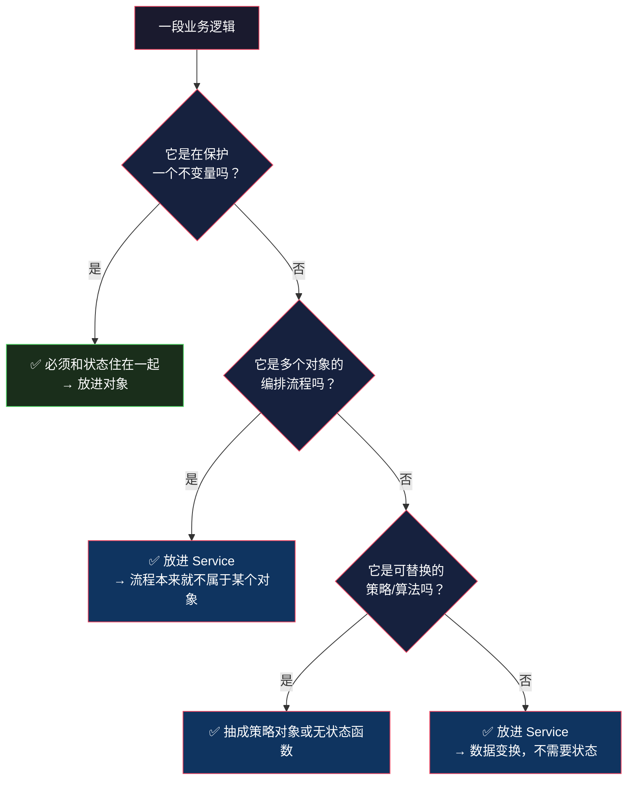

# 贫血模型 vs 充血模型：一场持续二十年的争论

> 系列：企业应用架构（4/19）。代码用 Python 3.12 / Java 对照。

## 生活比喻：傀儡和活人

前面三篇讲了三种组织方式。现在看第四种——**它没有名字，因为它长得像活动记录，但灵魂被抽走了**。

**贫血模型 = 提线木偶。** 它有 `Order` 这个对象，有 `id`、`total`、`status` 这些字段，甚至有 `get_total()` / `set_total()`——**唯独没有行为**。所有业务逻辑住在别的地方，由一只叫 `OrderService` 的手在操纵。

木偶长着人的形状，但自己不会动。**「贫血」这个比喻很准：它有对象的身躯，没有对象的血。**

## 什么是贫血模型

一件事说清楚：**对象只有字段和 getter/setter，业务逻辑全在 Service 里。**

```java
// 贫血的 Order —— 只有数据
public class Order {
    private Long id;
    private Long userId;
    private BigDecimal total;
    private String status;

    // 全是 getter / setter，一个业务方法都没有
    public BigDecimal getTotal() { return total; }
    public void setTotal(BigDecimal total) { this.total = total; }
    // ...
}

// 逻辑全在这里
@Service
public class OrderService {
    public void placeOrder(Long userId, List<OrderItem> items) {
        Order order = new Order();
        order.setUserId(userId);
        // ... 200 行业务逻辑
        order.setTotal(calculateTotal(items, vipLevel));
        orderMapper.insert(order);
    }

    private BigDecimal calculateTotal(List<OrderItem> items, int vipLevel) {
        // 折扣规则在这里
        BigDecimal sum = items.stream()
            .map(i -> i.getPrice().multiply(BigDecimal.valueOf(i.getQty())))
            .reduce(BigDecimal.ZERO, BigDecimal::add);
        // ... VIP 折扣与满减
        return sum;
    }
}
```

**看着眼熟吗？** 这几乎就是[事务脚本](01-transaction-script.md)——只不过数据被包进了对象，而对象只是数据袋。

## Fowler 为什么说它是反模式

2003 年，Martin Fowler 创造了 "Anemic Domain Model" 这个词，并把它称为**反模式**。他的核心论证是：

> 这种做法违背了面向对象设计的基本主张——**把数据和操作数据的过程放在一起**。贫血模型的代价是双倍的：你既要维护一坨对象（它们只是数据结构），又要维护一套和它们一一对应的服务类。

**这个批评是成立的**，在它的语境里。如果真的按 OO 的教义来，`Order` 应该自己知道怎么算总价、怎么应用折扣、怎么校验状态流转。把 `Order` 降级成数据袋，等于放弃了封装带来的所有好处。

## 但现实中 90% 的项目在用它

**这不是无知，是三个真实约束下的理性选择。**

### 理由一：框架要求对象必须贫血

这条最硬。看 Java 生态：

| 框架 | 要求 |
|------|------|
| Jackson / Gson（JSON 序列化） | 需要无参构造 + getter/setter |
| Spring（依赖注入） | 需要能被代理，方法不能是 final |
| JPA / Hibernate | 需要无参构造 + 可访问的字段 |
| MyBatis | 直接映射字段 |

**你要用这些框架，对象就得长成它们要的样子。** 而「有行为的富对象」往往需要构造函数保证不变量——比如 `Order` 必须带 `userId` 才能创建。

于是就有了这个经典场景：

```java
// 富对象的自然写法：构造时保证不变量
public Order(Long userId) {
    if (userId == null) throw new IllegalArgumentException("必须有用户");
    this.userId = userId;
    this.status = OrderStatus.CREATED;
}
```

**然后 ORM 说：我要一个 `public Order() {}`。**

你为了满足框架，加了个空构造器——**不变量当场失守**。任何人都能 new 出一个没有 `userId` 的订单。

**当框架逼你在「对象能保护自己」和「对象能被序列化」之间二选一时，绝大多数团队选了后者。**

### 理由二：Service 是「过程」的天然容器

业务需求本身，很多就是过程式的：

> 「用户点结算，系统要：检查库存 → 算价 → 冻结优惠券 → 创建订单 → 通知仓库」

**这是一条流程，不是某个对象的能力。** 硬要塞进对象，就得决定「冻结优惠券」该属于 `Order` 还是 `Coupon`——

- 放 `Order`：订单为什么要管优惠券的状态？
- 放 `Coupon`：优惠券怎么知道订单？

**放哪边都别扭。** 而 Service 天然适合装流程——它没有「我该属于谁」的心理负担。

### 理由三：分布式和序列化天然要贫血

跨服务传输的 DTO 不可能充血：

```java
// 从另一个服务收到的订单 —— 它就是个 JSON
public class OrderDTO {
    public Long id;
    public BigDecimal total;
    // 没有行为，因为行为在对面那台机器上
}
```

**任何跨进程序列化的对象都必然贫血**——你能传过去的是数据，不是方法。

当系统从单体走向分布式，充血对象会在服务边界上被迫「脱壳」，这个迁移成本劝退了很多团队。

## 充血模型自己的问题

如果贫血的问题这么明显，为什么不用充血？因为充血有它自己的三个硬伤：

**① 加载代价：改一个字段要加载整个对象图**

`order.applyDiscount()` 要生效，得先把订单和它所有的 `order_items` 从数据库读出来装配成对象——**哪怕你只想改一个状态字段**。

对比事务脚本：

```sql
UPDATE orders SET status = 'paid' WHERE id = 1;
```

**一条 SQL 和「加载对象图 → 改内存 → 回写」的差距。** 在高并发写入场景下这是致命的。

**② 并发：聚合是天然的锁边界**

充血模型里，`Order` 是保护自己不变量的单元，所以修改它通常要加锁（乐观锁版本号 / 悲观锁）。**聚合越大，锁越粗，并发越差。**

（第 15 篇会专门讲聚合边界怎么划——它就是被这个问题逼出来的。）

**③ 和框架打架**

前面说的 `public Order() {}`。此外还有：ORM 生成的代理对象会让 `this` 指向代理而非真实对象（导致 `equals` / 内部调用诡异失效）、级联保存不可控、懒加载异常等等。

**这些都是为了「对象能自己管自己」付出的运行时代价。**

## 争论的焦点被搞错了

读到这你可能会觉得：这不就是个两难，选哪个都有问题。

**这个感觉是对的，但结论不是「两害相权」——而是这个问题本身问错了。**

真正的问题不是「对象该不该有行为」，而是：

> **哪些逻辑必须和状态住在一起？**

答案是分层的，不是一刀切：



### 什么是「不变量」

**不变量 = 任何时候都必须成立的条件。** 违反它，数据就是坏的。

| 逻辑 | 是不变量吗 | 该住哪 |
|------|-----------|-------|
| 「订单总额 == 各项小计之和」 | ✅ 是 | `Order` 上 |
| 「已支付的订单不能改商品」 | ✅ 是 | `Order` 上 |
| 「库存不能为负」 | ✅ 是 | `Product` / `Inventory` 上 |
| 「VIP3 打 9 折」 | ❌ 不是 | 策略对象 / Service |
| 「邮箱格式校验」 | ❌ 不是 | 输入校验层 |
| 「下单要通知仓库」 | ❌ 不是 | Service（编排流程） |

**看第四行。** 「打几折」是**业务政策**，它随时会变、和订单本身的状态无关——把它放进 `Order` 只会让 `Order` 每次政策变动都要改。

**而第一行不是政策**——不管折扣怎么算，总额和小计的关系必须成立。**这条关系必须由 `Order` 自己守，否则任何人都能 `setTotal(0)`。**

### 一个具体的混合写法

按上面的判断切完，你的代码长这样：

```python
@dataclass
class Order:
    user_id: int
    items: list[OrderItem] = field(default_factory=list)
    status: str = "created"
    total: float = 0.0

    # ✅ 不变量：总额必须等于小计之和 —— 只有 Order 自己知道怎么算
    def recalculate_total(self) -> None:
        self.total = sum(i.subtotal for i in self.items)

    # ✅ 不变量：状态流转必须合法 —— 只有 Order 知道哪些流转是允许的
    def mark_paid(self) -> None:
        if self.status != "created":
            raise ValueError(f"不能从 {self.status} 支付")
        self.status = "paid"

    # ✅ 不变量：空订单不能提交
    def validate_for_submit(self) -> None:
        if not self.items:
            raise ValueError("订单不能为空")


# ❌ 折扣是政策，不是不变量 —— 放在外面
def price_order(order: Order, vip_level: int, policy: DiscountPolicy) -> None:
    order.recalculate_total()
    order.total = policy.apply(order.total, vip_level)


# ❌ 编排流程 —— 放在 Service
def place_order(conn, user_id: int, items: list[dict]) -> dict:
    order = build_order(conn, user_id, items)     # 组装
    price_order(order, vip_level, POLICY)         # 算价（政策）
    order.validate_for_submit()                   # 校验（不变量）
    repo.save(order)                              # 持久化
    notify_warehouse(order)                       # 副作用
    return {"order_id": order.id, "total": order.total}
```

**注意 `validate_for_submit` 在 `Order` 上，而 `price_order` 在外面。** 这个分界线就是判断标准的实际应用：

- **对象守的是「不能坏」的属性**
- **Service 管的是「要做什么」的流程**
- **策略对象管的是「按什么规则」的政策**

## 判断标准总表

| 逻辑类型 | 特征 | 归属 |
|---------|------|------|
| **不变量** | 违反则数据损坏；和状态强相关 | 领域对象（充血） |
| **流程编排** | 跨多个对象/服务；有先后顺序 | Service（贫血侧的写法） |
| **政策/策略** | 会变；可替换；和状态无关 | 策略对象 |
| **输入校验** | 数据进系统前的把关 | 应用层 / DTO |
| **查询/报表** | 只读；需要拼多表 | 直接 SQL，别包对象 |

**你会发现：一张表里「该充血」的那一行，通常是数量最少、但最要命的那一行。** 大多数项目不需要「全充血」或「全贫血」——需要的是**把不变量守住，其余随便**。

## 总结

| 维度 | 贫血模型 | 充血模型 |
|------|---------|---------|
| 对象内容 | 字段 + getter/setter | 字段 + 业务方法 |
| 逻辑位置 | 集中在 Service | 分散在对象上 |
| 框架兼容性 | ✅ 天然兼容 | ⚠️ 和 ORM / 序列化打架 |
| 单元测试 | 要测 Service + mock 依赖 | 可以直接 new 对象测 |
| 加载代价 | 低（可以只更新字段） | 高（要装配对象图） |
| 并发 | 灵活（细粒度 SQL） | 受聚合边界限制 |
| 不变量保护 | ❌ 靠纪律 | ✅ 靠封装 |
| 适合 | CRUD、流程密集、分布式 | 规则复杂、一致性要求高 |

**三条结论：**

1. **Fowler 的批评成立，但他假设的是「所有逻辑都该进对象」。** 现实里大部分逻辑不是不变量，是流程和政策——它们本来就不属于任何对象。

2. **贫血模型的真正问题不是「对象没行为」，而是「不变量没人守」。** 当 `Order` 可以被任意 `setTotal(0)`，你失去的不是「OO 的优雅」，是**数据的正确性保障**。这个问题在 CRUD 系统里不明显，在金融/交易系统里是灾难。

3. **别在「贫血 or 充血」里二选一——按逻辑类型切开。** 不变量进对象，流程进 Service，政策进策略。**一个项目里三种写法共存是正常的，也是应该的。**

第一部分到此结束。我们回答了「业务逻辑写在哪」这个问题——**答案是：按逻辑的性质分开写，而不是按教条统一写。**

第二部分换一个维度：界面和业务逻辑之间那条线该划在哪。下一篇从 MVC 开始。

---

**相关文章：** [数据映射器](03-data-mapper.md) · [总纲](00-overview.md)
