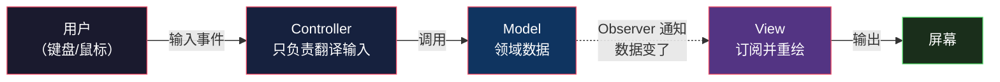
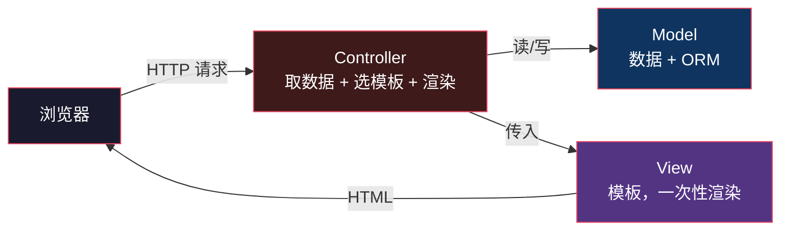
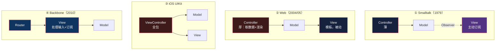

# MVC：一个名字，四种东西

> 系列：企业应用架构（5/19）。跨语言对照：Smalltalk / Ruby / Python / Swift / JavaScript。

## 生活比喻：「班主任」这个头衔

「班主任」这个词，在不同地方指的是完全不同的工作：

| 场景 | 班主任实际干什么 |
|------|----------------|
| 小学 | 教语文 + 管纪律 + 收作业 + 处理打架 + 家访 |
| 大学 | 一学期见两次，主要是签字 |
| 培训机构 | 主要工作是催续费 |

**同一个头衔，三份职责。** 如果有人问「班主任到底该干什么」，正确答案取决于**你在哪所学校**。

**MVC 就是这个状态。** 1979 年它诞生时是一份职责，后来被搬到 Web、搬到 iOS、搬到前端——每搬一次，职责就变一次。而所有这些变体**都还叫 MVC**。

**几乎所有人第一次学 MVC 时的困惑，都来自把其中一个当成了标准答案。** 这篇要做的就是把四个版本分开摆清楚，并说明每次变化是**被什么逼出来的**。

## 版本一：原始 MVC（Smalltalk-80, 1979）

Trygve Reenskaug 在 Xerox PARC 做 Smalltalk-80 时提出了这个模式（1978–79 年间构思，1979 年成文）。当时的原始命名甚至不叫 MVC，而是 **Thing-Model-View-Editor**——「Editor」后来才改名成 Controller。

**这里有个几乎没人提的细节，它本身就是「同名不同物」的第五个例子：**

Reenskaug 原版里的 **Controller**，是他后来称之为 **Tool** 的东西（负责输入设备与光标）；而 **Smalltalk-80 类库里的 `Controller`**（Jim Althoff 实现的那套）对应的其实是 Reenskaug 原版的 **Editor**。

**也就是说：连「Controller」这个词，在 MVC 诞生后的第一年就已经换过一次意思了。** 这个名字的漂移不是从 Web 才开始的。

它的结构是这样的：



**注意那条虚线——它是整个原始 MVC 的核心。**

View **直接订阅** Model。Model 变了，它主动通知所有订阅它的 View，View 自己重绘。Controller 不参与这个过程——它只干一件事：**把用户的输入（点一下、敲一下）翻译成对 Model 的调用**。

这意味着：

- **Controller 非常薄**——通常只有几行，「用户按了删除键 → 调 `model.remove()`」
- **View 是主动的**——它有「数据变了我要重绘」的能力
- **Model 不知道 View 存在**——它只管发通知，谁在听它不管

那条虚线用的就是 [Observer 模式](../design-patterns/observer.md)。**MVC 是 Observer 模式最著名的应用——事实上 Observer 几乎就是为了 MVC 才被提炼出来的。**

### 为什么它长这样

因为它运行在 **Smalltalk 环境**里：对象长期存活在内存中，有完整的消息传递机制，View 和 Model 都能互相持有引用。

**这个前提后面三个版本全都不成立。**

## 版本二：Web MVC（Rails 2004 / Django 2005）

Web 来了，有人把 MVC 往 HTTP 上套。**结果套歪了，但歪得很成功。**



**那条虚线不见了。** 为什么？

**因为 HTTP 是无状态的，一次请求一次响应，View 渲染完就死了。** 它没有机会「订阅」任何东西——下次数据变了，那是另一个请求，会有另一个 View 实例。

于是职责被迫重排：

| 原始 MVC | Web MVC | 变化 |
|---------|---------|------|
| Controller 只翻译输入 | **Controller 取数据、选模板、渲染** | 变厚了 |
| View 订阅 Model 并重绘 | View 是个**模板**，接收数据、产出 HTML | 变被动了 |
| Model 发通知 | Model 是**数据 + ORM** | 不发声了 |

**Web 的「Controller」其实把原始 MVC 里 View 的活儿也干了。** 它接收请求、取数据、决定用哪个模板——这更像是「**调度员**」而不是原始的 Controller。

这个变形在 Java 世界有正式名字：**JSP Model 2**（Servlet 当 Controller，JavaBean 当 Model，JSP 当 View）。Rails 和 Django 都是这个形态。

### 看一段 Django

```python
# urls.py —— 路由
urlpatterns = [path("orders/<int:pk>/", views.order_detail)]

# views.py —— 这个叫 "view"，但它其实是 Controller
def order_detail(request, pk):
    order = Order.objects.get(pk=pk)          # 取数据（原始 MVC 里 Controller 不管这个）
    return render(request, "order_detail.html", {"order": order})
    #      ~~~~~~ 选模板 + 渲染（原始 MVC 里这是 View 的活儿）

# models.py —— Model 是数据 + ORM
class Order(models.Model):
    total = models.DecimalField(...)
```

**注意 Django 把函数叫 `views.py`——但按原始 MVC 的定义，它明明是 Controller。** 这个命名混乱本身就是证据：**Web 世界早就把两个角色揉在一起了。**

**记住这个感觉**——它不是错误，是**无状态协议逼出来的必然结果**。后面三篇（MVP/MVVM/Flux）都是在这个变形的基础上继续打补丁。

## 版本三：iOS MVC（UIKit）

第三份工作，来自 Apple。

```swift
class OrderViewController: UIViewController {
    @IBOutlet weak var totalLabel: UILabel!   // ← View 的引用
    var order: Order!                          // ← Model 的引用

    override func viewDidLoad() {
        super.viewDidLoad()
        loadOrder()                            // 取数据
    }

    func loadOrder() {
        APIClient.fetchOrder { [weak self] order in
            self?.order = order
            self?.totalLabel.text = "\(order.total)"   // 更新 View
        }
    }

    @IBAction func payTapped(_ sender: UIButton) {     // 处理输入
        order.pay()
        totalLabel.text = "\(order.total)"
    }
}
```

**`UIViewController` 同时持有 View 引用和 Model 引用，同时处理输入和更新显示。** 它是 Controller，但它把 View 和 Model 都攥在手里。

结果就是 iOS 开发圈里那个著名的抱怨：**Massive View Controller**——一个 `ViewController` 动辄两千行。

**为什么变成这样？** 因为 UIKit 的 `UIViewController` 生命周期和 View 的加载绑死了——你没法像原始 MVC 那样让 View 独立订阅 Model，`ViewController` 天然是那个「持有者」。

## 版本四：前端 MVC（Backbone, 2010）

第四份工作，来自单页应用时代。

```javascript
// Backbone：Router + View + Model，Controller 去哪了？
const OrderView = Backbone.View.extend({
  events: { 'click .pay': 'onPay' },           // ← View 自己处理输入事件
  initialize() {
    this.listenTo(this.model, 'change', this.render);  // ← View 订阅 Model
  },
  render() { this.$el.html(this.template(this.model.toJSON())); },
  onPay() { this.model.pay(); }
});

const router = Backbone.Router.extend({
  routes: { 'orders/:id': 'showOrder' }         // ← Router 负责导航
});
```

在 Backbone 里：

- **View 直接订阅 Model**（`listenTo`）——原始 MVC 的虚线回来了
- **View 直接处理输入**（`events`）——Controller 的活儿被 View 抢了
- **有一个 Router**，负责 URL 和视图的映射

**Controller 不见了。** 因为浏览器里没有「一次请求一次响应」——页面长期存活在内存里，对象可以互相订阅。**平台约束变了，原始 MVC 的那条虚线就回来了，而 Controller 这个角色被 Router 和 View 瓜分了。**

## 四个版本摆在一起



| 维度 | ① Smalltalk | ② Web MVC | ③ iOS UIKit | ④ Backbone |
|------|------------|-----------|------------|-----------|
| **谁处理输入** | Controller | Controller | ViewController | **View** |
| **谁取数据** | Controller | Controller | ViewController | View/Model |
| **谁负责渲染** | View（订阅后自己重绘） | View（模板，一次性） | ViewController | View |
| **View 订阅 Model 吗** | ✅ 订阅 | ❌ 无状态，订阅不了 | ❌ 手动更新 | ✅ 订阅 |
| **Controller 厚度** | 极薄 | **很厚** | 极厚 | **不存在** |
| **为什么这样** | 对象常驻内存 + 消息机制 | HTTP 无状态 | UIKit 生命周期绑定 | 页面常驻 + Router |

**四个版本，没有一个「错了」。** 每一个都是**平台能力决定的最优解**——同一个抽象搬到不同平台，职责必然重排。

## 今天你还需要「实现 MVC」吗

**大部分情况下不需要——因为框架替你实现了。**

- 用 Django / Rails：路由 + 视图函数 + 模板系统，MVC 的形状是框架给的
- 用 React / Vue：组件 + 状态管理，「数据变了 UI 怎么更新」框架全接管了
- 用 SwiftUI：`@State` 一改，界面自动重绘

这和 [设计模式：Rust 视角](../design-patterns/index.md) 里那条主线是同一件事：

> **架构模式从「你手写的结构」变成「框架内建的约束」。**

**但你仍然需要理解它**，因为三件事绕不开：

1. **读旧代码**——你要能认出「这个 Rails controller 里塞了 800 行」是职责错位，而不是「Rails 就该这样」
2. **做技术选型**——知道 Django 的 "MVT" 和 Rails 的 "MVC" 其实是同一个东西，只是命名不同
3. **理解后面三篇**——MVP/MVVM/Flux 全都是**对版本②那个「厚 Controller」的修正**

## 骨架代码

```python
# ========== Web MVC（Django 形态）==========
# urls.py       —— 路由：URL → Controller
# views.py      —— Controller：取数据 + 选模板 + 渲染
# models.py     —— Model：数据 + ORM
# templates/    —— View：模板，一次性渲染

def view(request, pk):
    obj = Model.objects.get(pk=pk)        # 取数据
    return render(request, "t.html", {"o": obj})   # 渲染

# ========== 判断你的 Controller 有没有「太厚」==========
# 症状一：一个 view 函数超过 50 行         → 逻辑该下沉到 Model 或 Service
# 症状二：view 里出现业务规则（if/else 算价）→ 规则不该在 Controller
# 症状三：多个 view 复制同一段逻辑          → 该抽出来，见第 1 篇的「三次法则」
# 症状四：view 直接写 SQL                  → Model/Repository 的职责
#
# Controller 该干的只有三件事：
#   ① 解析请求参数    ② 调用应用逻辑    ③ 组织响应

# ========== 原始 MVC 的形态（对象常驻内存时才成立）==========
# class Model:      subscribe(observer) / notify()
# class View:       update()  ← 订阅 Model，收到通知后重绘
# class Controller: handle_input()  ← 薄，只把输入翻译成 Model 调用
```

## 总结

**MVC 不是一个模式，是四个。** 它们共享名字和三个角色的抽象，但在「谁处理输入、谁取数据、谁负责渲染」上各不相同。

**造成差异的唯一变量是平台**：

| 平台约束 | 结果 |
|---------|------|
| 对象常驻 + 消息机制（Smalltalk） | View 能订阅 Model，Controller 极薄 |
| 无状态请求响应（Web） | View 无法订阅，Controller 被迫变厚 |
| 生命周期绑定（UIKit） | Controller 吞掉 View 和 Model |
| 页面常驻 + 路由（SPA） | Controller 消失，View 自己订阅 |

**判断你该用哪个版本的方法很简单：问「我的 View 能不能订阅 Model？」**

- 能（桌面/移动/SPA）→ 原始形态，Controller 该薄
- 不能（Web）→ Web 形态，Controller 必然厚，但**别让它厚到装下业务规则**

而 Web 这个「厚 Controller」形态，正是接下来三篇要解决的问题——**当 Controller 什么都干的时候，它就没法测了。**

下一篇：[MVP](06-mvp.md)——为了把逻辑从 View 里抠出来，付出的第一笔代价。

---

**相关文章：** [贫血模型 vs 充血模型](04-anemic-vs-rich.md) · [Observer 模式](../design-patterns/observer.md) · [总纲](00-overview.md)
