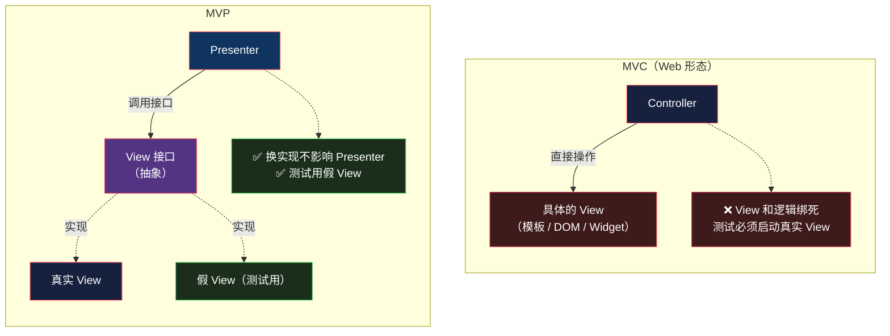

# MVP：为了让 View 能测，付出的第一笔代价

> 系列：企业应用架构（6/19）。代码用 JavaScript（Node 22）演示，附 Android / WinForms 对照。

## 生活比喻：公司前台

[上一篇文章](05-mvc.md)讲到，Web MVC 的 Controller 变得很厚。**MVP 是把这份厚度再切一刀。**

想象一家公司的前台：

- **访客**（用户）只跟前台打交道
- **前台**（View）只会说几句固定的话：「请稍等」「我帮您转接」「他不方便接听」——**它不做任何决策**
- **真正做决定的**（Presenter）在里面，它知道谁该见谁、谁不在、要不要挡下来

**关键在前台有多笨**：它不判断、不记忆、不查资料，只负责「把话传进去」和「把结果显示出来」。

这个「笨」不是缺点——**它是为了让前台可替换**。前台换成机器人、换成电话语音、换成网页，里面的决策逻辑一行都不用改。

## 什么是 MVP

一句话定义：

> **Presenter 持有 View 的抽象接口；所有表现逻辑在 Presenter 里，View 只负责「显示」和「转发事件」。**

对比 MVC 的差别在哪：



**这是一次依赖倒置**——和[第 3 篇](03-data-mapper.md)里数据映射器对着数据库做的是同一件事，只不过这次对着 UI 做：

| | 依赖方向 |
|---|---------|
| MVC | Controller → **具体的 View** |
| MVP | Presenter → **View 接口** ← 具体 View 实现它 |

**Presenter 不认识具体的 View，只认识它的接口。** 这一条就是 MVP 的全部。

## 完整的样子

一个订单页面：显示总额、根据状态决定「支付」按钮能不能点、处理支付。

```javascript
// ---------- Presenter：不知道 View 长什么样，只知道它有哪些方法 ----------
class OrderPresenter {
  constructor(view, repo) {
    this.view = view;
    this.repo = repo;
  }

  async load(orderId) {
    const order = await this.repo.find(orderId);
    if (!order) {
      this.view.showError("订单不存在");
      return;
    }
    this.view.showTotal(order.total);
    this.view.setPayEnabled(order.status === "created");   // 状态决定按钮能否点
  }

  async onPay(orderId) {
    const order = await this.repo.find(orderId);
    if (order.status !== "created") {
      this.view.showError("订单状态不允许支付");
      return;
    }
    order.status = "paid";
    await this.repo.save(order);
    this.view.showMessage("支付成功");
    this.view.setPayEnabled(false);
  }
}
```

**Presenter 里没有一行 `document.querySelector`。** 它只知道「调用 `view.showTotal(x)`」——具体怎么显示，它不关心。

于是测试可以这样写：

```javascript
// ---------- 假 View：只记录被调用了什么，没有任何 UI ----------
class FakeView {
  constructor() { this.calls = []; }
  showTotal(t)     { this.calls.push(["showTotal", t]); }
  showError(m)     { this.calls.push(["showError", m]); }
  showMessage(m)   { this.calls.push(["showMessage", m]); }
  setPayEnabled(b) { this.calls.push(["setPayEnabled", b]); }
}
```

跑起来：

```console
$ node mvp.mjs
--- MVP 表现逻辑测试（无浏览器）---
  ✅ 未支付订单：显示总额 + 按钮可用
  ✅ 已支付订单：按钮不可用
  ✅ 订单不存在：只显示错误
  ✅ 重复支付被拦截
  ✅ 正常支付：提示 + 禁用按钮
  ✅   状态已落库

通过 6，失败 0
```

**六个表现层测试，全程没有 DOM、没有浏览器、没有渲染。** 这就是 MVP 买到的东西。

## 为什么当年需要 MVP

看它诞生的场景就明白了——**WinForms / Web Forms / 早期 Android，这些平台的 View 根本没法测。**

```csharp
// WinForms 的典型写法：逻辑和控件绑死
private void btnPay_Click(object sender, EventArgs e) {
    var order = orderRepo.Find(orderId);
    if (order.Status != "created") {
        MessageBox.Show("订单状态不允许支付");   // ← 弹窗，怎么测？
        return;
    }
    order.Status = "paid";
    orderRepo.Save(order);
    lblTotal.Text = order.Total.ToString();      // ← 直接摸控件
    btnPay.Enabled = false;                       // ← 直接改控件状态
}
```

**这段代码你没法写单元测试。** `MessageBox.Show` 会真的弹窗、`lblTotal` 需要真实的窗体实例、`btnPay.Enabled` 需要真实控件。

自动化 UI 测试能覆盖，但那个成本——启动应用、等待渲染、定位控件——**测三个分支要跑一分钟**，而且极不稳定。

**MVP 的解法是：把所有「决定」抠出来，控件只负责执行。** 抠完之后：

- 「什么情况下显示什么」→ 纯逻辑，可以测
- 「怎么显示」→ 一行 `label.text = x`，不值得测

## 两种变体：Passive View vs Supervising Controller

MVP 在实践中分化成两支，差别在于**多少逻辑留给 View**：

| | Passive View | Supervising Controller |
|---|---|---|
| **View 的职责** | 完全被动，只会 set 内容 | 处理**简单**绑定（如 `name → 输入框`） |
| **Presenter 的职责** | 所有表现逻辑 | 复杂逻辑 + 需要测试的部分 |
| **View 接口** | 方法很多很细 | 方法少，留了余地 |
| **测试覆盖** | 最全 | 部分逻辑在 View 里测不到 |
| **样板代码** | 最多 | 少一些 |

**Martin Fowler 的划分标准是：这段逻辑值得测吗？**

- 值得测 → 放 Presenter
- 不值得测（比如「把名字填进输入框」）→ 让它留在 View 里，省一个接口方法

**大多数项目实际用的是 Supervising Controller**——因为纯 Passive View 的接口会爆炸。

> **一个历史注脚**：Fowler 明确说过 **Passive View「不属于 MVP 的原始描述」**——它是后来为了让 View 更好测而发展出来的极端形态。原始的 MVP（1990 年代 Taligent 时期）里，Presenter 和 View 的分工没有这么彻底。

## 代价：接口爆炸

MVP 最疼的地方在这。**每一个 View 上的变化，都要在接口上加一个方法。**

```javascript
// 页面复杂起来之后，View 接口就长这样了
class OrderView {
  showTotal(t) {}
  showSubtotal(t) {}
  showDiscount(d) {}
  showShipping(s) {}
  showError(m) {}
  showMessage(m) {}
  setPayEnabled(b) {}
  setCancelEnabled(b) {}
  setLoading(b) {}
  setItems(list) {}
  setItemPrice(i, p) {}
  clearItems() {}
  highlightRow(i) {}
  scrollToBottom() {}
  // ... 还在长
}
```

**问题不只是长，还有两个更麻烦的**：

**① 接口和 UI 细节耦合**

`showSubtotal` / `showDiscount` / `showShipping` 这三个方法，暴露了「页面上是分开显示的三行」。哪天设计改成「只显示一个总额」，接口要改、Presenter 要改、所有假 View 要改。

**Presenter 本该不知道 UI 长什么样——但接口的形状其实就是 UI 的形状。**

**② 简单交互也要绕一圈**

用户勾选一个复选框，只想改个样式：

```
用户点击 → View 转发给 Presenter → Presenter 判断 → 调 view.setXxx() → View 执行
```

**四个环节做一件本来一行 CSS 能搞定的事。** 这就是为什么纯 Passive View 在实践中很少见。

## 今天还需要 MVP 吗

**在 Web 前端，基本不需要了。** 原因很直接——**当年 MVP 要解决的那个问题，现在的工具已经解决了**：

| 当年 | 现在 |
|------|------|
| View 没法在测试里实例化 | jsdom / happy-dom 能跑真实 DOM |
| 组件测试要启动整个应用 | Vitest / Testing Library 直接测组件 |
| 控件状态改不了 | 断言 DOM 状态和断言假 View 一样方便 |

**当「测试真实 View」的成本降到和「测试假 View」差不多时，MVP 的主要动机就消失了。**

但在这些场景里它仍然成立：

- **Android 传统 View 体系**（`Activity` 仍然难测，MVP/MVVM 还是主流）
- **桌面应用**（WPF/WinForms/Qt）
- **嵌入式 / 特殊 UI**（渲染成本高，必须把逻辑抠出来测）
- **多端复用同一套表现逻辑**（同一份 Presenter，三个 View 实现）

## 骨架代码

```javascript
// ========== 1. View 接口：只管显示，不做决定 ==========
// interface OrderView {
//   showTotal(total)          // 显示类
//   showError(msg)            // 反馈类
//   setPayEnabled(bool)       // 状态类
//   onPayClick(callback)      // 事件绑定（View 只转发，不处理）
// }

// ========== 2. Presenter：所有表现逻辑在这 ==========
class XxxPresenter {
  constructor(view, model) { this.view = view; this.model = model; }
  // ① 加载数据 → 决定显示什么
  // ② 处理用户动作 → 改 Model → 更新 View
  // ③ 不为「怎么显示」操心
}

// ========== 3. 三个实现 ==========
// RealView    —— 真实 UI，方法体是一行 DOM/控件操作
// FakeView    —— 测试用，把调用记进数组
// NullView    —— 调试用，什么都不做

// ========== 4. 判断 View 接口是不是失控了 ==========
// 症状：接口方法名里出现 UI 细节（showSubtotal / highlightRow）
//   → 说明 Presenter 在管布局，该回退到 Supervising Controller
// 症状：为了改一个样式要动 Presenter、接口、所有假 View
//   → 这一层抽象的成本已经超过收益
// 症状：Getter 式方法（getInputValue）大量出现
//   → 那是 Supervising Controller 的信号，View 该保留一些职责
```

## 总结

| 维度 | MVC（Web 形态） | MVP |
|------|----------------|-----|
| **View 和逻辑的关系** | 绑在一起 | 通过接口分开 |
| **谁做决定** | Controller | Presenter |
| **View 的智商** | 有模板逻辑 | 接近零（Passive View） |
| **依赖方向** | Controller → 具体 View | Presenter → View 接口 |
| **表现逻辑可测吗** | ❌ 需要真实 View | ✅ 假 View 即可 |
| **代价** | 逻辑散在 Controller 里 | 接口爆炸 + 样板 |
| **典型场景** | Web 服务端渲染 | WinForms / 早期 Android / 桌面 |

**一句话**：MVP 买的是「表现逻辑可以脱离 UI 测试」，付的是「每多一个 UI 变化就多一个接口方法」。

**这笔交易在 View 难测试的平台上（WinForms、Android）非常划算；在 View 已经很好测的平台上（现代 Web 前端），它变成了纯粹的负担。**

而 MVP 那个「接口爆炸」的问题，下一次被用另一种方式解决了——**如果绑定能自动完成，就不需要为每个字段写一个方法**。

下一篇：[MVVM](07-mvvm.md)。

---

**相关文章：** [MVC](05-mvc.md) · [MVVM](07-mvvm.md) · [数据映射器](03-data-mapper.md) · [总纲](00-overview.md)
