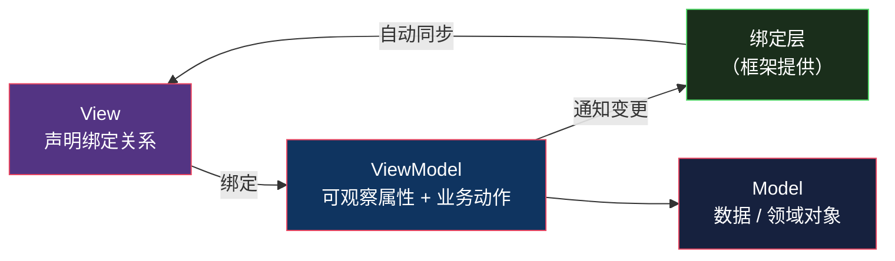
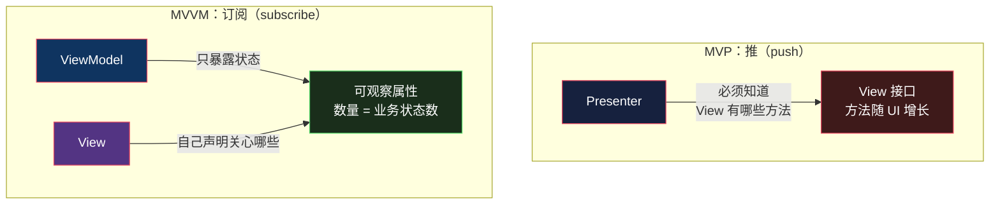

# MVVM：数据绑定的红利与代价

> 系列：企业应用架构（7/19）。代码用 JavaScript（Node 22）演示，附 WPF / Vue / SwiftUI 对照。

## 生活比喻：Excel 的联动表

你在 Excel 的「明细表」改一个数字，「汇总表」里的合计**自动就变了**。

**你没有写任何一行「把明细表的 A1 复制到汇总表的 B2」的代码。** 你写的是一个**关系**：`B2 = SUM(A1:A10)`。

这就是 MVVM 和 [MVP](06-mvp.md) 的根本差别：

| | 写法 | 本质 |
|---|------|------|
| **MVP** | `view.showTotal(x)` | **命令式**——告诉 View「去做这个」 |
| **MVVM** | `vm.total = x` | **声明式**——只声明状态，View 自己跟上 |

**MVP 是「推」（push）**：Presenter 主动通知 View，所以它必须知道 View 有哪些能力——于是有了那个会爆炸的接口。

**MVVM 是「订阅」**：View 声明自己关心哪些状态，状态一变自动同步。**Presenter（现在叫 ViewModel）不需要知道 View 的结构。**

## 什么是 MVVM

一句话定义：

> **ViewModel 暴露一组可观察属性；View 通过绑定声明它关心哪些属性，同步由绑定层自动完成。**

三个部分：



**中间那个「绑定层」是 MVVM 成立的前提。** 没有它，MVVM 就退化成 MVP 加一堆手工同步。

## 完整的样子

同样的订单场景，[上一篇文章](06-mvp.md)的 Presenter 改写成 ViewModel：

```javascript
// ---------- 最小绑定层：把属性变更转成通知 ----------
function reactive(target, onChange) {
  return new Proxy(target, {
    set(t, k, v) {
      const old = t[k];
      t[k] = v;
      if (old !== v) onChange(k, v, old);     // 值真变了才通知
      return true;
    },
  });
}

// ---------- ViewModel：只有状态和业务动作，不知道 View 存在 ----------
class OrderViewModel {
  constructor(repo) {
    this.repo = repo;
    this._bindings = [];
    this.total = 0;
    this.canPay = false;
    this.error = "";
    this.message = "";
    return reactive(this, (key, val) => {
      for (const b of this._bindings) if (b.key === key) b.apply(val);
    });
  }

  bind(key, apply) { this._bindings.push({ key, apply }); }

  async load(orderId) {
    const order = await this.repo.find(orderId);
    if (!order) { this.error = "订单不存在"; return; }
    this.total = order.total;
    this.canPay = order.status === "created";    // ← 只改状态
    this.error = "";
  }

  async pay(orderId) {
    const order = await this.repo.find(orderId);
    if (order.status !== "created") { this.error = "订单状态不允许支付"; return; }
    order.status = "paid";
    await this.repo.save(order);
    this.message = "支付成功";
    this.canPay = false;                          // ← 只改状态，View 自己会跟上
  }
}

// ---------- View：通过 bind 声明它关心哪些字段 ----------
class FakeView {
  constructor(vm) {
    this.dom = { total: "", canPay: null, error: "", message: "" };
    this.paintCount = 0;
    vm.bind("total",   v => { this.dom.total = v;   this.paintCount++; });
    vm.bind("canPay",  v => { this.dom.canPay = v;  this.paintCount++; });
    vm.bind("error",   v => { this.dom.error = v;   this.paintCount++; });
    vm.bind("message", v => { this.dom.message = v; this.paintCount++; });
  }
}
```

跑起来：

```console
$ node mvvm.mjs
--- MVVM：改状态，View 自动跟上 ---

  ✅ 未支付订单
     ↑ 只赋值了 vm.total / vm.canPay，View 的 4 个字段自己同步了
  ✅ 支付后
     ↑ 只改了 vm.message / vm.canPay，触发 2 次视图更新
  ✅ 重复支付被拦截

通过 3，失败 0
```

## 对比 MVP：省掉了什么

把两段代码并排看，差别一目了然：

```javascript
// ---------- MVP：命令式，逐个通知 ----------
this.view.showTotal(order.total);
this.view.setPayEnabled(order.status === "created");
this.view.showError("");        // 还得记得清空上次的错误

// ---------- MVVM：声明式，只改状态 ----------
this.total = order.total;
this.canPay = order.status === "created";
this.error = "";
```

**MVP 的 Presenter 要记得「通知每一个受影响的 View 元素」。** 少通知一个，界面上就有一块陈旧的显示——这是 MVP 代码里最常见的 bug。

**MVVM 的 ViewModel 只改状态。** 谁关心这个状态、要显示在哪，是 View 自己声明的。

### 接口爆炸的问题解决了

回顾[上一篇文章](06-mvp.md)里那个问题——View 接口随着 UI 复杂度线性膨胀：

```javascript
// MVP：每加一个 UI 元素，接口就多一个方法
class OrderView {
  showTotal(t) {}
  showSubtotal(t) {}
  showDiscount(d) {}
  showError(m) {}
  setPayEnabled(b) {}
  // ... 还在长
}
```

**MVVM 里这些方法全没了：**

```javascript
// MVVM：View 自己声明关心什么，ViewModel 不需要知道
vm.bind("total",    v => this.dom.total = v);
vm.bind("subtotal", v => this.dom.subtotal = v);
vm.bind("discount", v => this.dom.discount = v);
```

**加一个 UI 元素，只改 View 的绑定声明，ViewModel 一行不动。**

这就是「推」和「订阅」的差别——**推的一方必须知道接收方能接什么，订阅的一方不用。**



**接口从「UI 的形状」变成了「业务状态的形状」。** 这才是 MVVM 真正解决的问题——MVP 的接口泄漏了 UI 细节（`showSubtotal` 暴露了「页面上分成三行」），而 ViewModel 的属性只反映业务状态。

## 前提：平台得有绑定能力

**MVVM 不是纯设计——它依赖运行时支持。**

| 平台 | 绑定机制 | 出现时间 |
|------|---------|---------|
| WPF | `DependencyProperty` + `INotifyPropertyChanged` | 2006（MVVM 的诞生地） |
| Vue | `Object.defineProperty` / `Proxy` 响应式系统 | 2014 |
| SwiftUI | `@State` / `@Published` + Combine | 2019 |
| Jetpack Compose | `mutableStateOf` + 重组 | 2021 |
| Android DataBinding | 注解处理器生成绑定代码 | 2015 年推出（当年仍是 beta，1.0 稳定版在 2016） |

上面那个 demo 里，绑定层是我用 `Proxy` 手写的 10 行。**在 2005 年，写这 10 行是不可能的**——这就是为什么 MVVM 直到 WPF 出现才被提出来（John Gossman, 2005）。

**如果平台没有绑定能力，MVVM 就是纯负担**——你会写出一个需要手工同步的 ViewModel，等于 MVP 少了个明确的接口。这也是为什么在 2005 年之前的 Web 端，MVVM 根本不存在。

## 代价

### 代价一：绑定是黑盒

MVP 里，「为什么按钮是灰的」这个问题，答案是确定的：

```javascript
this.view.setPayEnabled(false);    // ← 一搜就找到
```

MVVM 里：

```html
<button :disabled="!canPay">支付</button>
```

**你得先知道 `canPay` 在哪儿被改。** 属性可能被三个方法修改、可能被 computed 依赖、可能被 watch 二次修改——**调用链从「显式」变成了「隐式」**。

这也是 Vue/React 调试时最常见的一类问题：「这个值怎么变了？」

### 代价二：双向绑定的连锁反应

单向绑定（VM → View）是安全的。**双向绑定（`v-model`）会让数据流成环**：

```vue
<input v-model="form.name" />
```

用户输入 → 改 `form.name` → 触发 watcher → watcher 里又改了别的字段 → 那个字段又绑到另一个 input → ……

**一条输入引发的连锁更新，很难在脑子里推演。** 这是著名的「`$watch` 地狱」，也是下一篇 [Flux](08-flux.md) 要解决的问题。

### 代价三：ViewModel 会膨胀

ViewModel 里塞什么？

- 纯状态 → 合理
- 业务动作（`load` / `pay`）→ 合理
- 数据转换（格式化、格式化货币）→ 合理，但开始模糊
- **业务规则**（折扣怎么算）→ ❌ 这是领域层的活儿
- **调用 API** → 视架构而定

**当 ViewModel 开始装业务规则时，你就把[第 4 篇](04-anemic-vs-rich.md)那个「Service 变胖」的问题在表现层重演了一遍。**

判断标准还是那条：**不变量进领域对象，编排进 Service/ViewModel，格式化留给 View。**

## 三种写法的最终对比

| 维度 | MVC（Web） | MVP | MVVM |
|------|-----------|-----|------|
| **View 和逻辑的分界** | 模板 | 接口 | 绑定声明 |
| **通信方式** | Controller 直接操作 | Presenter **推** | ViewModel 暴露状态，View **订阅** |
| **抽象泄漏** | View 细节泄漏进 Controller | **UI 细节泄漏进接口** | 状态形状，不泄漏 UI |
| **手工同步代码** | 多 | **最多**（每步都要通知） | 零 |
| **可测性** | 差 | 好 | 好 |
| **调试难度** | 中 | 低（调用链显式） | **高（数据流隐式）** |
| **前提** | 无 | 无 | **平台要有绑定能力** |
| **典型** | Django / Rails | WinForms / 早期 Android | WPF / Vue / SwiftUI |

**一条主线**：

- MVC 把逻辑从模板里抠出来 → 但 Controller 变厚
- MVP 把逻辑从 View 里抠出来 → 但接口爆炸
- MVVM 用绑定消掉了接口 → 但数据流变隐式

**每一步都在解决上一步的具体问题，也都引入了新的具体问题。** 这不是「MVVM 最先进」的故事。

## 骨架代码

```javascript
// ========== 1. ViewModel 该装什么 ==========
class XxxViewModel {
  // ✅ 可观察状态（数量 = 业务状态数，不是 UI 元素数）
  loading = false; error = ""; data = null;

  // ✅ 业务动作（编排，不含业务规则）
  async load()   { /* 调 API → 改状态 */ }
  async submit() { /* 校验 → 调 API → 改状态 */ }

  // ❌ 不该有：折扣算法、状态机、直接摸 DOM
}

// ========== 2. View 只声明绑定 ==========
// vm.bind("data", v => render(v))     // 或模板语法 :value="data"
// 不要：vm 里出现 document.xxx

// ========== 3. 判断 MVVM 是否失控 ==========
// 症状：双向绑定 + watcher 改 watcher，数据流成环  → 改用单向流（下一篇）
// 症状：ViewModel 超过 500 行                    → 业务规则该下沉到领域层
// 症状：为了调试一个值怎么变的，要加 5 行 log     → 数据流太隐式了
// 症状：多个 View 共享一个 ViewModel             → 状态该往上层提
```

## 总结

**MVVM 买的是「View 和 ViewModel 彻底解耦 + 零手工同步」，付的是「数据流从显式变隐式」。**

它成立的前提很硬：**平台必须提供绑定能力**。这个前提在 2005 年（WPF）才具备，所以 MVVM 是四个模式里最晚出现的。

它解决的最后一个问题是 MVP 的接口爆炸——**从「推」改成「订阅」，ViewModel 就不再需要知道 View 的结构，接口数量从「UI 元素数」降回「业务状态数」。**

而它引入的新问题是：**数据流变成隐式的了。** 当双向绑定让数据成环，一个输入可能触发一串你推演不出来的更新——这就是下一篇要处理的。[Flux / Redux](08-flux.md)。

---

**相关文章：** [MVP](06-mvp.md) · [Flux / Redux](08-flux.md) · [贫血模型 vs 充血模型](04-anemic-vs-rich.md) · [总纲](00-overview.md)
