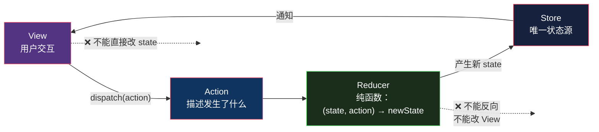

# Flux / Redux：当双向绑定失控

> 系列：企业应用架构（8/19）。代码用 JavaScript（Node 22）演示。

## 生活比喻：银行的传票制度

[上一篇](07-mvvm.md)里，MVVM 的双向绑定像一群人围着一块白板改数字——**谁都能改，改完就走**。出问题时你面对的是一个已经改乱的白板，没人记得谁动过哪一笔。

**Flux 是银行的传票制度**：

- 你不能自己拿笔划账本
- 要改余额，必须**填一张传票**（`action`）：「给 A 账户加 100」
- 传票交给**指定的柜员**（`reducer`），由他按规则处理
- 柜员**每一笔都记流水**，账本是 append-only 的

**关键不是「填传票很麻烦」，而是：任何时候你都能把流水从头放一遍，复现出当前这个余额是怎么来的。**

这就是 Flux 的全部价值，也是它唯一的代价来源。

## 背景：Facebook 遇到的问题

2014 年 Facebook 公开 Flux 时，描述的动机大致是这类场景：

页面上有三处显示未读消息数——侧边栏、聊天窗口标题、通知中心。你点开一条消息，三个地方都该减一。

用双向绑定，这三处各自订阅了同一个状态，看起来没问题。但实际跑起来：

```
用户点开消息
  → 侧边栏的计数变了
  → 触发侧边栏的 watcher，它顺手把聊天窗口也标记为"已读"
  → 聊天窗口的 watcher 发现状态变了，更新标题
  → 通知中心的 watcher 依赖聊天窗口的标题，也更新
  → 更新时又改了某个状态，绕回第一步……
```

**一个点击触发的更新链，可能有五六个环节，而且顺序不确定。** 出问题时你看到的是一堆 watcher 互相触发——**没有一个地方能看到「状态是怎么一步步变成现在这样的」**。

**问题的根源不是「绑定不好用」，而是「谁都能改状态，且改动没有记录」。**

## 什么是 Flux

一句话定义：

> **状态只能由 `action` 修改；修改逻辑集中在一个纯函数 `reducer` 里；数据永远单向流动。**



**这张图最重要的部分是它「缺」的东西**——没有从 View 直接到 Store 的箭头，没有从任何地方回到 Action 的环。**数据只能沿着这条线绕圈，不能抄近路。**

对比一下 MVVM 的双向绑定：

| | MVVM | Flux |
|---|------|------|
| 谁能改状态 | 任何绑定了的地方 | **只有 reducer** |
| 改动有记录吗 | ❌ 没有 | ✅ 每个 action 都记下来 |
| 数据流方向 | 双向（可成环） | **单向** |
| 出问题怎么查 | 加 log 猜 | **回放 action** |

## 完整的样子

一个最小但完整的 Redux：

```javascript
// ---------- 最小 Redux ----------
function createStore(reducer, initial) {
  let state = initial;
  const listeners = [];
  const history = [];

  return {
    getState: () => state,
    dispatch(action) {
      history.push(action);                    // ★ 每个变更都记下来
      const next = reducer(state, action);
      if (next !== state) {                    // 状态真变了才通知
        state = next;
        listeners.forEach(fn => fn(state, action));
      }
      return action;
    },
    subscribe(fn) { listeners.push(fn); },
    getHistory: () => [...history],
  };
}

// ---------- Reducer：纯函数，所有变更逻辑集中在这 ----------
function reducer(state, action) {
  switch (action.type) {
    case "ORDER_ADD":
      return {
        ...state,                              // ← 不改原 state，返回新的
        orders: [...state.orders, action.order],
        total: state.total + action.order.total,
      };
    case "ORDER_PAY": {
      const orders = state.orders.map(o =>
        o.id === action.id ? { ...o, status: "paid" } : o);
      return { ...state, orders };
    }
    case "DISCOUNT_APPLY":
      return { ...state, total: Math.round(state.total * (1 - action.rate) * 100) / 100 };
    default:
      return state;                            // 未知 action 不改状态
  }
}
```

跑起来：

```console
$ node flux.mjs
--- 当前状态 ---
{"orders":[{"id":1,"total":300,"status":"paid"},{"id":2,"total":240,"status":"created"}],"total":486}
视图更新次数: 4
```

## 关键能力：回放

**这才是我要重点展示的部分。** 因为每个变更都经过了 action，整个历史可以完整重演：

```console
$ node flux.mjs
--- 逐条回放 action，复现每一步状态 ---
  ORDER_ADD        → total=   300  orders=1
  ORDER_ADD        → total=   540  orders=2
  ORDER_PAY        → total=   540  orders=2
  DISCOUNT_APPLY   → total=   486  orders=2

--- 从任意一步重新演算（time travel）---
  回到第 2 步: {"orders":[{"id":1,...},{"id":2,...}],"total":540}
  最终状态:     {"orders":[{"id":1,...status:"paid"}],"total":486}
```

**注意「回到第 2 步」那行。** 我只取前两个 action 重放，就得到了那个时刻的完整状态——**这在 MVVM 里做不到**，因为状态是被各处 watcher 逐步改出来的，没有一份「改动的完整清单」。

**这就是「传票制度」的回报**：任何时候都能把流水从头放一遍。

### 前提：reducer 必须是纯函数

回放能成立，靠的是最后那条验证：

```console
--- 纯函数验证 ---
  两次调用结果相同: true
  原 state 未被修改: true
```

**同样的 `(state, action)` 必须永远得到同样的新 state。** 这意味着 reducer 里不能有：

- 随机数、时间戳
- API 调用（副作用）
- 修改原 state（必须返回新对象）

```javascript
// ❌ 破坏可回放
case "ADD": {
  state.total += action.amount;      // 改了原 state → 回放结果会不一致
  return state;
}

// ✅ 纯的
case "ADD":
  return { ...state, total: state.total + action.amount };
```

**副作用不是不能有，是不能在 reducer 里有**——它们该放在 action 之前或之后（Redux 生态里用 middleware 处理，比如 `redux-thunk` / `redux-saga`）。

## 代价

### 代价一：样板代码

实现同样的功能，三个模式的代码量：

| | 改一个状态需要 |
|---|---------------|
| MVVM | `vm.total = 100` |
| Redux | 定义 action type → 写 action creator → 在 reducer 加 case → dispatch |

```javascript
// MVVM：一行
vm.total = 100;

// Redux：四处
const SET_TOTAL = "SET_TOTAL";                              // ① 类型
const setTotal = (v) => ({ type: SET_TOTAL, value: v });     // ② creator
case SET_TOTAL: return { ...state, total: action.value };    // ③ reducer
store.dispatch(setTotal(100));                               // ④ 派发
```

**这是 Redux 最常被吐槽的点**，也是很多人「用了 Redux 后觉得还不如不用」的原因。这个成本是真实的，不是可以靠熟练度消除的。

### 代价二：全局单例状态

Redux 的 store 是**全局唯一**的。这带来两个问题：

- **多个不相关的功能共享一个 store**——用户信息、购物车、UI 开关全在一个对象树里
- **组件卸载了状态还在**——离开页面后数据没清，下次进来看到旧数据

代价是**状态的生命周期和组件的生命周期脱钩了**。MVVM 里 ViewModel 跟着 View 走，Redux 里 store 跟着应用走。

（现代 Redux 用 `combineReducers` 分片、用 RTK 的 slice 隔离，但全局性没变。）

### 代价三：简单场景下是杀鸡用牛刀

一个「点按钮计数器加一」的组件，用 Redux 要写 action/reducer/store——**比直接 `useState` 多出十倍代码**。

## 什么时候值得用

| 场景 | 选谁 |
|------|------|
| 一个表单、几个字段 | `useState` / MVVM，**别上 Redux** |
| 多个组件共享状态、有交叉更新 | **Redux 划算**——可追踪性值这个钱 |
| 需要撤销/重做 | **Redux**——回放能力直接给了 undo/redo |
| 需要状态持久化 / 同步到服务端 | **Redux**——action 日志天然可传输 |
| 调试复杂的状态 bug | **Redux**——能回放就能定位 |
| 简单的 CRUD 页面 | MVVM / 组件状态 |

**判断标准**：问自己「**我需不需要知道状态是怎么变成现在这样的？**」

- 不需要 → MVVM
- 需要（有交叉更新、要 undo、要排查）→ Flux

## 第二部分收尾：四种模式全对比

| 维度 | MVC | MVP | MVVM | Flux / Redux |
|------|-----|-----|------|-------------|
| **谁做决定** | Controller | Presenter | ViewModel | Reducer |
| **通信方式** | 直接调用 | **推**（push） | **订阅**（bind） | **单向流**（dispatch） |
| **View 的智商** | 模板逻辑 | 接近零 | 绑定声明 | 纯渲染 |
| **数据流方向** | 双向 | 双向 | **双向（可成环）** | **单向** |
| **改动有记录吗** | ❌ | ❌ | ❌ | ✅ **action 日志** |
| **手工同步** | 多 | 最多 | 零 | 零 |
| **可测性** | 差 | 好 | 好 | **最好**（reducer 是纯函数） |
| **样板代码** | 少 | 中 | 少 | **多** |
| **调试难度** | 中 | 低 | 高（隐式） | 中（有工具） |
| **典型** | Django/Rails | WinForms/Android | WPF/Vue/SwiftUI | Redux/Vuex/Pinia |

**四个模式解决的是同一类问题的不同侧面**：


**每解决一个问题，就引入一个新的问题。** 这不是「Flux 最先进」的进化论——**Flux 的样板代码代价，正是它换可追踪性付出的钱。**

## 骨架代码

```javascript
// ========== 1. Redux 三件套 ==========
// Action   —— 描述"发生了什么"，必须是可序列化的普通对象
const action = { type: "ORDER_PAID", id: 1 };

// Reducer  —— 纯函数：(state, action) => newState
function reducer(state, action) {
  switch (action.type) {
    case "ORDER_PAID":
      return { ...state, orders: state.orders.map(...) };   // 返回新对象
    default:
      return state;                                          // 未知 action 返回原状态（同一个引用）
  }
}

// Store    —— 唯一状态源 + dispatch + subscribe
const store = createStore(reducer, initial);

// ========== 2. 纯函数的红线 ==========
// ❌ 改原 state        ✅ 返回新对象
// ❌ 随机数/时间戳      ✅ 放进 action 里传进来
// ❌ API 调用          ✅ middleware / thunk 里做
// ❌ 读全局变量        ✅ 从 state 里取

// ========== 3. 判断该不该上 Redux ==========
// 问：我需不需要知道"状态是怎么变成现在这样的"？
//   不需要 → useState / MVVM，别上
//   需要   → 有交叉更新 / 要 undo / 要排查 → 值这个钱
```

## 总结

**Flux 买的是「状态变更完全可追踪、可回放」，付的是「样板代码 + 全局状态 + 单向流的约束」。**

它成立的前提是 **reducer 是纯函数**——没有这条，回放就不成立，整个模式的收益就没了。

回到那个比喻：**银行不是因为「填传票比划账本快」才用传票制度的，是因为对不上账的时候，传票能查。**

第二部分到此结束。我们回答了「界面和逻辑之间那条线划在哪」——**答案是：线划在哪取决于平台能提供什么，而每划一次都会引入新的代价。**

第三部分换一个尺度：不再是「哪个类负责什么」，而是**整个应用横向切成几层**。下一篇从三层架构开始。

---

**相关文章：** [MVVM](07-mvvm.md) · [MVP](06-mvp.md) · [总纲](00-overview.md)
