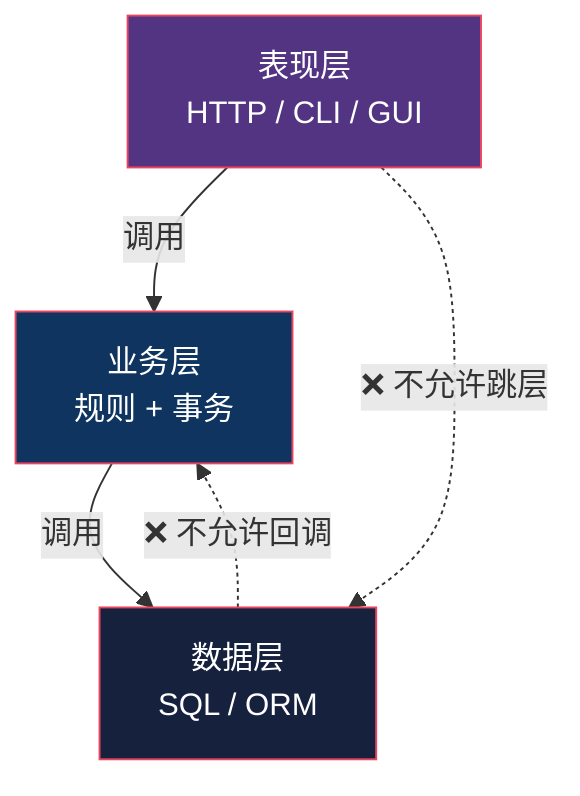

# 三层架构：从 UI 分层到整栈

> 系列：企业应用架构（9/19）。代码用 Python 3.12 演示，附 Java / .NET 对照。

## 生活比喻：餐厅的分区

一家餐厅有三个职能区：

- **前厅**（表现层）：接待、点单、上菜、结账
- **后厨**（业务层）：真正决定菜怎么做
- **库房**（数据层）：食材从哪来、往哪放

**关键问题来了**：街边小馆可能就**一间屋子**——前厅、后厨、库房全在一个空间里，老板转身就能从灶台走到冰柜。

**它仍然是「三层」**，因为「三层」说的是**职能划分**，不是「三个房间」。

这个区分就是三层架构里最大的一个混淆源。

## 三层是哪三层

| 层 | 职责 | 不该做什么 |
|----|------|-----------|
| **表现层**（Presentation） | 解析输入、调用业务、组织输出 | ❌ 不含业务规则 |
| **业务层**（Business / Domain） | 业务规则、事务边界 | ❌ 不碰 HTTP、不写 SQL |
| **数据层**（Data Access） | 数据存取 | ❌ 不含业务判断 |



**两条禁令**：表现层不能跳过业务层直接摸数据层；数据层不能反过来调业务层。

## ★ 最大的混淆：layer 还是 tier

**中文「三层架构」这个词，被两种完全不同的东西共用了。**

| | 逻辑三层（**layer**） | 物理三层（**tier**） |
|---|---------------------|-------------------|
| 说的是 | **代码怎么组织** | **机器怎么部署** |
| 三层 | 表现层 / 业务层 / 数据层 | 客户端 / 应用服务器 / 数据库服务器 |
| 边界 | 函数调用、模块依赖 | 网络调用 |
| 典型语境 | 「这个项目分三层」 | 「我们上了三层架构」 |

**这两件事是正交的。** 组合起来有四种情况：


**左上角那个最常见。** 一个 Django 单体应用跑在一台机器上——它逻辑上是三层，物理上是一层。

**面试里那句「你们项目是三层架构吗」，问的人可能指逻辑，答的人可能指物理**，于是鸡同鸭讲。

### 还有一个混淆：三层和 MVC 什么关系

**它们不在一个尺度上。**

```
三层架构：表现层 / 业务层 / 数据层     ← 跨层的组织
   └── 表现层内部：MVC / MVP / MVVM   ← [第二部分](05-mvc.md)讲的，是层内的模式
```

MVC 只管「表现层内部怎么切」，它完全不知道下面还有几层。**问「三层架构和 MVC 哪个好」就像问「楼层设计和户型设计哪个好」。**

## 完整的样子

同一个订单场景，按三层切开：

```python
# ============ 数据层：只管存取，不懂业务 ============
class OrderRepository:
    def __init__(self, conn):
        self.conn = conn

    def find_user(self, user_id: int):
        return self.conn.execute(
            "SELECT id, vip_level FROM users WHERE id = ?", (user_id,)).fetchone()

    def decrement_stock(self, sku: str, qty: int) -> int:
        cur = self.conn.execute(
            "UPDATE products SET stock = stock - ? WHERE sku = ? AND stock >= ?",
            (qty, sku, qty))
        return cur.rowcount          # 返回受影响行数，让业务层判断成没成

    def insert_order(self, user_id: int, total: float) -> int: ...
    def commit(self): ...


# ============ 业务层：规则在这里 ============
class OrderService:
    def __init__(self, repo: OrderRepository):
        self.repo = repo

    def place_order(self, user_id: int, items: list[dict]) -> PlaceOrderResult:
        user = self.repo.find_user(user_id)
        if user is None:
            raise ValueError("用户不存在")
        vip_level = user[1]

        total = 0.0
        for item in items:
            p = self.repo.find_product(item["sku"])
            if p is None:
                raise ValueError(f"商品不存在: {item['sku']}")
            _, price, stock = p
            if stock < item["qty"]:
                raise ValueError(f"库存不足: {item['sku']}")
            total += price * item["qty"]

        # ★ 折扣规则 —— 业务层的核心职责
        if vip_level >= 3:
            total *= 0.9
        elif vip_level >= 1:
            total *= 0.95
        if total > 1000:
            total -= 50

        order_id = self.repo.insert_order(user_id, round(total, 2))
        for item in items:
            if self.repo.decrement_stock(item["sku"], item["qty"]) == 0:
                raise ValueError(f"库存不足: {item['sku']}")
            self.repo.insert_item(order_id, item["sku"], item["qty"])
        self.repo.commit()
        return PlaceOrderResult(order_id, round(total, 2))


# ============ 表现层 A：HTTP ============
def http_handler(conn, request) -> dict:
    """只做三件事：解析请求 → 调业务层 → 组织响应"""
    try:
        svc = OrderService(OrderRepository(conn))
        r = svc.place_order(request["user_id"], request["items"])
        return {"status": 201, "body": {"order_id": r.order_id, "total": r.total}}
    except ValueError as e:
        return {"status": 400, "body": {"error": str(e)}}


# ============ 表现层 B：CLI —— 业务层完全不知道 ============
def cli_handler(conn, argv: list[str]) -> str:
    """同一套业务层和数据层，换一个入口"""
    user_id = int(argv[0])
    items = []
    for spec in argv[1:]:
        sku, qty = spec.split(":")
        items.append({"sku": sku, "qty": int(qty)})
    try:
        r = OrderService(OrderRepository(conn)).place_order(user_id, items)
        return f"下单成功 #{r.order_id} 合计 {r.total}"
    except ValueError as e:
        return f"下单失败: {e}"
```

跑起来：

```console
$ python3 layers.py
--- 表现层 A：HTTP ---
{'status': 201, 'body': {'order_id': 1, 'total': 540.0}}
{'status': 400, 'body': {'error': '库存不足: A001'}}

--- 表现层 B：CLI（同一套业务层）---
下单成功 #2 合计 1050.0
下单失败: 库存不足: A001
```

**注意重点不在输出，在两个表现层共享了同一套业务层。** HTTP 和 CLI 的代码里，`OrderService` 和 `OrderRepository` 一个字都没改。

## 三层的价值：可替换性

三层架构买的是**每一层都能独立替换**：

| 想换什么 | 要改哪层 | 其他层 |
|---------|---------|--------|
| HTTP → gRPC | 表现层 | 不动 |
| 加一个 CLI 工具 | 表现层 | 不动 |
| MySQL → PostgreSQL | 数据层 | 不动 |
| 加一个「企业客户九折」规则 | **业务层** | **不动** |
| 换 ORM | 数据层 | 不动 |

**最后一行是重点**：业务规则变了只改业务层——这说明**规则没有被泄漏到其他层**。

反过来，如果你要加一条折扣规则，却得同时改 Controller、Service、和 SQL——**那说明根本没分成三层**，只是分了三个文件夹。

## 常见的三个错误

**① 「三层」变成了三个文件夹**

```
src/
├── controllers/    ← 全在这
├── services/       ← 空的，或者只是转发
└── repositories/   ← 全是 SQL 拼接 + 业务判断
```

**文件夹有了，职责没分。** 判断标准：业务规则能不能在不动其他两层的前提下改？

**② 表现层直接调数据层**

```python
# ❌ 跳层
def order_detail(request, pk):
    return render(request, "d.html",
                  {"order": db.execute("SELECT * FROM orders WHERE id = ?", (pk,))})
```

**跳层本身不一定是错的**——纯查询场景（读一个列表展示）跳过业务层是常见优化，因为那里确实没有业务规则。

**但它有个代价**：这段 SQL 现在和 HTTP 请求绑死了。哪天要加「用户只能看自己的订单」这条规则，你得回到表现层来加——**而这条规则本该在业务层**。

**③ 业务层退化成「转发层」**

```python
class OrderService:
    def place_order(self, user_id, items):
        return self.repo.place_order(user_id, items)   # 纯转发，一行逻辑都没有
```

**如果业务层只是转发，那它就是多余的。** 这个症状通常说明：（a）业务规则跑到了数据层，或者（b）这个场景确实没有业务规则（纯 CRUD），不需要三层。

## 代价

| 代价 | 说明 |
|------|------|
| **层间数据传递** | 一行数据库记录要变成 DTO、变成领域对象、变成 View 模型——**每过一层就可能转一次** |
| **样板代码** | 一个简单的「改个字段」，要写 Controller + Service + Repository 三个方法 |
| **调试要跨文件** | 一个请求要跳三次才能看全 |
| **层的数量争议** | 三层？四层？要不要加 Service 层？（下一篇会讲） |

**第一行是最真实的成本。** 三层架构强制了「层间只能用约定的数据结构通信」——这个约束带来了解耦，也带来了转换开销。

## 什么时候不需要三层

| 场景 | 建议 |
|------|------|
| 纯 CRUD 后台 | **两层就够**——表现层直接调数据层，业务层是空的 |
| 报表 / 导出 | 一层——需要什么就查什么 |
| 一次性脚本 | 一层——没有复用需求 |
| 业务规则复杂 | **必须三层**——这是它真正的主场 |
| 多端接入同一套逻辑 | **三层**——Web + CLI + 定时任务共享业务层 |

**判断标准**：

> **如果业务层里真的没有业务规则，那就不需要业务层。**

三层架构不是「规范」，是**当业务规则需要被多个入口复用时的自然结果**。

## 骨架代码

```python
# ========== 1. 三层的骨架 ==========
# 表现层：解析 → 调用 → 组织输出（三件事，不多不少）
def handler(input):
    try:
        result = BusinessService(Repo()).do_something(parsed)
        return format_success(result)
    except DomainError as e:
        return format_error(e)

# 业务层：规则 + 事务边界
class BusinessService:
    def do_something(self, cmd):
        # ① 读数据（通过 Repo）
        # ② 应用业务规则   ← 这一层存在的唯一理由
        # ③ 写数据 + 事务
        ...

# 数据层：只说数据的语言，不判断业务
class Repo:
    def find(self, key) -> Row: ...       # 返回原始数据
    def save(self, row) -> int: ...       # 无返回值 / 影响行数
    # ❌ 不写 if vip_level >= 3 这种判断

# ========== 2. 判断三层是不是真的分开了 ==========
# 问：加一条新的业务规则，要改几个文件？
#   1 个（业务层）  → ✅ 分层成功
#   2-3 个          → ⚠️ 规则泄漏了
#   全部都要改      → ❌ 只是分了文件夹

# ========== 3. 跳层的判断 ==========
# 纯查询、无业务规则 → 跳层可以（省一个转发方法）
# 有任何判断逻辑     → 不能跳，那个判断就是业务规则
```

## 总结

| 维度 | 三层架构 |
|------|---------|
| 组织原则 | 按**职责**横向切 |
| 三层 | 表现层 / 业务层 / 数据层 |
| 通信方向 | 单向：表现 → 业务 → 数据 |
| 买到的 | 每层可独立替换；业务规则集中在一处 |
| 付出的 | 层间数据转换 + 样板代码 + 跨文件调试 |
| 最大的混淆 | **layer（逻辑）vs tier（物理）**——两者正交 |
| 和 MVC 的关系 | MVC 是表现层**内部**的模式，尺度不同 |
| 不需要的场景 | 纯 CRUD、报表、脚本 |

**一句话**：三层架构不是「规范」，它是**「业务规则需要被多个入口复用」这件事的自然结果**。当你的系统同时有 Web、CLI、定时任务要下单，三层几乎是必然的；当只有一个 CRUD 后台，三层就是三个空文件夹。

但三层架构有个它自己解决不了的问题：**依赖方向还是从上往下的**——业务层依然依赖数据层的接口。下一篇讲的三种架构，就是要把这个箭头掉转过来：[六边形 / 洋葱 / Clean](10-hexagonal-onion-clean.md)。

---

**相关文章：** [MVC](05-mvc.md) · [六边形 / 洋葱 / Clean](10-hexagonal-onion-clean.md) · [数据映射器](03-data-mapper.md) · [总纲](00-overview.md)
