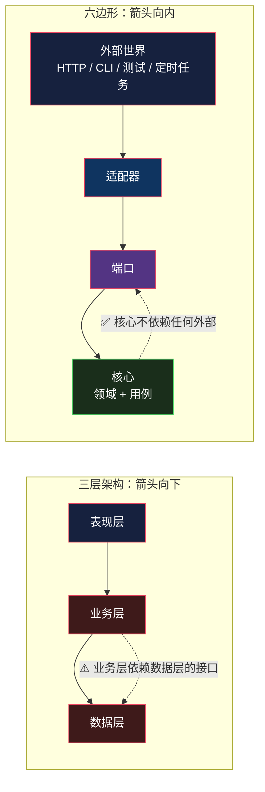

# 六边形 / 洋葱 / Clean：同一个想法的三种画法

> 系列：企业应用架构（10/19）。代码用 Python 3.12 演示。

## 生活比喻：土豆、马铃薯、洋芋

同一个东西，三个地方三个叫法。你去菜市场说要「洋芋」，四川的摊主秒懂，东北的摊主会愣一下——**但它们说的是同一种作物。**

**六边形架构、洋葱架构、Clean Architecture 就是这个关系。**

三个名字、三张图、三个提出者，但**内核是同一句话**：

> **依赖方向一律向内；核心不认识任何外部设施。**

## 三个来源

| 名字 | 提出者 | 时间 | 当时的出发点 |
|------|-------|------|-------------|
| **六边形架构**<br/>（Ports & Adapters） | Alistair Cockburn | 2005 | 让应用能同时被多种方式驱动（UI、测试、批处理） |
| **洋葱架构**（Onion） | Jeffrey Palermo | 2008 | 解决传统分层的「数据库中心主义」 |
| **Clean Architecture** | Robert C. Martin | 2012 | 把前两者的共识整理成一套通用规则 |

**13 年间被独立提出三次**——这本身就说明问题真实存在。

## 共同内核：把箭头掉转过来

先看[三层架构](09-three-tier.md)的问题在哪：



**三层架构里，业务层仍然依赖数据层**——它的构造函数里有 `OrderRepository` 这个具体类型。

**六边形把这条线断开了**：核心定义「我需要一个能存订单的东西」（端口），谁来实现、怎么实现，核心不关心。

**这其实就是[第 3 篇](03-data-mapper.md)数据映射器那个依赖倒置——只不过尺度从「对象 vs 数据库」扩大到了「整个应用 vs 一切外部世界」。**

## 端口与适配器

两个核心概念：

| 概念 | 谁定义 | 谁实现 | 例子 |
|------|-------|-------|------|
| **端口**（Port） | **核心** | 外部 | `OrderRepository` 接口、`PaymentGateway` 接口 |
| **适配器**（Adapter） | 外部 | 外部 | `SqliteOrderRepo`、`StripePayments`、`FakeOrderRepo` |

**关键：端口由核心定义。** 这跟传统的「先定接口再实现」不同——**接口的所有权在核心手里**，因为核心才知道自己需要什么能力。

Cockburn 的「六边形」还有个细节：**左侧和右侧是对称的**——

- **驱动侧**（driving / 左侧）：外部**调用**应用（HTTP、CLI、定时任务、测试）
- **被驱动侧**（driven / 右侧）：应用**调用**外部（数据库、消息队列、支付网关）

**为什么画成六边形？** Cockburn 自己说过：为了让人一眼看出「**边上可以接任意多个适配器**」，而不是固定的三四个。六这个数字没有特殊含义。

## 完整的样子

```python
# ═══════════════ 核心：端口 —— 由核心定义，由外部实现 ═══════════════
# 这个区域里没有 import sqlite3、没有 HTTP、没有框架

@dataclass
class Order:
    user_id: int
    items: list[tuple[str, int, float]] = field(default_factory=list)
    status: str = "created"
    paid_txn: str | None = None

    @property
    def total(self) -> float:
        return round(sum(p * q for _, q, p in self.items), 2)


class OrderRepository(ABC):          # ← 端口
    @abstractmethod
    def save(self, order: Order) -> int: ...

class PaymentGateway(ABC):           # ← 端口
    @abstractmethod
    def charge(self, amount: float) -> str: ...


# ═══════════════ 核心：用例 —— 编排，只依赖端口 ═══════════════
class PlaceOrder:
    def __init__(self, orders: OrderRepository, payments: PaymentGateway):
        self.orders = orders              # ← 类型是抽象端口，不是具体实现
        self.payments = payments

    def execute(self, user_id: int, items: list[tuple[str, int, float]]) -> dict:
        order = Order(user_id=user_id, items=items)
        if not order.items:
            raise ValueError("订单不能为空")

        txn = self.payments.charge(order.total)     # ← 调端口
        order.status = "paid"
        order.paid_txn = txn
        order_id = self.orders.save(order)          # ← 调端口
        return {"order_id": order_id, "total": order.total, "txn": txn}
```

**`PlaceOrder` 的构造函数收的是 `OrderRepository`（抽象），不是 `SqliteOrderRepo`（具体）。** 这一行就是整个架构。

然后准备几套适配器：

```python
class FakeOrderRepo(OrderRepository):     # 内存，测试用
    def __init__(self): self.db = {}; self._seq = 0
    def save(self, order): self._seq += 1; self.db[self._seq] = order; return self._seq
    def find(self, order_id): return self.db.get(order_id)

class SqliteOrderRepo(OrderRepository):   # 真实存储
    def __init__(self, conn): self.conn = conn
    def save(self, order):
        cur = self.conn.execute("INSERT INTO orders (...) VALUES (?, ?, ?, ?)", ...)
        return cur.lastrowid

class FakePayments(PaymentGateway):       # 假支付
    def charge(self, amount): return f"fake-txn-{amount}"

class LogPayments(PaymentGateway):        # 只记日志
    def charge(self, amount): return "log-txn"
```

**同一个用例，三种组装方式：**

```console
$ python3 hexagonal.py
--- 组合 A：内存 + 假支付（纯测试，无任何外部依赖）---
  {'order_id': 1, 'total': 600.0, 'txn': 'fake-txn-1'}

--- 组合 B：SQLite + 日志支付（真实存储）---
  {'order_id': 1, 'total': 600.0, 'txn': 'log-txn'}

--- 组合 C：再换回来，用例代码没动过 ---
  {'order_id': 1, 'total': 600.0, 'txn': 'fake-txn-1'}

--- 领域逻辑单测：零外部依赖 ---
  总额 280.0（2.5×100 + 10.0×3 = 280.0）
```

**`PlaceOrder` 的代码在这三次里一个字符都没改。**

换存储（SQLite → 内存）、换支付（真实 → 假的），只改了**组装那几行**——这个「组装处」在术语里叫 **Composition Root**，通常是 `main` 或者依赖注入容器。

## 三个名字到底差在哪

**差在「画了几层」。**

```mermaid
flowchart TB
    subgraph H["六边形（2005）：只有内外"]
        direction LR
        H1["外部"] --> H2["适配器"] --> H3["端口"] --> H4["核心"]
    end

    subgraph O["洋葱（2008）：4 层同心圆"]
        direction LR
        O1["Infrastructure"] --> O2["Application Services"] --> O3["Domain Services"] --> O4["Domain Model"]
    end

    subgraph C["Clean（2012）：4 层同心圆"]
        direction LR
        C1["Frameworks & Drivers"] --> C2["Interface Adapters"] --> C3["Use Cases"] --> C4["Entities"]
    end

    style H4 fill:#1a2e1b,stroke:#53d769,color:#fff
    style O4 fill:#1a2e1b,stroke:#53d769,color:#fff
    style C4 fill:#1a2e1b,stroke:#53d769,color:#fff
    style H3 fill:#533483,stroke:#e94560,color:#fff
    style O3 fill:#533483,stroke:#e94560,color:#fff
    style C3 fill:#533483,stroke:#e94560,color:#fff
```



| 维度 | 六边形（2005） | 洋葱（2008） | Clean（2012） |
|------|--------------|-------------|--------------|
| 核心概念 | 端口 / 适配器 | 同心圆分层 | 同心圆分层 |
| 分几层 | **不分层**，只有「内 / 外」 | 4 层 | 4 层 |
| 左右对称 | ✅ 明确区分驱动侧/被驱动侧 | ❌ 不分 | ❌ 不分 |
| 中心是什么 | 「应用」 | Domain Model | Entities |
| 命名风格 | 讲**边界** | 讲**层次** | 讲**依赖规则** |

**Clean 的贡献是把前两者的共识提炼成一条规则。** Robert Martin 自己的说法是：Clean Architecture 是「把这些架构**整合成一个可操作的统一想法**」——他点名整合了六边形、洋葱、Screaming Architecture、DCI、BCE 五种，落点是那条 **Dependency Rule**（依赖只能指向内层）。

**注意他的落点是「一条规则」，不是「一个分类框架」。** 洋葱和六边形主要回答「怎么画」，Clean 主要回答「什么不许做」。

所以：

- **想理解本质** → 看六边形（最少的概念，只有「内外」和「端口/适配器」）
- **想在团队里落地** → 用 Clean 的分层命名（更具体，新人好对应）
- **洋葱** → 基本可以当作 Clean 的前身

**它们不是三个可选方案，是同一个方案的三种描述精度。**

## 和三层架构的正面比较

| 维度 | 三层架构 | 六边形 / Clean |
|------|---------|---------------|
| **依赖方向** | 向下（表现 → 业务 → **数据**） | **向内**（外部 → 适配器 → **核心**） |
| **领域层依赖什么** | 依赖数据层的接口 | **不依赖任何东西** |
| **换数据库要改哪** | 数据层 + 业务层（接口变了） | **只加一个新适配器** |
| **能测吗** | 业务层要 mock 数据层 | 核心零依赖，直接 new |
| **层数** | 固定 3 层 | 2~4 层，按需 |
| **上手成本** | 低 | **高** |

**核心差别就一行**：三层架构里，业务层的构造函数依赖**具体的数据访问接口**；六边形里，核心只依赖**自己定义的端口**。

## 代价

### 代价一：接口（端口）数量爆炸

每个外部依赖都要定义端口 + 至少一个适配器：

```
OrderRepository  ←→  SqliteOrderRepo + FakeOrderRepo
PaymentGateway   ←→  StripePayments + FakePayments + LogPayments
InventoryPort    ←→  HttpInventory + FakeInventory
Notifier         ←→  EmailNotifier + FakeNotifier
```

**一个简单功能，可能要写 8 个类。** 这些类里有一半是「转接头」——除了转发什么都不干。

### 代价二：间接层让代码难追

```
HTTP → Controller → UseCase → Port → Adapter → SQL
```

**六个环节，一个查询。** 追一个 bug 要跳六个文件。

### 代价三：简单场景下是灾难

一个「查列表展示」的功能，在六边形架构里要：

```
Controller → QueryUseCase → QueryPort → QueryAdapter → SQL
```

**而它本来只需要一行 SQL 加一行 render。**

## 什么时候值得

| 场景 | 建议 |
|------|------|
| CRUD 后台 | **别用**——三层甚至两层就够 |
| 业务规则复杂、需要大量单测 | **值得**——核心可测是刚需 |
| 多种驱动（Web + CLI + 定时 + 测试） | **值得**——这正是 Cockburn 的出发点 |
| 外部依赖会换（支付网关、存储） | **值得** |
| 生命周期短 / 原型 | **别用**——投入收不回来 |
| 团队不熟悉 | **谨慎**——容易画成三层架构的皮 |

**判断标准**：

> **你的核心逻辑，能不能在不引入任何外部依赖的情况下测试？**

- 能（哪怕用的是别的办法）→ 不一定需要六边形
- 不能，而且这是痛点 → 六边形值这个钱

## 骨架代码

```python
# ========== 1. 目录结构（Clean 的分层命名）==========
# domain/          ← 实体 + 领域服务：零依赖，不 import 任何外部
# application/     ← 用例：只依赖 domain 和端口
# ports/           ← 端口定义（也可以放在 domain/ 里）
# adapters/        ← 实现端口：sqlite_ / http_ / fake_
# main.py          ← Composition Root：唯一决定用哪个适配器的地方

# ========== 2. 依赖规则（Clean 的核心）==========
# 外 → 内：可以
# 内 → 外：绝对不行
# 判断方法：grep 一下 domain/ 里有没有 import 框架
#   import sqlite3 / fastapi / requests  → ❌ 依赖泄漏

# ========== 3. 端口定义在核心侧 ==========
class SomePort(ABC):
    @abstractmethod
    def do_something(self, arg) -> Result: ...
# 注意：方法的参数和返回值只用核心自己的类型，不要出现框架类型

# ========== 4. 判断值不值得上这套 ==========
# 问：我的核心逻辑需要被几种方式驱动？
#   1 种（只有 Web）且逻辑简单 → 三层够了
#   多种 / 逻辑复杂 / 依赖会换 → 六边形值得
```

## 总结

| 结论 | 说明 |
|------|------|
| 三个名字，一个东西 | 内核都是「依赖一律向内，核心不认识外部」 |
| 差别在描述精度 | 六边形最简（不分层），洋葱和 Clean 加了同心圆 |
| 和三层架构的分水岭 | 三层是「向下依赖」，六边形是「向内依赖」 |
| 和[数据映射器](03-data-mapper.md)的关系 | 同一个依赖倒置，尺度从「对象 vs 库」扩大到「应用 vs 一切外部」 |
| 最大的代价 | 端口和适配器的数量；简单场景下是纯负担 |

**一句话**：这三个架构买的是「**核心逻辑完全独立于外部世界**」，付的是「**一堆转接头 + 一条更长的调用链**」。

**它的价值随「核心逻辑的复杂度」和「外部依赖的更换频率」上升**——在业务规则复杂的系统里非常值，在 CRUD 后台里是灾难。

第三部分还剩最后一个问题：**用例这一层到底该放什么，它和领域服务怎么分工，事务该在哪一层开？** 下一篇：[服务层](11-service-layer.md)。

---

**相关文章：** [三层架构](09-three-tier.md) · [数据映射器](03-data-mapper.md) · [服务层](11-service-layer.md) · [总纲](00-overview.md)
