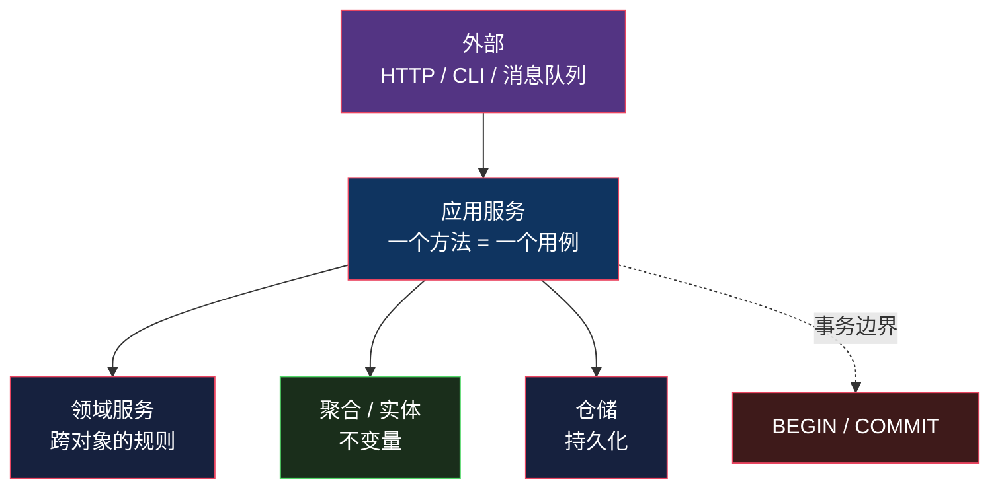

# 服务层：应用服务和领域服务的分工

> 系列：企业应用架构（11/19）。代码用 Python 3.12 演示。

## 生活比喻：大堂经理和外聘顾问

回到餐厅。有两种「服务人员」经常被混为一谈：

**大堂经理**（应用服务）：
- 接待客人、安排座位、协调后厨和前台
- **决定什么时候开门营业、什么时候打烊**（事务边界）
- 但他不做菜——**他不懂菜谱**

**外聘顾问**（领域服务）：
- 遇到需要专业判断的事才请他：「这两个账户之间转账合不合规？」
- 他给的是**判断**，不是流程
- **他不属于任何一个部门**——这正是他被外聘的原因

**这两个角色的差别，就是服务层里最常见的混乱来源。**

## 什么是服务层

一句话定义：

> **服务层定义应用的边界——为每个用例提供一个入口。**

它是「外面能调用的东西」和「里面的领域逻辑」之间的那层膜：



**Fowler 在 PoEAA 里把这一层叫 Service Layer**，它的定位是「**用例的边界**」——一个方法对应一个完整的业务动作。

## ★ 应用服务 vs 领域服务

这是本文的核心。**两个东西都叫 Service，但职责完全不重叠：**

| | 应用服务 | 领域服务 |
|---|---------|---------|
| **装什么** | 编排、事务、权限 | **业务规则** |
| **有业务规则吗** | ❌ **没有** | ✅ 有 |
| **有状态吗** | 通常无状态 | 必须无状态 |
| **一个方法对应** | 一个**用例** | 一个**能力** |
| **事务边界** | ✅ **在这里** | ❌ 不碰事务 |
| **典型命名** | `PlaceOrderAppService` | `PricingService` / `TransferService` |
| **谁调用它** | 外部（Controller） | 应用服务 / 其他领域对象 |

**记忆点**：

> **应用服务回答「这个用例要做哪几步」；领域服务回答「这条规则怎么算」。**

### 什么时候需要领域服务

判断标准很具体：

> **这条业务规则能不能自然地落在某个对象上？**

- **能** → 放进那个对象（这就是[第 4 篇](04-anemic-vs-rich.md)说的「不变量」）
- **不能**（需要同时看多个对象，且放哪边都别扭）→ **领域服务**

看这个例子：

```python
# ❌ 折扣规则放 Order 上？—— Order 不该知道 User 的等级
class Order:
    def price(self, user): ...        # 订单为什么要管用户？

# ❌ 放 User 上？—— User 不该知道订单的构成
class User:
    def discount_for(self, order): ...  # 用户为什么要算别人的订单？

# ✅ 它跨越两个对象，不属于任何一方 —— 领域服务
class PricingService:
    def price(self, order: Order, user: User) -> float:
        total = sum(i.subtotal for i in order.items)
        if user.vip_level >= 3:
            total *= 0.9
        elif user.vip_level >= 1:
            total *= 0.95
        if total > 1000:
            total -= 50
        return round(total, 2)
```

**这正是[第 4 篇](04-anemic-vs-rich.md)里说的「政策」**——它不是不变量（订单总额不等于小计之和才算坏），它是一条会变的业务政策。政策放领域服务，不变量放实体。

另一个经典例子是**转账**：

```python
class TransferService:
    def transfer(self, from_acct: Account, to_acct: Account, amount: float) -> None:
        from_acct.withdraw(amount)     # ← 各自的规则在各自对象上
        to_acct.deposit(amount)
        # 「两边总额守恒」这条规则跨越两个对象 → 在这里校验
```

`withdraw` / `deposit` 是 `Account` 的不变量，放对象上；**「转账前后总额必须相等」这条跨越两个对象，所以是领域服务。**

## 事务边界

**事务边界在应用服务，不在领域层。** 原因有三：

1. **领域对象不该知道「事务」这个概念**——它只管自己的不变量，不管外面有没有数据库
2. **一个用例 = 一个事务**，而用例是应用服务的概念
3. **领域服务可能被组合**——`PlaceOrder` 调了 `PricingService`，如果两个都开事务，就嵌套了

看代码：

```python
class UnitOfWork:
    """事务边界 —— 由应用服务持有，不由领域对象或仓储管理"""
    def __init__(self, conn): self.conn = conn
    def __enter__(self):
        self.conn.execute("BEGIN")
        return self
    def __exit__(self, exc_type, *_):
        if exc_type is None:
            self.conn.execute("COMMIT")
        else:
            self.conn.execute("ROLLBACK")     # ← 出错整体回滚
        return False


class PlaceOrderAppService:
    """应用服务：编排 + 事务 + 权限。★ 里面没有业务规则"""

    def __init__(self, conn, pricing: PricingService):
        self.conn = conn
        self.repo = OrderRepository(conn)
        self.pricing = pricing            # ← 领域服务被注入进来

    def execute(self, cmd: PlaceOrderCommand) -> int:
        with UnitOfWork(self.conn):                    # ← 事务边界在这
            user = self.repo.user(cmd.user_id)
            if user is None:
                raise ValueError("用户不存在")
            if user.vip_level < 0:
                raise PermissionError("账户被冻结")     # ← 权限：应用服务的职责

            order = Order(user_id=cmd.user_id, items=cmd.items)
            order.validate()                            # ← 不变量：问 Order
            order.total = self.pricing.price(order, user)   # ← 规则：问领域服务
            order.id = self.repo.next_id()
            self.repo.save(order)
        return order.id
```

**看 `execute` 方法体**——里面没有一行 `if total > 1000` 这种业务规则。它只做四件事：

1. 开事务
2. 取数据、检查权限
3. **把规则委托出去**（问 `Order` 要校验，问 `PricingService` 要价格）
4. 存数据

跑起来：

```console
$ python3 service_layer.py
--- 应用服务编排：用例入口 ---
  VIP3 下单 → order #1, total 540.0
  支付后状态: paid

--- 事务回滚验证 ---
  预期失败: 订单不能为空
  订单数 1 → 1（未增加 = 事务回滚成功）

--- 权限检查在应用服务，不在领域 ---
  预期拒绝: 账户被冻结
```

**「订单数 1 → 1」那行是重点**——空订单触发了 `Order.validate()` 抛异常，事务回滚，没留下脏数据。

**注意这个回滚是怎么发生的**：`UnitOfWork.__exit__` 看到异常就 ROLLBACK。**应用服务只需要「把用例圈进事务里」，不用在每个方法里手写 try/rollback。**

## 三个常见错误

### 错误一：应用服务里塞业务规则

```python
# ❌ 业务规则跑到了应用服务
class PlaceOrderAppService:
    def execute(self, cmd):
        with self.uow:
            order = Order(...)
            # 折扣规则直接写在这 —— 那么「价格预览」用例怎么办？再写一遍？
            total = sum(i.subtotal for i in order.items)
            if user.vip_level >= 3:
                total *= 0.9
            ...
```

**这正是[第 1 篇](01-transaction-script.md)那个「规则重复」问题的重演**——只不过这次它披着「分层」的外衣（毕竟代码确实在 Service 里，看起来挺规矩）。

**信号**：你发现自己在两个应用服务里复制同一段计算。

### 错误二：Service 变成上帝类

```
OrderService        ← 800 行
  ├── placeOrder()
  ├── cancelOrder()
  ├── refundOrder()
  ├── calculatePrice()       ← 该去 PricingService
  ├── sendNotification()     ← 该去 Notifier 端口
  ├── exportToExcel()        ← 该去专门的查询服务
  └── validateAddress()      ← 该去地址领域服务
```

**这是最常见的失败模式**，尤其在贫血模型 + Service 的项目里。

**信号**：`OrderService` 的构造函数有 8 个依赖。

### 错误三：把「查询」也塞进应用服务

```python
# ❌ 查询走完整的领域路径
def get_order_list(self, user_id):
    orders = self.repo.find_by_user(user_id)      # 加载完整聚合
    return [self._to_dto(o) for o in orders]      # 再转一遍
```

**只读查询不需要经过领域层。** 它没有业务规则、不改状态、也不需要保护不变量——它就是要拼几个表的数据。

**查询可以直接走 SQL**（第 19 篇和 CQRS 那篇会展开这一点）。**让查询绕过领域层不是偷懒，是识别出「这里没有领域逻辑」。**

## 和 Controller 的边界

很多人分不清 Controller 和应用服务的区别：

| | Controller | 应用服务 |
|---|-----------|---------|
| **知道 HTTP 吗** | ✅ 知道 | ❌ **不知道** |
| **职责** | 解析请求、组织响应 | 编排用例、管事务 |
| **可以有几个入口** | 一个 Controller 方法 | 一个应用服务方法，**多个 Controller 可以调它** |
| **参数类型** | Request / DTO | Command 对象（领域语言） |

**判断标准**：把 HTTP 换掉，应用服务要不要改？

- 要改 → 它其实是 Controller
- 不用改 → 它是对的

**这正是[三层架构](09-three-tier.md)那篇演示过的**——HTTP 和 CLI 两个表现层共享同一套业务层，业务层一个字没改。

## 什么时候不需要服务层

| 场景 | 建议 |
|------|------|
| CRUD 后台 | **不需要**——Controller 直接调仓储 |
| 纯查询接口 | **不需要**——查询直接走 SQL |
| 只有一个入口且逻辑简单 | 不需要——服务层会退化成转发 |
| 多入口 / 用例复杂 / 要事务 | **需要** |

**判断标准**：

> **这个用例需要「事务 + 编排 + 权限」中的任意两样吗？**

- 需要 → 应用服务
- 都不需要（比如一个纯查询）→ 别建这一层

## 骨架代码

```python
# ========== 1. 应用服务：编排者 ==========
class XxxAppService:
    def __init__(self, uow, repo, domain_service):
        ...
    def execute(self, cmd: XxxCommand) -> Result:
        with self.uow:                 # ① 事务边界
            # ② 权限 / 前置检查（这是应用的关注点，不是领域的）
            # ③ 从仓储取聚合
            # ④ 把规则委托给领域（对象或领域服务）
            # ⑤ 存回
        return result
    # ❌ 不写 if total > 1000 这种规则

# ========== 2. 领域服务：无状态的能力 ==========
class XxxDomainService:
    def calculate(self, a: AggregateA, b: AggregateB) -> ...:
        # 规则跨越多个对象，放哪边都不对 → 放这里
        ...
    # ❌ 不碰事务、不碰仓储、不调外部 IO

# ========== 3. 判断一段逻辑该去哪 ==========
# 只依赖自己一个对象的状态        → 实体/聚合的不变量
# 跨越多个对象，不属于任何一方    → 领域服务
# 跨多个用例的编排 + 事务 + 权限  → 应用服务
# 纯数据拼装，无规则             → 查询，直接 SQL
```

## 总结

| 结论 | 说明 |
|------|------|
| 两个「服务」是两回事 | 应用服务管编排，领域服务管规则 |
| 应用服务不装规则 | 它是编排者；装规则会导致跨用例重复 |
| 事务边界在应用服务 | 领域层不该知道「事务」这个概念 |
| 领域服务的判断标准 | 规则跨越多个对象、放哪边都别扭 |
| 服务层不是必需的 | 纯 CRUD 和纯查询不需要它 |
| 和 Controller 的分界 | 换掉 HTTP 不影响应用服务，就是对的 |

**一句话**：服务层的价值在于**给「用例」一个明确的家**——事务在哪开、权限在哪查、规则委托给谁，都在这一层写清楚。**但它不该装业务规则，那些规则属于领域对象和领域服务。**

第三部分到此结束。我们回答了「代码怎么横向切」——**答案是：切的尺度取决于你要隔离什么。三层隔离的是「变化的频率」；六边形隔离的是「核心与外部」；服务层隔离的是「用例与领域」。**

第四部分换一个尺度：对象和关系数据库之间那道鸿沟。下一篇从仓储开始。

---

**相关文章：** [六边形 / 洋葱 / Clean](10-hexagonal-onion-clean.md) · [贫血模型 vs 充血模型](04-anemic-vs-rich.md) · [三层架构](09-three-tier.md) · [总纲](00-overview.md)
