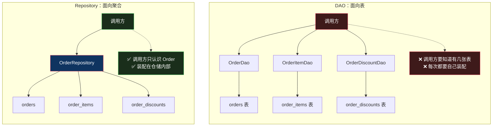

# 仓储：不只是 DAO 换个名字

> 系列：企业应用架构（12/19）。代码用 Python 3.12 演示。

## 生活比喻：书库和检索台

图书馆的资料可能散在三个书库：正文在一个库、注解在另一个库、附录在第三个库。

**DAO 的用法是你自己进书库**：你知道「正文在 B 区、注解在 C 区、附录在 D 区」，然后跑三个地方各拿一份，回来自己装订成一本。

**仓储的用法是去检索台**：你说「我要《红楼梦》的完整注解版」，馆员把三处的东西找齐交给你。**你根本不需要知道它有几个书库。**

这个差别不是「方便一点」——**它决定了「资料怎么存放」这件事会不会泄漏到你的业务代码里**。

## 什么是仓储

一句话定义：

> **仓储给领域对象一个「像操作内存集合」的接口，同时把「聚合跨了几张表」这件事藏起来。**

三个关键词：

| 关键词 | 含义 |
|--------|------|
| **像集合** | 接口是 `add` / `remove` / `find_by_id`，不是 `insert` / `delete` / `select` |
| **领域语言** | `active_orders_of(user)`，不是 `findByUserIdAndStatus` |
| **隐藏结构** | 调用方不知道聚合跨了几张表 |

第三点是它和 DAO 的分水岭。

## ★ 仓储 vs DAO

| 维度 | DAO | Repository |
|------|-----|-----------|
| **抽象的单位** | **一张表** | **一个聚合** |
| **数量** | 3 张表 → 3 个 DAO | 3 张表 → **1 个 Repository** |
| **返回什么** | 裸数据（row / tuple / dict） | **完整领域对象** |
| **谁负责装配** | 调用方 | 仓储内部 |
| **接口语言** | SQL 语言 | **领域语言** |
| **有行为吗** | 无（纯数据） | 返回的对象有领域行为 |
| **属于哪一层** | 数据访问层 | **领域层**（接口）+ 基础设施层（实现） |



## 完整的样子

```python
# ═══════════ ❌ DAO 风格：一张表一个 DAO，返回裸数据 ═══════════
class OrderDao:
    def find_by_id(self, conn, oid):
        return conn.execute("SELECT * FROM orders WHERE id = ?", (oid,)).fetchone()

class OrderItemDao:
    def find_by_order(self, conn, oid):
        return conn.execute("SELECT * FROM order_items WHERE order_id = ?", (oid,)).fetchall()

class OrderDiscountDao:
    def find_by_order(self, conn, oid):
        return conn.execute("SELECT * FROM order_discounts WHERE order_id = ?", (oid,)).fetchall()


# 调用方得自己装配
o = OrderDao().find_by_id(conn, 1)
items = OrderItemDao().find_by_order(conn, 1)
discounts = OrderDiscountDao().find_by_order(conn, 1)
# 总额怎么算？items 和 discounts 什么关系？—— 调用方自己想办法
```

跑出来是这样：

```console
--- ❌ DAO：调用方自己装配，且拿到的是裸 tuple ---
  order = (1, 7, 'created')
  items = [(1, 1, 'A001', 2, 100.0), (2, 1, 'B002', 1, 300.0)]
  discounts = [(1, 1, 'vip', 50.0)]
  ↑ 总额怎么算？items 和 discounts 的关系是什么？——调用方自己想办法
  ↑ 而且每次都要记住「要查三张表」，漏一张就得到错误的总价
```

**注意最后一行**——这是 DAO 最真实的危险：**漏查一张表不会报错，只会得到一个静默错误的总价。**

换成仓储：

```python
@dataclass
class Order:
    user_id: int
    status: str = "created"
    id: int | None = None
    items: list[OrderItem] = field(default_factory=list)
    discount: float = 0.0

    # 领域语言的方法 —— DAO 返回的 tuple 上无处安放
    @property
    def total(self) -> float:
        return round(sum(i.subtotal for i in self.items) - self.discount, 2)

    def cancel(self) -> None:
        if self.status == "shipped":
            raise ValueError("已发货的订单不能取消")
        self.status = "cancelled"


class OrderRepository:
    """一个聚合 = 一个仓储。内部拼三张表，但对调用方只暴露领域语言"""

    def __init__(self, conn): self.conn = conn

    def find(self, order_id: int) -> Order | None:
        r = self.conn.execute("SELECT id, user_id, status FROM orders WHERE id = ?",
                              (order_id,)).fetchone()
        if r is None:
            return None
        items = self.conn.execute(
            "SELECT sku, qty, price FROM order_items WHERE order_id = ?", (order_id,)).fetchall()
        discs = self.conn.execute(
            "SELECT amount FROM order_discounts WHERE order_id = ?", (order_id,)).fetchall()
        return Order(                              # ← 装配在这里，不在调用方
            id=r[0], user_id=r[1], status=r[2],
            items=[OrderItem(*i) for i in items],
            discount=sum(d[0] for d in discs),
        )

    # ★ 接口是领域语言，不是 SQL 语言
    def active_orders_of(self, user_id: int) -> list[Order]:
        ...
```

```console
--- ✅ 仓储：一次调用拿到完整聚合 ---
  order.total = 450.0   ← 领域语言，不用管底层几张表
  order.items = [('A001', 2), ('B002', 1)]

--- ✅ 仓储接口用领域语言 ---
  repo.active_orders_of(7) → 1 个待处理订单

--- ✅ 领域行为住在对象上，DAO 的 tuple 上没有 ---
  取消后 status = cancelled
  预期失败: 已发货的订单不能取消
```

**最后一段是重点**：`order.cancel()` 这个领域行为，在 DAO 返回的 tuple 上**根本无处安放**。你只能把它写成 `OrderDao.cancel(conn, order_id)`——然后[第 1 篇](01-transaction-script.md)那个「规则散落」的问题就回来了。

## 接口要说领域语言

这一条值得单独讲，因为它最容易被忽略：

```python
# ❌ SQL 语言泄漏到接口上
repo.find_by_user_id_and_status_order_by_created_at_desc(user_id, "created")

# ✅ 领域语言
repo.active_orders_of(user)
```

**第一种写法的问题不是「长」，是它把「用户」和「状态」和「创建时间」这些实现细节变成了接口契约。**

哪天业务规则变成「待处理的订单，包含还没付款和部分付款的」：

- 领域语言版：改 `active_orders_of` 的实现，**调用方一行不动**
- SQL 语言版：方法名要改，或者加个新方法，**所有调用方都要改**

**更根本的是**：`active_orders_of` 这个方法是**业务概念**，`find_by_user_id_and_status...` 是**查询写法**。前者能放进领域层讨论，后者不能。

### 仓储的接口属于领域层

这一点接[第 10 篇](10-hexagonal-onion-clean.md)的六边形架构：

```python
# domain/ports/order_repository.py   ← 接口在领域层
class OrderRepository(ABC):
    @abstractmethod
    def find(self, order_id: int) -> Order | None: ...
    @abstractmethod
    def active_orders_of(self, user_id: int) -> list[Order]: ...
    @abstractmethod
    def save(self, order: Order) -> None: ...

# infrastructure/sqlite_order_repo.py  ← 实现在基础设施层
class SqliteOrderRepository(OrderRepository): ...
```

**接口在核心侧定义**——因为核心才知道「我需要什么能力」。这和[数据映射器那篇](03-data-mapper.md)是同一条依赖倒置规则。

## 四个常见错误

### 错误一：一个表一个 Repository

```python
# ❌ 这就是 DAO 改了个名
class OrderRepository: ...
class OrderItemRepository: ...
class OrderDiscountRepository: ...
```

**仓储的粒度是「聚合」，不是「表」。** 如果 `OrderItemRepository` 单独存在，调用方还是得自己装配——那你只是把 DAO 改名成了 Repository。

**判断标准**：你的 Repository 有没有「装配完整对象」的职责？没有的话它就是 DAO。

### 错误二：方法爆炸

```python
class OrderRepository:
    def find_by_id(self, oid): ...
    def find_by_user(self, uid): ...
    def find_by_user_and_status(self, uid, status): ...
    def find_by_status_and_created_after(self, status, dt): ...
    def find_by_amount_range(self, lo, hi): ...
    def count_by_user(self, uid): ...
    # ... 还在长
```

**每来一个查询需求就加一个方法**——这是仓储最典型的失控方式。

**根因**：**仓储被当成了查询工具。** 它本该只负责「按聚合 id 存取」，查询是另一回事。

**解法**：把查询需求从仓储里分出去。

- 按 id 取完整聚合 → **仓储**
- 各种条件的筛选、统计、报表 → **专门的查询服务 / 直接 SQL**（这就是后面 CQRS 要讲的读写分离）

### 错误三：返回 DTO 而不是领域对象

```python
# ❌ 返回一个展示用的结构
def find(self, oid) -> OrderDTO:
    # 只挑了页面需要的字段
    ...
```

**返回部分字段的仓储不是仓储。** 因为领域对象需要**完整状态**才能执行它的业务方法——只加载一半的 `Order` 调 `cancel()`，可能算错。

**这条和[工作单元](13-unit-of-work.md)那条「聚合要么全加载，要么不加载」是同一个原则。**

### 错误四：仓储里写业务规则

```python
# ❌ 规则跑到了仓储里
class OrderRepository:
    def save(self, order):
        if order.total > 1000:
            order.status = "needs_review"      # ← 这是业务规则！
```

**仓储只搬运，不判断。** 这条规则该在 `Order` 对象上或者领域服务里。

## 什么时候不需要仓储

| 场景 | 建议 |
|------|------|
| CRUD 后台 | **不需要**——DAO 或直接 ORM 更省事 |
| 纯查询 / 报表 | **不需要**——直接 SQL，别包一层 |
| 单一数据源、不打算换 | **视情况**——但可测性仍然是个理由 |
| 领域模型复杂、要单测 | **需要**——假仓储让领域层可测 |
| 依赖会换 / 多数据源 | **需要** |

**判断标准**：

> **你的领域对象需要「完整状态」才能工作吗？**

- 需要（有不变量要保护）→ 仓储
- 不需要（就是查数据展示）→ DAO / 直接 SQL

## 骨架代码

```python
# ========== 1. 仓储的接口（领域层）==========
class XxxRepository(ABC):
    @abstractmethod
    def find(self, xxx_id) -> Xxx | None: ...
    @abstractmethod
    def save(self, xxx: Xxx) -> None: ...
    @abstractmethod
    def remove(self, xxx: Xxx) -> None: ...
    # ★ 像集合，不像数据库：add/remove/find，不是 insert/delete/select
    # ★ 用领域语言：active_orders_of，不是 findByStatus
    # ★ 只围绕「按 id 取整个聚合」设计，不承担任意查询

# ========== 2. 实现（基础设施层）==========
class SqliteXxxRepository(XxxRepository):
    # 装配逻辑在这 —— 跨几张表是这里的私事
    ...

class FakeXxxRepository(XxxRepository):
    # 内存实现 —— 领域层单测用，不碰数据库
    ...

# ========== 3. 判断是不是退化成了 DAO ==========
# 症状：一个表一个 Repository        → 该合并成「一个聚合一个」
# 症状：Repository 的方法名里出现多个条件 → 查询需求，该分出去
# 症状：调用方还要自己装配对象        → 装配职责没收到仓储里
# 症状：Repository 里有 if/else 业务判断 → 规则跑错地方了
```

## 总结

| 维度 | DAO | Repository |
|------|-----|-----------|
| 抽象单位 | 表 | **聚合** |
| 返回 | 裸数据 | **领域对象** |
| 装配 | 调用方 | 仓储内部 |
| 接口语言 | SQL | **领域语言** |
| 接口归属 | 数据层 | **领域层** |
| 职责范围 | 任意查询 | **按 id 存取聚合** |
| 适合 | CRUD、报表 | 领域模型复杂、要单测 |

**一句话**：仓储买的是「**领域代码不知道数据怎么存**」，付的是「**多一层装配代码 + 要克制住不把它当查询工具**」。

**它和 DAO 的真正差别不在名字，在两件事**：仓储**装配完整聚合**，仓储**说领域语言**。少了任何一条，它就只是 DAO 换了个名字。

下一篇要讲一个仓储解决不了的问题：**一次事务里改了三个对象，谁负责记住都改了什么？** [工作单元与延迟加载](13-unit-of-work.md)。

---

**相关文章：** [数据映射器](03-data-mapper.md) · [工作单元与延迟加载](13-unit-of-work.md) · [六边形 / 洋葱 / Clean](10-hexagonal-onion-clean.md) · [总纲](00-overview.md)
