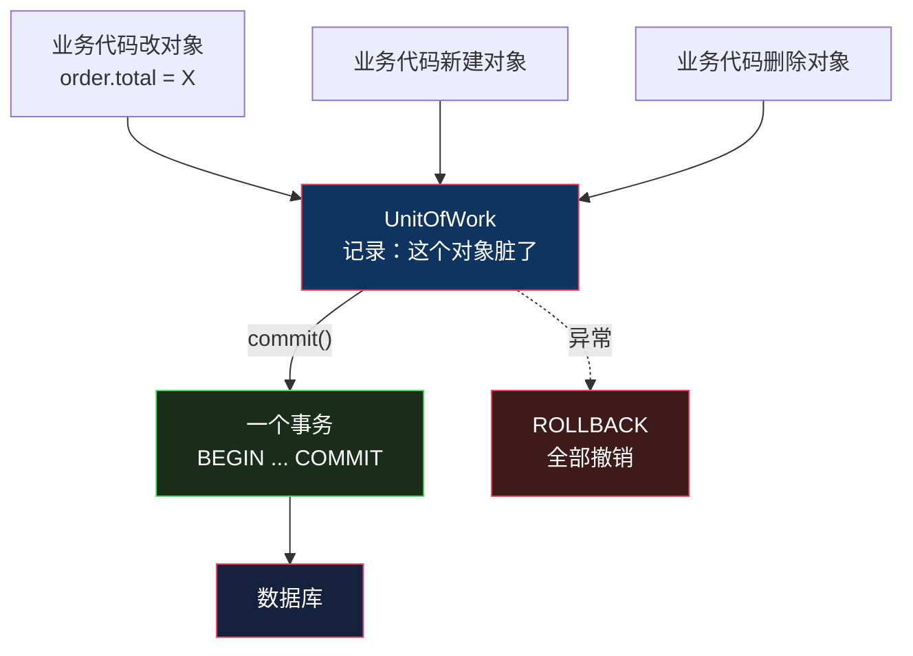
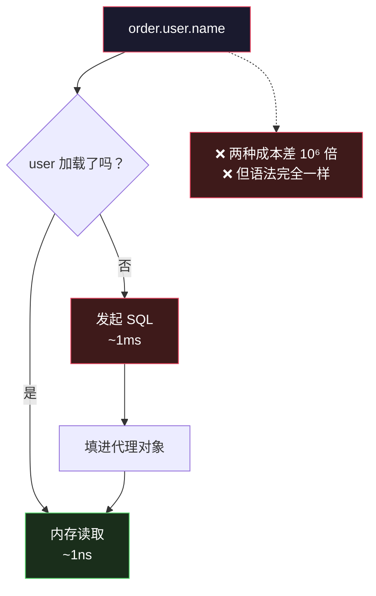

# 工作单元与延迟加载：N+1 是怎么来的

> 系列：企业应用架构（13/19）。代码用 Python 3.12 演示。

## 生活比喻：购物车

**没有工作单元的写法**：你进超市，拿一瓶牛奶 → 跑去收银台结账 → 回来再拿一包面包 → 又跑去结账 → 再回来拿鸡蛋……

**工作单元的写法**：推一辆购物车，需要什么往里放，**最后一次性结账**。

这个比喻抓住了工作单元的两个要点：

1. **它跟踪「这一趟要买什么」**——你不需要每拿一件就记一次账
2. **它决定「什么时候结账」**——结账是一次的、原子的（要么全买走，要么全不买）

而**延迟加载**是另一件事：你推着车，**货架上没拿的东西，等你真正要用的时候才回去拿**。

这两件事凑在一起，就生出了 N+1。

## 什么是工作单元

一句话定义：

> **工作单元跟踪一批领域对象的变更，最后在一个事务里统一提交。**

它跟踪三种状态：

| 状态 | 含义 | 提交时的动作 |
|------|------|-------------|
| **new** | 新建的对象 | INSERT |
| **dirty** | 已存在、被修改过的 | UPDATE |
| **removed** | 被删除的 | DELETE |



```python
class UnitOfWork:
    """跟踪这一批对象的变更，最后一次性提交"""

    def __init__(self, conn):
        self.conn = conn
        self._new: list[Order] = []
        self._dirty: list[Order] = []

    def register_new(self, order: Order) -> None:
        self._new.append(order)

    def register_dirty(self, order: Order) -> None:
        if order not in self._dirty:
            self._dirty.append(order)

    def commit(self) -> dict:
        """所有变更在一个事务里落地"""
        self.conn.execute("BEGIN")
        try:
            for o in self._new:
                cur = self.conn.execute(
                    "INSERT INTO orders (user_id, total, status) VALUES (?, ?, ?)",
                    (o.user_id, o.total, o.status))
                o.id = cur.lastrowid
            for o in self._dirty:
                self.conn.execute("UPDATE orders SET total = ?, status = ? WHERE id = ?",
                                  (o.total, o.status, o.id))
            self.conn.execute("COMMIT")
        except Exception:
            self.conn.execute("ROLLBACK")
            raise
        result = {"inserted": len(self._new), "updated": len(self._dirty)}
        self._new.clear(); self._dirty.clear()
        return result
```

跑起来：

```console
$ python3 uow_n1.py
提交结果: {'inserted': 2, 'updated': 1}
发的 SQL: 5 条（BEGIN + 2 INSERT + 1 UPDATE + COMMIT）
新订单拿到 id: 11, 12
更新已生效: (999.0, 'paid')
```

**三个对象的变更，一个事务。**

### 不用工作单元会怎样

```python
# ❌ 每个对象自己 save()，事务边界散了
order_a.save(conn)
order_b.save(conn)
order_c.save(conn)      # ← 这里失败了，前两个已经落库
```

**这就是「数据不一致」的经典来源**：三个本该一起生效的变更，前两个成功了、第三个失败了。

**工作单元的价值不在于「少写几行 save」，而在于它把「这几次变更属于同一次业务操作」这件事显式化了。**

## 延迟加载与 N+1

现在讲另一半。先看一个看起来完全正常的代码：

```python
def list_orders_lazy(conn):
    rows = conn.execute("SELECT id, user_id, total FROM orders").fetchall()
    out = []
    for oid, uid, total in rows:
        u = conn.execute("SELECT name FROM users WHERE id = ?", (uid,)).fetchone()
        out.append(f"#{oid} {u[0]} {total}")
    return out
```

**10 条订单，发了 11 条 SQL：**

```console
════════════════════════════════════════════════════
N+1 问题：列出 10 个订单及所属用户
════════════════════════════════════════════════════

懒加载：11 条 SQL
  1 条查订单 + 10 条查用户 = 11

预加载（JOIN）：1 条 SQL

→ 同样的结果，11 条 vs 1 条。订单变成 1000 条时是 1001 vs 1。
```

**「1 + N」这个名字就是这么来的**：1 条主查询 + N 条子查询。

**注意最后一行**——N 是随数据量线性增长的。开发时 10 条数据毫无感觉，上线后 1000 条数据就是 1001 次数据库往返。

## 为什么惰性加载特别容易导致 N+1

这才是我真正想讲的。

上面那段代码你一眼能看出有循环里发 SQL——**因为 SQL 是显式的**。

**换成一个「好用的」ORM 之后，问题会藏起来：**

```python
for order in orders:
    print(order.user.name)      # 看起来只是一次属性访问
```

**这行代码看起来是 O(1) 的内存操作，实际上是 N 次数据库往返。**

### 根因：抽象泄漏

延迟加载的设计目标是「**让数据库访问看起来像内存访问**」。

**但这个目标本身就是错的**——因为它抹掉了两者最关键的差别：

| | 内存访问 | 数据库访问 |
|---|---------|-----------|
| 耗时 | ~1 纳秒 | ~1 毫秒 |
| **差了几个数量级** | | **10⁶ 倍** |

**当你用同样的语法（`order.user.name`）表达两种成本差 100 万倍的操作时，写代码的人不可能不出错。**

这就是典型的**抽象泄漏**（leaky abstraction）——抽象没有真正隐藏复杂性，只是把它推到了你看不见的地方，等到生产环境才爆发。



**这就是为什么各语言的 ORM 都在这件事上翻过车**——Hibernate 的 `LazyInitializationException`、Rails 的 `N+1`（甚至专门做了 `bullet` 这个 gem 来检测它）、Django 的 `select_related` / `prefetch_related`。

## 四种解法

### 解法一：预加载（JOIN）

```python
def list_orders_eager(conn):
    rows = conn.execute("""
        SELECT o.id, u.name, o.total
        FROM orders o JOIN users u ON u.id = o.user_id
    """).fetchall()
    return [f"#{oid} {name} {total}" for oid, name, total in rows]
```

**一条 SQL 解决**。各框架的对应写法：Django 的 `select_related`、Rails 的 `includes`、JPA 的 `JOIN FETCH`。

**代价**：你得**提前知道**要用到哪些关联。而延迟加载的诱惑正是「不用提前想」。

### 解法二：批量加载

```python
# 一次把 N 个 user 都取回来
uids = {uid for _, uid, _ in rows}
users = dict(conn.execute(
    f"SELECT id, name FROM users WHERE id IN ({','.join('?' * len(uids))})", tuple(uids)))
```

**2 条 SQL 而不是 N+1 条**。适合「关联对象会被反复用到」的场景。

### 解法三：投影（只取需要的字段）

```python
# 直接查展示需要的东西，不构造对象
conn.execute("SELECT o.id, u.name, o.total FROM orders o JOIN users u ...")
```

**这条最重要**——它指出了一件被忽略的事：

> **这个场景根本不需要领域对象。**

「列出订单和用户名」是一次**只读展示**，它没有业务规则、不改状态、不需要保护不变量。它就该直接走 SQL。

**这是[第 11 篇](11-service-layer.md)说过的**：查询绕过领域层不是偷懒，是识别出「这里没有领域逻辑」。

### 解法四：强制显式

有些团队干脆**禁用延迟加载**——所有关联必须显式声明预加载，不声明就报错。

**代价是每次都要写加载策略，收益是没有任何隐式查询。**

## 什么时候崩

三个信号：

**① 生产环境比开发环境慢几十倍**

开发库 100 条数据、生产 10 万条——**N+1 的 N 变了 1000 倍**。这类问题在开发环境**永远复现不出来**。

**② 接口响应时间随数据量线性增长**

正常的查询应该接近常数时间（有索引）。**如果响应时间随列表长度线性涨，几乎一定是 N+1。**

**③ 数据库 QPS 高得离谱，但业务量不大**

一条业务请求打出几百条 SQL——数据库连接池被打满，但你找不到「大查询」。

## 工作单元和聚合的关系

最后说一个连结。

**工作单元里能装多少对象，受聚合边界限制。**

如果一个聚合很大（比如一个订单连带 500 个订单项、200 条日志），那么：

- 加载它 = 500+ 次查询（N+1 的最大来源）
- 修改它 = 锁住 500 行
- 并发 = 急剧下降

**第 15 篇会专门讲聚合该怎么划（见[聚合根](15-aggregate-root.md)）**——它本质上就是被「工作单元和延迟加载的代价」逼出来的一个约束。

## 骨架代码

```python
# ========== 1. 工作单元 ==========
class UnitOfWork:
    def __init__(self, conn): ...
    def register_new(self, obj): ...      # 新建
    def register_dirty(self, obj): ...    # 修改
    def register_removed(self, obj): ...  # 删除
    def commit(self):  # 一个事务，全成功或全回滚
        ...
    # ★ 事务边界在这里，不在领域对象上

# ========== 2. 避免 N+1 的检查清单 ==========
# ① 循环体里有没有触发查询的语句？（属性访问 / 方法调用）
#    用「查询计数器」包一层连接，跑一遍测试就知道
# ② 列表接口的关联数据，是不是应该 JOIN 一次取回来？
# ③ 这个场景真的需要领域对象吗？还是只用几个字段？
#    → 只读展示直接 SQL，别走 ORM
# ④ 生产数据量是多少？N+1 的 N 是会变的

# ========== 3. 检测手段 ==========
# 包一层连接统计 SQL 条数（本文 demo 的做法）
# 各生态的现成工具：Rails bullet / Django silk / JPA statistics
```

## 总结

| 概念 | 定义 | 解决的问题 | 引入的代价 |
|------|------|-----------|-----------|
| **工作单元** | 跟踪一批对象的变更，统一提交 | 事务边界散落、部分成功 | 要维护状态跟踪 |
| **延迟加载** | 用到时才加载关联数据 | 不用提前想加载策略 | **N+1 查询** |

**三条结论：**

1. **工作单元的价值是把「这几次变更属于同一次业务操作」显式化。** 它不只是省几行 `save`——它决定了失败时数据会不会不一致。

2. **N+1 的根因不是「惰性」，是「抽象泄漏」。** 用同样的语法（`order.user.name`）表达两种成本差 10⁶ 倍的操作，写代码的人不可能不出错。

3. **最好的解法往往是不用 ORM。** 只读展示场景直接 SQL——**识别出「这里没有领域逻辑」，比优化 ORM 配置更根本。**

第四部分到此结束。第四部分和第五部分之间的分界线很清楚——**前四部分讲的是「怎么组织代码」，从下一篇开始讲「怎么理解业务」**。

---

**相关文章：** [仓储](12-repository.md) · [服务层](11-service-layer.md) · [总纲](00-overview.md)
