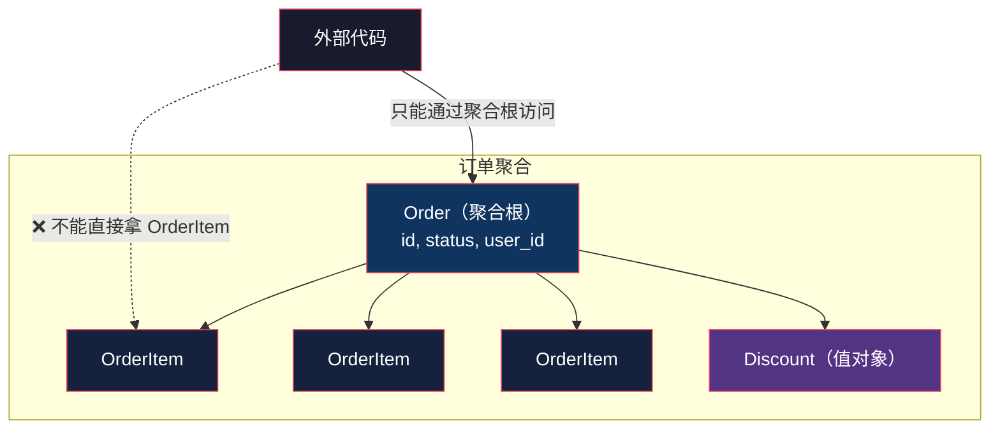

# 实体、值对象、聚合：DDD 的三块积木

> 系列：企业应用架构（14/19）。代码用 Python 3.12 演示。

## 生活比喻：人和身份证号

**张三是谁？**

- 他改了名字、换了手机号、搬了家——**他还是张三**。因为「张三」是由他的身份证号定义的，不是由姓名定义的。
- 这叫**实体**（Entity）：**有身份，身份不变，属性可变。**

**一张 50 元钞票呢？**

- 你手里这张和我手里那张，**没有任何区别**——它们可以互换，没人在乎「哪一张」。
- 这叫**值对象**（Value Object）：**没有身份，靠内容定义，不可变。**

这个区分看起来像学究式的分类，但**搞错了会产生真实的 bug**——本文后面会演示一个。

## 三种积木

| 概念 | 有身份吗 | 可变吗 | 相等怎么判断 | 例子 |
|------|---------|-------|-------------|------|
| **实体** Entity | ✅ 有 ID | ✅ 可变 | 按 **ID** | 用户、订单、商品 |
| **值对象** Value Object | ❌ 没有 | ❌ **不可变** | 按 **内容** | 金额、地址、时间段、颜色 |
| **聚合** Aggregate | — | — | — | 一组相关对象的一致性边界 |

### 判断标准：一句话

> **改了它的属性之后，它还是原来那个它吗？**

- **还是** → 实体（改的是属性，身份没变）
- **不是了** → 值对象（内容变了就是另一个值）

「张三改名成李四」——还是同一个人 → 实体。
「50 元改成 100 元」——那是另一张钞票 → 值对象。

## 反例：可变的值对象会咬人

**把值对象做成可变的，会发生这件事：**

```python
# ❌ 可变的值对象
class MutableAddress:
    def __init__(self, city, street):
        self.city = city
        self.street = street

class BadOrder:
    def __init__(self, oid, addr: MutableAddress):
        self.id = oid
        self.addr = addr          # ← 直接持有引用
```

跑起来：

```console
════════════════════════════════════════════════════════
反例：可变的值对象被共享 —— 改一处，别处跟着变
════════════════════════════════════════════════════════
  初始: 订单1=上海南京路 1 号  订单2=上海南京路 1 号

  改订单1后: 订单1=上海北京路 99 号  订单2=上海北京路 99 号
  ↑ ❌ 订单 2 的地址也被改了 —— 它们共享同一个对象
  ↑ 这类 bug 在并发下更糟：另一个线程正在读这个对象
```

**两个订单用了同一个地址对象**——这在一开始是完全合理的（同一个收货地址）。但因为这个对象**可变**，改一个等于改全部。

**这类 bug 的可怕之处在于**：`o1.addr.street = "北京路"` 这行代码**看起来完全正常**。它只是一个属性赋值。评审时没人会发现问题——**除非他记得「这个对象可能被多个订单共享」**。

**这就是为什么值对象必须不可变：不可变的对象可以安全共享，不存在「改一处影响别处」的可能。**

### 正解：改 = 换一个新的

```python
@dataclass(frozen=True)          # frozen=True → 不可变
class Address:
    city: str
    street: str

    def with_street(self, new_street: str) -> "Address":
        """改地址不是「修改」，是「换一个」—— 返回新对象"""
        return Address(self.city, new_street)
```

```console
  初始: 订单1=Address(city='上海', street='南京路 1 号')  订单2=Address(city='上海', street='南京路 1 号')

  换地址后: 订单1=Address(city='上海', street='北京路 99 号')  订单2=Address(city='上海', street='南京路 1 号')
  ↑ ✅ 订单 2 不受影响

  尝试直接修改值对象: FrozenInstanceError: cannot assign to field 'city'
  ↑ 编译器/运行时替你挡住了这个错误
```

**注意最后一行**——`frozen=True` 让「直接修改」变成一个**错误**。你不是靠纪律不去改它，是**改不了**。

**`with_street` 这个方法名是个约定**（Java 里叫 `withXxx`，Rust 里叫 `with_xxx`）——它一眼就能看出「这是返回新对象，不是修改原对象」。

### 值对象的相等性

```console
  值对象对比：两个内容相同的 Address 就是同一个地址
    Address('上海','南京路') == Address('上海','南京路') → True
  ↑ 没有身份，靠内容相等 → 这是值对象
```

**值对象的「相等」是按内容判断的**——两个内容相同的地址，就是同一个地址，不需要区分「哪一个」。

而实体的相等是**按 ID**：

```console
  改了姓名和邮箱后: id 仍是 42（True）
  ↑ 身份不随属性变化 → 这是实体
```

**这个区别直接影响代码**：如果用 `==` 比较两个 `User` 对象，应该比 ID；比较两个 `Address`，应该比内容。**搞反了就会出现「同一个人被当成两个」或「两个不同地址被当成一个」。**

## 聚合：一致性边界

第三块积木是**聚合**（Aggregate）：

> **一组必须保持一致的对象，作为一个整体被访问和修改。**

比如「订单 + 订单项」：



**为什么订单项不能单独访问？** 因为「订单总额 == 各项小计之和」这条不变量，只有把订单和它的项作为一个整体才能保护。

- 如果外部能直接 `orderItem.price = 999`，总额就错了
- 如果外部能绕过订单直接删掉一个订单项，总额也错了

**聚合的边界就是「一致性必须由谁保证」的边界。** 「谁来保证」的答案就是**聚合根**——它是外部访问的唯一入口。

**下一篇整篇讲聚合根怎么划**——这是 DDD 里最容易出错、后果最严重的一个决策。

## 三块积木的配合

一个完整的例子：

```python
@dataclass(frozen=True)
class Money:                     # 值对象：不可变，按内容相等
    amount: float
    currency: str = "CNY"

    def __add__(self, other: "Money") -> "Money":
        self._assert_same_currency(other)
        return Money(self.amount + other.amount, self.currency)

    def _assert_same_currency(self, other):
        if self.currency != other.currency:
            # 人民币加美元 —— 这条保护必须在这
            raise ValueError(f"币种不同: {self.currency} vs {other.currency}")


@dataclass(frozen=True)
class Address: ...               # 值对象


@dataclass
class OrderItem:                 # 实体（在聚合内，有 ID）
    id: int | None
    sku: str
    price: Money                 # ← 组合值对象
    qty: int

    @property
    def subtotal(self) -> Money:
        return Money(self.price.amount * self.qty, self.price.currency)


@dataclass
class Order:                     # 实体 + 聚合根
    id: int | None
    user_id: int
    items: list[OrderItem] = field(default_factory=list)
    ship_to: Address = ...       # ← 组合值对象
    status: str = "created"

    @property
    def total(self) -> Money:    # 不变量：总额 = 各项之和
        result = Money(0.0)
        for i in self.items:
            result = result + i.subtotal
        return result
```

**注意 `Money` 那个 `_assert_same_currency`**——**值对象自己保护自己的有效性**。你不可能造出一个「人民币 + 美元」的金额，因为相加时它会拒绝。

**这就是值对象的价值**：它把「这个值永远合法」这件事，从「所有使用它的地方都要检查」变成了「它自己保证」。

## 划错了会怎样（本文的反例）

| 错误 | 后果 |
|------|------|
| **值对象做成可变的** | 共享引用时改一处影响多处；并发下读到半改状态 |
| **给值对象加 ID** | 系统里出现几万条「50 元」记录；本该合并的被拆开 |
| **实体靠属性判等** | 用户改了邮箱后，系统认为「来了个新用户」 |
| **值对象靠引用判等** | 两个内容相同的地址被当成两个不同地址，去重失效 |
| **跳过聚合根直接改内部对象** | 不变量失守（总额 ≠ 各项之和） |

**第一条是最常见的**——尤其在从「贫血模型」迁移过来的项目里，所有对象都是可变的，值对象这个分类根本没建立起来。

## 总结

| 概念 | 判断标准 | 关键约束 |
|------|---------|---------|
| **实体** | 「改了属性还是它吗」→ 是 | 有 ID；**按 ID 判等** |
| **值对象** | 「改了属性还是它吗」→ 不是 | **不可变**；**按内容判等**；改 = 换新的 |
| **聚合** | 「这些对象的一致性必须一起保证吗」→ 是 | 只能通过**聚合根**访问 |

**三条最该记住的：**

1. **值对象必须不可变**，因为它会被安全地共享。不可变换来的正是「随便共享都不会出问题」。

2. **「改」和「换」是不同的操作。** 值对象的 `withXxx()` 返回新对象，不是修改自己——**这个命名约定能让读代码的人一眼看出语义**。

3. **聚合的边界是「谁必须一起保持一致」的边界。** 划定它的代价很高（下一篇会讲划错的后果），但**不划的代价更高**——那就是没有一致性保证。

下一篇是 DDD 里后果最严重的一个决策：[聚合根](15-aggregate-root.md)——划大了锁死并发，划小了没人保证一致性。

---

**相关文章：** [贫血模型 vs 充血模型](04-anemic-vs-rich.md) · [聚合根](15-aggregate-root.md) · [工作单元与延迟加载](13-unit-of-work.md) · [总纲](00-overview.md)
