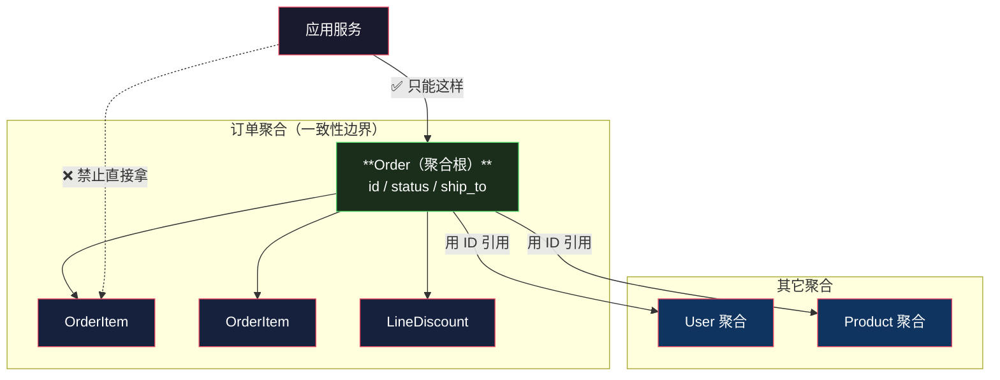
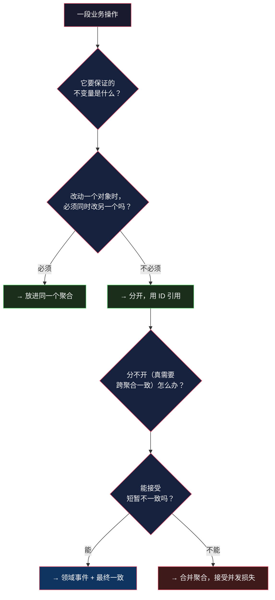

# 聚合根：一致性边界怎么划

> 系列：企业应用架构（15/19）。代码用 Python 3.12 演示。

## 生活比喻：合同的签署边界

一份合同里可以有正文和若干附件。**关键问题是：哪些东西必须一起签、一起改、一起作废？**

- **边界划太大**：把「供应商年度框架协议」和「本次采购订单」装进同一份合同——**改一个订单数量要重签年度协议**。
- **边界划太小**：正文和关键附件分成两份独立文件——**附件被人单独改了，正文还引用着旧版本**。

**聚合边界就是这条线：哪些东西的一致性必须由同一次操作来保证。**

- 划大了 → 改任何一处都要付全量的代价（[加载、加锁、并发](#反例一聚合太大)）
- 划小了 → 跨越边界的那些不变量**没人保证**

**这是 DDD 里后果最严重的一个决策**，也是本文的重点。

## 什么是聚合根

> **聚合根是聚合的唯一入口。外部只能持有聚合根的引用，只能通过它访问内部对象。**



### 四条规则

Vaughn Vernon 在《Effective Aggregate Design》里总结的四条，实践中最有用：

| # | 规则 | 为什么 |
|---|------|-------|
| 1 | **通过聚合根访问内部对象** | 否则不变量可以被绕过 |
| 2 | **聚合之间用 ID 引用，不用对象引用** | 对象引用会形成跨聚合的锁和延迟加载 |
| 3 | **一个事务只修改一个聚合** | 一个聚合 = 一个事务边界 |
| 4 | **跨聚合的一致性用最终一致处理** | 领域事件 + 补偿，不是分布式事务 |

**第 3 条是最有争议也最重要的一条。** 它意味着：如果你发现「这个操作要改两个聚合」，**说明你的聚合划错了，或者你需要接受最终一致。**

## 反例一：聚合太大

最经典的错误是**把「订单 + 所有订单项 + 所有审计事件」塞进一个聚合**——理由是「它们都属于这个订单」。

跑一下代价：

```console
══════════════════════════════════════════════════════════════════
场景：把订单标记为已发货（订单有 500 个项、200 条事件）
══════════════════════════════════════════════════════════════════
  大聚合（全部加载）            查询 4 次  加载  701 行  耗时   0.28ms
  小聚合（按需引用）            查询 2 次  加载    1 行  耗时   0.01ms

  → 同一个操作：加载 701 行 vs 1 行（701 倍）
  → 锁的范围：大聚合锁住整棵对象图，小聚合只锁订单行本身

══════════════════════════════════════════════════════════════════
并发影响：0.3 秒内能完成多少次同样操作
══════════════════════════════════════════════════════════════════
  大聚合:    1131 次（     3770 次/秒）
  小聚合:  128162 次（   427207 次/秒）
```

**113 倍的吞吐差距。**

**注意问题的本质**：「标记发货」这个操作**根本不需要订单项和事件**。把不需要的东西划进聚合，等于每次改状态都替它们付一次加载和加锁的成本。

```python
# ❌ 大聚合：改状态要把整个对象图拖出来
class BigOrderAggregate:
    @classmethod
    def load(cls, conn, oid):
        agg.status = conn.execute("SELECT status FROM orders ...").fetchone()[0]
        agg.items  = conn.execute("SELECT ... FROM order_items ...").fetchall()   # 500 行
        agg.events = conn.execute("SELECT ... FROM order_events ...").fetchall()  # 200 行
        return agg

# ✅ 小聚合：只装「必须一起一致」的东西
class SmallOrderAggregate:
    @classmethod
    def load(cls, conn, oid):
        agg.status = conn.execute("SELECT status FROM orders ...").fetchone()[0]
        return agg        # 订单项不在这个一致性边界里
```

**现实中「大聚合」还有个更隐蔽的危害**：它不是一次性变大的，是**慢慢长出来的**。每来一个需求（「订单要记审计日志」「订单要存发票快照」），就顺手往聚合里加一个集合——**三个月后它就有 8 个子集合了**。

## 反例二：聚合太小

反过来也有问题。最经典的例子是**转账**：

```python
# ❌ 划成两个聚合，跨聚合的不变量没人管
class AccountAggregate:
    def withdraw(self, amount): ...
    def deposit(self, amount): ...

# 应用服务里
a.withdraw(100)      # ✅ 成功
b.deposit(100)       # ❌ 失败
# 结果：100 元凭空消失了
```

**「转账前后两边总额守恒」这条不变量，跨越了两个聚合。** 按规则 3（一个事务只改一个聚合），这条不变量**没有地方能保证它**。

**这不是设计失误，是聚合边界定义本身的矛盾**——它在告诉你：**要么这两个 Account 属于同一个聚合，要么你接受最终一致。**

三种处理方式：

| 方案 | 做法 | 代价 |
|------|------|------|
| **合并聚合** | 把两个 Account 放进一个聚合 | 并发下跌（两个账户不能并行操作） |
| **最终一致** | 先扣款、发事件、到账；失败则补偿 | 中间态可见；要处理补偿逻辑 |
| **重新划界** | 用一个「转账单」聚合，两个 Account 只记余额 | 需要重新建模 |

**没有免费的选项。** 聚合边界上的取舍，最终都落到「一致性 vs 可用性」这个 CAP 的局部版本上。

## 怎么划：判断清单

Vernon 给的启发式规则，翻译成可操作的清单：



### 五个具体的判断标准

**① 问「如果不一起改会怎样」**

- 「订单项变了，订单总额必须跟着变」→ **必须一起** → 同一个聚合
- 「订单发货了，物流单号要更新」→ 可以不一起（稍后更新也能接受）→ **分开**

**② 优先划小**

**聚合越小，并发越好、加载越快。** 当你不确定时，选小的那个——因为「划小了导致一致性问题」比「划大了导致性能问题」**更容易发现和修正**（前者会有明确的 bug，后者只是慢）。

**③ 一个聚合 = 一个事务 = 一次数据库往返**

如果某个操作要改 5 个聚合，那它**不该是一个事务**。

**④ 用 ID 引用代替对象引用**

```python
# ❌ 对象引用：会拖出一整棵对象图
class Order:
    user: User              # 加载订单等于加载用户
    items: list[OrderItem]

# ✅ ID 引用：需要时再单独取
class Order:
    user_id: int            # 要展示用户名？查询时单独 JOIN，或走只读查询
    items: list[OrderItem]  # ← 这个留在聚合内，因为总额依赖它
```

**⑤ 别把「审计日志」「操作记录」塞进聚合**

它们**几乎从不参与业务不变量**——它只是记录。而且它们是**只追加**的，没有一致性问题。

（DeepSeek Harness 的 Session 系统就是个好例子——它把会话事件做成 append-only 的独立日志，而不是塞进某个聚合里。这也是[第 18 篇](18-cqrs-event-sourcing.md)事件溯源的基础。）

## 跨聚合一致性怎么做

第 3 条规则说「一个事务只改一个聚合」，那跨聚合怎么办？答案是**领域事件 + 最终一致**：

```python
# 一个事务内：只改订单聚合，同时记下「要发事件」
class OrderAppService:
    def ship(self, order_id):
        with self.uow:
            order = self.repo.find(order_id)
            order.ship()                            # ← 只改订单聚合
            self.events.publish(OrderShipped(order_id, order.user_id))
            #      ↑ 事件和状态变更在同一个事务里落库（Outbox 模式）

# 另一个事务：消费者处理事件，更新属于它的聚合
def on_order_shipped(event):
    user = user_repo.find(event.user_id)
    user.record_order_shipped(event.order_id)       # ← 改用户聚合
```

**代价是「中间态可见」**：订单已发货、用户统计还没更新。**收益是两个聚合可以独立并发**。

**这就是最终一致的本质**——不是「最终会一致所以没关系」，而是「**用中间态可见换并发能力**」，是一笔明确的交易。

## 总结

| 维度 | 聚合划太大 | 聚合划太小 |
|------|-----------|-----------|
| **加载** | 拖出整棵对象图（本文 demo：701 行） | 快（1 行） |
| **并发** | 差（demo：3770/s） | 好（demo：427207/s） |
| **一致性** | ✅ 强保证 | ❌ **跨聚合的不变量没人管** |
| **典型症状** | 改个状态要 300ms | 转账时钱凭空消失 |
| **修正难度** | 中（要拆） | **高（要重新建模）** |

**三条结论：**

1. **聚合边界 = 一致性边界 = 事务边界。** 三者是同一件事的三种说法。

2. **判断标准只有一个问题**：「如果我改了 A 却不改 B，数据会不会坏？」会坏 → 同一个聚合。

3. **优先划小，但要认清代价。** 划小了跨聚合的一致性就交给了最终一致——**这是一笔明码标价的交易，不是免费的优化**。

下一篇的尺度和这篇完全不同——不再是「一个聚合内部怎么组织」，而是**「同一个词在不同业务里是不是同一个东西」**：[限界上下文](16-bounded-context.md)。

---

**相关文章：** [实体、值对象、聚合](14-entity-value-aggregate.md) · [工作单元与延迟加载](13-unit-of-work.md) · [限界上下文](16-bounded-context.md) · [总纲](00-overview.md)
