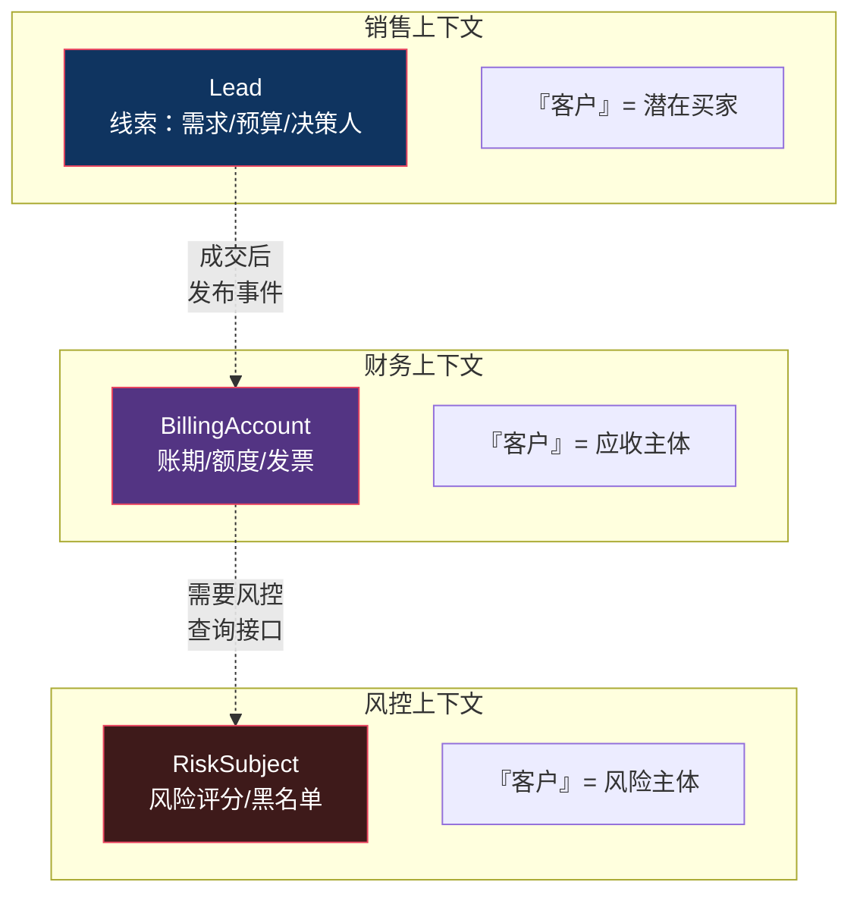
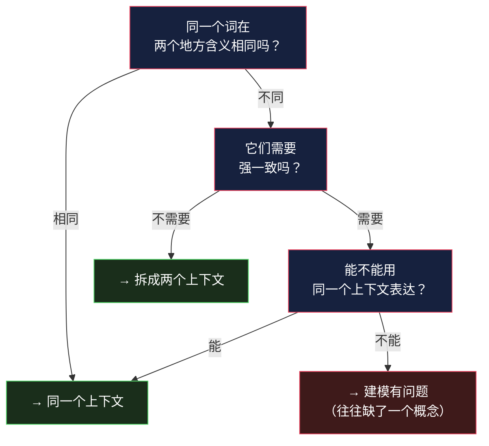

# 限界上下文：同一个词为什么在不同地方意思不同

> 系列：企业应用架构（16/19）。代码用 Python 3.12 演示。

## 生活比喻：公司里的「客户」

问四个部门「什么是客户」，你会得到四个答案：

| 部门 | 「客户」指的是 | 关心什么 |
|------|--------------|---------|
| **销售** | 潜在买家 | 有需求吗、有预算吗、谁是决策人 |
| **财务** | 应收账款的主体 | 信用额度、账期、开票信息 |
| **客服** | 需要被服务的人 | 历史工单、联系方式、满意度 |
| **法务** | 合同相对方 | 签约主体、法人信息、履约责任 |

**这四个「客户」不是同一个东西**：

- 销售说的「客户」可以是**还没成交**的线索
- 财务说的「客户」**必须有账期和信用额度**——线索不具备
- 法务说的「客户」是**法人主体**——个人客户在这个语境下没有意义

**它们拼写相同，指的不是同一个概念。**

**限界上下文（Bounded Context）就是「一个词在哪范围内是这个意思」的那条线。**

## 什么是限界上下文

> **限界上下文是一个模型适用的边界。边界内，每个术语有唯一且明确的含义；边界外，同一个词可以是别的东西。**



**注意三个上下文里的类名都不是 `User`。** 它们分别叫 `Lead`、`BillingAccount`、`RiskSubject`——**这才是关键：换个上下文，换个名字，因为概念本来就不同。**

## 反例：强行合并成一个模型

大多数项目的默认做法是**建一张 `users` 表，然后所有部门往里加字段**：

```python
class User:
    # 登录相关
    id: int; username: str; password_hash: str; last_login: str
    # 销售相关
    lead_source: str; budget: float; decision_maker: bool; pipeline_stage: str
    # 财务相关
    credit_limit: float; payment_terms: int; tax_id: str; invoice_address: str
    # 风控相关
    risk_score: float; blacklisted: bool; kyc_status: str; risk_reviewed_at: str
    # 客服相关
    satisfaction: float; ticket_count: int; preferred_channel: str
    # 营销相关
    email_subscribed: bool; utm_source: str; last_campaign: str
    # ... 80 个字段之后还在长
```

**问题不是「字段多」，是这些字段背后的规则互相冲突。**

看一个最具体的冲突——**「删除用户」**：

```python
# ❌ 一个 delete 方法要满足四个部门的相反要求
class User:
    def delete(self):
        # 营销：用户有权要求删除（GDPR / 个人信息保护法）
        # 财务：有未结清账单不能删（还要对账）
        # 风控：必须保留 5 年（监管要求）
        # 客服：删了历史工单就断了

        if self.unpaid_amount > 0:
            raise ValueError("有未结清账单")     # 财务的要求
        if self.kyc_status == "verified" and years_since(self.risk_reviewed_at) < 5:
            raise ValueError("监管要求保留 5 年")  # 风控的要求
        if self.ticket_count > 0:
            self.anonymize_tickets()             # 客服的折中
        self.email_subscribed = False            # 营销的部分满足
        self.mark_deleted()                      # 实际上谁也没删掉
        # ...
```

**这段代码永远写不对**，因为「删除」这个词在四个上下文里的含义**根本不同**：

| 上下文 | 那个操作真正叫什么 | 语义 |
|--------|------------------|------|
| 营销 | `forget()` | 停止联系、清除营销数据（可恢复） |
| 财务 | `close()` | 结清后关闭账户（**不能**删，要留痕） |
| 风控 | `archive()` | 归档但保留（5 年内可查） |
| 客服 | `anonymize()` | 脱敏但保留工单 |

**注意这四个动词都不一样。**

**这才是限界上下文最实用的信号**：

> **当你发现同一个方法要满足互相矛盾的规则时，不是方法写错了，是这个词跨越了两个本不该合并的上下文。**

### 合并的长期代价


**成本不是「字段多」，是「任何人都改不动」。** 每个部门加一个字段，都要走一遍所有部门的评审——**因为大家都不知道这个共享模型会不会被自己影响**。

这就是「**大泥球**」（Big Ball of Mud）的典型成因：不是设计得差，是**每次改动都只能往共享模型上打补丁，因为拆不开**。

## 怎么划：从语言边界入手

限界上下文的划法不是「按部门」也不是「按表」，是**按语言**：



### 三个可操作的信号

**① 同一个词，不同的动词**

像上面的「删除」——**营销要 forget、财务要 close、风控要 archive**。动词不一样，说明概念不一样。

**② 同一份数据，不同的生命周期**

- 订单地址：下单后**不可变**（历史凭证）
- 用户默认地址：**随时可变**

**同一个「地址」在两个地方一个可变一个不可变**——这是划界的强信号。

**③ 同一句话，两边都要加限定词**

如果你在沟通时发现必须说「**风控的**用户」「**营销的**用户」才能讲清楚——**你已经在用限界上下文了，只是代码里没画出来。**

### 划完之后

三个上下文各自建模：

```python
# 销售上下文
@dataclass
class Lead:
    id: int
    source: str
    budget: float
    decision_maker: bool
    def convert(self) -> "Opportunity": ...      # 转化成商机

# 财务上下文
@dataclass
class BillingAccount:
    id: int
    credit_limit: float
    payment_terms: int
    def close(self) -> None:
        """结清后关闭 —— 保留记录用于对账"""
        if self.unpaid_amount > 0:
            raise ValueError("有未结清账单")
        self.status = "closed"

# 风控上下文
@dataclass
class RiskSubject:
    id: int
    risk_score: float
    def archive(self) -> None:
        """归档 —— 监管要求保留 5 年，不删除"""
        self.status = "archived"
```

**三个类都有「id」，但它们的 id 指的是同一个自然人/法人**——这是跨上下文的关联点（下一篇文章讲的「上下文映射」就是处理这个）。

**注意每个类都变小了**：`Lead` 只有销售关心的字段，`BillingAccount` 只有财务关心的——**没有一个是 80 个字段**。

## 什么时候不需要限界上下文

| 场景 | 建议 |
|------|------|
| 小系统、单一业务 | **不需要**——一个模型够用 |
| CRUD 后台 | 不需要——业务概念本来就简单 |
| 多个部门共用一套数据 | **需要**——这是它的主场 |
| 词汇表开始出现「XX的YY」 | **需要**——信号已经很明显了 |
| 一个大模型谁都不敢改 | **需要**——大泥球已经形成了 |

**判断标准**：

> **团队沟通时，是不是经常要说「我说的是哪种 XX」？**

- 经常要说 → 划上下文
- 从不需要澄清 → 一个模型就够

## 总结

| 维度 | 单一共享模型 | 限界上下文 |
|------|-------------|-----------|
| 术语 | 一个词一个定义（但经常冲突） | **每个上下文内定义明确** |
| 类的字段数 | 80 个还在长 | 每个只装本上下文关心的 |
| 加一个字段 | 跨部门评审 2 周 | **本上下文内决定** |
| 冲突的规则 | 挤在一个方法里，永远写不对 | 各自用各自的动词 |
| 跨上下文关联 | 靠同一张表 | **靠 ID + 映射**（下一篇） |
| 代价 | — | 有重复建模 + 需要处理上下文间关系 |

**三条结论：**

1. **限界上下文划的是「语言」的边界，不是「部门」或「表」的边界。** 判断标准是「这个词在这里是什么意思」。

2. **最好的信号是动词不一致。** 营销要 `forget`、财务要 `close`、风控要 `archive`——**动词不同就是说概念不同**。

3. **合并的代价不是字段多，是改不动。** 每个改动都要走所有相关方的评审，最后谁都只能打补丁——这是大泥球的形成机制。

划完上下文之后立刻有个新问题：**这三个上下文之间怎么通信？上游改了模型，下游怎么办？** 下一篇：[防腐层与上下文映射](17-acl-context-mapping.md)。

---

**相关文章：** [聚合根](15-aggregate-root.md) · [防腐层与上下文映射](17-acl-context-mapping.md) · [实体、值对象、聚合](14-entity-value-aggregate.md) · [总纲](00-overview.md)
