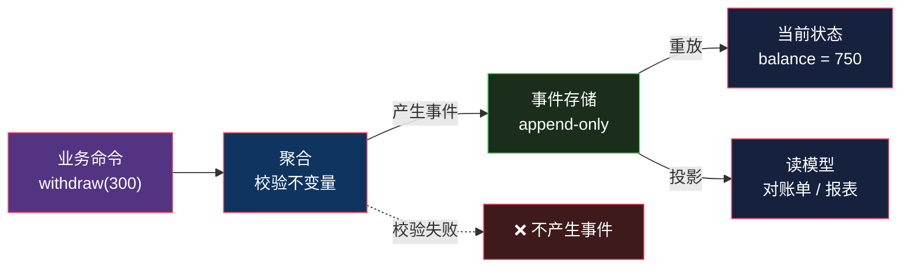

# CQRS 与事件溯源：把状态变成日志

> 系列：企业应用架构（18/19）。代码用 Python 3.12 演示。

## 生活比喻：账本和报表

银行有两种东西：

- **流水账本**：每一笔交易按时间顺序记下来，**只追加，不修改**
- **余额报表**：当前余额是多少、这个月支出了多少

**关键在于：余额不是「存」出来的，是「算」出来的。**

你可以把流水从头加一遍得到余额——**但银行不会真的每次这么干**，它会把算好的余额单独存一份，方便查询（这就是 CQRS 的读模型）。

这个「账本 + 报表」的结构，就是**事件溯源（Event Sourcing）+ CQRS**。

## 事件溯源：存事件，不存状态

> **不保存对象的当前状态，而是保存导致状态变化的一系列事件。当前状态 = 重放所有事件的结果。**

| | 传统（存状态） | 事件溯源（存事件） |
|---|--------------|------------------|
| 数据库里有什么 | `balance = 750` | `Opened / Deposited 1000 / Withdrawn 300 / Deposited 50` |
| 余额怎么来的 | 直接读 | **重放算出来** |
| 历史 | 丢了（或者另建审计表） | **本来就是历史** |
| 修改历史 | `UPDATE balance` | **不可能——只能追加新事件** |



### 代码

```python
class Account:
    """不存 balance 字段 —— 它是 apply 事件算出来的"""

    def __init__(self) -> None:
        self.balance = 0.0
        self._uncommitted: list[dict] = []

    @classmethod
    def from_events(cls, events: list[dict]) -> "Account":
        acc = cls()
        for e in events:
            acc._apply(e)                  # ← 重放历史
        return acc

    def _apply(self, e: dict) -> None:
        kind = e["type"]
        if kind == "Opened":
            self.balance, self.status = 0.0, "open"
        elif kind == "Deposited":
            self.balance += e["amount"]
        elif kind == "Withdrawn":
            self.balance -= e["amount"]
        # ← 未知事件直接忽略：这是事件版本演进的容错点

    # ── 业务动作 = 产生事件，不直接改状态 ──
    def withdraw(self, amount: float) -> None:
        if amount > self.balance:
            raise ValueError(f"余额不足: {self.balance}")
        self._emit({"type": "Withdrawn", "amount": amount})

    def _emit(self, event: dict) -> None:
        self._apply(event)                # 先应用到自身
        self._uncommitted.append(event)   # 再记下来待提交
```

跑起来：

```console
════════════════════════════════════════════════════════════
事件溯源：存的是事件，余额是算出来的
════════════════════════════════════════════════════════════

事件存储里的全部内容（append-only，永不修改）：
  #0 Opened
  #1 Deposited    1000
  #2 Withdrawn    300
  #3 Deposited    50

重放这些事件得到的余额: 750.0
```

**数据库里没有 `750` 这个数字。** 它是四条事件重放出来的结果。

## 白送的两个能力

事件溯源有两个「不需要额外做」的能力——**它们是这个模式的真正卖点**。

### 能力一：时间旅行

```console
  第 1 个事件之后: 余额  1000.00
  第 2 个事件之后: 余额   700.00
  第 3 个事件之后: 余额   750.00
```

**任意时点的状态都能重放出来**，因为历史事件一条都没丢。

这在传统模型里做不到——`UPDATE balance = 750` 执行完，`700` 那个中间值就永远消失了。

（业务上的用途：「这笔订单当时为什么算错价？」——把当时的事件重放一遍。）

### 能力二：审计日志

```console
  事件本身就是审计日志 —— 谁在什么时候改了什么，全在
  共 4 条，全部可追溯到具体事件
```

**传统模型需要专门建一张审计表、专门写记录逻辑、专门处理「有人绕过应用直接改库」的情况。**

**事件溯源里这不需要做——事件存储本身就是审计日志。**

### 还有一个：业务规则失败不留痕迹

```console
  余额不足: 750.0
  事件数 4 → 4（未增加 = 状态未变）
```

**校验失败时不产生事件**，所以状态自然没变。**不需要「先改后回滚」这种操作。**

## CQRS：读写用两套模型

**CQRS = Command Query Responsibility Segregation，命令查询职责分离。**

> **写用一套模型（保证不变量），读用另一套（为查询优化）。**

```console
对账单（读模型）：
  开户              余额      0.00
  存入 + 1000.00  余额   1000.00
  支出 -  300.00  余额    700.00
  存入 +   50.00  余额    750.00

  ↑ 同一批事件，写模型算余额、读模型出对账单
  ↑ 两者互不知道对方存在，可以各自优化
```

**为什么要分开？**

因为**读写的最优形态是相反的**：

| | 写模型 | 读模型 |
|---|-------|-------|
| 目标是 | 保证不变量 | 查询快 |
| 形态 | 规范化的聚合 | **反范式，怎么快怎么来** |
| 数据源 | 事件存储 | 投影出来的表 |
| 是否关心历史 | 需要（保护不变量） | 通常不需要 |

**硬要用一套模型同时满足两者，结果就是两边都不好用**——这就是为什么很多系统里「领域模型加载一大坨对象只为展示一个列表」。

**CQRS 的解法**：写走聚合，读直接查投影表。**读模型可以从事件投影，也可以直接从写模型的表同步**——后者更常见，也不需要事件溯源。

**注意 CQRS 和事件溯源是两个独立的东西**，可以只用其一：

| | 只用 CQRS | 只用事件溯源 | 两者都用 |
|---|----------|-------------|---------|
| 写模型 | 聚合 | 事件重放 | 事件重放 |
| 读模型 | 独立投影表 | 从事件算 | 从事件投影 |
| 常见度 | **高** | 中 | 中 |

## 和你已经见过的东西的联系

### Flux / Redux 就是轻量版

[第 8 篇](08-flux.md)里的 `action` 日志，本质上就是事件溯源的简化版：

| | Redux | 事件溯源 |
|---|-------|---------|
| 变更描述 | `action` | `event` |
| 应用变更 | `reducer` | `apply` |
| 状态 | `store.getState()` | 聚合重放 |
| 时间旅行 | Redux DevTools | 重放到指定序号 |
| 持久化 | 通常不持久化 | **事件必须持久化** |

**区别在持久化**：Redux 的状态在内存里，刷新就没了；事件溯源的事件**是唯一的真相来源**，必须持久化。

### deepseek-harness 的 Session 系统

如果你读过[源码阅读里 deepseek-harness 那几篇](../../source-read/index.md)，它的 Session 系统就是**教科书式的事件溯源**：

- 会话事件写成 **append-only 的日志**，不做修改
- 当前对话消息通过 `deriveMessages()` **从事件推导出来**，而不是单独存一份
- 它甚至有个明确的不变量：**「模型可见的 ⟺ 已记录在日志中」**

**这正好印证了事件溯源的核心思想**：**状态是派生的，事件才是原始事实。**

## 代价

事件溯源不是免费的，它的代价很具体。

### 代价一：事件版本演进

三个月后需求变了，要给 `Deposited` 加一个 `channel` 字段（「从哪个渠道存入」）：

```python
# 新事件有 channel
{"type": "Deposited", "amount": 100, "channel": "atm"}

# 但库里三年前的老事件没有这个字段
{"type": "Deposited", "amount": 100}
```

**事件是 append-only 的，你没法回头把老事件改掉。** 三种处理方式：

| 方案 | 做法 | 问题 |
|------|------|------|
| **容忍缺省** | 读的时候给默认值 | 简单，但语义上「不知道」被当成了「默认」 |
| **事件升级** | 重放时把老事件转成新格式 | 需要维护升级链 |
| **版本化事件** | `DepositedV1` / `DepositedV2` | 类型爆炸 |

**这是事件溯源最真实的长期成本**——**你的历史不可变，所以每个格式变更都要永远兼容下去。**

### 代价二：重放成本

一个运行三年的账户可能有几万条事件。**每次操作都要重放全部事件？**

解法是**快照**（snapshot）——每 N 个事件存一次状态，重放时从最近的快照开始：

```python
def load(stream_id):
    snapshot = find_latest_snapshot(stream_id)
    acc = Account.from_snapshot(snapshot)          # 从快照恢复
    for e in events_after(stream_id, snapshot.seq):  # 只重放增量
        acc._apply(e)
    return acc
```

**加了快照之后，「事件是唯一真相」这个说法就有了个注脚**——快照是从事件派生的，可以随时删掉重建。

### 代价三：查询困难

**「查出所有余额大于 1000 的账户」——事件存储做不到。**

事件存储只能按 stream 加载事件。要支持任意查询，**你必须先投影出一个读模型**——这就是为什么事件溯源通常和 CQRS 一起出现。

**代价是「最终一致」**：事件写进去了，读模型可能还没更新。用户刚存了钱，刷新页面发现余额没变——**这是 CQRS 必须处理的体验问题**。

### 代价四：团队学习曲线

「为什么数据库里没有余额这个字段」——这个问题每个新人都会问一次。**调试方式也完全不同**：出问题时你要重放事件序列，而不是查当前状态。

## 反例：什么时候不该用

| 场景 | 建议 |
|------|------|
| **CRUD 后台** | ❌ **别用**——事件溯源让「改个标题」变成三条事件加一个投影 |
| 需要强一致的读 | ❌ 谨慎——CQRS 带来最终一致 |
| 团队不熟悉 | ❌ 先别用——调试成本很高 |
| 查询模式多变、无法预估 | ❌ 每个查询都要新建投影 |
| **金融/交易/审计要求** | ✅ 值得——审计和历史是刚需 |
| **需要时间旅行/复盘** | ✅ 值得 |
| **事件本身就是业务价值** | ✅ 值得——比如日志、流水 |

**判断标准**：

> **「这个状态是怎么变成现在这样的」——是你的业务问题吗？**

- 是（金融、审计、合规、复盘）→ 事件溯源天然对口
- 不是（改个标题、更新个状态）→ **状态就是你要的全部，别存事件**

## 总结

| 维度 | 传统（存状态） | 事件溯源（存事件） |
|------|--------------|------------------|
| 真相来源 | 当前状态 | **事件序列** |
| 历史 | 丢失或另建表 | **天然完整** |
| 时间旅行 | ❌ 做不到 | ✅ 重放即可 |
| 审计 | 要专门做 | **白送** |
| 查询 | 直接查 | **要先投影** |
| 格式演进 | 改表结构 | **每个变更要永久兼容** |
| 调试方式 | 看当前状态 | 重放事件序列 |

**三条结论：**

1. **事件溯源买的是「完整历史和可回放」，付的是「不可变带来的永久兼容成本」。** 事件一旦写进去就不能改——这个约束是它的力量，也是它最贵的部分。

2. **CQRS 和事件溯源是两件事。** 你可以只做读写分离（更常见），不必引入事件溯源。

3. **它的适用场景有明确特征**：**「过程」本身就是业务价值**的地方。金融流水、审计日志、合规记录——这些场景里「怎么变成这样的」和「现在是什么样」同样重要。而在 CRUD 系统里，前者根本没人问。

最后一篇是整个系列的收尾，也是我建议你**先读**的一篇：[什么时候这些全是过度设计](19-when-overkill.md)。

---

**相关文章：** [Flux / Redux](08-flux.md) · [聚合根](15-aggregate-root.md) · [什么时候这些全是过度设计](19-when-overkill.md) · [总纲](00-overview.md)
