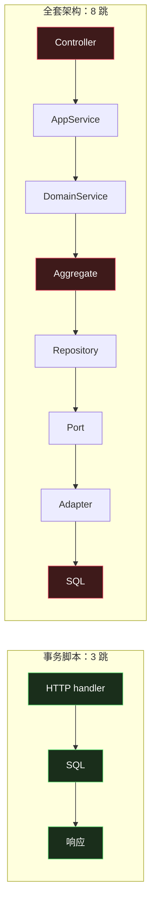
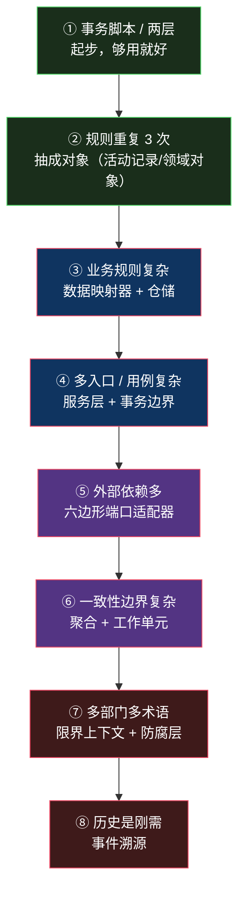

# 反方：什么时候这些全是过度设计

> 系列：企业应用架构（19/19）。

## 生活比喻：回到那家小馆

[总纲](00-overview.md)开头用了「街边小馆 vs 米其林后厨」的比喻。现在回到那个小馆。

**老板一天做 30 碗面。** 如果给他配：

- 米其林的三岗位分工（切配 / 灶台 / 摆盘）
- HACCP 食品安全体系（每个环节留记录）
- 供应链管理系统（供应商比价、库存周转率分析）
- 成本核算到每一碗面

**结果不是「更规范」，是菜做不出来了。**

这 18 篇文章讲的每一个模式，都是**给特定规模的问题准备的**。用错规模，它们的代价全部落在你身上，收益一点拿不到。

**这篇要做的就是算这笔账。**

## 一个具体场景

假设你有一个 5 人团队，在做一个**管理后台**：

- 8~10 张表，主要是增删改查
- 有少量业务规则（状态流转、几个校验）
- 用户量不大，QPS 峰值几十
- 预期还要维护两三年

**这个系统需要本系列里的哪些东西？**

## 逐条算账

用本系列 demo 的真实代码量（同一场景的不同实现）：

```console
=== 同一场景（订单下单）三种写法的核心业务代码行数 ===
  ts.py（事务脚本）    85 行
  ar.py（活动记录）   130 行
  dm.py（数据映射器） 150 行
```

```console
=== 本系列 15 个 demo ===
  flux.mjs             84
  ts.py                85   ← 事务脚本
  value_object.py      90
  mvp.mjs             101
  mvvm.mjs            106
  hexagonal.py        114   ← 六边形
  repository.py       126
  aggregate.py        127
  ar.py               130   ← 活动记录
  layers.py           134   ← 三层架构
  uow_n1.py           139
  acl.py              145
  cqrs_es.py          147
  dm.py               150   ← 数据映射器
  service_layer.py    174   ← 服务层
  ────────────────────────
  合计               1852
```

**同一件事，从 85 行到 174 行——两倍。** 而这还是**教学用的最小实现**，真实项目里这个倍数只会更大（还要加依赖注入容器、配置文件、目录结构）。

### 每一项的收益/成本对照

| 模式 | 小系统（本文场景） | 复杂系统 |
|------|------------------|---------|
| **事务脚本** | ✅ **正解**——最直白 | ❌ 规则会重复到失控 |
| **活动记录** | ✅ 合适（ORM 框架自带） | ❌ 跨表逻辑没地方放 |
| **数据映射器** | ❌ 多一层纯搬运 | ✅ 领域层可测 |
| **MVC/MVP/MVVM/Flux** | 用框架默认的即可 | 取决于状态复杂度 |
| **三层架构** | ⚠️ 业务层往往是空的 | ✅ 多入口共享逻辑时必需 |
| **六边形** | ❌ 端口和适配器翻倍 | ✅ 外部依赖多且会换 |
| **仓储** | ❌ DAO 就够 | ✅ 聚合复杂时必需 |
| **工作单元** | ⚠️ 框架的 session 够用 | ✅ 跨聚合事务时必需 |
| **DDD 三件套** | ❌ **概念成本 > 收益** | ✅ 业务规则复杂时必需 |
| **限界上下文** | ❌ 一个模型就够 | ✅ 多部门/多术语时必需 |
| **防腐层** | ⚠️ 看上游是否常变 | ✅ 上游不可控时必需 |
| **CQRS** | ❌ 两套模型纯负担 | ✅ 读写压力差异大时 |
| **事件溯源** | ❌ **灾难**——改个标题要三条事件 | ✅ 审计/历史是刚需时 |

**数一下「✅ 正解」的格子**：在这个场景里只有前两行。

**18 篇文章讲了 13 类模式，这个系统只需要 2 类。**

## 代价不只是代码量

代码行数是最容易算的那部分。**真正贵的是另外三样：**

### 认知负担

一个新人加入，他需要理解多少东西才能改一行代码？

| 方案 | 新人要学 |
|------|---------|
| 事务脚本 | 「这个函数从哪进来、到哪落库」 |
| **全套 DDD + 六边形** | 聚合边界、值对象规则、端口适配器、应用服务 vs 领域服务、仓储职责、限界上下文划分、事件溯源的重放机制…… |

**每一项单独看都讲得通，加在一起就是一道墙。** 而且这堵墙**每个新人来了都要爬一次**。

### 调试路径变长



**「为什么这个订单状态不对」——三跳能查清的事，八跳要看八个文件。**

### 决策疲劳

**每加一个功能，你要多做多少决策？**

事务脚本：「这个函数写在哪？」——一个问题。

全套架构：「这个逻辑属于应用服务还是领域服务？是聚合的不变量还是政策？要不要新开一个端口？读模型要不要加投影？这个操作跨聚合吗？需要发领域事件吗？」——**七个问题。**

**而这些问题大多数时候没有唯一正确答案**，团队还会为此争论。

## 判断清单

那么什么时候该上？下面是这 19 篇反复出现的信号，收成一张表：

### 该上的信号

| 信号 | 该上什么 |
|------|---------|
| 同一段业务规则在 3 处以上重复 | 抽象成对象（[第 1 篇](01-transaction-script.md)） |
| 业务规则需要大量单测 | 数据映射器 + 领域对象（[第 3](03-data-mapper.md)、[4 篇](04-anemic-vs-rich.md)） |
| 多个入口共享同一套逻辑 | 三层架构 / 服务层（[第 9](09-three-tier.md)、[11 篇](11-service-layer.md)） |
| 外部依赖经常换 | 六边形（[第 10 篇](10-hexagonal-onion-clean.md)） |
| 改一个操作要锁很多行 | 拆小聚合（[第 15 篇](15-aggregate-root.md)） |
| 团队沟通要说「XX 的 YY」 | 限界上下文（[第 16 篇](16-bounded-context.md)） |
| 上游模型经常改且不可控 | 防腐层（[第 17 篇](17-acl-context-mapping.md)） |
| 「状态怎么变成这样的」是业务问题 | 事件溯源（[第 18 篇](18-cqrs-event-sourcing.md)） |

### 不该上的信号

| 信号 | 说明 |
|------|------|
| 业务逻辑约等于零 | CRUD 不需要领域模型 |
| 只有一个入口 | 不需要服务层 |
| 查询为主，写入很少 | 不需要 CQRS |
| 团队 5 人以下、生命周期 2 年内 | 认知成本的回收周期不够 |
| 「因为这是最佳实践」 | **唯一不该上的理由就是这条** |
| 「面试会问」「显得专业」 | 同上 |

## 一条渐进路线

**这些模式不是「上全套」或「不上」，是有顺序的。** 按需要依次引入：



**关键：每一步都是被上一个问题逼出来的，不是提前规划的。**

- 你**不会**在项目第一天决定「我们要用六边形」——你先写事务脚本，然后发现规则重复了，然后发现领域层不好测，然后才需要六边形。
- **反过来做（先上全套）的失败率极高**，因为你在为一个**还不存在的问题**付成本。

**这和[第 1 篇](01-transaction-script.md)那个「三次法则」是同一个道理**：规则出现一次就写在原地，出现三次才抽出来。架构模式也该遵守这个纪律。

## 全系列回顾

| # | 模式 | 一句话 |
|---|------|-------|
| [00](00-overview.md) | 总纲 | 三个问题：逻辑写在哪、界面怎么分、对象怎么存 |
| [01](01-transaction-script.md) | 事务脚本 | 最直白的写法；死于规则重复 |
| [02](02-active-record.md) | 活动记录 | 对象管自己；假设「一个概念 = 一张表」 |
| [03](03-data-mapper.md) | 数据映射器 | 领域层不认识数据库 |
| [04](04-anemic-vs-rich.md) | 贫血 vs 充血 | 争论焦点搞错了：该问「哪些逻辑必须和状态住一起」 |
| [05](05-mvc.md) | MVC | 一个名字四种东西；差异全来自平台约束 |
| [06](06-mvp.md) | MVP | 买「表现逻辑可测」，付「接口爆炸」 |
| [07](07-mvvm.md) | MVVM | 买「零手工同步」，付「数据流隐式化」 |
| [08](08-flux.md) | Flux / Redux | 买「变更可追踪」，付「样板代码」 |
| [09](09-three-tier.md) | 三层架构 | layer 和 tier 是正交的 |
| [10](10-hexagonal-onion-clean.md) | 六边形 / Clean | 依赖一律向内 |
| [11](11-service-layer.md) | 服务层 | 应用服务管编排，领域服务管规则 |
| [12](12-repository.md) | 仓储 | 面向聚合、说领域语言 |
| [13](13-unit-of-work.md) | 工作单元 | N+1 的根因是抽象泄漏 |
| [14](14-entity-value-aggregate.md) | 实体 / 值对象 / 聚合 | 值对象必须不可变 |
| [15](15-aggregate-root.md) | 聚合根 | 一致性边界 = 事务边界 |
| [16](16-bounded-context.md) | 限界上下文 | 划的是语言边界；信号是动词不一致 |
| [17](17-acl-context-mapping.md) | 防腐层 | 防的是概念污染，不是接口变化 |
| [18](18-cqrs-event-sourcing.md) | CQRS / 事件溯源 | 状态是派生的，事件才是事实 |

## 收尾

回到最初那句话：

> **你的规模决定你该怎么分工。**

19 篇文章里的每一个模式，都是**对某个具体问题的回答**，而不是「更高级的做法」。它们的价值全部来自「它解决了什么」，离开那个问题，价值就是零，成本却照样要付。

**所以这个系列最实用的一句是**：

> **先有痛点，再找模式。** 而不是先学模式，再找地方用。

如果你只记住一篇，记住这篇。**知道什么时候不用，比知道怎么用值钱得多。**

---

**系列完成。** 感谢读到这里——如果你在某个项目里正纠结「要不要上 DDD」，希望这 19 篇能帮你算清那笔账。

**相关文章：** [总纲](00-overview.md) · [事务脚本](01-transaction-script.md) · [设计模式：Rust 视角](../design-patterns/index.md) · [System Design 架构地图](../system-design/index.md)
