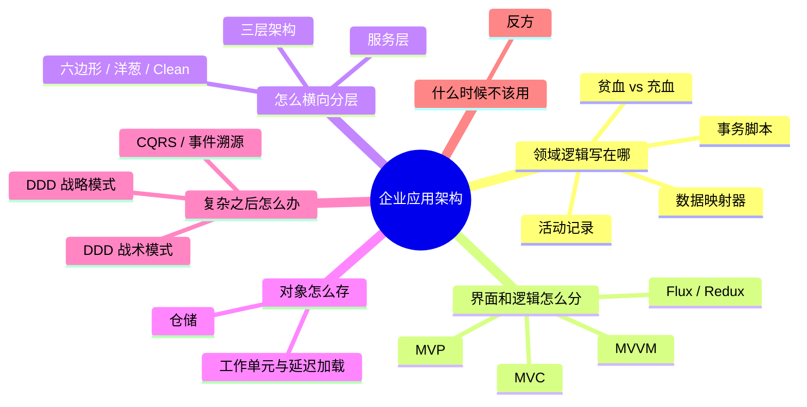

# 企业应用架构

代码怎么组织成系统——从「业务逻辑写在哪」到「服务怎么拆」。

> 系列共 19 篇，**已完成 14 篇**。已完成的篇目可点击，其余为规划中的大纲。

## 系列结构

## 阅读路径

## 文章列表

### 总纲

| # | 主题 | 回答什么问题 |
|---|------|-------------|
| [00](00-overview.md) | 三个问题与一张地图 | 这些模式各自在解决什么 |

### 一、领域逻辑：业务代码到底写在哪 ✅

| # | 主题 | 回答什么问题 |
|---|------|-------------|
| [01](01-transaction-script.md) | 事务脚本 | 过程式写法真的那么不堪吗 |
| [02](02-active-record.md) | 活动记录 | 让对象自己管自己，代价是什么 |
| [03](03-data-mapper.md) | 数据映射器 | 业务对象凭什么要知道数据库 |
| [04](04-anemic-vs-rich.md) | 贫血模型 vs 充血模型 | Service 里全是逻辑，是反模式还是务实 |

### 二、表现层：界面和逻辑怎么分 ✅

| # | 主题 | 回答什么问题 |
|---|------|-------------|
| [05](05-mvc.md) | MVC | 一个名字，为什么有四种东西 |
| [06](06-mvp.md) | MVP | 为了让 View 能测，值得多写多少代码 |
| [07](07-mvvm.md) | MVVM | 双向绑定的红利与代价 |
| [08](08-flux.md) | Flux / Redux | 当双向绑定失控 |

### 三、横向分层：代码怎么切 ✅

| # | 主题 | 回答什么问题 |
|---|------|-------------|
| [09](09-three-tier.md) | 三层架构 | 三层到底是哪三层 |
| [10](10-hexagonal-onion-clean.md) | 六边形 / 洋葱 / Clean | 它们真的不同吗 |
| [11](11-service-layer.md) | 服务层 | 事务边界该划在哪一层 |

### 四、数据访问：对象和关系库的鸿沟 ✅

| # | 主题 | 回答什么问题 |
|---|------|-------------|
| [12](12-repository.md) | 仓储 | 和 DAO 的差别到底在哪 |
| [13](13-unit-of-work.md) | 工作单元与延迟加载 | N+1 是怎么来的 |

### 五、DDD：当模型开始复杂 ⏳

| # | 主题 | 回答什么问题 |
|---|------|-------------|
| 14 | 实体、值对象、聚合 | 什么该有 ID，什么该不可变 |
| 15 | 聚合根 | 一致性边界怎么划 |
| 16 | 限界上下文 | 同一个词为什么在不同地方意思不同 |
| 17 | 防腐层与上下文映射 | 依赖别人之前先包一层，值不值 |

### 六、进阶与反方 ⏳

| # | 主题 | 回答什么问题 |
|---|------|-------------|
| 18 | CQRS 与事件溯源 | 把状态变成日志 |
| 19 | 反方 | 什么时候这些全是过度设计 |

## 写作约定

- **跨语言对比**：每个模式用最适合演示它的语言/框架，不强行统一
- **配反例**：尤其 DDD 部分，每篇都配一个「划错了会怎样」
- 概念 + Mermaid 图 + 关键代码片段，不追求每篇跑完整项目
- 第一部分四篇**共用同一个业务场景**（下单），便于直接对比四种写法

## 相关系列

- [设计模式：Rust 视角](../design-patterns/index.md) — 类与类之间的模式
- [System Design 架构地图](../system-design/index.md) — 服务与服务之间的模式
