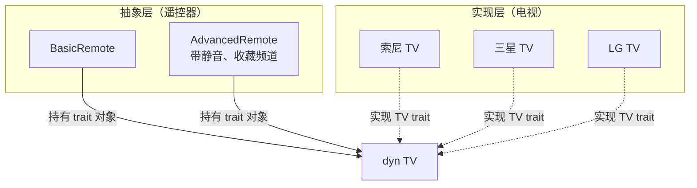

# Bridge 模式：把遥控器和电视分开——Rust 的 trait 对象与泛型

> 基于 Rust 1.96，涉及特性标注最低支持版本。

## 一个问题：遥控器不能只绑一种电视

你有一个万能遥控器，想控制不同品牌的电视——索尼、三星、LG。遥控器应该发送同样的命令（`power()`、`volume_up()`、`set_channel()`），但每台电视的底层实现完全不同。

最直观的做法是给每个品牌写一个遥控器：

```rust
struct SonyRemote { tv: SonyTV }
struct SamsungRemote { tv: SamsungTV }
struct LGRemote { tv: LGTV }
```

每加一个新品牌就多一个遥控器——这不是"万能遥控器"，是"N 个专用遥控器"。**Bridge 模式要解决的问题就是这种 m×n 爆炸——你有 m 种遥控器（基础款、高级款、语音款）和 n 种电视——让它们独立变化，而不是相乘。**

## Bridge 的本质：把"抽象"和"实现"拆成两棵树



关键设计：遥控器不直接知道电视的类型——它只知道一个 `TV` trait。电视怎么开机是电视的事，遥控器只负责说"开机"。

## GoF 经典写法：trait 对象（动态分发）

```rust
// ===== 实现层：电视 =====
trait TV {
    fn power(&mut self);
    fn volume_up(&mut self);
    fn set_channel(&mut self, channel: u32);
    fn model_name(&self) -> &str;
}

struct SonyTV { powered_on: bool, volume: u8 }
impl TV for SonyTV {
    fn power(&mut self) {
        self.powered_on = !self.powered_on;
        println!("索尼 {} 开机", self.model_name());
    }
    fn volume_up(&mut self) { self.volume = (self.volume + 1).min(100); }
    fn set_channel(&mut self, channel: u32) {
        println!("索尼切到频道 {}", channel);
    }
    fn model_name(&self) -> &str { "Bravia X90L" }
}

struct SamsungTV { powered_on: bool, volume: u8 }
impl TV for SamsungTV {
    fn power(&mut self) {
        self.powered_on = !self.powered_on;
        println!("三星 {} 开机", self.model_name());
    }
    fn volume_up(&mut self) { self.volume = (self.volume + 1).min(100); }
    fn set_channel(&mut self, channel: u32) {
        println!("三星切到频道 {}", channel);
    }
    fn model_name(&self) -> &str { "QLED QN90C" }
}

// ===== 抽象层：遥控器 =====
struct BasicRemote<'a> {
    tv: &'a mut dyn TV,   // 持有 trait 对象——不关心具体品牌
}

impl<'a> BasicRemote<'a> {
    fn new(tv: &'a mut dyn TV) -> Self {
        // 出厂配对：把遥控器和电视绑在一起
        println!("遥控器已配对：{}", tv.model_name());
        Self { tv }
    }

    fn power(&mut self)    { self.tv.power(); }
    fn volume_up(&mut self) { self.tv.volume_up(); }
    fn set_channel(&mut self, ch: u32) { self.tv.set_channel(ch); }
}

// 高级遥控器——扩展了基础遥控器，但不改电视代码
struct AdvancedRemote<'a> {
    tv: &'a mut dyn TV,
    favorites: Vec<u32>,
}

impl<'a> AdvancedRemote<'a> {
    fn new(tv: &'a mut dyn TV) -> Self {
        println!("高级遥控器已配对：{}", tv.model_name());
        Self { tv, favorites: vec![] }
    }

    fn power(&mut self)         { self.tv.power(); }
    fn volume_up(&mut self)     { self.tv.volume_up(); }
    fn mute(&mut self)          { println!("静音——但怎么实现由电视决定"); }
    fn add_favorite(&mut self, ch: u32) { self.favorites.push(ch); }

    fn cycle_favorites(&mut self) {
        if let Some(&ch) = self.favorites.first() {
            self.tv.set_channel(ch);
        }
    }
}

// ===== 使用 =====
fn main() {
    let mut sony = SonyTV { powered_on: false, volume: 30 };
    let mut samsung = SamsungTV { powered_on: false, volume: 30 };

    // 同一个 BasicRemote 类型，控制两种电视
    let mut remote = BasicRemote::new(&mut sony);
    remote.power();       // → "索尼 Bravia X90L 开机"
    remote.volume_up();   // sony.volume = 31

    remote = BasicRemote::new(&mut samsung);
    remote.power();       // → "三星 QLED QN90C 开机"

    // 高级遥控器也一样——不需要 SamsungAdvancedRemote
    let mut adv = AdvancedRemote::new(&mut sony);
    adv.add_favorite(5);
    adv.cycle_favorites();  // → "索尼切到频道 5"
}
```

遥控器（`BasicRemote`/`AdvancedRemote`）和电视（`SonyTV`/`SamsungTV`）**完全独立变化**。加一个新电视品牌不需要动遥控器代码，加一种新遥控器不需要动电视代码。

## Rust 特有写法：泛型 + trait bound（静态分发）

上面的代码用了 `&mut dyn TV`——**运行时多态**。每次方法调用都要走虚表（vtable），有微小的性能开销。Rust 给了另一种选择：**编译期多态**——用泛型在编译时生成具体代码，零运行时开销。

```rust
// ===== 同一个遥控器，泛型版本 =====
struct BasicRemote<T: TV> {
    tv: T,   // 编译期就知道是 SonyTV 还是 SamsungTV——没有虚表
}

impl<T: TV> BasicRemote<T> {
    fn new(tv: T) -> Self {
        println!("遥控器已配对：{}", tv.model_name());
        Self { tv }
    }

    fn power(&mut self)         { self.tv.power(); }
    fn volume_up(&mut self)     { self.tv.volume_up(); }
    fn set_channel(&mut self, ch: u32) { self.tv.set_channel(ch); }

    // 泛型版本的好处：可以直接访问 tv 的其他方法
    fn into_tv(self) -> T { self.tv }   // 把电视还给用户
}

// 高级遥控器——同样的泛型模式
struct AdvancedRemote<T: TV> {
    tv: T,
    favorites: Vec<u32>,
}

impl<T: TV> AdvancedRemote<T> {
    fn new(tv: T) -> Self {
        Self { tv, favorites: vec![] }
    }
    fn power(&mut self)         { self.tv.power(); }
    fn volume_up(&mut self)     { self.tv.volume_up(); }
    fn add_favorite(&mut self, ch: u32) { self.favorites.push(ch); }
    fn cycle_favorites(&mut self) {
        if let Some(&ch) = self.favorites.first() {
            self.tv.set_channel(ch);
        }
    }
}

// ===== 使用 =====
fn main() {
    let sony = SonyTV { powered_on: false, volume: 30 };
    let samsung = SamsungTV { powered_on: false, volume: 30 };

    let mut remote = BasicRemote::new(sony);
    remote.power();

    let mut adv = AdvancedRemote::new(samsung);
    adv.add_favorite(7);
    adv.cycle_favorites();

    // 泛型版本：同一个变量不能先绑 Sony 再绑 Samsung
    // remote = BasicRemote::new(samsung);  // ❌ 类型不匹配
    // BasicRemote<SonyTV> ≠ BasicRemote<SamsungTV>
}
```

## trait 对象 vs 泛型：什么时候用哪个

这是 Bridge 模式在 Rust 里最核心的决策：

| | `dyn TV`（动态分发） | `T: TV`（静态分发） |
|---|---|---|
| 切换实现 | ✅ 同一个变量可以切换不同类型的电视 | ❌ 类型在编译期确定，不能切换 |
| 运行时开销 | 有虚表查找 | 零开销——编译期单态化 |
| 二进制体积 | 小（一份代码） | 大（每种 T 生成一份） |
| 异构集合 | ✅ `Vec<Box<dyn TV>>` 可以混放不同电视 | ❌ `Vec<T>` 只能是同一种电视 |
| 代码可读性 | 需要生命周期标注 | 更简洁 |

**选 trait 对象** 当：你需要在运行时切换实现，或者需要把不同实现放在同一个集合里。

**选泛型** 当：编译期就知道具体类型，高性能是关键约束，或者你需要"把电视还给用户"（`into_tv()`）。

## 实战：日志系统的 Bridge

这是一个更接近真实应用的例子——日志框架需要支持不同的输出目标（文件、stdout、网络），每种目标还可以有不同的格式（普通、JSON、带颜色）：

```rust
// ===== 实现层：输出目标 =====
trait LogTarget {
    fn write(&mut self, msg: &str);
    fn flush(&mut self);
}

struct FileTarget {
    file: std::fs::File,
}

impl LogTarget for FileTarget {
    fn write(&mut self, msg: &str) {
        use std::io::Write;
        writeln!(self.file, "{}", msg).unwrap();
    }
    fn flush(&mut self) {
        use std::io::Write;
        self.file.flush().unwrap();
    }
}

struct StdoutTarget;
impl LogTarget for StdoutTarget {
    fn write(&mut self, msg: &str) { println!("{}", msg); }
    fn flush(&mut self) {}
}

// ===== 抽象层：日志格式 =====
struct PlainLogger<W: LogTarget> {
    target: W,
}

impl<W: LogTarget> PlainLogger<W> {
    fn new(target: W) -> Self { Self { target } }

    fn log(&mut self, level: &str, msg: &str) {
        self.target.write(&format!("[{}] {}", level, msg));
    }
}

struct JsonLogger<W: LogTarget> {
    target: W,
}

impl<W: LogTarget> JsonLogger<W> {
    fn new(target: W) -> Self { Self { target } }

    fn log(&mut self, level: &str, msg: &str) {
        let json = format!(
            r#"{{"level":"{}","message":"{}","timestamp":"{}"}}"#,
            level,
            msg,
            chrono::Local::now().format("%Y-%m-%dT%H:%M:%S"),
        );
        self.target.write(&json);
    }
}

// ===== 使用：m×n 任意组合 =====
fn main() -> std::io::Result<()> {
    // 组合 1：普通格式 → 文件
    let file = std::fs::File::create("app.log")?;
    let mut logger = PlainLogger::new(FileTarget { file });
    logger.log("INFO", "服务启动");

    // 组合 2：JSON 格式 → stdout
    let mut json_logger = JsonLogger::new(StdoutTarget);
    json_logger.log("ERROR", "连接超时");

    Ok(())
}
```

加一个新输出目标（比如 `NetworkTarget`，把日志发到远程服务器）？只需要实现 `LogTarget` trait——不需要动 `PlainLogger` 和 `JsonLogger`。加一种新格式（比如带颜色的 `ColoredLogger`）？只需要写一个新的 `struct`——不需要动任何 `LogTarget` 实现。

## 和 Adapter 的区别

Bridge 和 Adapter 容易混淆——它们都涉及"两个东西之间的连接"。区别在于**意图**：

| | Bridge | Adapter |
|---|---|---|
| 意图 | **分离抽象和实现**，让两者独立演化 | **适配接口**，让不兼容的接口一起工作 |
| 设计时机 | **事前设计**——你预料到会有多种组合 | **事后补救**——接口已经定了，需要转接 |
| 变化维度 | 两个维度各自独立变化 | 接口层面的一对一映射 |
| 例子 | 遥控器 + 电视（各自独立演化） | USB-C 转 USB-A 转接头（适配已有接口） |

上次写的 Adapter（`newtype + trait 实现`）是给一个已有的类型换个接口。Bridge 是**从一开始就设计了两个可以独立变化的层次**。

## 小结

Bridge 在 Rust 里的实现实际上是 **trait 的两面**：

- `dyn Trait` 是运行时的 Bridge——遥控器存一个 trait 对象，不同电视在运行时切换
- `T: Trait` 是编译时的 Bridge——每个组合在编译期单态化，零运行时开销

核心设计决策和"用什么方式持有 trait 引用"是同一件事。GoF 原版的 Bridge 关心的是"怎么把抽象和实现分开"，Rust 版本的 Bridge 关心的是"**分开之后，用什么代价把它们连起来**"。
