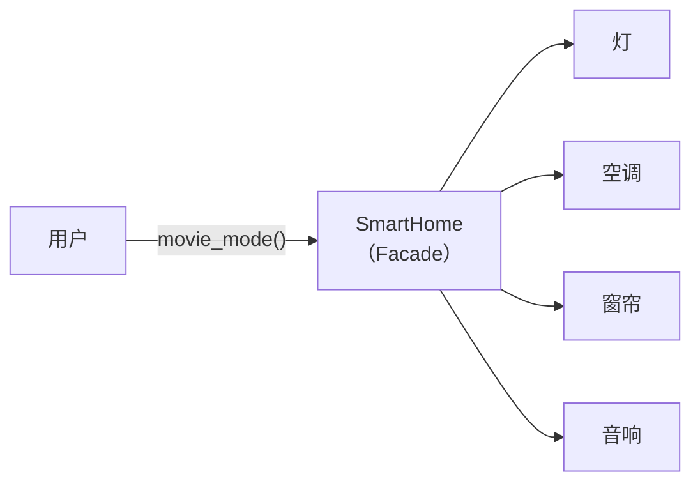

# Facade 模式：给复杂系统装一个"一键启动"按钮——Rust 的模块可见性

> 基于 Rust 1.96。模块可见性控制（`pub`/`pub(crate)`/`pub(super)`）自 1.18 起稳定。

## 一个问题：调用方不需要知道内部有多复杂

你家有一个智能家居系统——灯、空调、窗帘、音响。你想设置"观影模式"：灯调暗、空调 24 度、窗帘拉上、音响打开。如果每次都要分别操作四个设备：

```rust
fn movie_mode() {
    lights.set_brightness(10);
    ac.set_temperature(24);
    curtains.close();
    speaker.turn_on();
    speaker.set_input("TV");
}
```

每次想看个电影要先记住这 5 步。如果哪天换了一套音响，还得改调用代码。Facade 模式的核心：**把一个"一键操作"的按钮放在复杂系统前面，用户只按这个按钮，不知道内部发生了什么。**

```rust
fn movie_mode() {
    smart_home.movie_mode();  // 一键搞定
}
```



## GoF 经典写法：一个 Facade 类封装所有子系统

```rust
// ===== 子系统：各自独立，互不依赖 =====
struct Lights;
impl Lights {
    fn set_brightness(&self, level: u8) { println!("灯亮度: {}%", level); }
}

struct AirConditioner;
impl AirConditioner {
    fn set_temperature(&self, temp: u8) { println!("空调: {}°C", temp); }
    fn turn_off(&self) { println!("空调: 关闭"); }
}

struct Curtain;
impl Curtain {
    fn close(&self) { println!("窗帘: 已拉上"); }
    fn open(&self) { println!("窗帘: 已拉开"); }
}

struct Speaker;
impl Speaker {
    fn turn_on(&self) { println!("音响: 已开启"); }
    fn set_input(&self, source: &str) { println!("音响输入: {}", source); }
    fn turn_off(&self) { println!("音响: 已关闭"); }
}

// ===== Facade：一键操作的接口 =====
struct SmartHome {
    lights: Lights,
    ac: AirConditioner,
    curtain: Curtain,
    speaker: Speaker,
}

impl SmartHome {
    fn new() -> Self {
        Self { lights: Lights, ac: AirConditioner, curtain: Curtain, speaker: Speaker }
    }

    fn movie_mode(&self) {
        println!("🎬 启动观影模式");
        self.lights.set_brightness(10);
        self.ac.set_temperature(24);
        self.curtain.close();
        self.speaker.turn_on();
        self.speaker.set_input("TV");
    }

    fn sleep_mode(&self) {
        println!("😴 启动睡眠模式");
        self.lights.set_brightness(0);
        self.ac.set_temperature(26);
        self.curtain.close();
        self.speaker.turn_off();
    }

    fn leave_home(&self) {
        println!("🏃 离家模式");
        self.lights.set_brightness(0);
        self.ac.turn_off();
        self.curtain.open();
        self.speaker.turn_off();
    }
}

// ===== 使用 =====
fn main() {
    let home = SmartHome::new();
    home.movie_mode();   // 一键，不知道内部有 4 个子系统 5 个操作
    home.sleep_mode();   // 另一个一键操作
}
```

调用方不知道 `SmartHome` 内部有四个子系统。加一个子系统（比如加湿器）只需要改 `SmartHome`，调用方代码不变。

## Rust 特有写法：模块可见性就是 Facade

GoF 用**一个类**做 Facade。Rust 有更轻量的方式——**模块系统本身就是 Facade**：

```rust
// smart_home/mod.rs —— 模块的公共接口就是 Facade
mod lights;          // 私有子模块
mod air_conditioner;
mod curtain;
mod speaker;

use lights::Lights;
use air_conditioner::AirConditioner;
use curtain::Curtain;
use speaker::Speaker;

// 对外只暴露这个结构体，子模块完全不可见
pub struct SmartHome {
    lights: Lights,
    ac: AirConditioner,
    curtain: Curtain,
    speaker: Speaker,
}

impl SmartHome {
    pub fn new() -> Self { /* ... */ }
    pub fn movie_mode(&self) { /* ... */ }
    pub fn sleep_mode(&self) { /* ... */ }
    pub fn leave_home(&self) { /* ... */ }
}
```

```rust
// smart_home/lights.rs —— 完全不对外暴露
pub(crate) struct Lights;  // 只有 smart_home 模块内部能用

impl Lights {
    pub(crate) fn set_brightness(&self, level: u8) { /* ... */ }
}
```

外部代码只能 `use smart_home::SmartHome`——看不到 `Lights`、`AirConditioner` 这些子模块。模块边界就是 Facade 边界。

### `pub(crate)` 的精确控制

Rust 的可见性修饰符比 GoF 的 Facade 类更精细：

```rust
// 模块树
// crate
//  └── smart_home
//       ├── lights (pub(crate))
//       ├── air_conditioner (pub(crate))
//       └── speaker (pub(self))  // 只有 smart_home 模块自己能用
//  └── living_room (兄弟模块)
```

```rust
pub fn global_fn() {}      // 所有人都能调用
pub(crate) fn crate_fn() {} // 整个 crate 内可用
pub(super) fn parent_fn() {} // 父模块可用
pub(in crate::smart_home) fn scoped_fn() {} // 指定模块可用
fn private_fn() {}          // 只有当前模块可用
```

GoF 的 Facade 是一个设计建议——你写了 Facade 类，但调用方仍然可以绕过它直接访问子系统。Rust 的模块可见性是**编译器强制的 Facade**——`pub(crate)` 标注的方法调用方根本看不到，不存在"绕过 Facade"的可能。

## 和 Adapter、Decorator 的区分

这三个模式容易混淆，因为它们都涉及"一个东西包着另一个东西"：

| | Facade | Adapter | Decorator |
|---|---|---|---|
| 意图 | **简化接口**——给复杂系统一个简单的入口 | **转换接口**——让不兼容的接口兼容 | **增强行为**——在不改原对象的情况下加功能 |
| 典型场景 | 一键操作 vs 5 个步骤 | USB-C 转 USB-A | 加缓存/日志/重试 |
| 是否改变行为 | 否（只是重新编排） | 否（只是转换格式） | **是**（在原行为前后加逻辑） |
| 是否新增子系统 | **是**——Facade 引入了新的协调层 | 否——Adapter 只是一个转接头 | 否——Decorator 包装现有对象 |
| 外部能否绕过 | GoF：能。Rust：`pub(crate)` 强制不能 | 能——可以直接用原接口 | 能——可以不用装饰器 |

一句话区分：

- Facade：你家装了智能家居面板，按一下"观影模式"代替操作五个开关
- Adapter：国标插座转美标插头
- Decorator：给电视加了一个"自动关屏"的功能，原来的遥控器还能用

## 实战：数据库连接池的 Facade

```rust
// facade.rs —— 对外：一个简单的池
pub struct DbPool {
    pool: deadpool_postgres::Pool,
    metrics: MetricsCollector,
    health_checker: HealthChecker,
}

impl DbPool {
    pub async fn connect(config: &Config) -> Result<Self, DbError> {
        let pool = create_pool(config)?;
        let metrics = MetricsCollector::new();
        let health_checker = HealthChecker::new(pool.clone());
        Ok(Self { pool, metrics, health_checker })
    }

    pub async fn query(&self, sql: &str) -> Result<Vec<Row>, DbError> {
        let start = Instant::now();
        let client = self.pool.get().await?;
        let result = client.query(sql, &[]).await?;
        self.metrics.record_query(sql, start.elapsed());  // 自动记指标
        Ok(result)
    }

    pub fn health(&self) -> HealthStatus {
        self.health_checker.check()  // 一键健康检查
    }
}

// 调用方：
let db = DbPool::connect(&config).await?;
let users = db.query("SELECT * FROM users").await?;
// 不需要知道 deadpool_postgres、metrics、health_check 的存在
```

调用方不知道内部有连接池、指标收集、健康检查三个组件。以后把 `deadpool_postgres` 换成 `sqlx::Pool`？只需要改 `DbPool` 内部，调用方一行不变。

## 什么时候不该用 Facade

```rust
// ❌ 只有一个子系统——Facade 就是子系统本身，多余的包装
struct SingleFacade { inner: OnlySystem }
impl SingleFacade {
    fn do_thing(&self) { self.inner.do_thing(); }  // 纯转发，没有简化任何东西
}

// ❌ Facade 自己变得比子系统还复杂
struct MegaFacade {
    // 50 个方法，每个方法都只是转发——这不是 Facade，是上帝对象
}

// ✅ Facade 的正确用法：把多个子系统编排成有意义的"场景"
// movie_mode()、sleep_mode()、leave_home() 都是有业务含义的
```

## 小结

Facade 在 Rust 里的实现分成两层：

| 层次 | 机制 | 作用 |
|---|---|---|
| 代码层 | Facade 结构体 | 把多个子系统的调用编排成有意义的场景 |
| 模块层 | `pub(crate)` / `pub(super)` | **编译器强制**的 Facade——外部看不到内部 |

Rust 的 Facade 比 GoF 原版更强——不是"希望调用方别绕过 Facade"，而是"调用方根本不知道子系统存在"。
