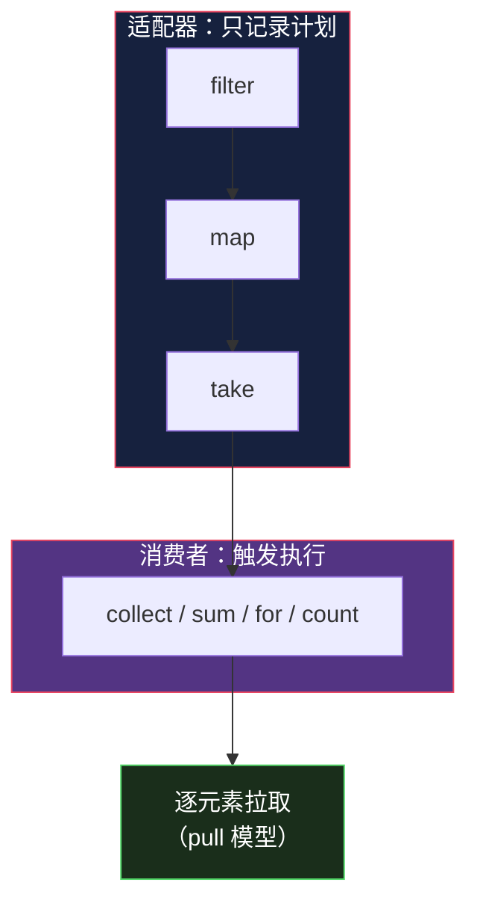

# Iterator 模式 — Rust 设计模式系列

> 系列：用 Rust 的类型系统重新审视 GoF 23 个设计模式。本文基于 Rust 1.95 稳定版。

## 生活比喻：超市的传送带

收银台的传送带一次推过来一件商品，你一件件扫码。你不需要知道货架上还剩多少、下一件是什么——**传送带负责"下一个是谁"，你只负责"处理这一个"**。

GoF 的 Iterator 就是这条传送带：**把"遍历"从"数据结构"里抽出来**，让调用方不关心底层是数组、链表还是树。

Rust 里这条传送带是语言内建的——`for` 循环、`Iterator` trait、几十个适配器，全都是标准库的一部分。

## GoF 的做法：手写迭代器类

GoF 时代（C++/Java），遍历一个集合要自己实现迭代器：

```java
// Java 风格：需要显式管理游标
public interface Iterator<T> {
    boolean hasNext();
    T next();
}

public class ArrayListIterator<T> implements Iterator<T> {
    private List<T> list;
    private int cursor = 0;

    public boolean hasNext() { return cursor < list.size(); }
    public T next() { return list.get(cursor++); }
}

// 使用
Iterator<User> it = users.iterator();
while (it.hasNext()) {
    User u = it.next();
    process(u);
}
```

问题：

1. **状态要手动管理**——`cursor` 的递增、边界检查都是样板代码
2. **两个方法必须配对调用**——`hasNext()` 忘了判断就越界
3. **没法组合**——想要"过滤后再取前 10 个"，得手写嵌套循环

## Rust 的做法：trait + 适配器

Rust 把迭代器做成了 trait，只要实现一个方法：

```rust
// 标准库定义（简化）
pub trait Iterator {
    type Item;                                  // 关联类型：产出什么
    fn next(&mut self) -> Option<Self::Item>;   // 唯一的必需方法
}
```

**只需实现 `next()`，其余 70+ 个方法全部免费获得**（标准库通过默认方法提供）。

```rust
struct Countdown(u32);

impl Iterator for Countdown {
    type Item = u32;

    fn next(&mut self) -> Option<u32> {
        if self.0 == 0 {
            None                    // 迭代结束
        } else {
            let n = self.0;
            self.0 -= 1;
            Some(n)                 // 产出下一个
        }
    }
}

// 使用
for n in Countdown(3) {
    println!("{n}");
}
// 输出：3 2 1
```

**好在哪：**

- **一个方法换全部能力**——实现 `next()` 就能用 `map`/`filter`/`take`/`sum`...
- **`Option` 表达结束**——类型系统保证你必须处理"没有下一个"的情况，不会越界
- **`&mut self` 显式可变**——迭代会改变内部状态，编译器强制独占借用

## 零成本抽象：适配器链

GoF 的迭代器只能遍历。Rust 的迭代器可以**组合**——每个适配器返回新的迭代器，链式调用：

```rust
let result: i32 = (1..=100)
    .filter(|n| n % 2 == 0)      // 只要偶数
    .map(|n| n * n)              // 平方
    .take(5)                     // 取前 5 个
    .sum();                      // 求和

println!("{result}");  // 4 + 16 + 36 + 64 + 100 = 220
```


**关键：整条链在编译后和手写 for 循环生成的机器码一样。** 适配器是 `#[inline]` 的零大小类型（ZST），不会有虚函数调用或堆分配——这是 Rust 迭代器最反直觉也最强大的地方。

对比一下手写版本：

```rust
// 等价的命令式写法
let mut result = 0;
let mut count = 0;
for n in 1..=100 {
    if n % 2 == 0 {
        result += n * n;
        count += 1;
        if count == 5 { break; }
    }
}
// 两段代码编译后性能相同，但上面那段是声明式的
```

## 惰性求值：不调用就不干活

适配器**不会立即执行**——它们只是构建了一个"计算计划"，直到遇到消费者（`sum`/`collect`/`for`）才真正运行：

```rust
let iter = (1..=100)
    .filter(|n| { println!("检查 {n}"); n % 2 == 0 })
    .map(|n| n * n);

// 到这里，一行日志都不会打印！

let v: Vec<_> = iter.take(3).collect();
// 现在才开始打印：检查 1 检查 2 检查 3 检查 4 检查 5 检查 6
// 注意：只检查到 6 就停了 —— take(3) 凑够 3 个就短路
```

**惰性 + 短路 = 按需计算。** 处理一个 10GB 的日志文件时，`iter.filter(...).take(10)` 只读到第 10 条匹配就停，不会把整个文件读进内存。



## 实现自定义迭代器：三种姿势

### 1. 从零实现 `next()`

```rust
/// 斐波那契迭代器
struct Fibonacci {
    a: u64,
    b: u64,
}

impl Fibonacci {
    fn new() -> Self {
        Self { a: 0, b: 1 }
    }
}

impl Iterator for Fibonacci {
    type Item = u64;

    fn next(&mut self) -> Option<u64> {
        let next = self.a + self.b;
        self.a = self.b;
        self.b = next;
        Some(self.a)     // 无限迭代器：永不返回 None
    }
}

// 配合 take 使用（无限迭代器必须自己限制）
let fibs: Vec<u64> = Fibonacci::new().take(10).collect();
// [1, 1, 2, 3, 5, 8, 13, 21, 34, 55]
```

### 2. 用 `impl Iterator` 返回适配器（最常用）

```rust
/// 返回一个已配置好的迭代器，不暴露具体类型
fn even_squares(limit: u32) -> impl Iterator<Item = u32> {
    (1..=limit)
        .filter(|n| n % 2 == 0)
        .map(|n| n * n)
}

// 调用方可以用任何迭代器方法继续组合
let total: u32 = even_squares(100).sum();
```

**`impl Iterator` 的价值**：不用写出 `Filter<Map<RangeInclusive<u32>, ...>, ...>` 这种无法阅读的类型——而且返回类型被封装，将来换实现不破坏 API。

### 3. 为自定义集合实现 `IntoIterator`

让你的类型支持 `for` 循环：

```rust
struct Playlist {
    songs: Vec<String>,
}

// for song in &playlist —— 借用迭代
impl<'a> IntoIterator for &'a Playlist {
    type Item = &'a String;
    type IntoIter = std::slice::Iter<'a, String>;

    fn into_iter(self) -> Self::IntoIter {
        self.songs.iter()      // 直接复用 Vec 的迭代器
    }
}

// for song in playlist —— 消费迭代（拿走所有权）
impl IntoIterator for Playlist {
    type Item = String;
    type IntoIter = std::vec::IntoIter<String>;

    fn into_iter(self) -> Self::IntoIter {
        self.songs.into_iter()
    }
}

// 现在两种都能用
let playlist = Playlist { songs: vec!["A".into(), "B".into()] };
for song in &playlist { println!("{song}"); }   // 借用
for song in playlist  { println!("{song}"); }   // 消费
```

## 常用适配器速查

| 适配器 | 作用 | 例子 |
|--------|------|------|
| `map` | 转换每个元素 | `.map(\|x\| x * 2)` |
| `filter` | 保留满足条件的 | `.filter(\|x\| x > &0)` |
| `filter_map` | 转换 + 过滤（`Option`） | `.filter_map(\|s\| s.parse().ok())` |
| `flat_map` | 展平嵌套 | `.flat_map(\|v\| v)` |
| `take` / `skip` | 取前 n / 跳过前 n | `.take(10)` |
| `take_while` | 满足条件就取 | `.take_while(\|x\| x < &10)` |
| `chain` | 拼接两个迭代器 | `.chain(other)` |
| `zip` | 配对两个迭代器 | `.zip(names)` |
| `enumerate` | 附带下标 | `.enumerate()` |
| `peekable` | 可预读一个元素 | `.peekable()` |
| `chunks` (slice) | 按块切分 | `.chunks(3)` |
| `windows` (slice) | 滑动窗口 | `.windows(3)` |
| `fold` | 累积计算 | `.fold(0, \|acc, x\| acc + x)` |
| `collect` | 收集成集合 | `.collect::<Vec<_>>()` |

## 实战：流式处理日志

场景——从一个可能很大的日志文件里，找出所有 5xx 错误并按状态码统计：

```rust
use std::collections::HashMap;
use std::fs::File;
use std::io::{BufRead, BufReader};

fn analyze_errors(path: &str) -> std::io::Result<HashMap<u16, usize>> {
    let file = File::open(path)?;

    let stats = BufReader::new(file)
        .lines()                                  // 逐行读（惰性，不载入内存）
        .filter_map(|line| line.ok())             // 跳过读失败的行
        .filter_map(|line| parse_status(&line))   // 提取状态码，解析失败返回 None
        .filter(|code| (500..600).contains(code)) // 只要 5xx
        .fold(HashMap::new(), |mut acc, code| {   // 累积统计
            *acc.entry(code).or_insert(0) += 1;
            acc
        });

    Ok(stats)
}

/// 从 "127.0.0.1 - - [time] \"GET / 500 1234\"" 里提取状态码
fn parse_status(line: &str) -> Option<u16> {
    line.split('"')
        .nth(2)?                    // 取请求行之后的部分
        .split_whitespace()
        .next()?
        .parse()
        .ok()
}

fn main() -> std::io::Result<()> {
    let stats = analyze_errors("access.log")?;
    let mut sorted: Vec<_> = stats.into_iter().collect();
    sorted.sort_unstable_by(|a, b| b.1.cmp(&a.1));
    for (code, count) in sorted.iter().take(10) {
        println!("{code}: {count}");
    }
    Ok(())
}
```

**对比 Python 版本**——Python 也能写生成器，但通常会把整个列表载入内存；Rust 版本是**惰性 + 短路**的，10GB 文件也只占用常数内存：

```python
# Python：列表推导会一次性建完整列表
with open('access.log') as f:
    statuses = [parse_status(line) for line in f]     # 全量载入
    errors = [s for s in statuses if s and 500 <= s < 600]
```

## 什么时候不用迭代器

迭代器链不是万能的，这些情况手写循环更清晰：

| 场景 | 原因 |
|------|------|
| 需要 `break` 带值返回 | 用 `find`/`try_fold`，或直接 for |
| 需要下标同时读写 | `for i in 0..v.len()` 更自然 |
| 逻辑有多个退出点 | 迭代器链会变成难懂的 `scan`/`try_fold` 嵌套 |
| 需要提前 `return` 整个函数 | `for` 循环里的 `return` 更直接 |
| 调试困难 | 迭代器链的中间值难打日志（用 `inspect` 可缓解） |

**经验法则：** 数据变换流水线用迭代器；控制流复杂的用循环。两者性能相当，选可读性好的那个。

## 骨架代码

```rust
// 1. 最小自定义迭代器
struct Chunks<'a> {
    data: &'a [u8],
    size: usize,
}

impl<'a> Iterator for Chunks<'a> {
    type Item = &'a [u8];

    fn next(&mut self) -> Option<&'a [u8]> {
        if self.data.is_empty() {
            return None;
        }
        let n = self.size.min(self.data.len());
        let (head, tail) = self.data.split_at(n);
        self.data = tail;
        Some(head)
    }
}

// 2. 返回 impl Iterator 封装内部实现
fn active_users(users: &[User]) -> impl Iterator<Item = &User> {
    users.iter().filter(|u| u.active)
}

// 3. 实现了 size_hint 帮助 collect 预分配
impl<'a> Iterator for Chunks<'a> {
    // ... next() 同上
    fn size_hint(&self) -> (usize, Option<usize>) {
        let n = self.data.len().div_ceil(self.size);  // Rust 1.73+
        (n, Some(n))   // 精确知道还剩几个
    }
}
```

**`size_hint` 的用处**：`collect()` 靠它预分配 `Vec` 容量，避免反复扩容。默认实现返回 `(0, None)`，能让 `collect` 变快一倍以上。

## 总结

| 维度 | GoF Iterator | Rust Iterator |
|------|-------------|--------------|
| 定义方式 | 接口 + 实现类 | trait + 一个方法 |
| 遍历协议 | `hasNext()` / `next()` | `next() -> Option<Item>` |
| 组合能力 | 无（或手写） | 70+ 适配器自由链式组合 |
| 执行时机 | 立即 | 惰性，消费者触发 |
| 性能 | 虚函数调用开销 | 零成本（内联/ZST） |
| 自定义集合 | 显式实现迭代器类 | 实现 `IntoIterator` 即可 `for` |

GoF 的 Iterator 在 Rust 里不是"一个模式"，而是**语言的语法设施**——`for` 循环、`Iterator` trait、适配器链，共同构成了 Rust 处理序列数据的统一抽象。这也是为什么 Rust 代码里几乎看不到手写的 `for i in 0..len` 索引循环。
