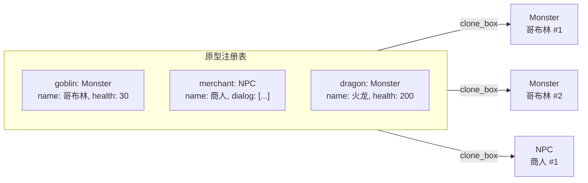

# Prototype 模式：Clone trait 与对象复制

> 本文基于 Rust 1.96。

## 不用 Prototype 的问题

假设你要构建一个游戏，里面有不同类型的怪物——哥布林、骷髅、火龙。每个怪物有很多配置参数：

```rust
struct Monster {
    name: String,
    health: i32,
    max_health: i32,
    damage: i32,
    defense: i32,
    speed: f64,
    texture: String,
    animations: Vec<String>,
    loot_table: Vec<String>,
    skills: Vec<String>,
    // ... 更多字段
}
```

每次生成一个怪物，你都得从头构造：

```rust
fn spawn_goblin(level: i32) -> Monster {
    Monster {
        name: format!("哥布林 Lv.{}", level),
        health: 30 + level * 5,
        max_health: 30 + level * 5,
        damage: 8 + level * 3,
        defense: 2 + level,
        speed: 1.2,
        texture: "goblin.png".into(),
        animations: vec!["idle".into(), "walk".into(), "attack".into()],
        loot_table: vec!["copper_coin".into(), "goblin_ear".into()],
        skills: vec!["scratch".into()],
    }
}

fn spawn_skeleton(level: i32) -> Monster {
    Monster {
        name: format!("骷髅 Lv.{}", level),
        // 和哥布林共享很多字段——但得重写一遍
        health: 25 + level * 5,
        max_health: 25 + level * 5,
        damage: 10 + level * 2,
        defense: 5 + level,
        speed: 0.8,
        texture: "skeleton.png".into(),
        animations: vec!["idle".into(), "walk".into(), "attack".into()],
        loot_table: vec!["bone".into(), "rusty_sword".into()],
        skills: vec!["slash".into()],
    }
}
```

问题很明显：

- **大量重复代码**——每个种族的构造器里重复写默认值
- **加一个新字段**，所有构造器都得改
- **运行时新增种族**不可能——你没法在运行期写一个新函数

Prototype 模式解决的就是这事：**先创建一个样板实例（原型），然后通过复制原型来生成新对象**。

## GoF 定义

```text
Prototype：
  用原型实例指定创建对象的种类，并通过拷贝这些原型创建新的对象。

                Client
                  │
                  ▼
        ┌─────────────────┐
        │   Prototype     │       ← 抽象原型：声明 clone() 接口
        │ + clone()       │
        └────────┬────────┘
                 │
        ┌────────┴────────┐
        │                 │
  ┌─────┴─────┐    ┌─────┴─────┐
  │ Concrete  │    │ Concrete  │
  │ PrototypeA │    │ PrototypeB │  ← 具体原型：实现自己的克隆逻辑
  │ clone()   │    │ clone()   │
  └───────────┘    └───────────┘
```

在传统 OOP 语言里，你需要手动定义 `clone()` 接口。在 Rust 里，这件事已经被标准库标准化了。

## Clone trait：Rust 的内建"原型复制"

Rust 没有纠结于「要不要支持克隆」——标准库直接提供了一个 `Clone` trait，任何类型只要实现它，就可以通过 `.clone()` 复制：

```rust
pub trait Clone {
    fn clone(&self) -> Self;

    fn clone_from(&mut self, source: &Self) {
        *self = source.clone()
    }
}
```

这就是 GoF Prototype 模式在 Rust 里的等价物——`Clone` 就是抽象原型接口，`clone()` 就是工厂方法。

```rust
#[derive(Clone)]  // ← 编译器自动生成 clone()
struct MonsterPrototype {
    name: String,
    health: i32,
    damage: i32,
    texture: String,
}

// 创建原型
let goblin_template = MonsterPrototype {
    name: "哥布林".into(),
    health: 30,
    damage: 8,
    texture: "goblin.png".into(),
};

// 从原型复制出新的实例——不到一行
let goblin_a = goblin_template.clone();
let goblin_b = goblin_template.clone();
```

对比直接构造：克隆不需要知道构造参数、不需要重新执行初始化逻辑、不会遗漏字段。**原型是已经配置好的对象，克隆就是创建它的副本。**

## #[derive(Clone)] 与手动 Clone

大多数时候 `#[derive(Clone)]` 就够用了——它逐字段调用每个字段的 `clone()`，生成的内容大致等价于：

```rust
// derive(Clone) 自动生成的等价代码
impl Clone for MonsterPrototype {
    fn clone(&self) -> Self {
        Self {
            name: self.name.clone(),     // String 的 clone() 做深拷贝
            health: self.health,          // i32 是 Copy，直接按位复制
            damage: self.damage,
            texture: self.texture.clone(),
        }
    }
}
```

需要自定义克隆逻辑的场景——比如共享只读数据、延迟加载资源：

```rust
struct Monster {
    name: String,
    stats: Stats,
    ai_script: Arc<str>,      // ← Arc：所有克隆体共享同一份 AI 脚本
    texture: String,
}

impl Clone for Monster {
    fn clone(&self) -> Self {
        Self {
            name: self.name.clone(),
            stats: self.stats,           // Stats 实现了 Copy
            ai_script: self.ai_script.clone(),  // Arc::clone() 只增加引用计数
            texture: self.texture.clone(),
        }
    }
}
```

这里 `Arc<str>` 的 `clone()` 不做深拷贝——它只增加引用计数。**这是 Rust 比 Java 更精细的地方：你可以精确控制克隆的语义，哪些字段深拷贝、哪些共享、哪些延迟加载。**

## 原型注册表（Prototype Registry）

只有一个原型不够用——真实游戏里有几十种怪物。原型注册表就是存所有原型的容器：

```rust
use std::collections::HashMap;

#[derive(Clone)]
struct Monster {
    name: String,
    kind: MonsterKind,
    health: i32,
    damage: i32,
    // ... 更多字段
}

#[derive(Clone, Copy, PartialEq, Eq, Hash)]
enum MonsterKind {
    Goblin,
    Skeleton,
    Dragon,
    Slime,
}

struct MonsterRegistry {
    prototypes: HashMap<MonsterKind, Monster>,
}

impl MonsterRegistry {
    fn new() -> Self {
        let mut prototypes = HashMap::new();

        // 预先创建好所有原型
        prototypes.insert(MonsterKind::Goblin, Monster {
            name: "哥布林".into(),
            kind: MonsterKind::Goblin,
            health: 30,
            damage: 8,
        });

        prototypes.insert(MonsterKind::Skeleton, Monster {
            name: "骷髅".into(),
            kind: MonsterKind::Skeleton,
            health: 25,
            damage: 10,
        });

        // ... 更多原型

        Self { prototypes }
    }

    /// 从原型复制出一个新的怪物——调用方可以继续修改
    fn spawn(&self, kind: MonsterKind) -> Option<Monster> {
        self.prototypes.get(&kind).cloned()  // cloned() = 先 clone 再 wrap 进 Option
    }

    /// 运行期注册新原型——不用改代码
    fn register(&mut self, kind: MonsterKind, prototype: Monster) {
        self.prototypes.insert(kind, prototype);
    }
}
```

使用：

```rust
let registry = MonsterRegistry::new();

// 克隆原型——而不是从头构造
let mut goblin = registry.spawn(MonsterKind::Goblin).unwrap();
goblin.health = 35;  // 在原型基础上微调
goblin.name = format!("{} Lv.2", goblin.name);

let mut skeleton = registry.spawn(MonsterKind::Skeleton).unwrap();
skeleton.damage = 15;  // 精英骷髅
```

这就是 Prototype 模式的核心价值：**原型定义默认状态，克隆体按需定制**。

## Trait 对象的克隆问题

上面的实现依赖具体类型 `Monster`。如果系统里所有实体都是同一个结构体，那直接 `clone()` 就行。但实际项目中，你可能有多种完全不相关的实体类型——`Monster`、`NPC`、`Item`、`Projectile`——它们共享同一个 trait 但有不同的内部结构。

问题来了：**`Clone` trait 不是对象安全的（not object-safe）**——你不能写 `Box<dyn Clone>`。原因很简单：`clone(&self) -> Self` 返回 `Self`，但 `Self` 对于 `dyn Clone` 是不确定大小的。

```rust
// ❌ 编译错误：Clone 不是对象安全的
let box_clone: Box<dyn Clone> = Box::new(goblin);
let copy = box_clone.clone();  // error: cannot call clone() on dyn Clone
```

常用的解决方案——`Box<dyn Entity>` 原型注册表需要两层 trait：

```rust
// 实体接口
trait Entity: EntityClone {
    fn name(&self) -> &str;
    fn render(&self);
    fn update(&self, dt: f64);
}

// 辅助 trait——专门给 Box<dyn Entity> 用的克隆
trait EntityClone {
    fn clone_box(&self) -> Box<dyn Entity>;
}

// 自动为所有 'static + Entity + Clone 的类型实现 EntityClone
impl<T> EntityClone for T
where
    T: Entity + Clone + 'static,
{
    fn clone_box(&self) -> Box<dyn Entity> {
        Box::new(self.clone())
    }
}

// 为 Box<dyn Entity> 实现 Clone
impl Clone for Box<dyn Entity> {
    fn clone(&self) -> Self {
        self.clone_box()
    }
}
```

这样 `Box<dyn Entity>` 就可以克隆了：

```rust
#[derive(Clone)]
struct Monster {
    name: String,
    health: i32,
}
impl Entity for Monster {
    fn name(&self) -> &str { &self.name }
    fn render(&self) { println!("渲染怪物: {}", self.name); }
    fn update(&self, _dt: f64) { /* AI 逻辑 */ }
}

#[derive(Clone)]
struct NPC {
    name: String,
    dialog: Vec<String>,
}
impl Entity for NPC {
    fn name(&self) -> &str { &self.name }
    fn render(&self) { println!("渲染 NPC: {}", self.name); }
    fn update(&self, _dt: f64) { /* 对话逻辑 */ }
}

// 原型注册表：存的是 Box<dyn Entity>，可以是任何具体类型
struct EntityRegistry {
    prototypes: HashMap<String, Box<dyn Entity>>,
}

impl EntityRegistry {
    fn new() -> Self {
        let mut p = HashMap::new();
        p.insert("goblin".into(), Box::new(Monster {
            name: "哥布林".into(),
            health: 30,
        }));
        p.insert("merchant".into(), Box::new(NPC {
            name: "商人".into(),
            dialog: vec!["欢迎光临！".into()],
        }));
        Self { prototypes: p }
    }

    fn spawn(&self, key: &str) -> Option<Box<dyn Entity>> {
        self.prototypes.get(key).map(|p| p.clone())
        //                                 ^^^^^^^^
        //                                 调用 Box<dyn Entity>::clone()
        //                                 再经由 EntityClone → Clone 完成
    }
}

fn main() {
    let registry = EntityRegistry::new();

    let goblin = registry.spawn("goblin").unwrap();
    goblin.render();    // "渲染怪物: 哥布林"

    let merchant = registry.spawn("merchant").unwrap();
    merchant.render();  // "渲染 NPC: 商人"

    // 两个克隆体独立，互不影响
    let goblin2 = registry.spawn("goblin").unwrap();
}
```



这里完整展示了 **Prototype + Registry** 模式：

- 原型是已经完成初始化的对象（不是未构建的蓝图）
- 克隆是复制原型（不是重新构造）
- 注册表让新增原型不需要改业务代码
- `clone_box` 模式解决了 trait object 不能克隆的 Rust 特有难题

## 对比其他语言

| | Java | Python | Rust |
|---|---|---|---|
| 接口 | `Cloneable` 标记接口 | `copy.copy()` / `__copy__` | `Clone` trait |
| 默认行为 | 浅拷贝（`super.clone()`） | 浅拷贝（`copy.copy`） | 自定义（`#[derive(Clone)]` 逐字段） |
| 深拷贝 | 手动重写 `clone()` | `copy.deepcopy()` | 手动在 `Clone::clone()` 里处理 |
| 对象安全 | `Cloneable` 是标记，没有对象安全问题 | 无类型限制 | ❌ `Clone` 不是对象安全——需要 `clone_box` 模式 |
| 构造 vs 克隆 | 不清楚该用 new 还是 clone | 有些库 clone 坑多 | **明确：clone 和构造是两个概念，调用方显式选择** |

Rust 的 `Clone` 最大的不同是**显式性**：

- Java 的 `clone()` 可以自动调用（被错误地重用时容易出 bug）
- Python 里 `b = a` 是引用赋值，`b = copy.copy(a)` 才是拷贝——约定不统一
- Rust 里浅拷贝是 `Copy`（赋值自动发生），深拷贝是 `Clone`（必须显式 `.clone()`）——**两个级别的拷贝，两个截然不同的设计**

> **语言笔记**：Rust 1.96 中 `Clone` trait 稳定。`Clone` 的设计是故意不对象安全的——它强迫你思考"当你需要运行期多态和克隆的组合时该怎么做"，而不是给你一个隐式执行的深拷贝。

## 什么时候用，什么时候不用

**用 Prototype**：
- 创建对象的成本很高（数据库查询、文件加载、复杂计算）——克隆已初始化的原型节省这些开销
- 对象有大量共享默认配置，但在运行期需要细微定制——原型 + clone + 修改
- 需要运行期动态增加"种类"——注册表可以随时插入新原型，不改任何已有代码
- 对象组合关系复杂，构造函数不够用——克隆一个已经组合好的实例更自然

**不用 Prototype**：
- 简单对象直接 `new()` 或 struct literal——不要为了克隆而克隆
- 对象初始化没有显著成本——克隆的复杂度和直接构造一样
- 不需要运行期增加种类——用 enum + match 的 Factory Method 更清晰
- 对象包含大量共享的不可变数据——用 `Arc` 共享引用比 Clone 更高效（这是借用/引用解决的问题，不是克隆解决的问题）

## 小结

| 概念 | Rust 表达 |
|---|---|
| 抽象原型 | `trait Clone` |
| 克隆方法 | `fn clone(&self) -> Self` |
| 自动实现 | `#[derive(Clone)]` |
| 浅拷贝 marker | `trait Copy`（自动 `clone`） |
| 原型注册表 | `HashMap<K, V> + cloned()` |
| Trait 对象克隆 | `clone_box` 模式 |
| 共享不可变数据 | `Arc::clone()` 只增加引用计数 |

Prototype 在 Rust 里不是"需要学习的模式"——**它就是 `Clone` trait。** 你每天都在用：`.clone()`、`#[derive(Clone)]`、`Arc::clone()`，这些都是 Prototype 的实例。GoF 的《设计模式》里 Prototype 是个独立章节，而在 Rust 里它被标准化成了一个语言级的 trait——不是模式需要你来实现，而是 `Clone` 给你规定好了实现方式。

核心思想不变：**用已有的实例作为模板，复制出新实例，而不是从构造函数开始填充。**

---

**下一篇：** [Singleton 模式](singleton.md)
**返回：** [设计模式：Rust 视角](index.md)
