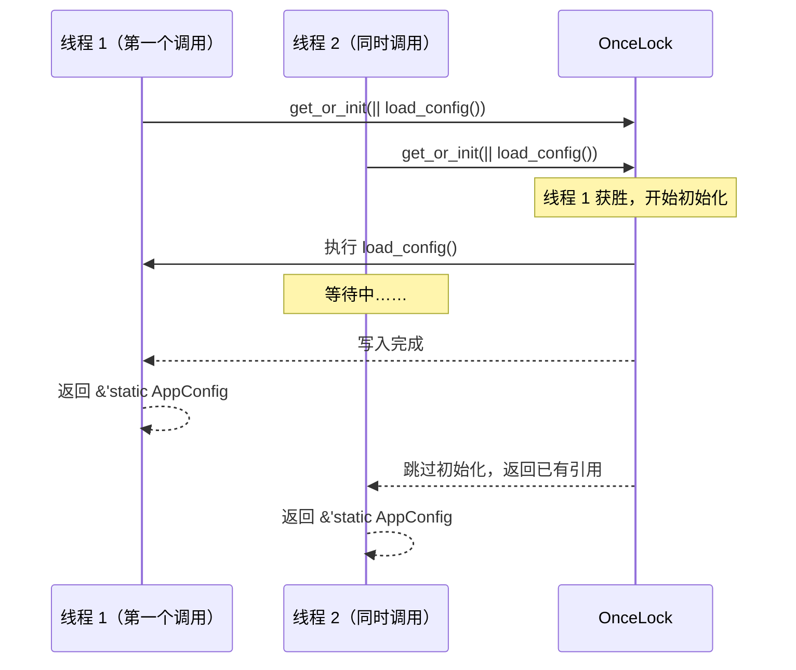

# Singleton 模式：Rust 里「只有一个」的三种写法

> 本文基于 Rust 1.85（2025 稳定版），涉及特性标注最低支持版本。

## 什么场景需要 Singleton

全局配置。日志实例。数据库连接池。缓存管理器。这些场景有一个共同点：**整个程序里只需要一个实例，且所有地方都能访问它**。

在其他语言里，这个需求通常直接翻译成「一个全局变量」。但在 Rust 里事情没这么简单——全局变量必须 `Sync` 且不能有引用，而且 Rust 明确地用所有权和生命周期告诉你：全局可变状态是危险的。

这不是 Rust 在为难你，而是 Singleton 模式本来就背负着设计债——它把对象变成了隐式全局依赖，让测试变得困难，让代码变得更难推理。**Rust 不把它做成「一行代码搞定」的默认方案，本身就是一种设计信号**：你真的想清楚了吗？

## GoF 定义

```text
Singleton：
  确保一个类只有一个实例，并提供全局访问点。

     ┌──────────────────────┐
     │      Singleton       │
     ├──────────────────────┤
     │ - instance: Self     │  ← 唯一的实例（通常是静态变量）
     ├──────────────────────┤
     │ + get_instance()     │  ← 全局访问点
     └──────────────────────┘
            │
  同一个程序里只有一个实例
```

## 为什么 Singleton 在 Rust 里不够「一行搞定」

在 Python 里：

```python
# Python：模块级别就已经是单例了
from config import settings  # 模块只会被执行一次
```

在 Java 里：

```java
public class Config {
    private static final Config INSTANCE = new Config();
    public static Config getInstance() { return INSTANCE; }
}
```

在 C++ 里（C++11 起）：

```cpp
Config& get_config() {
    static Config instance;  // 函数内 static → 线程安全懒汉式
    return instance;
}
```

这些语言里 Singleton 是一个「写几次就习惯了的模板」。但在 Rust 里，问题不在模板而在语言层面：

- 全局可变变量必须显式用 `static mut` + `unsafe`
- static 必须在编译期初始化——没法懒加载
- 全局变量必须实现 `Sync`——编译器不会让你无意间暴露线程不安全
- 没有构造函数的默认参数——不能用函数内 static 简单替代

**Rust 给了你选择，但没有给你默认值**。每种实现方式的选择背后都有不同的取舍。

## 写法一：编译期常量（最简单、最推荐）

如果你可以在编译期知道值的内容，**直接上 `const` 或 `static`**——这是 Rust 里最正宗、最简单的「全局单例」：

```rust
// 编译期确定的全局配置——不需要任何运行时初始化
const APP_NAME: &str = "my-service";
const VERSION: &str = env!("CARGO_PKG_VERSION");  // 编译期从 Cargo.toml 读
const MAX_CONNECTIONS: u32 = 100;

// 如果值不是 Copy，用 static
static LOG_PREFIX: &str = "[my-app]";
```

为什么这最好？**不需要初始化代码，不需要同步原语，编译器在编译期就把值嵌入到了二进制里**。不存在「还没初始化就被读取」的可能性。

```text
适用场景：
  配置常量、特征标记、魔法数字、编译期确定的字符串
不适用场景：
  运行期读配置文件、需要动态创建的连接池、有状态的 logger
```

## 写法二：`OnceLock` — 运行期一次性初始化

真正有挑战的 Singleton 是「运行期才能确定的值」——比如读配置文件、连接数据库、初始化日志路径。

Rust 1.70 稳定了 `std::sync::OnceLock`，它提供了一次性初始化的线程安全容器：

```rust
use std::sync::OnceLock;

// 程序配置——从 YAML 文件加载，全局只需要一份
#[derive(Debug)]
struct AppConfig {
    database_url: String,
    redis_url: String,
    log_level: String,
}

/// 全局配置访问器——第一次访问时初始化
fn global_config() -> &'static AppConfig {
    static CONFIG: OnceLock<AppConfig> = OnceLock::new();
    // call_once 保证初始化函数只被执行一次（即使多个线程同时走到这）
    CONFIG.get_or_init(|| {
        // 假设某处有 load_from_file()——实际项目里建议传路径参数
        AppConfig {
            database_url: std::env::var("DATABASE_URL")
                .unwrap_or_else(|_| "postgres://localhost:5432/mydb".into()),
            redis_url: std::env::var("REDIS_URL")
                .unwrap_or_else(|_| "redis://localhost:6379".into()),
            log_level: std::env::var("LOG_LEVEL")
                .unwrap_or_else(|_| "info".into()),
        }
    })
}

fn main() {
    let cfg = global_config();
    println!("connecting to: {}", cfg.database_url);
    // 再次调用直接返回已有实例，不触发第二次初始化
}
```

关键设计要点：

- **`OnceLock::new()`** 在编译期创建空容器——不占用运行时初始化的开销
- **`get_or_init(|| ...)`** 接受一个闭包，只执行一次——多个线程并发调用时只有第一个线程会执行初始化闭包，其余线程等待完成后直接拿到引用
- **返回 `&'static T`**——生命周期为整个程序执行周期，不会被释放
- **不需要 `unsafe`**——`OnceLock` 的所有操作都是完全安全的



### 带参数的懒初始化

有时 Singleton 依赖外部参数（比如配置文件的路径）。一个常见且实用的模式是「先注册，后获取」：

```rust
use std::sync::OnceLock;

static CONFIG_PATH: OnceLock<String> = OnceLock::new();
static APP_CONFIG: OnceLock<AppConfig> = OnceLock::new();

/// 在 main 函数最开头调用——程序执行期间只能调用一次
fn init_config(path: &str) {
    CONFIG_PATH
        .set(path.to_string())
        .expect("init_config 必须且只能调用一次");

    APP_CONFIG
        .set(AppConfig::load_from_file(path))
        .expect("加载配置失败");
}

fn global_config() -> &'static AppConfig {
    APP_CONFIG.get().expect("请先调用 init_config() 进行初始化")
}
```

这给调用者一个清晰的信号：**你必须手动初始化，且只能初始化一次**。忘记调用 `init_config()` 时——`global_config()` 直接 panic，帮你尽早发现问题。

## 写法三：`LazyLock` — 隐式懒初始化

从 Rust 1.80 起 `std::sync::LazyLock` 进入稳定版，它把 `OnceLock` 的常用模式包装成了「懒初始化 static」：

```rust
use std::sync::LazyLock;

/// LazyLock 在 static 首次被访问时自动执行初始化闭包
static APP_CONFIG: LazyLock<AppConfig> = LazyLock::new(|| {
    AppConfig {
        database_url: std::env::var("DATABASE_URL").unwrap_or_else(|_| "postgres://localhost:5432/mydb".into()),
        redis_url: std::env::var("REDIS_URL").unwrap_or_else(|_| "redis://localhost:6379".into()),
        log_level: std::env::var("LOG_LEVEL").unwrap_or_else(|_| "info".into()),
    }
});

fn main() {
    // APP_CONFIG 首次被 Deref 时自动初始化
    println!("connecting to: {}", APP_CONFIG.database_url);
}
```

`LazyLock` 本质上是 `OnceLock` + 自动调用 `get_or_init` 的语法糖。它通过实现 `Deref` 让 `static` 变量在被访问时自动初始化。比 `OnceLock` 少写一个函数调用——代价是初始化没有显式 moment，你无法控制「什么时候初始化」。

对应关系：

```rust
// OnceLock 版本——显式初始化
fn global_config() -> &'static AppConfig {
    static CONFIG: OnceLock<AppConfig> = OnceLock::new();
    CONFIG.get_or_init(|| load_config())
}

// LazyLock 版本——隐式初始化
static CONFIG: LazyLock<AppConfig> = LazyLock::new(|| load_config());
```

**选哪个？**

| | `OnceLock` | `LazyLock` |
|---|---|---|
| 稳定版本 | 1.70 | 1.80 |
| 初始化时机 | 首次调用 `get_or_init` | 首次 **Deref** |
| 是否依赖 static | 可以在函数内，也可以放在 static | 必须是 `static` |
| 控制感 | 强——你明确知道何时初始化 | 弱——隐式触发 |
| 代码简洁度 | 需要包一层函数 | 一行 static 声明 |

**优先用 `OnceLock` 包在函数内部**——这是 Rust 社区当前的主流做法。`LazyLock` 的隐式初始化在一些场景下更适合（比如全局日志实例），但作为默认模式，显式总比隐式好。

## 可变 Singleton

前面的例子都是不可变的 `&'static T`。但如果 Singleton 需要变化呢——比如一个带计数器的全局指标收集器？

```rust
use std::sync::OnceLock;
use std::sync::Mutex;

struct Metrics {
    counter: u64,
}

/// 可变的全局指标收集器——需要 Mutex 内部可变性
fn global_metrics() -> &'static Mutex<Metrics> {
    static METRICS: OnceLock<Mutex<Metrics>> = OnceLock::new();
    METRICS.get_or_init(|| Mutex::new(Metrics { counter: 0 }))
}

fn increment_counter() {
    let mut metrics = global_metrics().lock().unwrap();
    metrics.counter += 1;
}
```

**这里的关键是 `Mutex` —— 没有 `Mutex`，你无法在多线程环境下安全地修改全局状态。** Rust 不允许你对 `&` 引用做内部修改，除非它内部用了 `UnsafeCell`（`Mutex` 和 `RwLock` 的内部实现依赖它）。

```rust
// ❌ 直接 static mut——unsafe，不推荐
static mut COUNTER: u64 = 0;
unsafe { COUNTER += 1; }  // 需要 unsafe，且不保证线程安全

// ✅ OnceLock + Mutex——安全、线程安全
static COUNTER: OnceLock<Mutex<u64>> = OnceLock::new();
*COUNTER.get_or_init(|| Mutex::new(0)).lock().unwrap() += 1;
```

`Mutex` 的开销在低争用场景下基本可以忽略——大部分情况下你不需要纠结它。

如果读多写少，可以用 `RwLock` 替代 `Mutex`：

```rust
use std::sync::RwLock;

fn global_cache() -> &'static RwLock<HashMap<String, Vec<u8>>> {
    static CACHE: OnceLock<RwLock<HashMap<String, Vec<u8>>>> = OnceLock::new();
    CACHE.get_or_init(|| RwLock::new(HashMap::new()))
}
```

## 与其他语言的对比

| | 实现方式 | 线程安全 | 懒加载 | 可变性 |
|---|---|---|---|---|
| Rust（推荐） | `OnceLock` / `LazyLock` | 编译器保证 | ✅ | 需 `Mutex`/`RwLock` |
| Python | 模块级别单例 | GIL 保证（CPython） | ✅ | 默认就是可变的 |
| Java | `static final` 字段 | JVM 保证 | 可配置 | 需手动同步 |
| C++ | 函数内 `static` | C++11 后保证 | ✅ | 默认可变 |
| Go | `sync.Once` | 需主动使用 sync | ✅ | 需手动同步 |
| Kotlin | `object` 关键字 | 语言保证 | ✅ | 对象属性可变 |

Python 的模块单例是最简单的——模块只执行一次，天然单例、天然线程安全（CPython 的 GIL 保证）。但 Python 的「简单」来自 GIL，不是来自语言设计。

Rust 是唯一一个**把「是否要可变」变成类型选择**的语言——不可变 Singleton 不需要任何锁，可变 Singleton 必须用 `Mutex`/`RwLock` 显式声明。Go 在语法上很简单（`var once sync.Once`），但 `Once` 本身不能存值——你需要 `sync.Once` + 一个包级变量的组合。

## 什么时候用 Singleton

**可以用 Singleton 的场景**——因为这些对象本身就是「全局层面只有一个」的语义：

- 应用配置——从文件/环境变量加载，只加载一次，全局只读访问
- 日志系统——`log` crate 的全局 logger 注册（`log::set_logger` 只能调一次）
- 数据库连接池——复用连接，限制连接数，不需要多个池
- 指标收集器——全局计数，需要所有代码往同一个计数器累加
- 缓存——热点数据全局共享，避免重复加载

**不要用 Singleton 的场景**：

- 任何需要被 mock 或替换的核心依赖——Singleton 让测试变得脆弱
- 生命周期明确、作用域限定的对象——用依赖注入把实例传过去比从全局拿更好
- 多个独立子系统的隔离配置——除非所有子系统共享同一套配置
- 仅仅为了「少写一个参数传递」——代码的显式可追踪性比少打几个字符重要

## Singleton 的反模式警示

Singleton 模式在 GoF 年代（1994）被视为「一个经典设计模式」，但今天它已经被广泛认为是一种**反模式倾向**。问题不是它做不到「全局唯一」，而是它做到了之后产生的一系列副作用：

**测试成为噩梦。** 全局状态跨测试用例共享——一个测试改了 Logger 的行为，另一个测试被影响。你希望每个测试有独立的配置实例，而不是用了一个 `OnceLock` 后就再也换不掉了。

**隐式耦合。** `global_config().database_url` ——调用者没有在参数里声明它依赖 `AppConfig`，但实际依赖了。读代码的人不知道这个函数和数据连接有什么关系，直到它崩溃了。

**没有使用顺序保证。** 任何代码、在任何地方、任何时候都可以访问全局单例——包括在初始化完成之前。Rust 的 `OnceLock` 能在运行时发现这种问题（`get().expect(...)` panic），但如果是 C++ 的函数内 static，这个问题在初始化死锁场景下甚至可能让程序静默卡死。

**Rust 的防守：类型系统强制你面对选择。** Rust 不能阻止你用 Singleton，但它用类型系统让你每次写 Singleton 都要明确说「我要一个全局的、初始化的、线程安全的实例」。这种选择成本本身也是一种提醒。

## 小结

- Rust 的 Singleton 实现的核心工具是 **`OnceLock`（1.70+）和 `LazyLock`（1.80+）**
- **编译期常量优先**——如果你的值能在编译期确定，`const` / `static` 就是正确的 Singleton
- 不可变 Singleton 不需要锁——`OnceLock` 的 `get_or_init` 返回 `&'static T`
- 可变 Singleton 必须用 **`Mutex` 或 `RwLock` 包装**——这是 Rust 对你的保护
- 把 `OnceLock` 包在函数内是当前最主流的写法——显式初始化时机，清晰的自文档化
- Singleton 有设计债——测试难度增加、隐式耦合、依赖顺序不明。Rust 不能阻止你使用它，但它让你每次都需要明确选择

---

**上一篇：** [Abstract Factory 模式](abstract-factory.md)
**返回：** [设计模式：Rust 视角](index.md)
