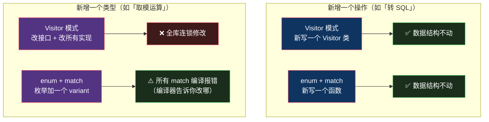
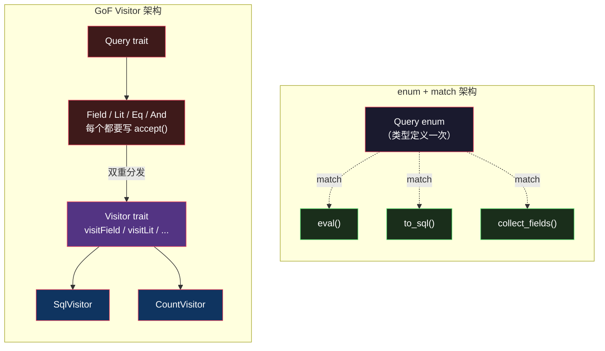
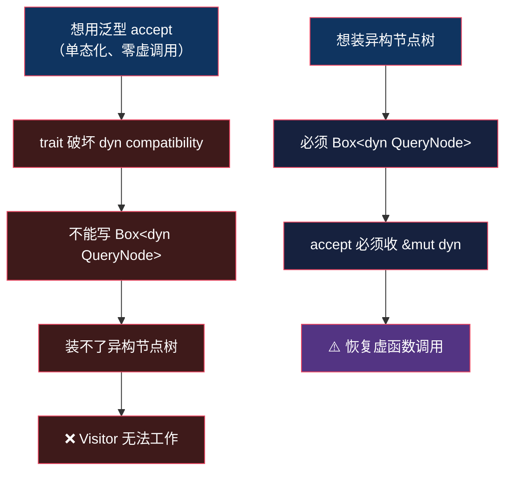

# Visitor 模式 — Rust 设计模式系列

> 系列：用 Rust 的类型系统重新审视 GoF 23 个设计模式。本文基于 Rust 1.95 稳定版。

## 生活比喻：体检车巡诊

社区里有几类居民：老人、儿童、孕妇。体检中心派医疗车来巡诊。

关键在于**谁动谁不动**：

- 居民待在原地，**不需要为每个科室内置一套流程**——不需要「老人自己实现抽血逻辑」
- 医生（Visitor）带着设备上门，对不同居民执行不同检查
- **新增一个科室**（比如眼科）→ 派一位新医生就行，居民一个都不用改 ✅
- **新增一类居民**（比如新增「残障人士」）→ **所有医生都得重新培训怎么处理** ❌

这就是 GoF Visitor 的本质：**把「操作」从「数据结构」里抽出来**，代价是操作和类型的耦合方向被反转了。

它擅长加操作，不擅长加类型。这个权衡有个正式名字——**表达式问题（Expression Problem）**，后面会展开。

而在 Rust 里，90% 的情况下你根本不需要这个模式——`enum` + `match` 直接就把问题解决了。

## GoF 的做法：双重分发

Java 里遍历一棵 AST 求值，得这么写：

```java
// 元素侧：每个类型都要实现 accept
interface Expr {
    <R> R accept(Visitor<R> v);
}

class Num implements Expr {
    double value;
    public <R> R accept(Visitor<R> v) { return v.visitNum(this); }
}

class Add implements Expr {
    Expr left, right;
    public <R> R accept(Visitor<R> v) { return v.visitAdd(this); }
}

// 访问者侧：一个操作 = 一个 Visitor 实现
interface Visitor<R> {
    R visitNum(Num n);
    R visitAdd(Add a);
}

class EvalVisitor implements Visitor<Double> {
    public Double visitNum(Num n) { return n.value; }
    public Double visitAdd(Add a) { return a.left.accept(this) + a.right.accept(this); }
}

// 使用
double result = expr.accept(new EvalVisitor());
```

**为什么要绕这一圈叫「双重分发」？**

因为 Java 的方法调用只能根据**一个**对象的运行时类型来选择。而这里需要同时知道「表达式是什么类型」和「访问者是什么类型」：


代价很直观：

1. **每个元素类型都要写一遍 `accept`**——纯样板代码，`Add`、`Mul`、`Div` 各来一遍
2. **加一个操作要改 Visitor 接口**——所有现有 Visitor 实现全部报错（Java 没有默认方法时）
3. **加一个类型要改所有 Visitor**——同样是全部报错，而且是**你的代码和第三方的代码一起报错**
4. **递归遍历的逻辑散落在每个 visit 方法里**——没有统一的地方能看清「树是怎么被走完的」

第 2 条和第 3 条正是那个权衡的两面：



注意右下角那格——**这是 Rust 和 Java 最大的分野**。

Java 里加一个类型，如果你漏改了某个 Visitor，可能要跑到线上才发现。Rust 里 `match` 是穷尽的，编译器会把所有没处理新 variant 的地方**全部列出来**。同样是「连锁修改」，一边是负担，一边是 checklist。

## Rust 的做法：enum + match

同样一棵 AST，Rust 版本：

```rust
#[derive(Debug, Clone)]
enum Expr {
    Num(f64),
    Add(Box<Expr>, Box<Expr>),
    Mul(Box<Expr>, Box<Expr>),
    Div(Box<Expr>, Box<Expr>),
}

/// 操作一：求值
fn eval(e: &Expr) -> f64 {
    match e {
        Expr::Num(n) => *n,
        Expr::Add(l, r) => eval(l) + eval(r),
        Expr::Mul(l, r) => eval(l) * eval(r),
        Expr::Div(l, r) => eval(l) / eval(r),
    }
}

/// 操作二：转成字符串（加操作 = 加一个函数，Expr 一行都不改）
fn to_infix(e: &Expr) -> String {
    match e {
        Expr::Num(n) => n.to_string(),
        Expr::Add(l, r) => format!("({} + {})", to_infix(l), to_infix(r)),
        Expr::Mul(l, r) => format!("({} * {})", to_infix(l), to_infix(r)),
        Expr::Div(l, r) => format!("({} / {})", to_infix(l), to_infix(r)),
    }
}
```

**没有一个 `accept`，没有一个 `visitXxx`，没有 Visitor 接口。**

GoF Visitor 想解决的「加操作不改数据结构」，Rust 用普通函数就做到了——因为数据结构和操作本来就在两个地方，函数天然可以定义在 `impl` 块外面。

**好在哪：**

- **不再需要双重分发**——`match` 一次就看全了「值的类型」，不需要先 accept 再 visit 绕两圈
- **递归结构一目了然**——整个遍历逻辑在一个函数里，不在 N 个 visit 方法之间跳来跳去
- **穷尽性检查**——忘了处理某个 variant 编译不过，这是 Visitor 给不了的
- **零成本**——`match` 编译成跳转表，没有虚函数调用

一句话：**GoF Visitor 是「没有 sum type 的语言」发明的补救措施。** Rust 有 `enum`，这个补救措施大部分时候就用不上了。

### 但「加类型」这件事，Rust 也不是白吃的

加一个 `Expr::Pow`：

```
error[E0004]: non-exhaustive patterns: `Expr::Pow(_, _)` not covered
  --> src/main.rs:12:11
   |
12 |     match e {
   |           ^ pattern `Expr::Pow(_, _)` not covered
```

编译器会把 `eval`、`to_infix`、以及将来所有写了 `match` 的地方一次列全。

**这是 Rust 版本真正优于 Visitor 的地方**：Java 里加类型，编译器只会告诉你「Visitor 接口变了，实现类要改」——至于你改的时候有没有漏掉某个 `visitPow` 的语义，它管不了。Rust 把「漏改」变成了「编译失败」。

代价是：**类型集合必须是封闭的**。这就是下一节的主题。

## 什么时候 Rust 真的需要 Visitor

`enum + match` 的前提是——**你能穷举所有类型**。有两种情况让这个前提不成立，但其中只有一种真的需要 Visitor。

### 情况一：类型集合开放（插件、第三方实现）——真需要

```rust
// 你提供一个 trait，第三方 crate 来实现它加新节点
pub trait Node {
    fn name(&self) -> &str;
}

// ❌ 无法 match —— 编译器不知道将来会有谁实现 Node
// ✅ 只能在 trait 上开一个口子，让操作方自己进来
pub trait NodeVisitor {
    fn visit_file(&mut self, n: &dyn Node);
    fn visit_dir(&mut self, n: &dyn Node);
}
```

（`Node` 和 `NodeVisitor` 互相引用，所以 `accept` 必须收 `dyn`——下面「反直觉的坑」会展开。）

这就是 `serde` 的处境——**反序列化器和被反序列化的类型，两边都是开放的**：

- `Deserializer` 有 JSON / YAML / TOML / MessagePack / bincode... 第三方随便加
- `Deserialize` 的实现遍布每一个用户结构体

两边都开放，`enum` 穷尽不了，**Visitor 是唯一解**。所以 serde 内部是货真价实的 Visitor。

下面是自己写一个 `Visitor` 的真实场景：配置项 `timeout` 既接受整数秒 `30`，也接受 `"5m"` 这种带单位的字符串。

```rust
/// 把 "30s" / "5m" / "2h" 解析成 Duration
fn parse_duration(s: &str) -> Result<Duration, String> {
    let (num, unit) = s.split_at(s.len() - 1);
    let n: u64 = num.parse().map_err(|_| format!("bad number: {num}"))?;
    match unit {
        "s" => Ok(Duration::from_secs(n)),
        "m" => Ok(Duration::from_secs(n * 60)),
        "h" => Ok(Duration::from_secs(n * 3600)),
        other => Err(format!("unknown unit: {other}")),
    }
}

/// Duration 和 Deserialize 都是外部类型（孤儿规则拦着），
/// 所以把 Visitor 收进一个模块，用 #[serde(with)] 挂上去
mod duration {
    use super::*;

    pub fn deserialize<'de, D: Deserializer<'de>>(d: D) -> Result<Duration, D::Error> {
        d.deserialize_any(DurationVisitor)
    }

    struct DurationVisitor;

    impl<'de> Visitor<'de> for DurationVisitor {
        type Value = Duration;

        // 报错信息里告诉用户「我能接受什么」
        fn expecting(&self, f: &mut fmt::Formatter) -> fmt::Result {
            f.write_str("秒数（整数）或 \"30s\" / \"5m\" 形式的字符串")
        }

        // 输入是数字 → 按秒解析
        fn visit_u64<E: de::Error>(self, v: u64) -> Result<Duration, E> {
            Ok(Duration::from_secs(v))
        }

        // 输入是字符串 → 按带单位的格式解析
        fn visit_str<E: de::Error>(self, v: &str) -> Result<Duration, E> {
            parse_duration(v).map_err(E::custom)
        }

        // 输入是别的类型（bool / 数组 / null...）→ 用 Visitor 的默认实现
        // 不写也能编译过，默认行为就是报错
    }
}

#[derive(Deserialize, Debug)]
struct Config {
    #[serde(deserialize_with = "duration::deserialize")]
    timeout: Duration,
}
```

跑起来（`serde_json` 1.0）：

```console
$ cargo run
int  -> 30s
str  -> 300s
err  -> invalid type: boolean `true`, expected 秒数（整数）或 "30s" / "5m" 形式的字符串 at line 1 column 16
```

最后一行值得注意——**你写在 `expecting()` 里的那句话，原封不动出现在了用户看到的报错里**。这是 Visitor 在 Rust 里少见的「正面收益」：错误信息的所有权在你手上。

`Visitor` 的方法有**默认实现**——它有二十多个 `visit_*` 方法（`visit_bool` / `visit_seq` / `visit_map`...），你只覆写关心的那两个，其余全部走默认的「类型不匹配」报错。

这是 Rust 对 GoF Visitor 的一处改良：Java 接口加方法会让所有实现类报错，Rust 的 trait 默认方法让 Visitor 可以「只关心我在意的那几种类型」。

### 情况二：跨 crate 给已有类型加操作——不需要

这种情况常被误判成「需要 Visitor」：类型来自 `dep-a`，你想给它加个操作，但孤儿规则不允许你写 `impl`。

看起来挺像 Visitor 的处境——「数据结构在别处，我只想加操作」。**但解法是自由函数，不是 Visitor**：

```rust
// Expr 来自 dep-a，你 impl 不了它
// 那就写自由函数接收它 —— 和 Visitor 的「操作与数据分离」是一回事
fn count_nodes(e: &Expr) -> usize {
    match e { /* ... */ }
}
```

区别在于：只要 `Expr` 的类型集合是封闭的（哪怕它定义在别人的 crate 里），`match` 照样能穷尽、照样有穷尽性检查。**Visitor 的价值从来不在于「操作写在外面」，而在于「类型集合无法穷举」。** 前者自由函数就够，后者才真的需要 Visitor。

### 什么时候不用 Visitor

| 你的需求 | 更 Rust 的做法 |
|---------|---------------|
| 只是想遍历集合 | `Iterator`（[已写过](iterator.md)） |
| 只是想转换/构造 | `From` / `Into` / `TryFrom` |
| 只是想格式化输出 | `Display` / `Debug` |
| 只是想序列化 | 派生 `Serialize` / `Deserialize` |
| 只是想做多态分派 | trait 对象 `Box<dyn Trait>`（[已写过](../../languages/rust/box-dyn.md)） |

**经验法则：先问「类型集合封闭吗」。** 封闭就用 `enum + match`，把 Visitor 这个词从脑子里删掉；开放才考虑 trait 版本。

## 实战：AST 的多操作导出

一个查询表达式 AST，需要三种输出：求值、转 SQL、收集引用到的字段名。

### 方案 A：enum + match（推荐）

```rust
use std::collections::BTreeSet;

#[derive(Debug, Clone)]
enum Query {
    Field(String),                              // name
    Lit(i64),                                   // 42
    Eq(Box<Query>, Box<Query>),                 // a = b
    And(Box<Query>, Box<Query>),                // a AND b
}

// ---- 操作 1：求值（对字面量表达式） ----
fn eval(q: &Query) -> Option<i64> {
    match q {
        Query::Lit(n) => Some(*n),
        Query::Field(_) => None,                // 字段值未知，无法求值
        Query::Eq(a, b) => Some((eval(a)? == eval(b)?) as i64),
        Query::And(a, b) => {
            // 短路：左边为假就不看右边
            if eval(a)? == 0 { Some(0) } else { Some((eval(b)? != 0) as i64) }
        }
    }
}

// ---- 操作 2：转 SQL（新增操作，Query 一行不改） ----
fn to_sql(q: &Query) -> String {
    match q {
        Query::Field(name) => format!("\"{name}\""),
        Query::Lit(n) => n.to_string(),
        Query::Eq(a, b) => format!("({} = {})", to_sql(a), to_sql(b)),
        Query::And(a, b) => format!("({} AND {})", to_sql(a), to_sql(b)),
    }
}

// ---- 操作 3：收集字段名（又是一个新操作，Query 依然不改） ----
fn collect_fields(q: &Query, out: &mut BTreeSet<String>) {
    match q {
        Query::Field(name) => { out.insert(name.clone()); }
        Query::Lit(_) => {}
        Query::Eq(a, b) | Query::And(a, b) => {
            collect_fields(a, out);             // or-pattern 合并分支
            collect_fields(b, out);
        }
    }
}

fn main() {
    // query: (age = 18) AND (city = "SH")
    let q = Query::And(
        Box::new(Query::Eq(
            Box::new(Query::Field("age".into())),
            Box::new(Query::Lit(18)),
        )),
        Box::new(Query::Eq(
            Box::new(Query::Field("city".into())),
            Box::new(Query::Lit(42)),           // 用 42 占位，真实场景是字符串
        )),
    );

    println!("{}", to_sql(&q));                 // (("age" = 18) AND ("city" = 42))

    let mut fields = BTreeSet::new();
    collect_fields(&q, &mut fields);
    println!("{:?}", fields);                   // {"age", "city"}
}
```

**三个操作，`Query` 定义一次，全程没改过。** 这正是 Visitor 的卖点，而这里一个 Visitor 类都没有。

用图看两种架构的差别：



左边：N 个操作 = N 条虚线，全部指向同一个类型定义。右边：多出来的 `accept` 和 `Visitor` 接口，是为了在**没有 sum type 的语言里**表达左边的结构。

### 方案 B：真要 trait 版 Visitor 的样子

如果 `Query` 的类型集合必须开放（比如要做成可扩展的规则引擎，第三方 crate 能加新的节点类型），才需要退回 Visitor。附上骨架供对照：

```rust
/// 元素侧：每个节点类型实现一次（注意签名，下面细说）
pub trait QueryNode {
    fn accept(&self, v: &mut dyn QueryVisitor);
}

/// 访问者侧：一个操作 = 一个实现
/// 关键改良：全部给默认实现，子类只覆写关心的类型
pub trait QueryVisitor {
    fn visit_field(&mut self, _name: &str) {}
    fn visit_lit(&mut self, _n: i64) {}
    fn visit_eq(&mut self, _l: &dyn QueryNode, _r: &dyn QueryNode) {}
    fn visit_and(&mut self, _l: &dyn QueryNode, _r: &dyn QueryNode) {}
}
```

### 这里有个反直觉的坑

写 Rust 版 Visitor 时，第一反应都会把 `accept` 写成泛型——用静态分发省掉虚函数调用：

```rust
// ❌ 编译不过
pub trait QueryNode {
    fn accept<V: QueryVisitor>(&self, v: &mut V);
    //   ^^^^^^ method `accept` has generic type parameters
}
```

报错是 `the trait QueryNode is not dyn compatible`。原因：**trait 一旦有泛型方法，就不能再写 `Box<dyn QueryNode>`**——泛型方法意味着「每个 `V` 生成一份实现」，编译器没法为它生成一张固定大小的 vtable。

而这里恰好**必须**用 `Box<dyn QueryNode>`——Visitor 模式存在的意义就是「类型集合开放」，一棵混着 `Field` / `Lit` / `Eq` 的树，节点类型是异构的，只能装箱。

两个诉求直接冲突：



**绕一圈，又回到同一个岔路口：**

- 要异构集合 → `accept` 只能收 `dyn`，虚函数调用跑不掉
- 要零开销单态化 → 元素类型必须编译期可穷举 → 那还不如直接 `enum + match`

这也从侧面解释了为什么 Rust 社区里 Visitor 用得少：它的两个适用形态，**一个被 `enum` 覆盖了，另一个的性能优势在 Rust 里并不成立**。

## 骨架代码

```rust
// ========== 1. 封闭类型集合：用 enum，不要 Visitor ==========
enum Shape {
    Circle { r: f64 },
    Rect { w: f64, h: f64 },
}

impl Shape {
    fn area(&self) -> f64 {
        match self {
            Shape::Circle { r } => std::f64::consts::PI * r * r,
            Shape::Rect { w, h } => w * h,
        }
    }
}
// 加操作：在别的 impl 块或自由函数里继续 match，Shape 定义不动
// 加类型：Shape 加 variant，所有 match 编译报错 —— 这是好事

// ========== 2. 开放类型集合：真 Visitor（可运行） ==========
// 元素侧 —— 第三方实现这个 trait 加新节点
// 注意 accept 收的是 &mut dyn，不是泛型（否则破坏对象安全）
pub trait Node {
    fn accept(&self, v: &mut dyn NodeVisitor);
}

// 访问者侧 —— 全部给默认实现，只覆写关心的
pub trait NodeVisitor {
    fn visit_leaf(&mut self, _v: &str) {}
    fn visit_branch(&mut self, _children: &[Box<dyn Node>]) {}
}

struct Leaf(String);
impl Node for Leaf {
    fn accept(&self, v: &mut dyn NodeVisitor) { v.visit_leaf(&self.0) }
}

struct Branch(Vec<Box<dyn Node>>);
impl Node for Branch {
    fn accept(&self, v: &mut dyn NodeVisitor) { v.visit_branch(&self.0) }
}

// 一个操作 = 一个 struct，Node 的定义不动
struct LeafCounter(usize);
impl NodeVisitor for LeafCounter {
    fn visit_leaf(&mut self, _v: &str) { self.0 += 1; }
    fn visit_branch(&mut self, children: &[Box<dyn Node>]) {
        for c in children { c.accept(self); }   // 递归分发，回到元素侧
    }
}

// ========== 3. 最小可用的 serde Visitor 骨架 ==========
use serde::de::{self, Visitor};
use std::fmt;

struct MyVisitor;

impl<'de> Visitor<'de> for MyVisitor {
    type Value = MyType;

    fn expecting(&self, f: &mut fmt::Formatter) -> fmt::Result {
        f.write_str("字符串或整数")
    }

    fn visit_str<E: de::Error>(self, v: &str) -> Result<MyType, E> {
        MyType::from_str(v).map_err(E::custom)
    }
    // visit_u64 / visit_seq / visit_map 都有默认实现，不关心就不写
}
```

## 总结

| 维度 | GoF Visitor | Rust `enum + match` |
|------|-------------|---------------------|
| 加操作 | ✅ 新写 Visitor 类 | ✅ 新写函数 |
| 加类型 | ❌ 改接口，所有实现连锁报错且易漏 | ⚠️ 编译报错，编译器列出全部待改点 |
| 类型集合 | 开放封闭都能跑，但封闭时是杀鸡用牛刀 | **必须封闭**（能穷举才能 `match`） |
| 分发方式 | 双重分发（多态 + 重载） | 单次 `match` |
| 遍历逻辑 | 散落在各 visit 方法 | 集中在一个函数 |
| 样板代码 | 每个元素一个 `accept` | 无 |
| 运行时开销 | 虚函数调用 | 跳转表 / 内联 |

**核心结论：Visitor 是「缺少 sum type 的语言」为「给封闭类型集合加操作」发明的绕路方案。** Rust 有 `enum`，有穷尽性检查，这条绕路在绝大多数场景下可以直接走直线。

真正还需要 Visitor 的场景只有一个特征：**被访问的类型集合是开放的**——serde 就是最好的例子。判断标准很清晰，问自己一句：

> 我能在编译期把所有类型写进一个 `enum` 吗？

- 能 → 用 `enum + match`，忘掉 Visitor
- 不能 → 用 trait 版 Visitor，并给它默认实现

---

**系列进度：15/23。**下一篇写 Chain of Responsibility——在 Rust 里它是 `Iterator + fold`，也是 axum / tower 中间件链的原型。
