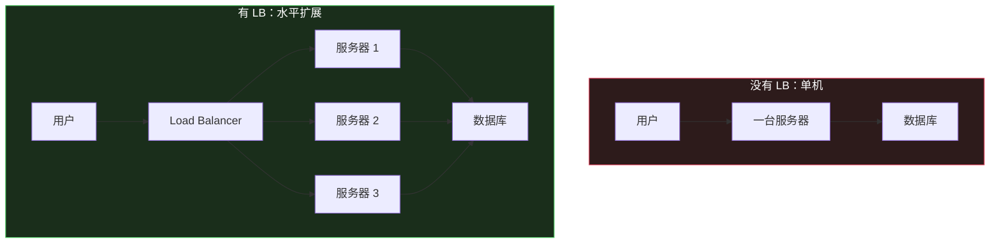
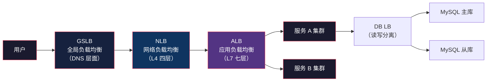
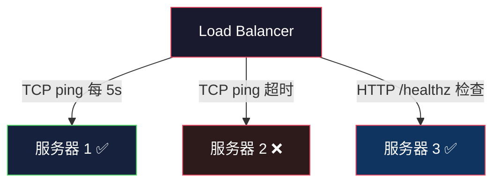

# Load Balancer：流量分发的第一道闸门

> System Design 架构地图系列第 1 篇。系列总览见 [index.md](index.md)。

## 生活比喻：医院的分诊台

一家医院如果只有一个医生，病人再多也忙不过来。分诊台就是医院的 Load Balancer：

- 病人来了先到分诊台（请求先到 LB）
- 分诊台根据每个医生的忙碌程度分配（调度算法）
- 某位医生生病了，病人自动转到别的医生（健康检查）
- 病人不知道也不关心自己看了哪个医生（透明）

## 为什么需要 Load Balancer



Load Balancer 解决三个问题：

| 问题 | 没有 LB | 有 LB |
|------|--------|-------|
| 容量 | 单机上限 | 加机器就能扩 |
| 可用性 | 机器挂了全挂 | 自动摘除故障机器 |
| 入口 | 用户直连服务器 | 统一入口 |

## 分层：LB 无处不在

负载均衡不是只有一层，而是贯穿整个链路：



## L4 vs L7：两种核心负载均衡

| 维度 | L4（传输层） | L7（应用层） |
|------|-------------|-------------|
| 依据 | IP + 端口 | URL + Header + Cookie |
| 性能 | 极高（不解析内容） | 低一些（要解析 HTTP） |
| 能力 | 只转发 | 可按路径/域名/Header 路由 |
| 典型产品 | LVS、HAProxy(tcp)、NLB | Nginx、HAProxy(http)、ALB |

**怎么选：** 追求极致性能选 L4；需要智能路由（/api 走 A 集群、/web 走 B 集群）选 L7。实践中常用 L4 挡流量入口，L7 做应用内路由。

## 调度算法

### 1. Round Robin（轮询）

```
请求 1 → 服务器 A
请求 2 → 服务器 B
请求 3 → 服务器 A
```

最简单，适合服务器配置相同的场景。加权轮询（Weighted RR）可解决机器强弱不均。

### 2. Least Connections（最少连接）

新请求发给当前连接数最少的服务器。适合请求耗时差异大的场景——有的请求是长连接（WebSocket），有的请求一瞬间完成，轮询会导致长连接堆积。

### 3. IP Hash（一致性哈希）

按客户端 IP 哈希分配，同一个用户总是打到同一台服务器。适合**有状态**服务（session 在本地内存）。

### 4. 一致性哈希

服务器增减时只影响少量 key 的映射，缓存场景的标配（详见 Sharding 篇）。

## 健康检查

LB 必须知道哪些服务器是活的，否则会把请求发给挂掉的机器：



| 检查方式 | 原理 | 优点 | 缺点 |
|---------|------|------|------|
| TCP 检查 | 能否建立 TCP 连接 | 简单 | 应用挂了也能连上 |
| HTTP 检查 | GET /healthz 返回 200 | 检查到应用层 | 应用要自己实现 |
| 自定义脚本 | 检查依赖（DB、Redis） | 最真实 | 复杂 |

**最佳实践：** 应用实现 `/healthz` 接口，内部检查数据库连接、缓存连接等关键依赖——依赖挂了就该从 LB 摘除。

## 关键问题：会话保持

HTTP 是无状态的，但业务往往有状态——用户登录后 session 存在某台服务器的内存里。如果下次请求被转发到别的服务器，用户就掉线了。

三种解法：

| 方案 | 原理 | 代价 |
|------|------|------|
| 粘性会话 | LB 记住用户 → 固定一台 | 这台挂了 session 就丢 |
| 共享存储 | session 存 Redis | Redis 成为依赖 |
| JWT/无状态 | 状态放 token 里 | 无法主动失效 |

**演进方向是第三条**——让服务器尽量无状态，session 外置（Redis）或内嵌（JWT）。服务器无状态后才能自由扩缩容，这是微服务的基石（见第 10 篇）。

## 实战：Nginx 做 L7 负载均衡

```nginx
upstream backend {
    # 最少连接 + 权重
    least_conn;
    server 10.0.0.1:8080 weight=3;   # 强机器，权重高
    server 10.0.0.2:8080 weight=1;   # 弱机器，权重低

    # 健康检查
    check interval=5000 rise=2 fall=3;
}

server {
    listen 80;

    # 按路径路由
    location /api/ {
        proxy_pass http://backend;
    }

    location /static/ {
        proxy_pass http://static-servers;
    }
}
```

## 与架构地图的衔接


Load Balancer 是整个架构地图的第一块拼图——它让"多台服务器"成为可能。但光有 LB，数据库会成为新的瓶颈，下一篇开始解决数据面的问题。

## 总结

| 决策点 | 要点 |
|--------|------|
| 在哪一层 | L4 挡入口流量，L7 做应用路由 |
| 什么算法 | 无状态用轮询；长连接用最少连接；有状态用哈希 |
| 怎么保活 | 应用实现 /healthz，检查真实依赖 |
| 状态怎么办 | 优先无状态化，session 外置 Redis 或 JWT |
