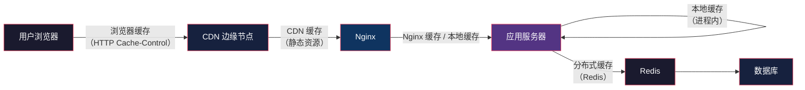
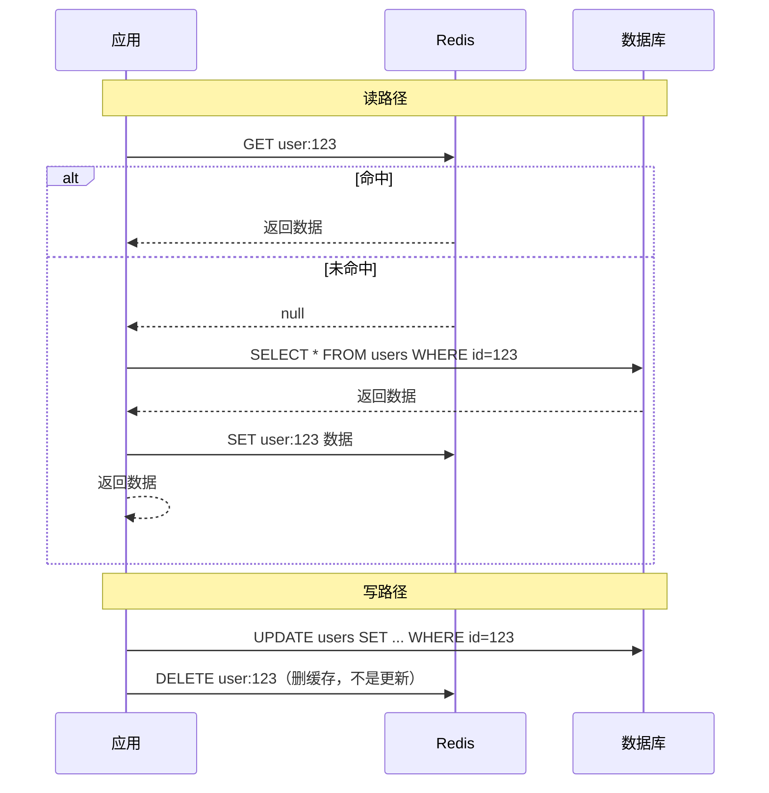
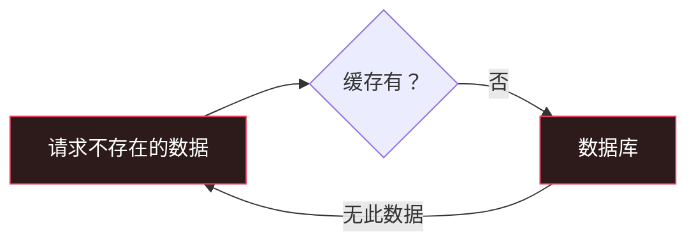
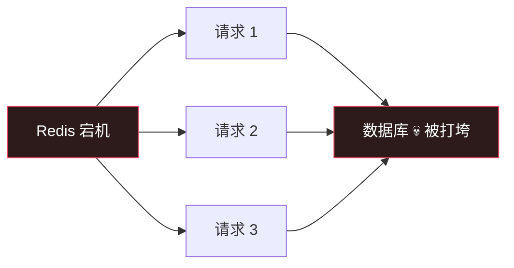

# Cache：把热数据放在手边

> System Design 架构地图系列第 2 篇。系列总览见 [index.md](index.md)。

## 生活比喻：厨房里的调料架

做饭时，盐、酱油放在灶台边随手拿；整袋大米放在储物间，用完了才去取。如果每次放盐都跑一趟储物间，做饭会慢得没法忍。

Cache 就是灶台边的调料架——**把高频访问的数据放在离计算最近的地方**。

访问速度的差距是数量级的：

| 存储 | 访问延迟 | 比喻 |
|------|---------|------|
| CPU 寄存器 | ~1ns | 大脑记忆 |
| L1/L2/L3 Cache | ~1-40ns | 条件反射 |
| 内存（Redis） | ~100ns | 灶台调料架 |
| SSD | ~100μs | 储物间 |
| 网络 + 数据库 | ~1-10ms | 去超市买 |

**核心思想：缓存是拿空间换时间，拿一致性换速度。**

## 缓存的分层

缓存不只是 Redis——整条链路上每一层都有缓存：



每一层缓存命中，就少穿透一层。**缓存命中率是衡量架构水平的核心指标。**

## 缓存模式：读路径

### Cache-Aside（旁路缓存）——最常用



**为什么写路径要"删缓存"而不是"更新缓存"？**

1. **更新是浪费**——更新的数据可能永远不被读
2. **并发脏写**——两个线程同时更新缓存，后写覆盖先写，但 DB 顺序可能相反
3. **删缓存更简单**——下次读自然 miss，从 DB 拉最新数据

### Read-Through（读穿透）

应用只跟缓存打交道，缓存未命中时缓存自己回源数据库。应用代码更简单，但缓存层要做回源逻辑。

## 缓存模式：写路径

| 模式 | 做法 | 风险 |
|------|------|------|
| Write-Through | 先写缓存，同步写 DB | 写延迟高，多一层故障点 |
| Write-Back | 先写缓存，异步刷 DB | **宕机丢数据** |
| Write-Around | 直接写 DB，缓存旁路 | 配合 Cache-Aside 最常用 |

**结论：绝大多数场景用 Cache-Aside。** Write-Back 只用在能容忍丢数据的场景（计数、日志）。

## 三大经典问题

### 1. 缓存穿透

**症状：** 查询一个不存在的 key，每次都打到数据库——缓存形同虚设。

**场景：** 攻击者用随机 ID 查用户，所有请求都 miss。



**解法：**

| 方案 | 原理 |
|------|------|
| 缓存空值 | 查不到也 SET 一个空值（TTL 短），挡住重复查询 |
| 布隆过滤器 | 请求先过 Bloom Filter，不存在的直接拒绝 |
| 参数校验 | 非法参数在入口就拦截 |

### 2. 缓存击穿

**症状：** 一个**热点 key** 恰好过期，大量并发请求同时打到数据库。

**场景：** 微博热搜词条的缓存过期瞬间，千万请求涌入。

**解法：**

| 方案 | 原理 |
|------|------|
| 互斥锁 | 只有一个请求去回源，其他请求等待或返回旧值 |
| 逻辑过期 | key 永不过期，后台异步刷新（适合热点数据） |
| 热点延长 | 预判热点，手动延长 TTL |

### 3. 缓存雪崩

**症状：** **大量 key 同时过期**，或 Redis 整体宕机，所有请求直达数据库，数据库被打垮。



**解法：**

| 方案 | 原理 |
|------|------|
| TTL 加随机值 | 防止同时过期：`TTL + random(0, 300s)` |
| 集群高可用 | Redis Cluster / 主从 + 哨兵 |
| 本地兜底 | 服务本地缓存扛住 Redis 宕机的空窗 |
| 限流降级 | 数据库侧限流，保护最后一道防线 |

## 缓存一致性：CAP 的缩影

缓存和数据库的一致性，本质是**两个存储之间无法原子更新**。想要强一致（读必读到最新），只能：

- **删缓存后，读到旧值的窗口内接受短暂不一致**
- 或引入版本号/订阅 binlog 双删

**架构上的现实选择：接受最终一致，缩短不一致窗口。**

## 实战：本地缓存 + Redis 两级缓存

```python
from functools import lru_cache
import redis

r = redis.Redis()

# 本地缓存（L1）：进程内，最快，但每台机器各有一份
@lru_cache(maxsize=1024, ttl=5)
def get_user_local(user_id):
    return get_user_redis(user_id)

# Redis 缓存（L2）：跨机器共享，TTL 随机化防雪崩
def get_user_redis(user_id):
    import random
    key = f"user:{user_id}"
    val = r.get(key)
    if val is None:
        val = get_user_db(user_id)      # 回源
        ttl = 300 + random.randint(0, 300)  # TTL 加随机值
        r.setex(key, ttl, val)
        if val is None:
            r.setex(key, 60, "")        # 缓存空值防穿透
    return val
```

## 与架构地图的衔接

缓存解决了"读多写少"场景的数据库压力，但还有两类问题没解决：

1. **静态资源全球加速** → 第 3 篇 CDN
2. **写多、数据量大** → 第 4 篇 Database Scaling

缓存是"让已有的机器干更少的活"，而数据库扩展是"让机器能干更多的活"。

## 总结

| 决策点 | 要点 |
|--------|------|
| 放哪层 | 越靠近用户越好：浏览器 → CDN → Nginx → 进程 → Redis |
| 什么模式 | 读用 Cache-Aside，写用 Write-Around + 删缓存 |
| 三大坑 | 穿透（空值/布隆）、击穿（互斥锁/逻辑过期）、雪崩（TTL 随机） |
| 一致性 | 接受最终一致，缩短不一致窗口 |
