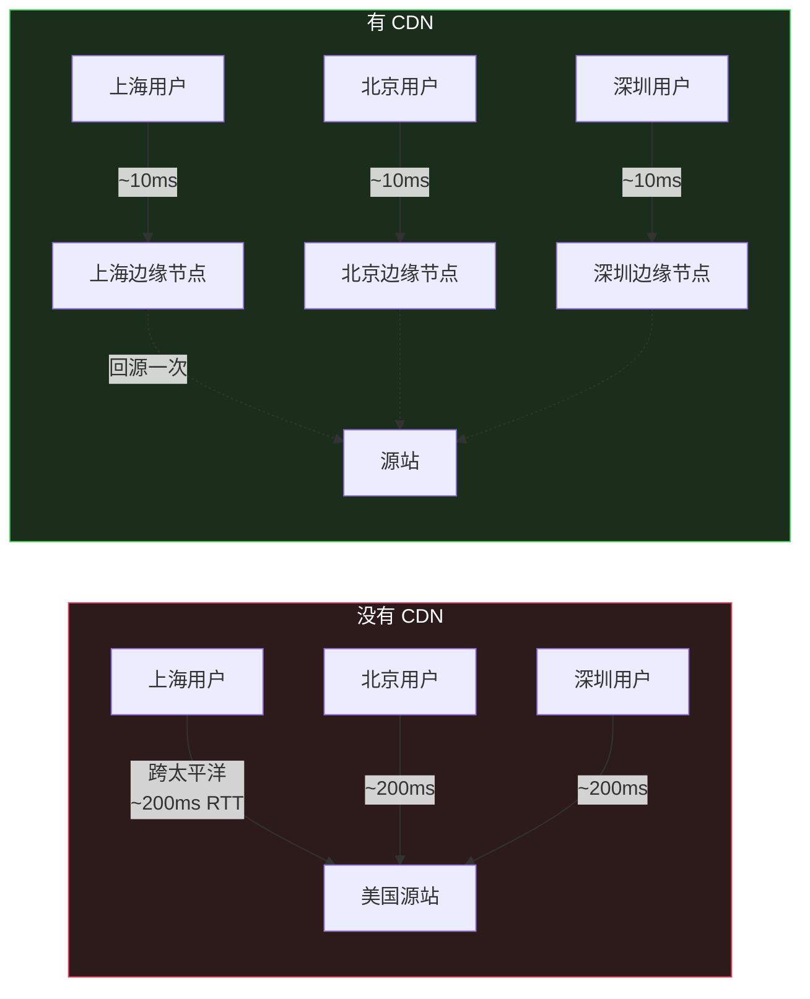
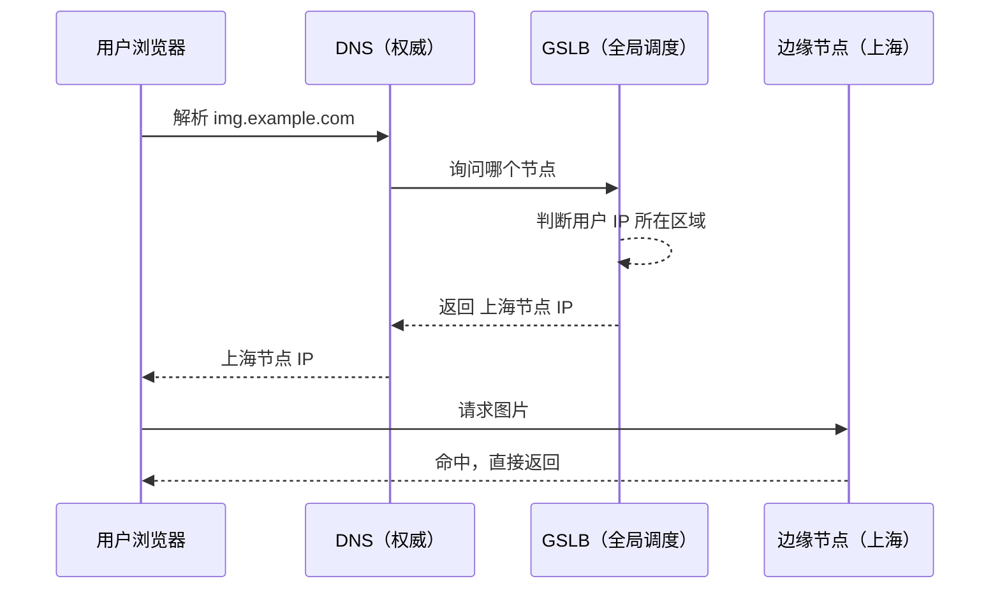
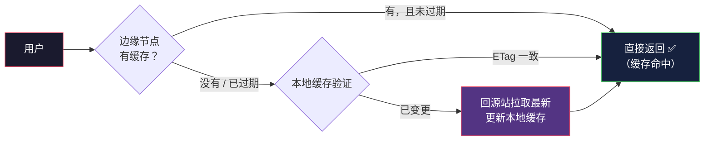
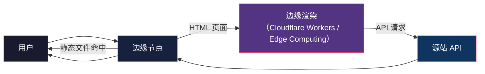

# CDN：把内容搬到用户门口

> System Design 架构地图系列第 3 篇。系列总览见 [index.md](index.md)。

## 生活比喻：连锁便利店 vs 中央仓库

品牌商把货存在一个中央仓库，全国用户都来买——运费贵、配送慢。于是他们在每个城市开连锁便利店，把热销品提前铺到店里。用户下楼就能买到，只有便利店缺货时才去中央仓库调货。

- 中央仓库 = 源站（Origin Server）
- 便利店 = CDN 边缘节点（Edge/PoP，Point of Presence）
- 铺货 = 缓存预热

**CDN = 内容分发网络——把静态内容缓存到离用户最近的节点。**

## 为什么需要 CDN



光速是有限的，物理距离决定网络延迟。CDN 解决的第一个问题不是带宽，是**距离**。

## CDN 缓存什么

| 内容类型 | 例子 | 适合 CDN？ |
|---------|------|-----------|
| 静态文件 | 图片、CSS、JS、视频 | ✅ 完全适合 |
| 动态页面 | 用户个性化页面 | ❌ 不适合 |
| 半动态 | 新闻页、商品页 | ⚠️ 边缘渲染/缓存部分 |

**判断标准：内容是否全局相同 + 变化频率低。** 头像图片、商品图、App 安装包是 CDN 的最佳客户。

## CDN 工作原理

### 1. DNS 解析引导（GSLB）



GSLB（Global Server Load Balancing）根据**用户来源 IP + 节点负载**返回最优节点。这就是为什么"CDN 配置后要等 DNS 生效"。

### 2. 缓存回源



## 缓存失效：CDN 最大的坑

源站更新了文件，但用户拿到的还是旧缓存。四种解法：

| 方案 | 原理 | 缺点 |
|------|------|------|
| TTL | 文件设置有效期 | 更新要等 TTL 到期 |
| 主动刷新 | API 通知 CDN 清缓存 | 依赖厂商 API |
| 版本号 Query | `app.js?v=2` | URL 变化，天然绕过缓存 |
| 指纹文件名 | `app.8f3d2c.js` | 构建时生成，内容变名字变 |

**工程上最常用的是指纹文件名**——文件内容不变就用旧缓存，变了名字也变了，天然不会命中旧缓存：

```html
<!-- 每次构建生成新的指纹 -->
<script src="/static/app.8f3d2c1a.js"></script>
<script src="/static/app.9b2e4d77.js"></script>
```

## 动态内容的 CDN 化

CDN 不只是静态文件缓存，现代 CDN 还能处理动态请求：



Cloudflare 的 Workers、AWS Lambda@Edge 把计算推到边缘——HTML 在边缘节点渲染，源站只承担 API。

## CDN 的其他职责

| 能力 | 说明 |
|------|------|
| DDoS 防护 | 流量先打到 CDN，源站 IP 被隐藏 |
| HTTPS | 边缘终结 TLS，免费证书 |
| 图片处理 | ?w=100&format=webp 实时缩放 |
| 安全 | WAF 规则在边缘拦截 |
| 日志分析 | 每节点访问日志聚合 |

**安全上有个关键点：源站 IP 必须保密。** 如果源站 IP 泄露，攻击者绕过 CDN 直打源站，所有防护失效。

## 实战：缓存头设置

CDN 是否缓存、缓存多久，由 HTTP 头控制：

```http
# 静态资源：强缓存 + 指纹
Cache-Control: public, max-age=31536000, immutable
ETag: "8f3d2c1a"

# HTML：不缓存或短缓存
Cache-Control: no-cache

# API 响应：短缓存（5 分钟）
Cache-Control: public, max-age=300
```

CDN 厂商都遵循标准 HTTP 缓存语义，理解这几个头就能控制所有 CDN 行为。

## 与架构地图的衔接

CDN 解决了**静态内容**的全球分发。但用户请求最终还要打到源站，源站背后真正的瓶颈是数据库——写多读多、数据超单机容量，这些靠缓存和 CDN 都解决不了。第 4 篇进入数据库扩展。

## 总结

| 决策点 | 要点 |
|--------|------|
| 缓存什么 | 全局相同 + 低变更的静态内容 |
| 怎么找节点 | GSLB 按用户 IP 就近返回 |
| 怎么失效 | 指纹文件名 > 版本号 > 主动刷新 > TTL |
| 动态内容 | 边缘渲染 + 源站只留 API |
| 安全 | 源站 IP 保密，CDN 挡 DDoS |
