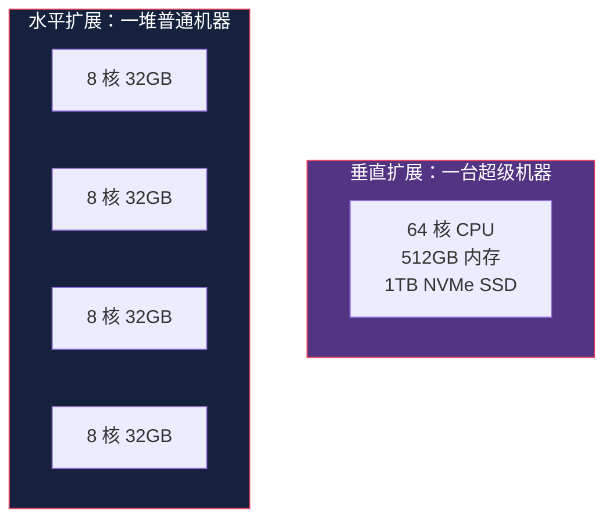
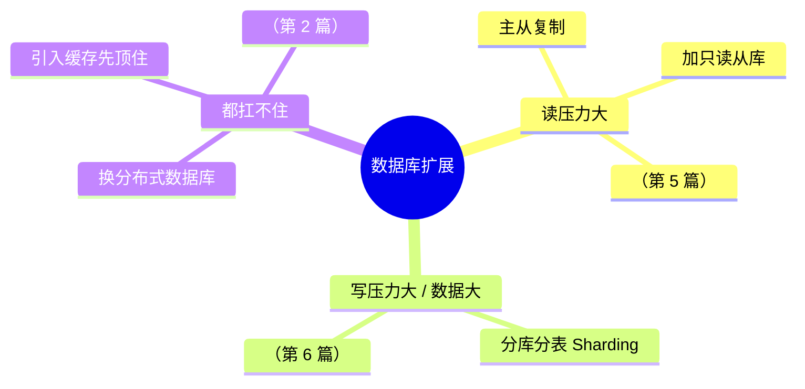
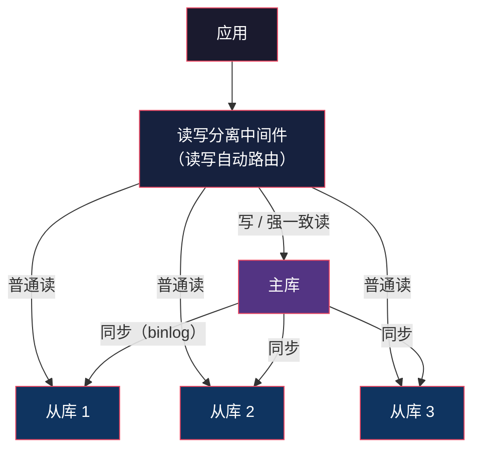
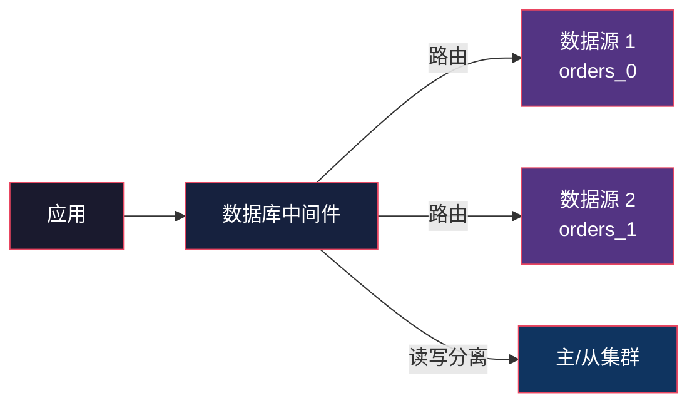

# Database Scaling：数据库扛不住怎么办

> System Design 架构地图系列第 4 篇。系列总览见 [index.md](index.md)。

## 生活比喻：一家饭店的成长

一家小饭店从 10 桌做到 1000 桌：

- **桌椅加宽**（垂直扩展）——换更大的店面，但店面总有上限
- **厨房加人**（水平扩展）——一个厨房变多个厨房，但要解决"菜怎么分"的问题

数据库扩展就是饭店的成长之路。**任何架构的瓶颈最终都会落在数据库上**——应用服务器可以无限加，数据库不能无限加。

## 两种扩展方式

| 维度 | 垂直扩展（Scale Up） | 水平扩展（Scale Out） |
|------|---------------------|---------------------|
| 做法 | 换更大的机器（CPU/内存/SSD） | 加更多机器 |
| 上限 | **物理上限**（最强机器也就那样） | 理论上无限 |
| 停机 | 需要停机迁移 | 可滚动扩展 |
| 成本 | 机器越贵性价比越低 | 普通机器便宜 |
| 复杂度 | 无 | 高（分片、复制、一致性） |



**正确的路径：先用垂直扩展撑到物理/成本极限，再转水平扩展。** 大多数业务在单机就能撑很久——过早分片是过度设计。

## 数据库瓶颈的本质

数据库瓶颈来自三件事：

```
1. 读的压力     → 请求太多，单机 CPU/IO 打满
2. 写的压力     → 写入太多，单机无法并行写
3. 容量压力     → 数据量太大，超过单机磁盘/内存
```

对应三种解法，复杂度递增：



## 先做免费的优化（在扩展之前）

加机器之前，先确认单机潜力用尽了：

| 优化 | 效果 | 成本 |
|------|------|------|
| 索引优化 | 查询从全表扫到索引跳 | 低 |
| 缓存（见第 2 篇） | 读请求不进 DB | 低 |
| 连接池调优 | 减少连接建立开销 | 低 |
| 慢查询治理 | 找出隐藏的全表扫描 | 低 |
| 冷热分离 | 旧数据归档到廉价存储 | 中 |

**扩展是有成本的，先做低成本优化是架构纪律。**

## 读写分离：第一级水平扩展

读多写少是绝大多数业务的形态（9:1 甚至更高），所以第一级扩展是**读写分离**：



读写分离能扛住读的扩展，但引入一个新问题：**主从延迟**——刚写入的数据，从库可能还没同步到。


解法（写后读一致性）：

| 方案 | 原理 |
|------|------|
| 主库直读 | 刚写完的请求强制读主库（如登录后读自己资料） |
| 延迟可接受 | 大部分读容忍几百 ms 延迟 |
| 半同步复制 | 至少一个从库确认后才返回写成功 |

**详细的主从同步机制在下一篇文章（Replication）。**

## 数据库中间件

读写分离和分库分表都需要**路由逻辑**——应用不该自己判断走主还是走从、查哪张表。于是有中间件层：

| 中间件 | 语言 | 能力 |
|--------|------|------|
| ProxySQL | C++ | 读写分离、查询路由 |
| MyCat | Java | 分库分表 |
| ShardingSphere | Java | 读写分离 + 分库分表 + 数据脱敏 |
| Vitess | Go | YouTube 的 MySQL 集群方案 |



**用中间件的核心原因：让应用无感知数据分布。** 路由规则变了只改中间件，不动应用代码。

## 什么时候该考虑分布式数据库

传统方案（主从 + 分片）做到极致后仍然吃力，就该考虑换引擎：

| 分布式数据库 | 特点 | 适合 |
|-------------|------|------|
| TiDB | MySQL 协议兼容，自动分片 | MySQL 用户平滑迁移 |
| CockroachDB | PostgreSQL 协议，全球分布 | 多地域写入 |
| YugabyteDB | PostgreSQL 兼容 | 强一致 |
| Aurora（AWS） | 存储与计算分离 | 云上 MySQL |

**决策标准：当你在手动分片上花的维护时间，超过了用分布式数据库的成本时，就该换了。**

## 与架构地图的衔接

Database Scaling 是"为什么"，Replication 和 Sharding 是"怎么做"：

| 压力类型 | 解法 | 详见 |
|---------|------|------|
| 读压力 | 主从复制（读写分离） | 第 5 篇 Replication |
| 写/容量压力 | 分片（水平拆分数据） | 第 6 篇 Sharding |

## 总结

| 决策点 | 要点 |
|--------|------|
| 先做啥 | 索引、缓存、慢查询——免费的先拿 |
| 读压力 | 主从复制 + 读写分离（最常用） |
| 写/容量压力 | 分片（第 6 篇） |
| 应用怎么感知 | 中间件层路由，应用无感知 |
| 何时换引擎 | 手动分片维护成本 > 分布式数据库成本 |
