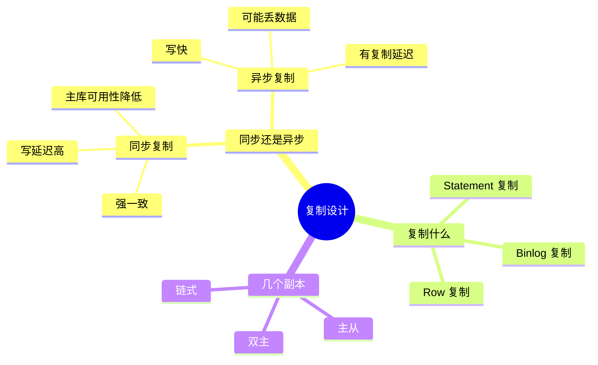
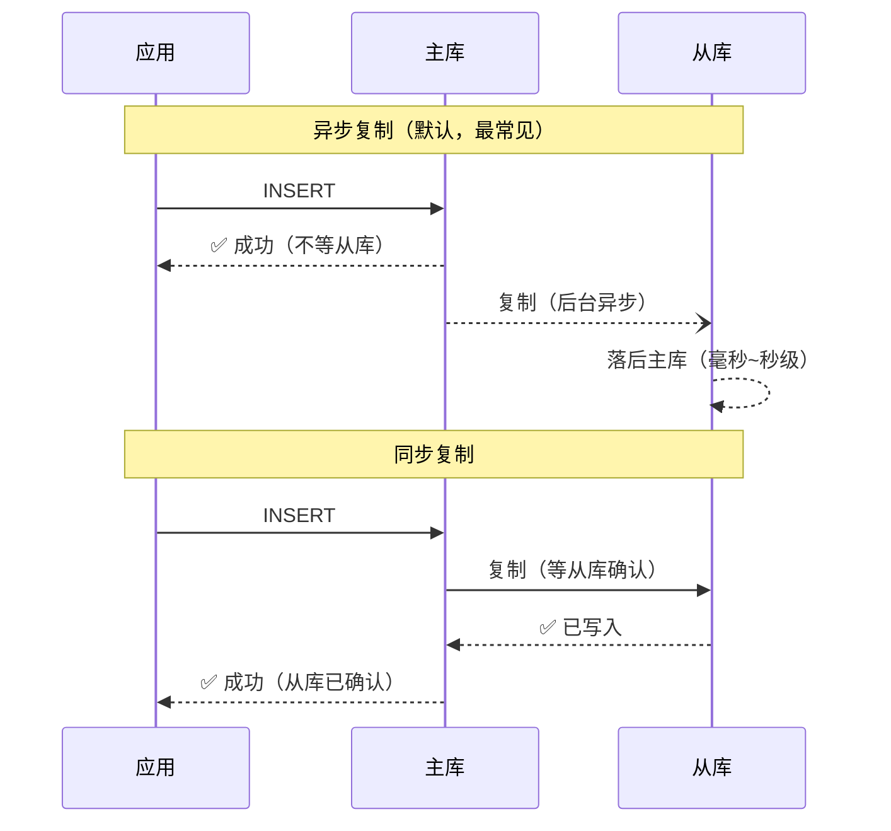
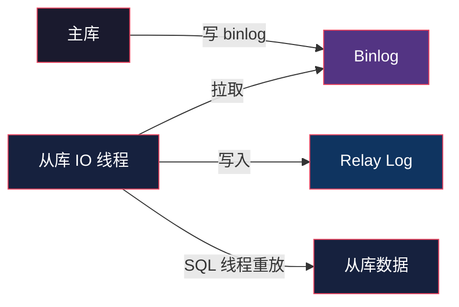
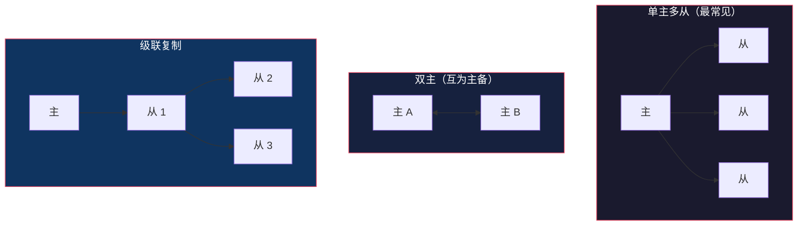
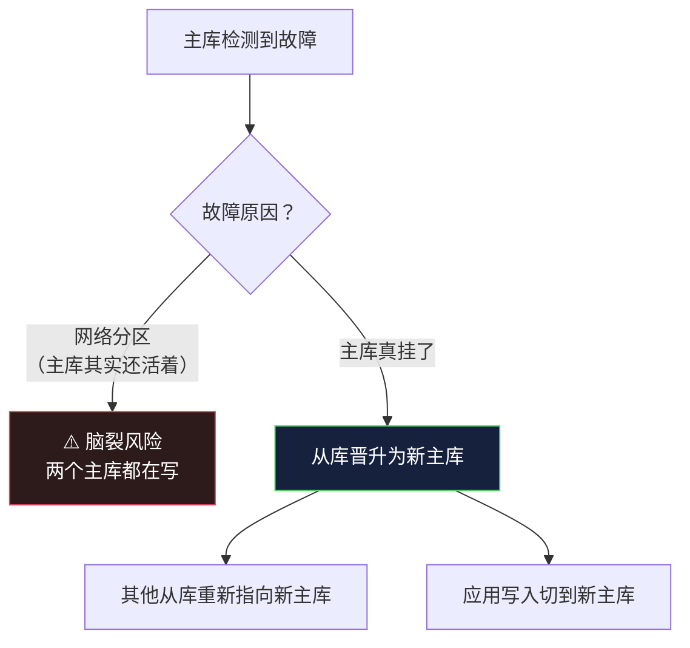

# Replication：多副本的世界

> System Design 架构地图系列第 5 篇。系列总览见 [index.md](index.md)。

## 生活比喻：学校发通知的两种方式

学校要给家长发通知：

- **同步发**：老师打电话给每个家长，确认每个家长都听到了才挂电话。**慢，但可靠**。
- **异步发**：老师把通知群发出去，不等回复就继续干活。**快，但家长可能没收到**。

数据库复制（Replication）就是数据在多台机器之间的"发通知"——主库的数据要同步到从库。

## 为什么需要副本

| 动机 | 说明 |
|------|------|
| 高可用 | 主库挂了，从库顶上（failover） |
| 读扩展 | 从库分担读流量（读写分离，见第 4 篇） |
| 数据安全 | 机器损坏不丢数据 |
| 就近访问 | 副本放不同地域，减少延迟 |

**一句话：复制是"冗余换可用性"——多存几份数据，换机器挂了不丢服务。**

## 复制的核心权衡

复制方案设计围绕三个问题：



## 同步 vs 异步复制



| 维度 | 异步复制 | 同步复制 |
|------|---------|---------|
| 写延迟 | 低（不等副本） | 高（等最慢的副本） |
| 数据安全 | 主库宕机**可能丢数据** | 不丢（至少一个副本确认） |
| 一致性 | 有窗口期读到旧数据 | 强一致 |
| 可用性 | 高（从库挂不影响写） | 低（从库挂则写阻塞） |

**工程实践：绝大多数系统用异步复制，加"半同步"折中——至少一个从库确认才返回成功，兼顾速度与安全。** MySQL 的 `semi-sync` 插件就是为此而生。

## 复制实现的三种层次

### 1. Statement-Based（SQL 语句复制）

把主库执行的 INSERT/UPDATE 语句发给从库重放。

- 优点：实现简单，日志小
- 缺点：**非确定性函数**（`NOW()`、`RAND()`）在从库执行结果不同；`UPDATE ... WHERE 全表` 在两端锁的行为不同

### 2. Row-Based（行复制）

把主库实际变更的**行数据**发给从库。

- 优点：结果确定，与 SQL 无关
- 缺点：一条 UPDATE 改 10 万行，日志就是 10 万行

### 3. Binlog（二进制日志）

MySQL 的默认方案——主库写 binlog，从库拉取重放。binlog 里两种格式可混用（`binlog_format=MIXED`）。



**注意从库是两个线程**：IO 线程只管拉取（不阻塞），SQL 线程负责重放——所以从库滞后往往是 SQL 线程赶不上，不是网络问题。

## 复制拓扑



| 拓扑 | 用途 | 坑 |
|------|------|-----|
| 单主多从 | 读写分离的标准形态 | 无 |
| 双主 | 高可用切换，避免从库晋升的等待 | **两边同时写会冲突**，必须配自增偏移 |
| 级联 | 从库过多时减轻主库复制压力 | 链路越长延迟越大 |

**双主不是让你两边写——是主备切换时备库能直接顶上。** 真正的多主写入（Multi-Primary）是分布式数据库的事。

## 故障切换（Failover）

主库挂了怎么办？这是复制系统最难的时刻：



### 脑裂（Split-Brain）

网络抖动导致主库和哨兵失联，哨兵误判主库挂了，把从库晋升为新主——此时旧主库还活着，两个主库同时接受写入，数据分叉。

**解法：仲裁（Quorum）**——需要多数派（超过一半节点）同意才能晋升。Kafka 的 ISR、Redis Sentinel、etcd 的 Raft 都是这个思路。

### 丢数据风险

异步复制下，主库宕机瞬间还没复制出去的数据会丢。缓解手段：

| 手段 | 说明 |
|------|------|
| 半同步复制 | 至少一个从库确认 |
| MySQL 5.7+ lossless semi-sync | 主库先等从库 ack 再提交 |
| 业务兜底 | 关键数据双写消息队列 |

**现实选择：接受"最多丢几秒数据"换"主库可用性"，还是用强一致方案换"写入变慢"——这是第 7、8 篇的核心。**

## 复制延迟的经典坑

**读己之写**：用户提交订单后立刻刷新，请求被路由到还没同步的从库——订单"消失"了。

```python
def create_order(user_id, order):
    db_master.execute("INSERT INTO orders ...", order)
    # 立刻读——强制走主库
    return db_master.execute(
        "SELECT * FROM orders WHERE id = ?", order.id
    )

def get_order(order_id, user_id):
    # 短期内存标记：最近写过该 key 的请求走主库
    if recent_writes.has((user_id, order_id)):
        return db_master.execute("SELECT ...")
    return db_slave.execute("SELECT ...")
```

## 与架构地图的衔接

Replication 解决"多副本 + 读扩展"，但有个天花板：**主库仍然只有一个，写仍是单点**。数据量超出单机容量、写并发超出单机能力时，需要把数据拆开——第 6 篇 Sharding。

## 总结

| 决策点 | 要点 |
|--------|------|
| 同步还是异步 | 默认异步 + 半同步折中 |
| 复制什么 | Row 格式更安全，Statement 更省日志 |
| 拓扑 | 单主多从最常见，双主只是备切换 |
| 最大风险 | 脑裂——用仲裁/多数派解决 |
| 延迟代价 | 接受短暂读旧，关键路径强制读主 |
