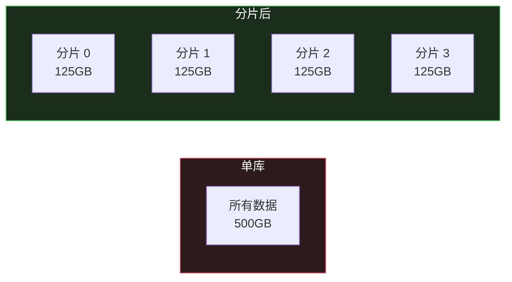
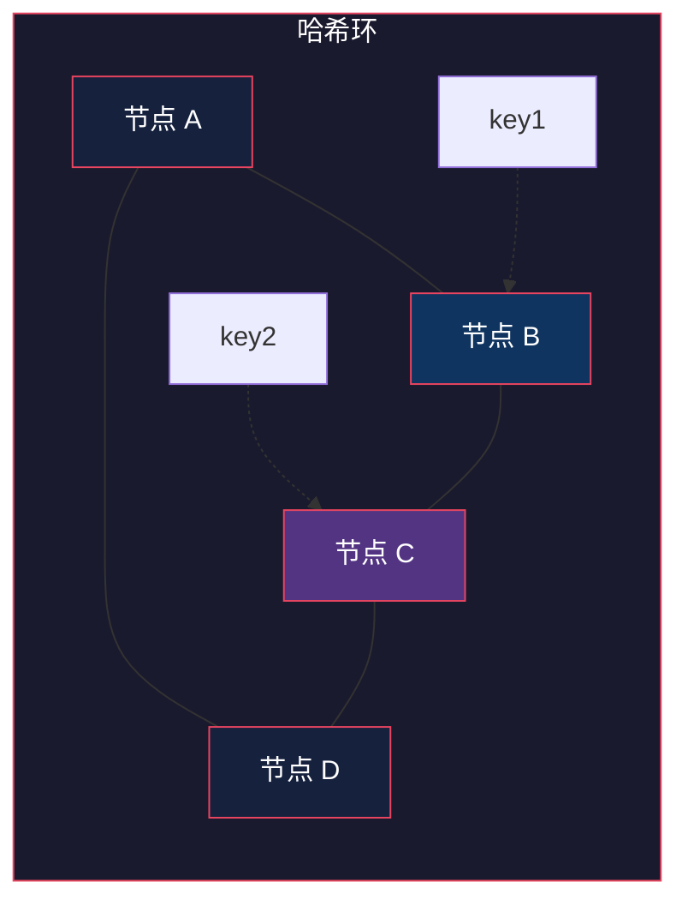
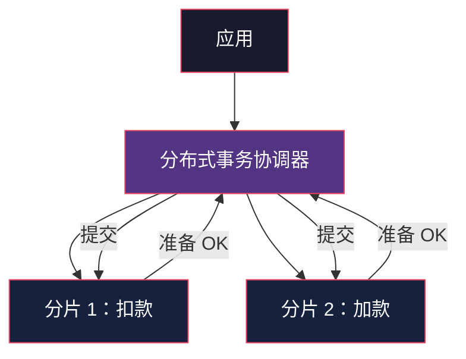
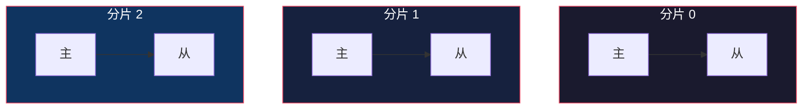

# Sharding：把数据切开来

> System Design 架构地图系列第 6 篇。系列总览见 [index.md](index.md)。

## 生活比喻：图书馆的图书分类

一个图书馆藏书太多放不下一间房，怎么办？按字母分馆——A-M 馆、N-Z 馆。每本书按作者姓氏首字母进对应分馆，找书时先判断去哪馆，再进馆找。

Sharding（分片）就是这个思路——**按某个 key 把数据拆到多台机器上，每台只存一部分。**

## 为什么需要 Sharding

Replication 解决了读的压力，但有两个问题解决不了：

| 瓶颈 | Replication 能解决吗 | Sharding 能解决吗 |
|------|---------------------|-------------------|
| 写并发 | ❌ 所有写仍打在主库 | ✅ 写分散到各分片 |
| 数据容量 | ❌ 每台都要存全量 | ✅ 每台只存一部分 |



## 分片键（Shard Key）的选择

分片的核心是**选哪个字段来分**。这是唯一最重要、也最难改的决策。

```python
# 伪代码：数据该去哪个分片
def shard_of(user_id):
    return hash(user_id) % 4  # 4 个分片
```

| 分片键 | 场景 | 例子 |
|--------|------|------|
| user_id | 用户维度数据 | 订单、帖子按用户分 |
| order_id | 大流量业务 | 订单表 |
| 租户 ID | 多租户 SaaS | 每个租户一个分片 |
| 地理 | 就近写入 | 按地区分库 |

**选择标准：查询最常用哪个字段定位数据，就用它分片。** 但注意——一个表只有一个分片键，其他维度的查询会变成全分片扫描。

## 三种分片策略

### 1. Range Sharding（范围分片）

按 key 的连续区间分片：

```
分片 0: user_id 1 ~ 1,000,000
分片 1: user_id 1,000,001 ~ 2,000,000
分片 2: user_id 2,000,001 ~ ...
```

| 优点 | 缺点 |
|------|------|
| 范围查询天然支持（查 1 月的数据在一台） | **热点问题**——新用户集中写在最后一个分片 |
| 分片键单调递增易维护 | 数据可能倾斜（老用户多的分片大） |

### 2. Hash Sharding（哈希分片）——最常用

```python
shard = hash(user_id) % 4
```

| 优点 | 缺点 |
|------|------|
| 数据分布均匀 | 范围查询要扫所有分片 |
| 无热点 | 加机器要重新哈希（见下文） |

### 3. 一致性哈希（Consistent Hashing）

**问题：** 普通取模 `hash(key) % N`，N 从 4 变 5，几乎所有 key 都迁移。缓存集群扩容一次，缓存全部失效 → 缓存雪崩。

**解法：** 哈希环——key 的哈希落在环上，顺时针找第一个节点；加节点只影响环上一小段。



| | 取模哈希 | 一致性哈希 |
|---|---|---|
| 加节点影响 | 几乎所有 key | 环上 1/N 的 key |
| 实现 | 简单 | 稍复杂（需虚拟节点防倾斜） |
| 典型场景 | 分库分表（数据要重分布也行） | 缓存、无状态路由 |

**一致性哈希的工程实现细节：** 物理节点少时哈希分布会倾斜，所以每个物理节点映射多个"虚拟节点"（每个节点复制 100~200 份放环上）。

## 分片后遇到的问题

### 1. 跨分片查询

分片后 `SELECT * FROM orders WHERE user_id = 1` 没问题（user_id 是分片键），但 `SELECT * FROM orders WHERE order_date > '2026-01-01'` 要**扫所有分片**再合并。

**解法：**

| 方案 | 说明 |
|------|------|
| 分片键必须出现在查询里 | 应用层强制 |
| 二级索引表 | 维护 "日期 → 分片" 的映射表 |
| 搜索引擎兜底 | 复杂查询走 ES，分片只存主键 |

### 2. 跨分片事务

传统 ACID 事务只在一个分片内有效。跨分片的 `UPDATE A 表 AND B 表` 需要分布式事务。



**两阶段提交（2PC）**是教科书方案，但阻塞、慢、协调器本身是单点。现代实践更倾向：

- **最终一致 + 补偿**（Saga 模式，见第 9 篇消息队列）
- **本地消息表 + 消息队列**
- **尽量把相关数据放同一分片**（按 user_id 分片后，用户的所有订单天然同片，事务就不跨片）

### 3. 分片键无法更改

**分片键一旦定下来，数据迁移成本极高。** 这是最痛的教训——很多系统上线时按 user_id 分，后来发现业务是商家维度的，全量重分。

## 分片与复制的组合

分片解决容量和写并发，复制解决可用性——生产环境两者叠加：



**每个分片本身是一个完整的主从集群。** 这样任何一个分片的主库挂了，该分片的从库顶上，其他分片不受影响。

## 实战：订单表分片

```python
import hashlib

SHARD_COUNT = 4

def shard_key(user_id: int) -> int:
    """按 user_id 一致性分片"""
    return hashlib.md5(str(user_id).encode()).hexdigest() % SHARD_COUNT

def get_order_conn(user_id: int):
    shard = shard_key(user_id)
    return DB_POOLS[shard]  # 每分片独立连接池

# 应用层强制：所有订单查询必须先有 user_id
def query_orders(user_id: int, page: int = 1):
    conn = get_order_conn(user_id)
    return conn.execute(
        "SELECT * FROM orders WHERE user_id = ? LIMIT 20 OFFSET ?",
        (user_id, (page - 1) * 20)
    )

# 禁止：没有 user_id 的全局订单查询
# def query_all_orders(date): ❌ 必须扫 4 个分片
```

## 与架构地图的衔接

Sharding 把数据拆开了，于是**跨机器的一致性问题浮出水面**——副本之间的延迟、跨分片的事务、节点故障的仲裁，这些都指向同一个理论问题：分布式系统的一致性与可用性权衡。第 7、8 篇进入 Consistency 与 CAP。

## 总结

| 决策点 | 要点 |
|--------|------|
| 什么时候分 | 单机容量/写并发到极限，且缓存优化已做完 |
| 分片键 | 最高频查询的定位字段，**慎之又慎** |
| 分片策略 | 数据均衡用哈希，范围查询多考虑 Range + 冷热 |
| 扩容 | 缓存类用一致性哈希，DB 类提前规划容量 |
| 代价 | 跨片查询、跨片事务、分片键不可变 |
