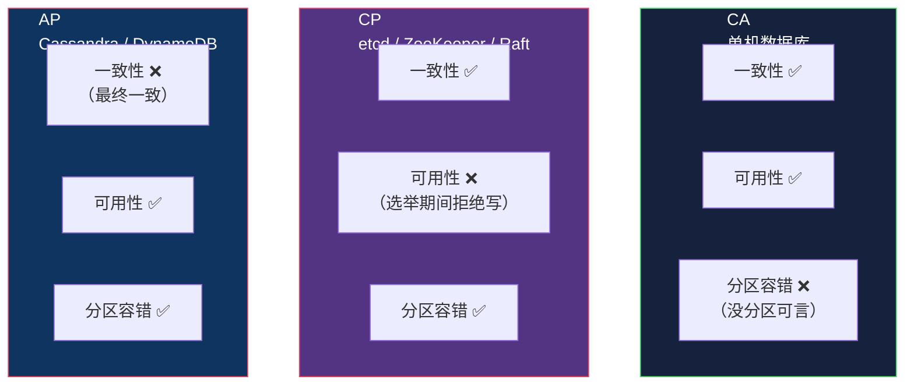

# CAP 定理：分布式系统的三选二

> System Design 架构地图系列第 8 篇。系列总览见 [index.md](index.md)。

## 生活比喻：断联的两地办公室

公司在上海和北京各有一个办公室（两个节点），中间的光缆断了（网络分区）。此时上海办公室接到一个客户订单，要更新客户资料——**北京办公室无法确认这次更新**。怎么办？

- 选择 **C（一致性）**：不确认就拒绝服务——"抱歉，系统暂时不可用"
- 选择 **A（可用性）**：先记下来，等光缆恢复再同步——"好的，马上办"

**CAP 定理说的就是：网络分区时，你只能在"接受这次写入"和"保证数据一致"之间选一个。** 没有第三条路。

## CAP 到底是什么

```
C = Consistency（一致性）：所有节点同一时刻看到同一份数据
A = Availability（可用性）：每个请求都收到非错误的响应
P = Partition Tolerance（分区容错）：网络分区（丢包/断连）时系统仍能运行
```



**最常见的误解：** "CAP 是三者选两个，所以可以选 CA 不用管 P。"

**真相：网络分区是分布式系统的必然事件（不是概率问题，是时间问题）。P 不是可选项，是必选。** 所以真正的选项只有两个：

```
分区发生时：
  CP：牺牲可用性，保证一致（等多数派）
  AP：牺牲一致性，保证可用（先响应，后收敛）
```

## 为什么三者不可兼得

用数学直觉理解：假设一个系统同时满足 C 和 A，而网络发生了分区（P 场景成立）。

- 分区把节点分成 G1 和 G2，G1 收到写请求 `x=1`
- 要满足 **C**：G1 必须等 G2 确认，否则两边数据不一致
- 要满足 **A**：G1 必须立即响应，不能等
- **矛盾**：要么等（牺牲 A），要么不等（牺牲 C）

不存在"立即响应且保证 G2 同步完成"的可能——G2 根本联系不上。

## CAP 在真实系统中的样子

### CP 系统：选举期间的拒绝服务

etcd/ZooKeeper 用 Raft 共识——Leader 挂了触发选举，选举期间拒绝写入（不保证可用），但绝不产生两个 Leader（保证一致）。

**典型现象：** ZooKeeper 集群 5 台挂 2 台，剩下的 3 台能继续服务（多数派）；挂 3 台，整个集群停止服务（不再有多数派）——宁可不可用，不可不一致。

### AP 系统：分区期间的旧数据

Cassandra/DynamoDB 每个副本都能接受写入，网络分区时两边各自写入，恢复后靠版本向量合并或 LWW 收敛。

**典型现象：** 分区的两端都接受写入，可能短暂读到旧值或丢失并发更新，但系统从不拒绝请求。

### "单机"系统是假 CA

单机数据库（MySQL 单实例）没有分区可言，所以"CA"是平凡成立的——因为没有第二个节点需要同步。一旦 MySQL 主从 + 异步复制，它面对分区时就变成了 **AP**（从库可能读到旧数据）。

## 生产系统的现实：分层混合

实际的大型系统不是"一个系统"，而是**不同层次选择不同 CAP 取向**：

| 层 | 系统 | 取向 | 为什么 |
|----|------|------|--------|
| 注册/登录 | 主库 | CP | 账户数据不能乱 |
| 余额/库存 | DB + 事务 | CP | 钱不能多扣 |
| 订单列表 | 主从复制 | AP（短暂读旧） | 列表晚几百 ms 无妨 |
| 点赞/阅读数 | Redis | AP | 计数差一点无所谓 |
| 消息通知 | 消息队列 | AP | 最终送达即可 |
| 元数据 | etcd | CP | 配置不能不一致 |

**架构师的日常工作不是"选 AP 还是 CP"，而是把每份数据归到它该去的层级。**

## CAP 的补充：BASE 与 PACELC

### BASE（基本可用 + 软状态 + 最终一致）

CAP 的 AP 分支在工程上的实践哲学：

```
BA = Basically Available     基本可用（响应慢一点可以，不能不响应）
S  = Soft state              软状态（中间态允许不一致）
E  = Eventually consistent  最终一致（终会收敛）
```

### PACELC（CAP 的扩展：正常时也要权衡）

CAP 只讨论**分区时**的选择，PACELC 补上了**正常运行时的选择**：

```
如果 P（分区）：选 A 还是 C        ← CAP
否则（正常）：  选 L（延迟）还是 C  ← PACELC 新增的
```

**例子：** MongoDB 默认"读主库"（分区时选 C，正常时也选 C 保强一致读）；改"读从库"（正常时选低延迟，分区时可能读到旧数据）。

## 实战：怎么设计一个分布式锁

分布式锁就是典型的 CP 需求：

```python
# ❌ 反例：Redis SETNX 无容错
# Redis 主库挂了，锁信息丢失，两个进程同时拿到锁

# ✅ etcd / ZooKeeper 实现
# Lease（租约）+ 序号 + watch，选主期间宁可等待
import etcd3

etcd = etcd3.client()
# 创建租约（锁持有超时）
lease = etcd.lease(30)
# 尝试加锁（只有一个人能成功）
lock = etcd.lock('order-123', ttl=30)
if lock.acquire():
    try:
        process_order()
    finally:
        lock.release()
# 锁服务不可用时，抛出异常而不是假成功
```

**但注意：** 如果"锁超时释放"与"业务还在执行"并发发生，即使 etcd 也会出问题——所以还要 Fencing Token（见第 10 篇）。

## 与架构地图的衔接

CAP 是理论基石，它解释了前面所有文章的取舍：

- Replication 为什么默认异步 → 选可用性，接受短暂不一致
- 分布式事务为什么难 → 跨节点要一致，就要牺牲可用性/性能
- 为什么需要消息队列（第 9 篇）→ MQ 是"最终一致"的工程基础设施
- 为什么微服务（第 10 篇）强调幂等 → 网络不可靠，重试是常态

## 总结

| 要点 | 结论 |
|------|------|
| P 是必选 | 网络分区是必然事件，只谈 CP vs AP |
| CP 代价 | 分区时拒绝服务，但数据可靠 |
| AP 代价 | 分区时继续服务，但数据可能不一致 |
| 单机假 CA | 没有分区，所以没有权衡 |
| 生产实践 | 按数据重要性分层，不同层不同取向 |
| PACELC | 正常运行时也要在延迟和一致间权衡 |
