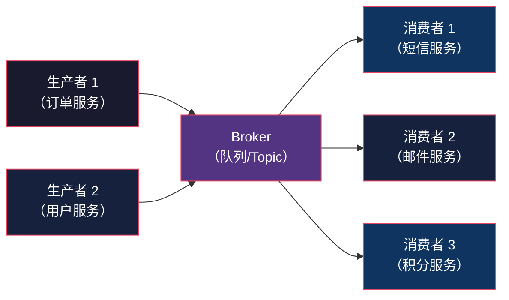
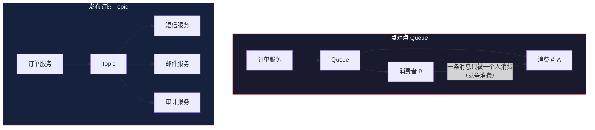
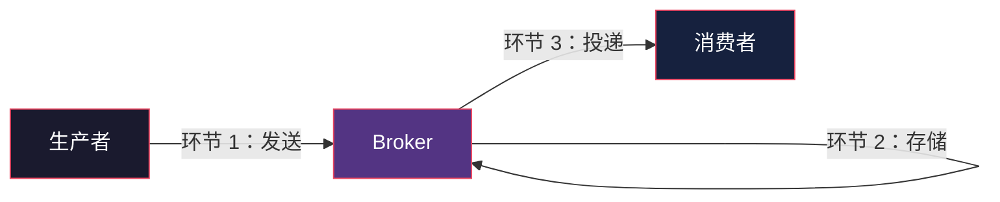
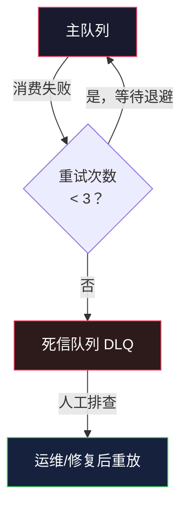
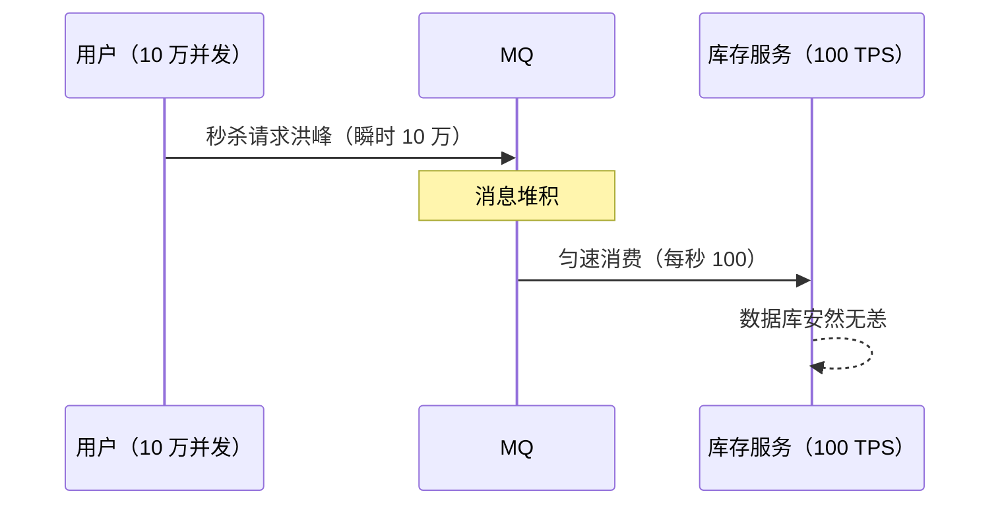
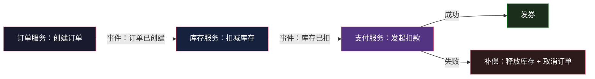
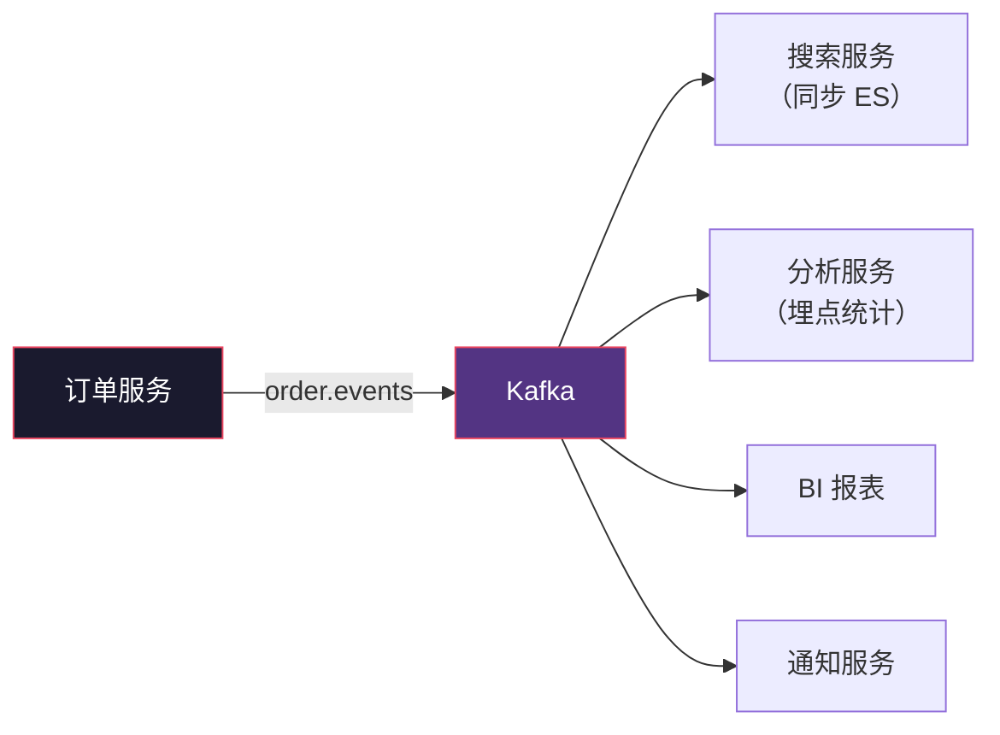

# Message Queue：服务之间的异步纽带

> System Design 架构地图系列第 9 篇。系列总览见 [index.md](index.md)。

## 生活比喻：餐厅的点菜系统

没有点菜系统时，服务员必须站在厨房等菜做好了端走，再回来接下一单——厨师忙时服务员全堵在厨房。

有点菜系统（消息队列）后：

1. 服务员写下菜单放进**传菜口**（生产者 → 队列），立刻去服务下一桌
2. 厨师从传菜口**按顺序取单**做菜（消费者 ← 队列）
3. 菜单没做就不会消失（消息持久化）；做完了就撕掉（消费确认）
4. 高峰期厨房忙不过来，传菜口的单子堆着——**削峰**

Message Queue（MQ）就是这个传菜口：**生产者和消费者之间解耦的异步消息通道。**

## MQ 解决什么问题

| 问题 | 没有 MQ | 有 MQ |
|------|--------|-------|
| 同步等待 | 下单要等发短信、发邮件、更新积分全部完成 | 下单只写一条消息，立即返回 |
| 突发流量 | 秒杀瞬间数据库被打垮 | 请求进队列，消费者匀速处理 |
| 服务耦合 | A 调 B 调 C，B 挂了 C 也挂 | A 只写消息，下游挂了不影响 |
| 重试成本 | 失败要业务自己重试 | MQ 自带重试 + 死信 |

## MQ 的核心模型



三个角色：

| 角色 | 职责 | 类比 |
|------|------|------|
| Producer | 发消息，不关心谁消费 | 服务员写单 |
| Broker | 存储 + 路由 + 投递 | 传菜口 |
| Consumer | 收消息处理，成功后确认 | 厨师取单 |

## 两种消费模型



| 模型 | 特点 | 典型 |
|------|------|------|
| Queue（点对点） | 每条消息只被一个消费者处理 | RabbitMQ |
| Topic（发布订阅） | 每个订阅者都收到全部消息 | Kafka、RocketMQ |

**怎么选：** 任务分配（谁来处理）用 Queue；事件广播（谁都要知道）用 Topic。

## 消息投递保证：MQ 与 CAP 的交汇

MQ 也逃不开一致性权衡。投递保证有三档：

```
At-Most-Once   ≤1 次  消息可能丢      快，不重试
At-Least-Once  ≥1 次  消息可能重复     默认档位
Exactly-Once   恰好 1 次             最贵，需要去重
```

**工程现实：没有免费的 Exactly-Once。** Kafka 的 exactly-once 也是"一次发送 + 幂等消费"的组合拳——真正保证靠的是**消费者幂等**：

```python
def consume_order(msg):
    order_id = msg["order_id"]
    # 幂等：以业务 ID 去重，而不是信任 MQ 只投递一次
    if redis.setnx(f"processed:{order_id}", "1", ex=3600):
        process_order(order_id)   # 只处理一次
    else:
        log_duplicate(order_id)   # 重复消息，跳过
```

## 消息丢失的三个环节



| 环节 | 丢失原因 | 防护 |
|------|---------|------|
| 发送 | 网络抖动，生产者以为失败了 | **ack 机制**——Broker 确认收到才返回成功 |
| 存储 | Broker 宕机，内存消息丢失 | **持久化 + 多副本**（Kafka ISR） |
| 投递 | 消费者收到后崩了，没来得及处理 | **手动确认**——处理成功才 ack |

## 消费失败与死信队列

消息处理失败不能无限重试（毒消息会把消费者拖死）：



**死信队列是 MQ 生产环境必备**——没有 DLQ，坏消息要么无限重试阻塞队列，要么被静默丢弃无法排查。

## MQ 的经典架构模式

### 1. 削峰填谷（秒杀）



### 2. 最终一致（Saga 分布式事务）

跨服务事务（下单扣库存 + 支付 + 发券）不用 2PC，用消息驱动逐步完成，失败则反向补偿：



**关键点：** 每一步消费端必须**幂等**（网络重试导致事件可能重复到达）；每步成功发下一步的事件，保证要么全成要么补偿。

### 3. 事件驱动 + 可追溯

所有业务事件（订单创建/支付成功/退款）都发到 Kafka Topic，下游各取所需：



## 常见 MQ 选型

| MQ | 模型 | 吞吐 | 特点 | 适合 |
|----|------|------|------|------|
| RabbitMQ | Queue | 万级 | 路由灵活，延迟低 | 任务队列、事务消息 |
| Kafka | Topic | 百万级 | 日志追加，可回放 | 事件流、大数据 |
| RocketMQ | Topic | 十万级 | 事务消息、延迟消息 | 电商订单 |
| Pulsar | Topic | 百万级 | 存储计算分离 | 云原生 |

**Kafka 的详细机制（分区、消费组、Exactly-Once、Kafka Streams）见 [Kafka 系列](tech/kafka/index.md) 10 篇文章。**

## 与架构地图的衔接

MQ 是单体拆微服务的前提——没有 MQ，服务间同步调用会形成调用链地狱。但 MQ 也引入分布式事务、消息幂等、顺序性等新问题。第 10 篇 Microservices 把这些综合起来，第 11 篇解决"服务太多被压垮"的限流问题。

## 总结

| 决策点 | 要点 |
|--------|------|
| 什么场景 | 解耦、削峰、异步化、事件驱动 |
| Queue vs Topic | 竞争消费用 Queue，广播用 Topic |
| 投递保证 | At-Least-Once + 消费者幂等 |
| 必配设施 | 手动 ack、重试退避、死信队列 |
| 事务 | Saga 最终一致 + 补偿 |
