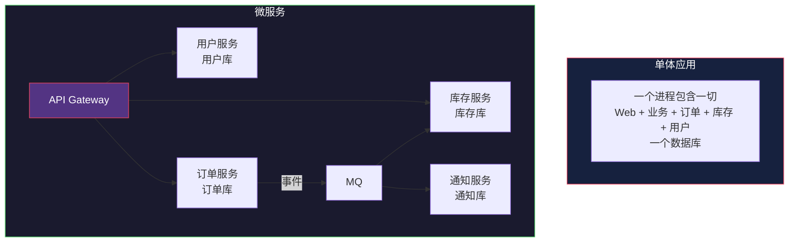
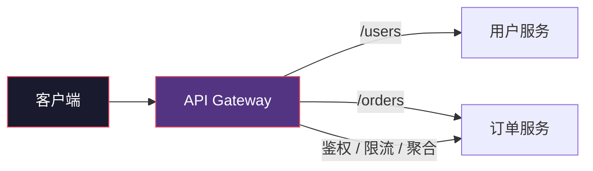
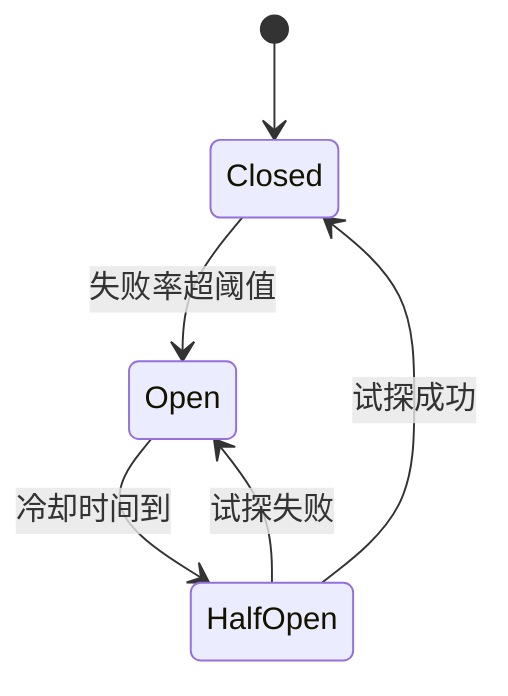

# Microservices：单体拆开之后的得与失

> System Design 架构地图系列第 10 篇。系列总览见 [index.md](index.md)。

## 生活比喻：大型公司怎么组织

一家公司从 10 人长到 10000 人，不可能还让所有人听 CEO 直接指挥——于是拆成部门（订单部、库存部、财务部），每个部门有自己的负责人和资源，部门之间通过标准流程（合同/单据）协作。

单体应用就像 10 人小公司——人少时最高效。公司变大后必须拆部门（微服务化），但拆了之后，跨部门协作的流程成本（开会、单据、扯皮）就是微服务的分布式复杂度。

**核心认知：微服务不是技术问题，是组织问题的技术映射。** 这正好对应康威定律——系统结构会复制组织的沟通结构。

## 什么是微服务



**定义：** 把应用按业务能力拆成一组独立部署、独立扩展、各自拥有数据的小服务。

## 为什么拆：单体的痛点

| 痛点 | 说明 |
|------|------|
| 部署耦合 | 改一行代码要重新部署整个应用 |
| 扩展浪费 | 只有订单模块压力大，却要扩展整个应用 |
| 团队冲突 | 100 人改同一个代码库，合并地狱 |
| 技术锁定 | 全公司绑死一个语言/框架 |
| 故障放大 | 一个模块内存泄漏，整个应用重启 |

## 拆了之后的代价

**微服务的所有优点都以分布式系统的基本定理（第 8 篇 CAP）为代价。** 拆之前请先看这份账单：

| 单体时代没有的问题 | 微服务后必须面对 |
|-------------------|-----------------|
| 本地函数调用 | 网络调用（可能超时、重试、乱序） |
| 数据库 ACID 事务 | 分布式事务（Saga、最终一致） |
| 一个测试跑全部 | 服务间契约测试、mock |
| 部署一个包 | 几十个服务编排、滚动发布 |
| 查日志 grep 一个文件 | 分布式追踪（链路 ID） |
| 单机调优 | 服务发现、负载均衡、熔断 |

**Martin Fowler 的判断值得记住：微服务不是银弹，它适合复杂的、快速演进的大业务。小团队小项目用单体（甚至模块化单体）更快。**

## 微服务的核心组件

### 1. API Gateway



Gateway 职责：路由、鉴权、限流、协议转换、请求聚合。**客户端只认识 Gateway，不知道背后有多少服务。**

### 2. 服务发现

服务实例动态伸缩，IP 随时变。服务发现解决"怎么找到对方"：


### 3. 熔断与降级

服务依赖的下游慢了/挂了，不能让自己也挂——**熔断器**：

```
正常状态:     请求正常通过
    ↓ 失败率 > 阈值（如 50%）
熔断开启:     快速失败，不再调用下游（给它喘息恢复）
    ↓ 冷却时间后
半开状态:     放少量试探请求
    ↓ 成功？
恢复 / 再次熔断
```



**对比：重试（Retry）与熔断（Circuit Breaker）是相反的方向——重试是"再试一次"，熔断是"先别试了"。** 级联调用中每一层都重试，会把故障放大 100 倍（重试风暴）。

### 4. 分布式追踪

一个请求跨 5 个服务，出问题怎么排查？给每个请求分配**链路 ID**，贯穿所有服务日志：

```text
GET /orders/123
  ├─ [trace-id: abc123] gateway → 订单服务 (12ms)
  ├─ [trace-id: abc123] 订单服务 → 用户服务 (5ms)
  ├─ [trace-id: abc123] 订单服务 → 库存服务 (FAILED, 30ms)
  └─ [trace-id: abc123] gateway 返回 500
```

## 分布式事务的两种主流思路

微服务各自持有数据库，传统事务失效。两条路线：

| 路线 | 思路 | 适合 |
|------|------|------|
| 本地消息表 + MQ | 本地事务写消息表，MQ 可靠投递，消费者幂等（见第 9 篇） | 大多数业务 |
| Saga 编排 | 长流程拆步骤，每步发事件，失败走补偿 | 订单全流程 |

**核心心法：能用"最终一致"解决的，不要追求分布式强一致；能设计成无状态幂等的，不要引入锁。**

## 幂等：微服务的生存技能

网络会重试、MQ 会重投、用户会手抖双点。**所有写接口必须幂等**——同一个请求处理两次，结果和一次一样：

```python
# 客户端生成 request_id，服务端去重
def create_order(request_id: str, ...):
    # 幂等键去重
    if exists("orders:request_id", request_id):
        return get_existing_order(request_id)

    with db.transaction():
        order = create_order_in_db(...)
        set("orders:request_id", request_id, order.id)
    return order
```

### Fencing Token：防止过期操作的"僵尸"执行

分布式锁的经典陷阱：进程 A 拿到锁后 GC 停顿 30 秒，锁超时释放；进程 B 拿到锁开始执行；进程 A 醒过来继续执行——**两个进程同时在改数据**。

解法：每次拿锁分配递增 token，写操作携带 token，存储侧只接受更大的 token。

```
A 拿锁 → token=1 → 停顿 30s（锁已过期）
B 拿锁 → token=2 → 执行写（token 2 > 已记录的 1 ✅）
A 醒来 → 携带 token=1 写 → 存储拒绝（1 ≤ 2 ❌）
```

## 什么时候别用微服务

```
❌ 团队 < 10 人
❌ 业务逻辑还不稳定（还在频繁改）
❌ 没有独立的运维/发布能力
❌ 性能瓶颈还没出现（第 4 篇的教训：先免费优化）
✅ 业务足够复杂、团队够大、模块边界清晰时再拆
```

**推荐的演进路径：模块化单体 → 按需拆出热点服务 → 逐步微服务化。** 而不是一步到位。

## 与架构地图的衔接

微服务把所有前面的知识串起来了：LB 负载均衡服务、缓存/熔断保护依赖、MQ 解耦服务间调用、数据按服务拆分后遇到的分片与一致性问题。但服务多了之后，最外层还有一个问题——**入口流量怎么控制**，第 11 篇 Rate Limiting 收官。

## 总结

| 决策点 | 要点 |
|--------|------|
| 拆不拆 | 团队规模 × 业务复杂度 × 边界清晰度 |
| 拆的代价 | 网络不可靠、事务分叉、排障困难 |
| 必备组件 | Gateway、服务发现、熔断降级、分布式追踪 |
| 事务方案 | 本地消息表 / Saga，放弃强一致 |
| 生存技能 | 所有写接口幂等 + Fencing Token |
