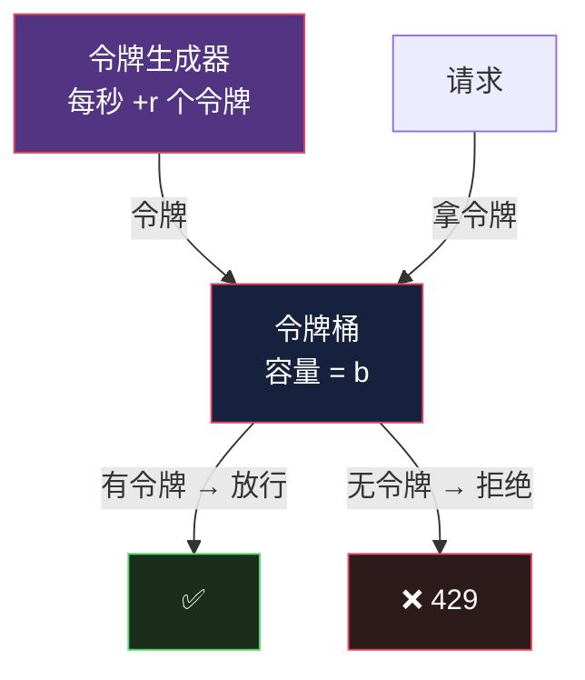
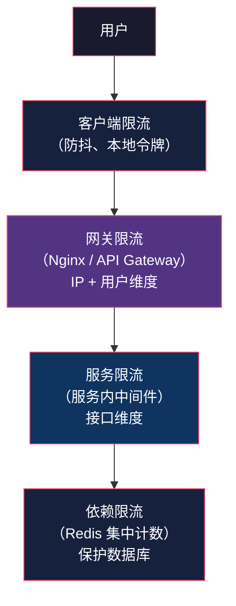
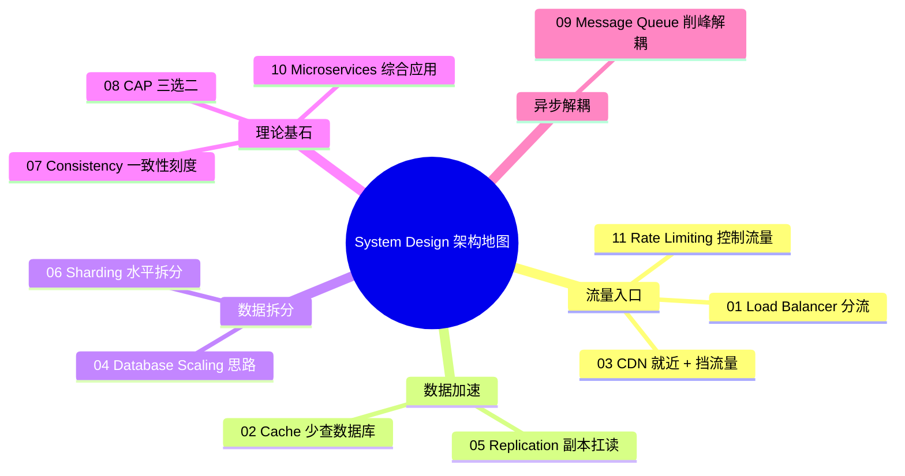

# Rate Limiting：给流量装上水龙头

> System Design 架构地图系列第 11 篇（收官）。系列总览见 [index.md](index.md)。

## 生活比喻：景区的限流闸机

热门景区每天只能接待 5 万人。不是不让你进，是**超出承载能力时，用排队代替瘫痪**——提前预约（配额）、按小时放人（滑动窗口）、VIP 通道（优先级）。

Rate Limiting（限流）就是系统的闸机——**在流量超过系统承载能力之前，主动控制请求速率，保护后端不被压垮。**

## 限流与它的表亲

| 概念 | 作用 | 时机 |
|------|------|------|
| 限流（Rate Limit） | 拒绝多余请求 | 进入系统前 |
| 熔断（Circuit Breaker） | 停止调用已故障的下游 | 调用下游时 |
| 降级（Degradation） | 用简化方案顶住 | 系统过载时 |
| 弹性伸缩（Auto Scaling） | 增加容量 | 系统过载时 |

第 10 篇的熔断保护"服务之间"，本篇的限流保护"系统入口"。

## 为什么要限流

```
1. 保护自己    —— 秒杀流量把数据库打垮
2. 公平使用    —— 少数用户占满资源，其他人饿死
3. 成本控制    —— 每请求都花钱（LLM API、短信、爬虫）
4. 防滥用      —— 暴力破解、刷单、爬虫
5. 容量规划    —— 让流量可预期，后端按配额设计
```

## 限流算法的演进

### 1. 固定窗口（Fixed Window）

每分钟最多 100 个请求，按分钟计数：

```text
|---- 窗口 1 ----|---- 窗口 2 ----|---- 窗口 3 ----|
       59:59 时刻      00:00 时刻
      80 个请求 ✅     60 个请求 ✅
      合计 140 个请求！！！（窗口边界突刺）
```

**缺陷：窗口边界突刺**——59:59 秒的第 100 个请求和 00:00 的第 100 个请求都放行，一秒钟内实际通过了 200 个。

### 2. 滑动窗口（Sliding Window）

不用固定边界，窗口随时间滑动：

```text
时间 →
滑动窗口（前 60 秒）
[---窗口实时滑动---]
   ↑请求时刻，窗口永远覆盖"过去 60 秒"
```

实现：记录每个请求的时间戳，每次请求删除窗口外的时间戳。精确但**占用内存**（要存每个请求的时间）。工程上用**滑动窗口计数**（把窗口切成小格子，近似滑动）折中。

### 3. 漏桶（Leaky Bucket）

想象一个底部漏水的水桶——请求像水一样倒进桶里，桶底以**固定速率**漏水（处理请求）。桶满了，新请求直接丢弃。


**特点：输出速率完全恒定**（平滑突发流量）。适合保护数据库、下游 API 这类"必须匀速"的资源。**缺陷：无法应对持续超载，且突发请求排队久了会超时。**

### 4. 令牌桶（Token Bucket）——最常用

桶里以固定速率添加令牌，请求需要**拿令牌**才能通过；桶空了拒绝，桶满了令牌不再增加（攒不下）。



**特点：允许一定程度的突发**——桶里攒了令牌，空闲后可以短时爆发（比漏桶灵活）。r 控制长期速率，b 控制突发上限。Nginx、Redis、大部分网关默认用它。

### 对比

| 算法 | 平滑输出 | 允许突发 | 实现复杂度 | 适用 |
|------|---------|---------|-----------|------|
| 固定窗口 | ❌ | ✅ 但边界突刺 | 最低 | 简单计数 |
| 滑动窗口 | ⚠️ 近似 | ✅ | 中 | API 限流 |
| 漏桶 | ✅ 完全恒定 | ❌ | 中 | 保护数据库 |
| 令牌桶 | ⚠️ | ✅ 可控突发 | 中 | **通用首选** |

## 限流的部署位置



| 层 | 限什么 | 例子 |
|----|--------|------|
| 网关 | IP、用户维度 | 每 IP 100 req/min |
| 服务 | API 维度 | 下单接口 10 req/s/用户 |
| 依赖 | 慢资源 | 数据库连接池配额 |

**原则：越靠外层限得越粗（IP），越靠内层限得越细（业务资源）。**

## 分布式限流：多实例怎么计数

服务有 10 个实例，限流"每秒 100 请求"是全局 100 还是每实例 100？两种方案：

### 方案一：集中式（Redis 计数）

```python
import time
import redis

r = redis.Redis()

def token_bucket_allow(key: str, rate: int, capacity: int) -> bool:
    """Redis 实现令牌桶（Lua 保证原子性）"""
    # 简化：滑动窗口计数
    now = int(time.time())
    pipe = r.pipeline()
    pipe.zremrangebyscore(key, 0, now - 60)  # 删窗口外
    pipe.zadd(key, {f"{now}:{rand}": now})    # 加当前请求
    pipe.expire(key, 120)
    pipe.zcard(key)                           # 窗口内总数
    results = pipe.execute()
    return results[-1] <= capacity
```

- 精确（全局统一计数）
- Redis 是新的故障点 → 限流器挂了怎么办？**降级放行或本地兜底**（fail-open 还是 fail-closed 的取舍）

### 方案二：本地计数

每实例限 rate/N——实例数不均时不准，但零依赖零延迟。**实践中网关层集中，服务内本地。**

## 被限流之后的响应

限流不只是返回 429，还要告诉客户端"多久能再试"：

```http
HTTP/1.1 429 Too Many Requests
RateLimit-Limit: 100          # 配额
RateLimit-Remaining: 0        # 剩余
RateLimit-Reset: 42           # 42 秒后重置
Retry-After: 42               # 客户端应等待 42 秒
```

配合客户端**指数退避**（退避 + 抖动）：

```python
def call_with_retry(fn, max_retries=3):
    for attempt in range(max_retries):
        resp = fn()
        if resp.status_code != 429:
            return resp
        wait = (2 ** attempt) + random.uniform(0, 1)  # 指数退避 + 抖动
        time.sleep(wait)
    raise RateLimitExceeded()
```

## 限流 vs 排队：被限的请求去哪了

| 策略 | 做法 | 场景 |
|------|------|------|
| 直接拒绝 | 返回 429，让用户重试 | 普通 API |
| 排队 | 请求进队列慢慢处理 | 秒杀（见第 9 篇削峰） |
| 降级 | 返回缓存/默认值 | 读多场景 |

**高价值请求排队，低价值请求拒绝**——秒杀场景用队列把洪峰抹平，普通接口直接 429。

## 与整个架构地图的衔接



## 总结

| 决策点 | 要点 |
|--------|------|
| 算法 | 默认令牌桶（可控突发）；保护匀速资源用漏桶 |
| 位置 | 网关限 IP/用户，服务限接口，依赖限配额 |
| 分布式 | Redis 集中计数（精确），本地计数（快但粗） |
| 响应 | 429 + RateLimit-* 头 + 客户端指数退避 |
| 被限请求 | 拒绝 / 排队 / 降级，按业务价值选 |
