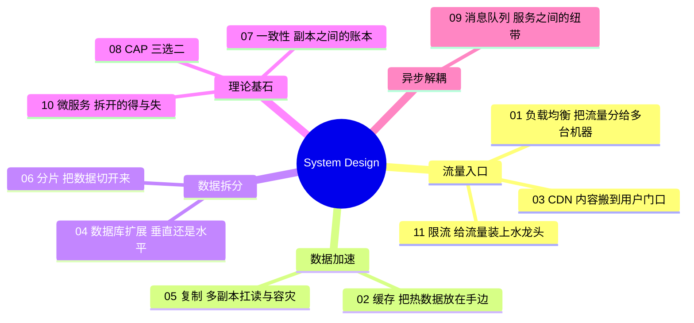

# System Design 架构地图

从单机到分布式的完整学习路径。参考 System Design Primer（donnemartin/system-design-primer）的主题框架，用"流量怎么进来、数据怎么存、系统怎么扩展、理论怎么约束"四条主线串起来，每篇解决一个问题、引入下一个问题。

## 整体架构地图

## 阅读路径

## 文章列表

| # | 主题 | 解决什么问题 | 留下什么问题 |
|---|------|-------------|-------------|
| [01](01-load-balancer.md) | Load Balancer | 一台服务器不够，流量怎么分 | 数据库扛不住怎么办 |
| [02](02-cache.md) | Cache | 数据库太慢，怎么少查 | 静态资源全球怎么加速 |
| [03](03-cdn.md) | CDN | 用户太远，内容怎么就近 | 源站数据库仍是瓶颈 |
| [04](04-database-scaling.md) | Database Scaling | 数据库扛不住怎么办 | 复制和分片怎么做 |
| [05](05-replication.md) | Replication | 读压力大，怎么多副本扛 | 数据太大一台装不下 |
| [06](06-sharding.md) | Sharding | 数据超容量，怎么切开 | 拆开后一致性怎么保证 |
| [07](07-consistency.md) | Consistency | 多副本数据怎么对齐 | 理论极限在哪 |
| [08](08-cap.md) | CAP | 一致性可用性怎么取舍 | 系统间怎么异步解耦 |
| [09](09-message-queue.md) | Message Queue | 服务怎么解耦削峰 | 拆成服务后怎么管理 |
| [10](10-microservices.md) | Microservices | 单体怎么拆、拆的代价 | 入口流量怎么控制 |
| [11](11-rate-limiting.md) | Rate Limiting | 流量过载怎么保护 | ——（收官） |
