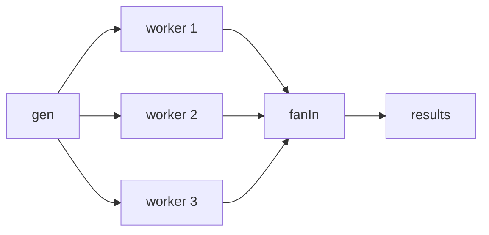

# Go Channel 系列（四）：并发模式——Pipeline、Fan-In 与 Done Channel

> 本文基于 Go 1.24。

前三篇讲了 channel 的单个操作。这一篇把前三篇串起来——实际项目中怎么组合这些操作来解决并发问题。Pipeline、fan-in、fan-out、done channel、or-done——这些不是设计模式的教条，而是 Go 并发代码中最常出现的结构。

## Pipeline——多阶段流水线

每个阶段是一个 goroutine，从上游 channel 读，处理后写到下游 channel：

```go
func gen(nums ...int) <-chan int {
    out := make(chan int)
    go func() {
        for _, n := range nums {
            out <- n
        }
        close(out)
    }()
    return out
}

func square(in <-chan int) <-chan int {
    out := make(chan int)
    go func() {
        for n := range in {
            out <- n * n
        }
        close(out)
    }()
    return out
}

func main() {
    // 两个阶段串联
    numbers := gen(2, 3, 4)      // 阶段 1：生成
    squared := square(numbers)    // 阶段 2：平方

    for result := range squared {
        fmt.Println(result)       // 4, 9, 16
    }
}
```

每个阶段的 goroutine 独立运行——`gen` 生成一个数时，`square` 可能同时在处理上一个数。这是真正的流水线并行，不是串行等。

## Fan-Out——一个输入分给多个 worker

```go
func fanOut(in <-chan int, workers int) []<-chan int {
    outs := make([]<-chan int, workers)
    for i := 0; i < workers; i++ {
        outs[i] = worker(in)     // 每个 worker 从同一个 in 读
    }
    return outs
}

func worker(in <-chan int) <-chan int {
    out := make(chan int)
    go func() {
        for n := range in {
            out <- process(n)
        }
        close(out)
    }()
    return out
}
```

同一个 channel 可以被多个 goroutine 同时 `range`——Go 保证每条消息只分发给一个接收者。这就是 fan-out 的基础——不需要自己实现分发逻辑。

## Fan-In——多个输入合并成一个输出

```go
func fanIn(inputs ...<-chan int) <-chan int {
    out := make(chan int)
    var wg sync.WaitGroup

    for _, in := range inputs {
        wg.Add(1)
        go func(in <-chan int) {
            defer wg.Done()
            for v := range in {
                out <- v
            }
        }(in)
    }

    go func() {
        wg.Wait()
        close(out)
    }()

    return out
}
```

等所有输入 channel 都关闭后，关闭输出 channel。`sync.WaitGroup` 追踪每个输入是否已经读完——全部读完后 `close(out)`。

### 完整组合：Pipeline → Fan-Out → Fan-In

```go
func main() {
    // 阶段 1：生成数据
    in := gen(1, 2, 3, 4, 5, 6, 7, 8)

    // 阶段 2：fan-out——3 个 worker 并行处理
    workers := fanOut(in, 3)

    // 阶段 3：fan-in——合并结果
    out := fanIn(workers...)

    for result := range out {
        fmt.Println(result)
    }
}
```



这个结构在数据处理管道中非常常见——生成数据 → 并行处理 → 汇总结果。

## Done Channel——优雅取消

前面 pipeline 的问题是——没法中途取消。接收方只消费前 3 个结果就走，但上游的 goroutine 还在跑：

```go
func genWithDone(done <-chan struct{}, nums ...int) <-chan int {
    out := make(chan int)
    go func() {
        defer close(out)
        for _, n := range nums {
            select {
            case out <- n:
            case <-done:
                return  // 收到取消信号，立刻退出
            }
        }
    }()
    return out
}

func main() {
    done := make(chan struct{})
    defer close(done)  // main 退出时自动取消所有下游

    numbers := genWithDone(done, 1, 2, 3, 4, 5)

    for n := range numbers {
        fmt.Println(n)
        if n == 3 {
            break  // 只要前 3 个——但 goroutine 不会泄漏
        }
    }
    // close(done) 确保 gen goroutine 退出
}
```

`done` channel 是 Go 中传播取消信号的标准方式——每个 goroutine 在发送或接收前先检查 `done`。`context.Context` 的 `Done()` 本质上就是这样一个 channel。

## Or-Done——合并多个取消信号

有时候你需要等「任意一个 goroutine 完成」——不是全部，是第一个：

```go
func orDone(channels ...<-chan struct{}) <-chan struct{} {
    switch len(channels) {
    case 0:
        return nil
    case 1:
        return channels[0]
    }

    orDone := make(chan struct{})
    go func() {
        defer close(orDone)
        switch len(channels) {
        case 2:
            select {
            case <-channels[0]:
            case <-channels[1]:
            }
        default:
            select {
            case <-channels[0]:
            case <-channels[1]:
            case <-channels[2]:
            case <-orDone(append(channels[3:], orDone)...):
            }
        }
    }()
    return orDone
}

// 用法：
// 等任意一个超时或取消信号
select {
case <-orDone(timeout1, timeout2, cancelCh):
    fmt.Println("done by something")
}
```

递归地合并多个 done channel——任何一个关闭，组合 channel 就关闭。Go 标准库没有提供这个，但项目里经常需要。

## Tee——把一份数据分到两个下游

```go
func tee(in <-chan int) (<-chan int, <-chan int) {
    out1 := make(chan int)
    out2 := make(chan int)
    go func() {
        defer close(out1)
        defer close(out2)
        for v := range in {
            out1 <- v
            out2 <- v
        }
    }()
    return out1, out2
}
```

和 `io.TeeReader` 一样——数据复制两份，同时从两个 channel 出去。一份给处理逻辑，一份给日志或监控。

## 总结

| 模式 | 做什么 |
|------|--------|
| Pipeline | 多阶段串联——每阶段一个 goroutine |
| Fan-Out | 一个输入分给多个 worker——并行处理 |
| Fan-In | 多个输入合并成一个输出——`sync.WaitGroup` 等全部 |
| Done Channel | 传播取消信号——goroutine 不会被泄漏 |
| Or-Done | 多个取消信号——任意一个触发就行 |
| Tee | 一份数据分到两个下游 |

这些模式的核心都是一个原则：**goroutine 通过 channel 通信，而不是通过共享内存同步**。pipeline 不需要锁，fan-in 不需要锁，done 不需要锁——channel 本身承载了同步的语义。

四条规则收束整个系列：
1. 发送方关闭 channel，接收方用 `range`
2. 用 `select` + `done` 保证 goroutine 可取消
3. 有缓冲 channel 的容量是速率容忍度，不是设计修补
4. nil channel 在 select 中是禁用开关，不是 bug

→ [回到系列导航](index.md)
