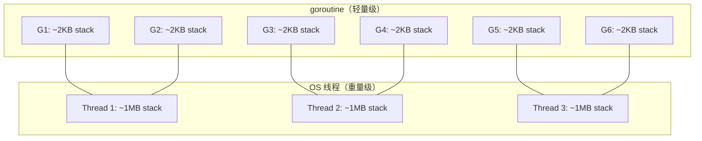

# Go Goroutines 系列（一）：goroutine 是什么——轻量线程的原理与实践

> 本文基于 Go 1.24。

用 Go 写并发程序的起点不是 `thread`，不是 `async/await`，是 `go`——一个关键字。`go func()` 启动一个 goroutine，它不是一个操作系统线程，而是一个由 Go 运行时调度的轻量执行单元。第一篇从原理讲起：goroutine 和线程有什么区别、`go` 关键字做了什么、怎么控制并发度。

## `go` 关键字——启动一个 goroutine

```go
func main() {
    go fmt.Println("hello from goroutine")
    fmt.Println("hello from main")
    time.Sleep(10 * time.Millisecond)
}
// 输出可能是：
// hello from main
// hello from goroutine
// 也可能反过来——两个 goroutine 的调度顺序不确定
```

`go f()` 做了两件事：
1. 在一个新的 goroutine 里执行 `f()`
2. `main` 继续往下走——不等待

所以需要 `time.Sleep` 让 main 等一下——否则 main 在 goroutine 执行前就退出了，整个程序结束，goroutine 被强制终止。这是一个演示 hack，实际代码中永远不该用 `time.Sleep` 来等 goroutine——后面会讲 `sync.WaitGroup`。

## goroutine vs OS 线程



核心差异：

| | OS 线程 | goroutine |
|---|---|---|
| 创建开销 | 大（内核态分配栈、寄存器） | 小（用户态分配，几 KB） |
| 初始栈大小 | ~1MB | ~2KB（按需增长） |
| 调度者 | OS 内核（抢占式） | Go 运行时（协作式 + 抢占） |
| 上下文切换 | 内核态——保存/恢复大量寄存器 | 用户态——只保存少量寄存器 |
| 并发数上限 | 数千 | 数十万 |

这意味着你可以放心写 `go process(item)` 十万次——Go 运行时会把它映射到少数几个 OS 线程上。这是 Go 并发的核心理念：**你负责分解任务，运行时负责高效调度**。

## GOMAXPROCS——控制并发的 OS 线程数

```go
import "runtime"

func main() {
    fmt.Println(runtime.GOMAXPROCS(0))  // 默认 = CPU 核数
    runtime.GOMAXPROCS(1)               // 只用 1 个 OS 线程
}
```

`GOMAXPROCS` 决定同时执行 goroutine 的 OS 线程数上限。默认等于 CPU 核数——意味着 N 个 CPU 核上可以同时跑 N 个 goroutine。调大它一般没用（受限于 CPU 核数），调小它可能有用——减少上下文切换，让 CPU 密集型的并发程序更稳定。

```go
// ✅ 好场景——CPU 密集型计算
runtime.GOMAXPROCS(runtime.NumCPU())  // 默认即可

// ✅ 好场景——大量 I/O 等待
// GOMAXPROCS 不需要改——goroutine 在 I/O 等待时自动让出线程
```

**goroutine 在发生阻塞操作（channel 等待、网络 I/O、time.Sleep）时自动被 Go 调度器换下**——另一个 goroutine 会接管这个 OS 线程。所以即使 `GOMAXPROCS=1`，你仍然可以同时处理数千个 HTTP 请求——每个请求的 goroutine 在等数据库响应时，调度器把线程给另一个 goroutine 用。

## goroutine 没有返回值——需要 channel 或 WaitGroup

```go
// ❌ goroutine 没有返回值——go 语句丢弃了函数的返回值
// go result := doWork()  编译错误

// ✅ 用 channel 传回结果
func doWorkAsync() <-chan int {
    ch := make(chan int, 1)
    go func() {
        ch <- doWork()
    }()
    return ch
}

result := <-doWorkAsync()
```

goroutine 不像 `Promise/Future`——没有内置的返回值机制。你需要显式地通过 channel 或 WaitGroup 来收集结果。这是故意的——迫使你思考 goroutine 之间怎么通信。

## goroutine 泄露——最常见的并发 bug

```go
// ❌ goroutine 泄露——ch 永远没人读，goroutine 永远阻塞在发送上
func leak() {
    ch := make(chan int)
    go func() {
        ch <- 42   // 阻塞——永远等不到接收者
    }()
    // 函数返回了，但 goroutine 还活着——占用内存
}
```

泄露的 goroutine 不会被 GC——它持有的 channel 引用和局部变量也不会被回收。检查方式：

```go
import "runtime"

// 在任何时候打印当前 goroutine 数量
fmt.Println(runtime.NumGoroutine())
```

如果这个数只增不减——你的代码有 goroutine 泄露。

泄露最常见的原因：
1. channel 没人读——发送方永远阻塞
2. channel 没人写——接收方永远阻塞
3. 没有取消机制——goroutine 不知道什么时候停止

前两个在 channel 系列里讲过。第三个是下下篇 context 要解决的问题。

## 总结

三条够日常用：

1. `go f()` 启动一个 goroutine——轻量，可以开成千上万个
2. goroutine 没有返回值——用 channel 或 WaitGroup 通信
3. 用 `runtime.NumGoroutine()` 检查泄露

下一篇讲怎么等 goroutine 结束——`sync.WaitGroup` 和 `errgroup`。

→ [（二）同步：WaitGroup、Once 与 errgroup](02-waitgroup.md)
