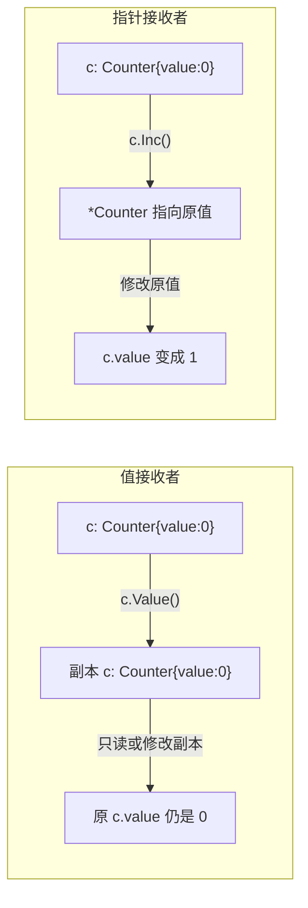

# Go 面向对象（一）：结构体与方法——Go 没有 class，但有更轻量的替代

> 本文基于 Go 1.24。

## 开篇：放下 class 关键字

Java 开发者第一次写 Go，会本能地找 `class` 关键字——然后发现根本没有。Python 开发者会找 `class`——然后意识到 Go 的结构体和方法是分开定义的。

这种不适感很真实，但它背后是 Go 对 OOP 的根本态度：**数据就是数据，行为就是行为，不需要强行绑在一起**。

一个简单的对照：

```go
// Java 风格（写在 Go 里会是什么样）
// class Dog {
//     private String name;
//     public void bark() { System.out.println("Bark!"); }
// }

// Go 的实际做法
type Dog struct {
    name string
}

func (d Dog) Bark() {
    fmt.Println("Bark!")
}
```

类型定义和它的方法在语法上是分离的。这看起来像是多打了几行字，但当你理解了 `func (d Dog) Bark()` 中的 `(d Dog)` 是什么之后，你会觉得这种分离是刻意为之的巧妙设计。

## 结构体：数据的骨架

### 定义

```go
type Person struct {
    Name string
    Age  int
    Email string
}
```

字段首字母大写意味着导出（公开），小写意味着包内私有。Go 只用大小写管访问控制——没有 public/private/protected 这一套修饰符。

### 创建实例

```go
// 方式一：按位置初始化（少用，字段顺序一变就炸）
p1 := Person{"张三", 30, "zhangsan@example.com"}

// 方式二：按字段名初始化（推荐）
p2 := Person{
    Name:  "张三",
    Age:   30,
    Email: "zhangsan@example.com",
}

// 方式三：零值初始化
var p3 Person    // Name="", Age=0, Email=""
p4 := Person{}   // 同上

// 方式四：用 new 获取指针
p5 := new(Person) // &Person{}, 等价于 &Person{}
```

Go 里 `new(Person)` 返回的是 `*Person` 指针，不是 Java 式的引用。`p5.Name` 可以直接用——Go 会自动解引用，不用写 `(*p5).Name`。

### 零值是设计特性

Go 的零值不是「没初始化」——它是「有意义的默认值」：

```go
var buf bytes.Buffer  // 空 buffer，可以直接 Write
buf.Write([]byte("hello"))

var mu sync.Mutex     // 未加锁的 mutex，可以直接 Lock
mu.Lock()

var wg sync.WaitGroup // 计数器为 0，可以直接 Add
wg.Add(1)
```

这就是为什么 Go 总是让你声明 `var x Type` 而不是强制你调构造函数。好的类型让零值立即可用。

## 方法：绑定到类型的函数

### 不是「类的成员函数」

Go 的方法和类型定义是分开的：

```go
type Counter struct {
    value int
}

// 方法：绑定到 Counter 类型
func (c Counter) Value() int {
    return c.value
}
```

`(c Counter)` 叫接收者（receiver）。它本质上就是函数的第一个参数，只是语法上放到前面了。这意味着 Go 的方法就是**语法糖**——你可以把它当普通函数写：

```go
// 这两者在语义上等价
func (c Counter) Value() int { return c.value }
func CounterValue(c Counter) int { return c.value }
```

### 值接收者 vs 指针接收者

这是 Go OOP 最关键的区分：

```go
type Counter struct {
    value int
}

// 值接收者：操作的是副本，原值不变
func (c Counter) IncorrectInc() {
    c.value++ // 只改了副本，调用者无感知
}

// 指针接收者：操作的是原值
func (c *Counter) Inc() {
    c.value++ // 改了原值
}

func main() {
    c := Counter{value: 0}
    c.IncorrectInc()
    fmt.Println(c.value) // 0 —— 没变
    c.Inc()
    fmt.Println(c.value) // 1 —— 变了
}
```



### 什么时候用哪个

| 场景 | 接收者类型 | 原因 |
|------|-----------|------|
| 需要修改接收者 | 指针 | 值接收者改的是副本 |
| 接收者是大型结构体 | 指针 | 避免拷贝开销 |
| 接收者包含 mutex 等不可复制字段 | 指针 | `sync.Mutex` 不能复制 |
| 小结构体 + 不需要修改 | 值 | 更安全、更清晰 |
| 基础类型别名 | 值 | 本身就是值语义 |

有一条实践准则：**如果类型上有任何一个方法用了指针接收者，就把所有方法都统一成指针接收者**。混用会让代码难以理解。

```go
// ❌ 混用——不清楚这个类型到底该用值还是指针
func (c Counter) Value() int { return c.value }   // 值接收者
func (c *Counter) Inc()      { c.value++ }         // 指针接收者

// ✅ 统一——全用指针接收者
func (c *Counter) Value() int { return c.value }
func (c *Counter) Inc()      { c.value++ }
```

### nil 接收者是有意义的

一个容易被忽视的设计——方法可以在 nil 接收者上调用：

```go
type Tree struct {
    Value int
    Left  *Tree
    Right *Tree
}

// 即使 t 是 nil，这个方法也能正常工作
func (t *Tree) Sum() int {
    if t == nil {
        return 0
    }
    return t.Value + t.Left.Sum() + t.Right.Sum()
}

func main() {
    var t *Tree        // nil
    fmt.Println(t.Sum()) // 0, 不是 panic
}
```

这和 Java 的 NPE 形成鲜明对比。Go 认为 `nil` 是一个合法的接收者——只要方法里处理了它。

## 构造函数：没有，也不需要

Go 没有构造函数语法。约定是用 `New` 前缀的工厂函数：

```go
type Server struct {
    addr    string
    timeout time.Duration
    logger  *log.Logger
}

func NewServer(addr string, timeout time.Duration) *Server {
    if timeout == 0 {
        timeout = 30 * time.Second // 默认值
    }
    return &Server{
        addr:    addr,
        timeout: timeout,
        logger:  log.Default(),
    }
}

func main() {
    s := NewServer(":8080", 0)
    // s 直接用，不需要担心"没调构造函数"
}
```

注意：Go 没办法强制调用者用 `NewServer`。调用者总可以直接写 `&Server{addr: ":8080"}`。这是有意为之——Go 相信调用者是成年人。如果零值是可用的，就让它可用。如果不可用，就在文档里写清楚要用 `NewXxx()`。

## 封装：首字母大小写就够了

```go
package user

type User struct {
    Name  string // 导出——外部可读写
    email string // 未导出——包内可读写，包外不可见
}

// Getter
func (u *User) Email() string {
    return u.email
}

// Setter（带验证）
func (u *User) SetEmail(email string) error {
    if !strings.Contains(email, "@") {
        return errors.New("invalid email")
    }
    u.email = email
    return nil
}
```

没有 getXxx/setXxx 的命名约定——直接用字段名 `Email()` 作为 getter，`SetEmail()` 作为 setter。Go 社区认为 `GetEmail()` 是多余的噪音。

## 小结

Go 的 struct + method 组合起来就是 OOP 中最核心的部分——封装。没有 class 关键字，没有构造函数，没有访问修饰符——但三样东西都在，只是用更少的语法、更透明的机制实现了。

下一步是代码复用的方式。既然没有继承，Go 用什么来替代？答案是 struct embedding——下一篇见。

---

**下一篇：** [（二）嵌入与组合：Go 对继承的回答](02-embedding.md)
