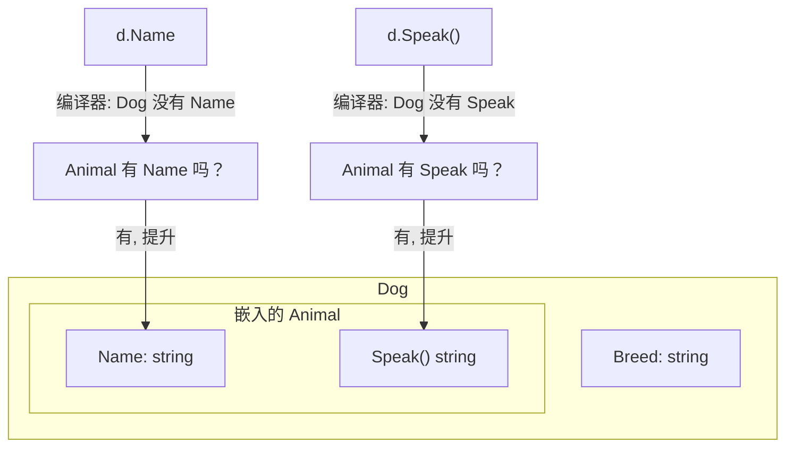
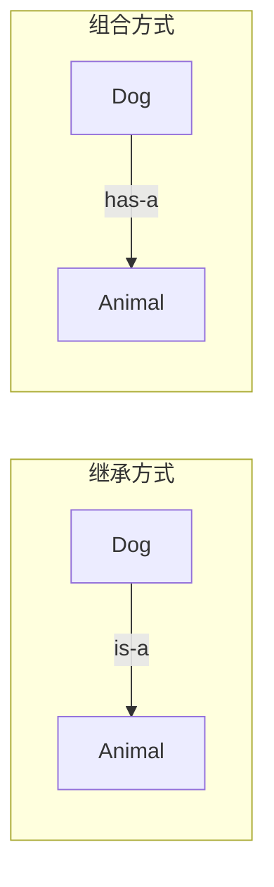

# Go 面向对象（二）：嵌入与组合——Go 对继承的回答

> 本文基于 Go 1.24。

## 继承是问题，不是答案

面向对象编程教了我们一件看似正确的事：用继承复用代码。`Dog` 继承 `Animal`，`Car` 继承 `Vehicle`。层次越堆越深，最后你发现 `Penguin` 继承了 `Bird`，但企鹅不会飞——于是你 override `fly()` 让它抛异常，或者把 `Bird` 拆成 `FlyingBird` 和 `NonFlyingBird`。

Go 的设计者看到了这一点，选择了另一条路：**根本没有继承，只有嵌入（embedding）和组合（composition）**。

这不是功能缺失——是刻意的设计决策。

## struct embedding：把类型嵌进去

```go
type Animal struct {
    Name string
}

func (a Animal) Speak() string {
    return "..."
}

type Dog struct {
    Animal          // 嵌入 Animal——不是继承
    Breed string
}
```

两条关键语义：
1. `Dog` **拥有了** `Animal` 的所有字段和方法——像是自动委派
2. `Dog` **不是** `Animal`——没有 is-a 关系

```go
func main() {
    d := Dog{
        Animal: Animal{Name: "旺财"},
        Breed:  "金毛",
    }

    // 字段提升：可以直接访问 Name
    fmt.Println(d.Name)  // "旺财"
    // 等价于
    fmt.Println(d.Animal.Name) // "旺财"

    // 方法提升：可以直接调用 Speak()
    fmt.Println(d.Speak()) // "..."
    // 等价于
    fmt.Println(d.Animal.Speak()) // "..."
}
```

这样的提升不是魔法——编译器在 `Dog` 没有 `Name` 字段时，会自动去嵌入的 `Animal` 上找。找到了，就委派过去。



## 方法覆盖：不是 override，是 shadow

嵌入的类型有 `Speak()`，你也可以给 `Dog` 定义自己的 `Speak()`：

```go
func (d Dog) Speak() string {
    return "汪汪！"
}

func main() {
    d := Dog{Animal: Animal{Name: "旺财"}}
    fmt.Println(d.Speak())       // "汪汪！" —— Dog 的方法
    fmt.Println(d.Animal.Speak()) // "..."   —— 嵌入的 Animal 方法
}
```

这不是 Java 式的 override——嵌入类型的原始方法依然存在、依然可调用。你只是遮掩（shadow）了它，没有销毁它。这让行为更加可控：想要 Dog 的行为就调 `d.Speak()`，想要 Animal 的行为就调 `d.Animal.Speak()`。

## 多嵌：组合的真正力量

一个类型可以嵌入多个类型：

```go
type Reader interface {
    Read(p []byte) (n int, err error)
}

type Writer interface {
    Write(p []byte) (n int, err error)
}

// 组合 Reader 和 Writer
type ReadWriter struct {
    io.Reader  // 嵌入接口也行
    io.Writer
}

func main() {
    rw := ReadWriter{
        Reader: strings.NewReader("hello"),
        Writer: os.Stdout,
    }
    // rw 同时有 Read 和 Write 方法
    data, _ := io.ReadAll(rw) // 直接当 Reader 用
    fmt.Println(string(data))
}
```

这就是 Go 的 composition over inheritance——不是 `ReadWriter extends Reader, Writer`，而是 `ReadWriter` **拥有** `Reader` 和 `Writer`。它既是一个 Reader，也是一个 Writer，但它不「继承」任何东西。

## 嵌入不是继承：关键区别

```go
// 场景：你想把一个 Dog 传给需要 Animal 的函数
func PrintName(a Animal) {
    fmt.Println(a.Name)
}

d := Dog{Animal: Animal{Name: "旺财"}}

// PrintName(d)  // ❌ 编译错误：Dog is not Animal
PrintName(d.Animal) // ✅ 可以的——因为 Dog 包含一个 Animal
```

这就是核心差异——**Dog 有一个 Animal，但 Dog 不是一个 Animal**。Go 没有 is-a，只有 has-a。多态不是通过继承来实现的——它留给接口来做，下一篇会讲。



## 实战：用嵌入重写一个 OOP 继承层次

从一个典型的 Java 式继承开始：

```java
// 传统的继承方式
class Vehicle {
    protected String brand;
    void start() { ... }
}

class Car extends Vehicle {
    void drive() { ... }
}

class ElectricCar extends Car {
    void charge() { ... }
}
```

Go 的做法：

```go
type Vehicle struct {
    Brand string
}

func (v Vehicle) Start() {
    fmt.Printf("%s engine started\n", v.Brand)
}

type Car struct {
    Vehicle
}

func (c Car) Drive() {
    fmt.Printf("%s is driving\n", c.Brand)
}

type ElectricCar struct {
    Car
    BatteryPct int
}

func (ec ElectricCar) Charge() {
    ec.BatteryPct = 100
    fmt.Printf("%s charged to %d%%\n", ec.Brand, ec.BatteryPct)
}

func main() {
    tesla := ElectricCar{
        Car: Car{
            Vehicle: Vehicle{Brand: "Tesla"},
        },
        BatteryPct: 80,
    }

    tesla.Start()  // Tesla engine started（从 Vehicle 提升）
    tesla.Drive()  // Tesla is driving（从 Car 提升）
    tesla.Charge() // Tesla charged to 100%
}
```

层次越深，初始化代码越长——这其实是好事：它提醒你思考「这个层次结构有没有更简单的表达方式」。大多数情况下，一层嵌入就足够了。

## 什么时候用嵌入

**适合嵌入：**
- 你想暴露嵌入类型的所有方法（如 `sync.Mutex` 嵌入到你的结构体里）
- 你要表达的确实是 has-a 关系
- 嵌入的类型在你的包里定义或你很熟悉

**不适合嵌入（用命名字段替代）：**
- 嵌入会造成字段/方法名冲突
- 你不希望暴露嵌入类型的所有公开方法
- 你需要限制外部对嵌入字段的访问

```go
// 嵌入——暴露了 Mutex 的 Lock/Unlock
type SafeCounter struct {
    sync.Mutex  // 外部可以直接 c.Lock()
    value int
}

// 命名字段——不暴露
type SafeCounter struct {
    mu    sync.Mutex // 外部不能直接访问 mu
    value int
}

func (c *SafeCounter) Inc() {
    c.mu.Lock()
    defer c.mu.Unlock()
    c.value++
}
```

两种方式都有用——嵌入适合「我要把这个类型的能力全部暴露出去」，命名字段适合「我要封装这个能力」。

## 小结

Go 没有继承，用嵌入和组合替代。方法提升让嵌入的类型像继承一样方便，但语义上始终保持 has-a 而非 is-a。这不是 Go 的缺点——它是 Go 对「继承被滥用了」这个观察的回答。

下一篇讨论 Go OOP 中最与众不同的设计：隐式接口。

---

**上一篇：** [（一）结构体与方法](01-struct-and-methods.md)
**下一篇：** [（三）隐式接口：Go 最与众不同的设计](03-interfaces.md)
