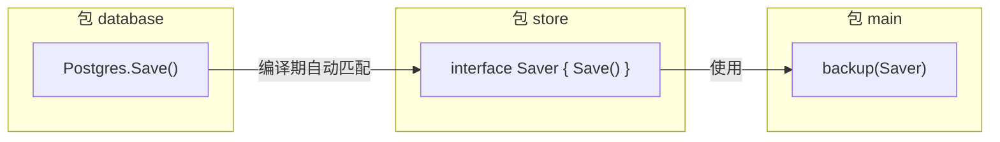

# Go 面向对象（三）：隐式接口——Go 最与众不同的设计

> 本文基于 Go 1.24。

## 没有 `implements` 关键字

Java 里声明接口实现是显式的：

```java
class Dog implements Animal { ... }
class Cat implements Animal { ... }
```

如果去掉 `implements Animal`，代码编译不过。这意味着**你在用类型之前就必须声明它实现什么接口**。

Go 的设计正好相反：

```go
type Animal interface {
    Speak() string
}

type Dog struct{}
func (d Dog) Speak() string { return "汪汪" }

type Cat struct{}
func (c Cat) Speak() string { return "喵喵" }

// 没有任何 "Dog implements Animal" 声明。
// 但只要 Dog 有 Speak() string 方法，它就自动满足 Animal 接口。
func MakeSound(a Animal) {
    fmt.Println(a.Speak())
}

func main() {
    MakeSound(Dog{}) // "汪汪"
    MakeSound(Cat{}) // "喵喵"
}
```

这就是 Go 的隐式接口——**你不需要声明你实现了什么接口，编译器会自己检查**。Dog 和 Cat 的定义里完全没有出现 Animal 两个字，但任何需要 Animal 的地方都能接收它们。

## 为什么这样设计

显式实现有三个问题：

1. **耦合**——类型定义必须 import 接口所在的包（或者接口必须和类型在同一个包）
2. **僵化**——先定义接口，再定义实现。如果后来发现两个完全不相关的包里有相同签名的方法，你也无法让它们共享接口——除非回去改每个类型的声明
3. **冗余**——你已经写了方法，还要再声明一次「我确实写了这个方法」

Go 的做法解耦了接口和实现：

```go
// 包 A：定义接口
package store

type Saver interface {
    Save(data []byte) error
}

// 包 B：定义类型——完全不引用包 A
package database

type Postgres struct { ... }
func (p *Postgres) Save(data []byte) error { ... }

// 包 C：消费接口——把 B 的类型当 A 的接口用
package main

func backup(s store.Saver) {
    s.Save(someData)
}

func main() {
    db := &database.Postgres{...}
    backup(db) // Postgres 被自动当作 store.Saver 使用
}
```

`Postgres` 的作者完全不知道 `store.Saver` 的存在。他只是写了一个有 `Save` 方法的类型。但 `main` 包里可以直接把 `Postgres` 传给需要 `Saver` 的地方——编译器自动验证签名匹配。



## 小接口哲学

Go 标准库里的接口通常只有 1-3 个方法：

```go
// io.Reader——1 个方法，一切可以读的东西
type Reader interface {
    Read(p []byte) (n int, err error)
}

// io.Writer——1 个方法，一切可以写的东西
type Writer interface {
    Write(p []byte) (n int, err error)
}

// io.Closer——1 个方法，一切可以关闭的东西
type Closer interface {
    Close() error
}

// 组合小接口得到大接口
type ReadWriteCloser interface {
    Reader
    Writer
    Closer
}
```

Java 式的接口通常是「一个类能做什么」——大而全。Go 式的接口是「我需要什么」——小而精。

```
// Java 风格（不要这样写 Go 接口）
type UserRepository interface {
    Create(user User) error
    Update(user User) error
    Delete(id int) error
    FindByID(id int) (User, error)
    FindAll() ([]User, error)
}

// Go 风格（按需定义）
type UserReader interface {
    FindByID(id int) (User, error)
}

type UserWriter interface {
    Create(user User) error
}
```

按需定义的威力：一个函数如果只需要读用户，它的签名就是 `func GetUser(r UserReader, id int)`——而不是 `func GetUser(r UserRepository, id int)`。调用者不需要提供一个完整的 Repository，只需要提供一个能读用户的东西。测试的时候 mock 一个方法就够了，不用 mock 五个。

## `interface{}` 和 `any`

Go 1.18 之前，空接口 `interface{}` 表示「任何类型」：

```go
func Print(v interface{}) {
    fmt.Println(v)
}
```

Go 1.18 引入了 `any` 作为 `interface{}` 的类型别名：

```go
func Print(v any) { // 完全等价于 interface{}
    fmt.Println(v)
}
```

`any` 更好读、更好写，新代码应该用 `any`。但要注意——把 `any` 到处用是在放弃类型安全。合理的用法是：容器（如 `[]any`）、Print/Debug 函数、JSON 解析中间态。业务逻辑的签名里出现 `any` 通常是设计问题。

## 接口的常见陷阱

### 陷阱一：nil 接口 ≠ nil 具体值

这是 Go 面试最喜欢考的点：

```go
func GetError() error {
    var p *MyError = nil // p 是 nil
    return p             // 但返回的 error 接口不是 nil！
}

func main() {
    err := GetError()
    if err != nil {
        fmt.Println("err is not nil!") // 这行会执行
    }
    fmt.Printf("%v\n", err) // <nil>
}
```

解释：一个接口值有两部分——类型指针和数据指针。`p` 的类型指针指向 `*MyError`（非 nil），数据指针是 nil。所以接口值本身不是 nil。

```
正确做法：
func GetError() error {
    if somethingWrong {
        return &MyError{...}
    }
    return nil // 直接 return nil，不要 return 一个 nil 指针
}
```

### 陷阱二：编译期检查接口实现

如果想让编译器帮你验证某个类型是否实现了某个接口：

```go
// 编译期断言——编译不过就是没实现
var _ http.Handler = (*MyHandler)(nil)
//                  ^^^^^^^^^^^^^^^^
//                  这是一个 *MyHandler 类型的 nil 指针
```

这行代码不会产生任何运行开销——编译器在编译期验证，检查完就丢掉了。

### 陷阱三：接口应该定义在使用方

```go
// ❌ 在实现方定义接口
package animals

type Animal interface {
    Speak() string
}
type Dog struct{}
func (d Dog) Speak() string { return "汪汪" }

// ✅ 在使用方定义接口
package circus

type Performer interface {
    Perform() string
}

// 只要 Dog（或任何类型）有 Perform 方法，就能在马戏团表演
```

这一点和 Java/C# 完全相反——Go 建议把接口定义在**使用**它的地方，而不是**实现**它的地方。这样做的好处：实现方不需要知道自己的使用者定义了什么接口，降低了包之间的耦合。

## 小结

隐式接口是 Go OOP 中最有辨识度的设计。它不需要 `implements` 关键字，遵循小接口哲学，鼓励在调用方定义接口。这些加在一起，形成了一个和主流 OOP 语言完全不同的抽象方式。

下一篇讨论这些接口怎么实现多态——类型断言和 type switch。

---

**上一篇：** [（二）嵌入与组合：Go 对继承的回答](02-embedding.md)
**下一篇：** [（四）多态与类型断言：接口之下的灵活性](04-polymorphism.md)
