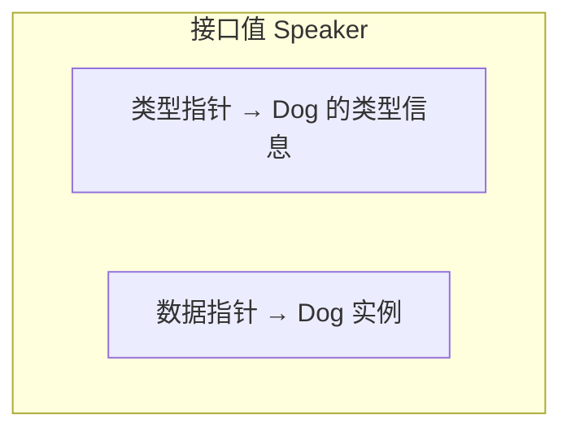

# Go 面向对象（四）：多态与类型断言——接口之下的灵活性

> 本文基于 Go 1.24。

## 接口就是 Go 的多态

多态（polymorphism）的核心含义：**同一个操作，不同的类型表现出不同的行为**。

Go 里实现多态只有一个方式——接口。没有泛型继承，没有虚函数表，没有方法重载。一个接口变量可以持有任何满足该接口的类型，调用方法时自动分发到对应实现。

```go
type Speaker interface {
    Speak() string
}

type Dog struct{}
func (d Dog) Speak() string { return "汪汪" }

type Cat struct{}
func (c Cat) Speak() string { return "喵喵" }

type Robot struct{}
func (r Robot) Speak() string { return "Hello World" }

func main() {
    speakers := []Speaker{Dog{}, Cat{}, Robot{}}
    for _, s := range speakers {
        fmt.Println(s.Speak())
    }
    // 汪汪
    // 喵喵
    // Hello World
}
```

`[]Speaker` 里存了三种完全不同的类型，但不需要做任何类型注册、继承声明——有 `Speak() string` 方法就能放进去。

## 接口值的内部结构

理解多态的运行时行为，需要知道接口值长什么样：



一个接口值由两个指针组成：一个指向**类型信息**（这个值是什么类型），一个指向**实际数据**。调用 `s.Speak()` 时，运行时通过类型指针找到对应的方法实现，然后用数据指针作为接收者来调用。

这就是为什么「nil 接口 ≠ nil 具体值」——接口值如果是 nil，两个指针都是 nil。但如果类型指针不为 nil 而数据指针为 nil，接口值就不是 nil（虽然它持有的具体值是 nil）。

## 类型断言：取回具体类型

接口可以接收不同类型，但总要有一个时机你需要知道它「到底」是什么：

```go
func Describe(s Speaker) {
    // 类型断言：s 是 Dog 吗？
    if dog, ok := s.(Dog); ok {
        fmt.Printf("这是一只狗：%s\n", dog.Speak())
        return
    }
    if cat, ok := s.(Cat); ok {
        fmt.Printf("这是一只猫：%s\n", cat.Speak())
        return
    }
    // 不知道是什么类型
    fmt.Printf("未知生物：%s\n", s.Speak())
}
```

类型断言语法是 `x.(T)`：
- `x` 是接口变量
- `T` 是你猜测的具体类型
- 单返回值写法 `x.(T)` 在断言失败时 **panic**
- 双返回值写法 `value, ok := x.(T)` 在断言失败时 `ok=false`，**推荐使用**

```go
// ❌ 危险——如果 s 不是 Dog 会 panic
dog := s.(Dog)

// ✅ 安全——自己处理失败情况
dog, ok := s.(Dog)
if !ok {
    log.Println("类型断言失败")
    return
}
```

## type switch：更优雅的断言

当需要判断多种类型时，`if-else` 链不如 type switch 清晰：

```go
func Describe(s any) {
    switch v := s.(type) {
    case Dog:
        fmt.Printf("狗: %s\n", v.Speak())
    case Cat:
        fmt.Printf("猫: %s\n", v.Speak())
    case Robot:
        fmt.Printf("机器人: %s\n", v.Speak())
    case nil:
        fmt.Println("是 nil")
    default:
        fmt.Printf("未知类型: %T\n", v)
    }
}
```

`switch v := s.(type)` 的语法只允许在 switch 里使用。`v` 在每个 case 里会被自动断言成对应的具体类型——case Dog 里 `v` 就是 `Dog` 类型，可以直接用。

## 真实场景：错误处理

Go 生态里最经典的类型断言场景是错误处理：

```go
// net 包定义了一个具体错误类型
type DNSError struct {
    Err         string
    Name        string
    Server      string
    IsTimeout   bool
    IsTemporary bool
}

func (e *DNSError) Error() string { ... }

// 业务代码用类型断言做错误分类
func dial(addr string) error {
    _, err := http.Get("http://" + addr)
    if err != nil {
        // 尝试把 error 接口转回具体类型
        var dnsErr *net.DNSError
        if errors.As(err, &dnsErr) {
            if dnsErr.IsTimeout {
                fmt.Println("DNS 查询超时")
            }
            if dnsErr.IsTemporary {
                fmt.Println("临时性错误，可以重试")
            }
        }
    }
    return err
}
```

Go 1.13 引入的 `errors.As` 是类型断言的推荐替代方案——它和 `err.(*net.DNSError)` 做的事情一样，但能正确处理错误包装链（`fmt.Errorf("...: %w", err)`）。

## 空接口的陷阱

`any`（即 `interface{}`）的灵活性是有代价的：

```go
func Process(data any) {
    // 取出具体类型只能靠类型断言
    switch v := data.(type) {
    case int:
        fmt.Println(v * 2)
    case string:
        fmt.Println(strings.ToUpper(v))
    default:
        fmt.Printf("不支持的类型: %T\n", v)
    }
}
```

`any` 类型把类型检查从编译期推迟到了运行期。如果你的函数签名里全是 `any`，你就失去了 Go 最大的优势——编译期类型安全。**把 `any` 用在不得不用的地方（JSON 解析、容器、反射），业务函数里优先用具体类型或带方法的接口。**

## 实战：一个基于接口的多态系统

```go
// 支付方式——定义一个接口，不是定义一个基类
type PaymentMethod interface {
    Pay(amount float64) error
    Name() string
}

// 支付宝
type Alipay struct {
    Account string
}

func (a Alipay) Pay(amount float64) error {
    fmt.Printf("[支付宝] 从 %s 支付 %.2f 元\n", a.Account, amount)
    return nil
}

func (a Alipay) Name() string {
    return "支付宝"
}

// 微信支付
type WechatPay struct {
    OpenID string
}

func (w WechatPay) Pay(amount float64) error {
    fmt.Printf("[微信] 从 %s 支付 %.2f 元\n", w.OpenID, amount)
    return nil
}

func (w WechatPay) Name() string {
    return "微信支付"
}

// 银行卡（有特殊逻辑——大于 5000 需要短信验证）
type BankCard struct {
    CardNo string
    Bank   string
}

func (b BankCard) Pay(amount float64) error {
    if amount > 5000 {
        fmt.Printf("[银行卡] 金额 %.2f 超过 5000，需要短信验证\n", amount)
    }
    fmt.Printf("[银行卡] 从 %s 支付 %.2f 元\n"+
        "", b.CardNo, amount)
    return nil
}

func (b BankCard) Name() string {
    return fmt.Sprintf("%s 银行卡", b.Bank)
}

// 支付服务——只依赖接口，不依赖具体类型
type CheckoutService struct{}

func (cs CheckoutService) Checkout(method PaymentMethod, amount float64) error {
    fmt.Printf("使用 %s 支付 %.2f 元\n", method.Name(), amount)
    if err := method.Pay(amount); err != nil {
        return fmt.Errorf("支付失败: %w", err)
    }
    fmt.Println("支付成功！")
    return nil
}

func main() {
    cs := CheckoutService{}

    // 运行时选择支付方式——多态
    methods := []PaymentMethod{
        Alipay{Account: "user@example.com"},
        WechatPay{OpenID: "wxid_abc123"},
        BankCard{CardNo: "6222****1234", Bank: "招商银行"},
    }

    for _, m := range methods {
        cs.Checkout(m, 100.50)
    }
}
```

这个系统要加一个新的支付方式（比如 PayPal）——只需要定义一个新的类型、实现 `Pay(amount float64) error` 和 `Name() string` 两个方法。`CheckoutService` 一行代码都不用改。这就是面向接口编程和多态的真正威力。

## 小结

Go 的多态精简到了一个概念——接口。类型断言和 type switch 是从接口回到具体类型的桥梁。把接口用好的关键是：**接口定义在使用方，方法签名叫编译器做耦合，类型断言留给最外围的错误处理和分发逻辑**。

下一篇讨论几个在实战中最常见的 Go OOP 惯用模式。

---

**上一篇：** [（三）隐式接口：Go 最与众不同的设计](03-interfaces.md)
**下一篇：** [（五）惯用模式：Functional Options 与组合之道](05-patterns.md)
