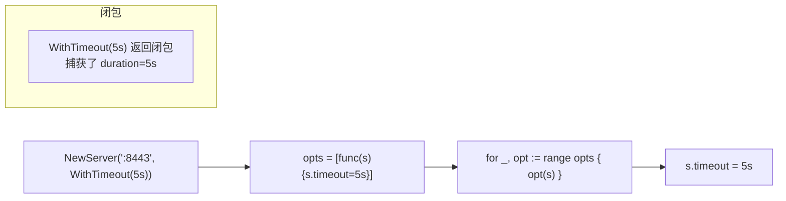
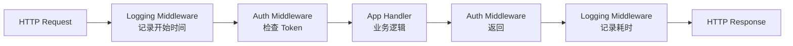

# Go 面向对象（五）：惯用模式——Functional Options 与组合之道

> 本文基于 Go 1.24。

## 系列收官：从概念到模式

前四篇覆盖了 Go OOP 的核心机制——结构体、方法、嵌入、接口、多态。这一篇把这些机制串起来，讨论三个在 Go 生态中反复出现的惯用模式。它们不是语言特性，但几乎是写 Go 代码的必修课。

## 模式一：Functional Options —— 告别构造函数地狱

### 问题

一个结构体有 5 个可选参数。传统的做法：

```go
// ❌ 构造函数地狱
func NewServer(addr string, timeout time.Duration, maxConns int,
    tls bool, logger *log.Logger) *Server {
    return &Server{...}
}

// 调用方看着一长串参数不知所措
s := NewServer(":8080", 30*time.Second, 100, false, nil)
// ":8080" 知道了，30s 也看懂了，false 是什么？最后一个 nil 又是什么？
```

### 解决方案：Functional Options

```go
type Server struct {
    addr     string
    timeout  time.Duration
    maxConns int
    tls      bool
    logger   *log.Logger
}

// Option 是一个函数类型——修改 Server 的配置
type Option func(*Server)

// 每个可选参数对应一个 With 函数
func WithTimeout(d time.Duration) Option {
    return func(s *Server) {
        s.timeout = d
    }
}

func WithMaxConns(n int) Option {
    return func(s *Server) {
        s.maxConns = n
    }
}

func WithTLS() Option {
    return func(s *Server) {
        s.tls = true
    }
}

func WithLogger(l *log.Logger) Option {
    return func(s *Server) {
        s.logger = l
    }
}

// 构造函数——必选参数显式传入，可选参数用 Option
func NewServer(addr string, opts ...Option) *Server {
    // 默认值
    s := &Server{
        addr:     addr,
        timeout:  30 * time.Second,  // 默认超时
        maxConns: 100,                // 默认最大连接数
        logger:   log.Default(),      // 默认 logger
    }
    // 应用选项
    for _, opt := range opts {
        opt(s)
    }
    return s
}

func main() {
    // 只传必选参数，用默认值
    s1 := NewServer(":8080")

    // 需要自定义的才传
    s2 := NewServer(":8443",
        WithTLS(),
        WithTimeout(5*time.Second),
        WithMaxConns(1000),
    )
}
```

这个模式的核心技巧：**Option 是 `func(*Server)` 类型，With 函数返回一个闭包**。闭包捕获了用户传入的值，等到 `NewServer` 里被调用时才写到 Server 上。



### 为什么不用 Config 结构体

```go
// 另一种常见做法
type Config struct {
    Timeout  time.Duration
    MaxConns int
    TLS      bool
}
func NewServer(addr string, cfg Config) *Server { ... }
```

Config 结构体的缺点是零值歧义——用户没填 `Timeout` 时，它的值是 `0`（零值）。你怎么区分「用户没传」和「用户确实想设成 0」？Functional Options 解决了这个问题——用户没传的 Option 就使用默认值，没有歧义。

## 模式二：accept interfaces, return structs

这是 Go 社区最著名的设计原则之一：

```go
// ✅ 参数用接口——接受任何满足接口的类型
func SaveData(w io.Writer, data []byte) error {
    _, err := w.Write(data)
    return err
}

// ✅ 返回值用具体类型——给调用者最大的灵活性
func NewFileWriter(path string) *os.File {
    f, _ := os.Create(path)
    return f
}
```

**参数用接口**的理由：`SaveData` 不关心数据写到哪——文件、网络连接、bytes.Buffer、HTTP response——只要是 `io.Writer` 就行。这给了调用者最大的自由，也方便测试（测试时传 `&bytes.Buffer{}` 即可）。

**返回值用具体类型**的理由：返回具体类型，调用者可以使用类型的所有方法。如果返回接口，调用者就只能用接口定义的方法——其他方法（比如 `*os.File` 的 `Stat()`、`Readdir()`）都不可用了。而且，调用者如果需要一个接口，他自己做类型转换就行——Go 的隐式接口让这毫无成本。

```go
// ❌ 反模式：返回接口
func NewUserRepo() UserRepository {
    return &postgresUserRepo{...}
}

// ✅ 正确：返回具体类型
func NewUserRepo() *PostgresUserRepo {
    return &PostgresUserRepo{...}
}

// 调用者如果需要一个接口，自己封装
var repo UserRepository = NewUserRepo()
```

唯一例外：返回 `error` 接口（这本身就是 Go 的约定）。

## 模式三：用组合实现中间件

Go 没有继承，但用接口组合可以实现极其灵活的中间件链：

```go
// 核心接口——只关心 ServeHTTP
type Handler interface {
    ServeHTTP(w http.ResponseWriter, r *http.Request)
}

// 中间件——一个函数，接收 Handler，返回 Handler
type Middleware func(Handler) Handler

// 日志中间件
func LoggingMiddleware(logger *log.Logger) Middleware {
    return func(next Handler) Handler {
        return HandlerFunc(func(w http.ResponseWriter, r *http.Request) {
            start := time.Now()
            logger.Printf("→ %s %s", r.Method, r.URL.Path)
            next.ServeHTTP(w, r)
            logger.Printf("← %s %s (%v)", r.Method, r.URL.Path, time.Since(start))
        })
    }
}

// 认证中间件
func AuthMiddleware(token string) Middleware {
    return func(next Handler) Handler {
        return HandlerFunc(func(w http.ResponseWriter, r *http.Request) {
            if r.Header.Get("Authorization") != "Bearer "+token {
                http.Error(w, "Unauthorized", 401)
                return
            }
            next.ServeHTTP(w, r)
        })
    }
}

// 组合中间件链
func Chain(h Handler, middlewares ...Middleware) Handler {
    // 从右到左包裹——最外层的先执行
    for i := len(middlewares) - 1; i >= 0; i-- {
        h = middlewares[i](h)
    }
    return h
}

// HandlerFunc 是一个函数类型的适配器——让普通函数实现 Handler 接口
type HandlerFunc func(w http.ResponseWriter, r *http.Request)

func (f HandlerFunc) ServeHTTP(w http.ResponseWriter, r *http.Request) {
    f(w, r)
}
```

使用：

```go
func main() {
    // 核心业务逻辑
    app := HandlerFunc(func(w http.ResponseWriter, r *http.Request) {
        fmt.Fprintln(w, "Hello, World")
    })

    // 组装中间件——声明式的
    h := Chain(app,
        LoggingMiddleware(log.Default()),
        AuthMiddleware("my-secret-token"),
    )

    http.ListenAndServe(":8080", h)
}
```



这个模式只依赖两个东西：一个接口（`Handler`）和一个函数类型（`Middleware`）。没有继承、没有反射、没有框架——就是类型和函数的组合。

## 小结

三个模式串起来就是 Go OOP 的实践准则：

- **Functional Options** 解决复杂构造——闭包 + 可变参数，比 Config 结构体更清晰
- **accept interfaces, return structs** 指导你的 API 设计——最大化灵活性的同时不给调用者添负担
- **中间件模式** 展示组合的真正威力——一个接口 + 一个函数类型，搞定所有横切关注点

Go 的 OOP 不是「用结构体模拟类」，而是一套不同的思维模型——数据和行为分开定义、隐式接口解耦依赖、组合替代继承。五篇文章下来，应该已经能感受到：Go 少了 class 关键字，但多出来的简洁和灵活性，值得放下旧习惯去适应。

---

**上一篇：** [（四）多态与类型断言：接口之下的灵活性](04-polymorphism.md)
