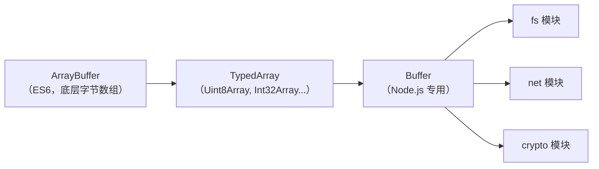

# Node.js Buffer：为什么要用二进制，以及每次 `readFile` 背后发生了什么

> 本文基于 Node.js 22.x。

## `readFile` 返回的不是字符串

```javascript
const fs = require('fs');

// 默认返回 Buffer
const data = fs.readFileSync('hello.txt');
console.log(data);             // <Buffer 48 65 6c 6c 6f>
console.log(typeof data);      // object
console.log(Buffer.isBuffer(data));  // true

// 指定编码才返回字符串
const text = fs.readFileSync('hello.txt', 'utf8');
console.log(text);             // Hello
```

大多数 Node.js 开发者天天用 `readFile`，但未必意识到如果不传 `utf8`，拿到的不是字符串——是 **Buffer**。Buffer 是 Node.js 在 JavaScript 里处理二进制数据的方案。

## 为什么 JavaScript 需要 Buffer

JavaScript 原生有 `ArrayBuffer`、`TypedArray`。Node.js 在 V8 还没有 `TypedArray` 的年代就造了 Buffer。后来 ES6 引入了 `ArrayBuffer`，但 Buffer 已经在 Node.js 生态里根深蒂固——`fs`、`net`、`http`、`crypto`、`stream` 全用它。

Buffer 和 `Uint8Array` 的关系：

```javascript
// Buffer 是 Uint8Array 的子类（Node 4+）
const buf = Buffer.from([0x48, 0x65, 0x6c, 0x6c, 0x6f]);
console.log(buf instanceof Uint8Array);  // true

// 可以互相转
const uint8 = new Uint8Array([72, 101, 108, 108, 111]);
const buf2 = Buffer.from(uint8);         // Uint8Array → Buffer

// 但 Buffer 有额外的 API
console.log(buf.toString('utf8'));       // Hello（Uint8Array 没有）
console.log(buf.toString('hex'));        // 48656c6c6f
console.log(buf.toString('base64'));     // SGVsbG8=
```



## 创建 Buffer 的四种方式

```javascript
// 1. 指定大小——预分配内存（未初始化，可能含旧数据）
const buf1 = Buffer.alloc(10);             // <Buffer 00 00 00 00 00 00 00 00 00 00>
const buf2 = Buffer.allocUnsafe(10);       // 不初始化——快但可能泄露旧内存数据

// 2. 从数组/字符串创建
const buf3 = Buffer.from([0x48, 0x65]);    // <Buffer 48 65>
const buf4 = Buffer.from('Hello');          // <Buffer 48 65 6c 6c 6f>
const buf5 = Buffer.from('你好', 'utf8');   // <Buffer e4 bd a0 e5 a5 bd>

// 3. 从 base64 解码
const buf6 = Buffer.from('SGVsbG8=', 'base64');  // <Buffer 48 65 6c 6c 6f>

// 4. 从 hex 解码
const buf7 = Buffer.from('48656c6c6f', 'hex');   // <Buffer 48 65 6c 6c 6f>
```

### alloc vs allocUnsafe：性能 vs 安全

```javascript
console.time('alloc');
for (let i = 0; i < 1_000_000; i++) Buffer.alloc(1024);
console.timeEnd('alloc');           // ~800ms（每次清零 1024 字节）

console.time('allocUnsafe');
for (let i = 0; i < 1_000_000; i++) Buffer.allocUnsafe(1024);
console.timeEnd('allocUnsafe');     // ~120ms（不管旧数据）
```

`allocUnsafe` 快 6-7 倍，但从内存池里拿到的区域可能包含之前释放的敏感数据（密码、密钥）。**除非你立即用新数据覆盖整个 buffer，否则用 `alloc`。**

## Buffer 的编码转换

```javascript
const text = 'Hello 你好';

// 编码：字符串 → 各种格式的 Buffer
const utf8     = Buffer.from(text, 'utf8');      // UTF-8（默认）
const hex      = Buffer.from(text, 'hex');       // 把 hex 字符串解码为字节
const base64   = Buffer.from('SGVsbG8=', 'base64');

// 解码：Buffer → 字符串
console.log(utf8.toString('utf8'));     // Hello 你好
console.log(utf8.toString('hex'));      // 48656c6c6f20e4bda0e5a5bd
console.log(utf8.toString('base64'));   // SGVsbG8g5L2g5aW9
console.log(utf8.toString('latin1'));   // Hello ä½ å¥½（非 ASCII 乱码）
```

支持的编码：

| 编码 | 用途 |
|------|------|
| `utf8` | Web 世界的默认编码 |
| `hex` | 调试——把二进制打印成十六进制字符串 |
| `base64` / `base64url` | HTML 内嵌图片、JWT、Data URL |
| `latin1` | 单字节编码（0-255）——适合二进制数据的字符串化 |

## Buffer 的读写操作

```javascript
const buf = Buffer.alloc(8);

// 写入不同位宽的值
buf.writeUInt8(0xFF, 0);        // 偏移 0 写 1 字节: FF
buf.writeUInt16BE(0x1234, 1);   // 偏移 1 写 2 字节（大端）: 12 34
buf.writeUInt32LE(0x56789ABC, 3); // 偏移 3 写 4 字节（小端）: BC 9A 78 56

console.log(buf);  // <Buffer ff 12 34 bc 9a 78 56 00>

// 读出
console.log(buf.readUInt8(0));        // 255
console.log(buf.readUInt16BE(1));     // 4660 (0x1234)
console.log(buf.readUInt32LE(3));     // 1450744508 (0x56789ABC)
```

### 大端 vs 小端——每个字节的两种解释方式

```javascript
const buf = Buffer.alloc(4);
buf.writeUInt32BE(0x12345678, 0);
console.log(buf);  // <Buffer 12 34 56 78>（大端：高位在前）

const buf2 = Buffer.alloc(4);
buf2.writeUInt32LE(0x12345678, 0);
console.log(buf2);  // <Buffer 78 56 34 12>（小端：低位在前）
```

| 字节序 | 规则 | 谁在用 |
|--------|------|--------|
| 大端（BE） | 高位字节存低地址 | 网络协议（TCP/IP）、JPEG |
| 小端（LE） | 低位字节存低地址 | x86/ARM CPU |

网络字节序是大端——解析 TCP 包时用 `readUInt16BE`。CPU 内部是小端——读本地文件二进制 header 时用 `readUInt32LE`。**用错字节序，读到的数字完全不对。**

## 实战一：解析 PNG 文件头

PNG 文件的前 8 个字节是固定的签名：

```javascript
const fs = require('fs');

const buf = fs.readFileSync('image.png');

// PNG 签名：8 字节
const signature = buf.slice(0, 8);
const expected = Buffer.from([137, 80, 78, 71, 13, 10, 26, 10]);
console.log(signature.equals(expected));  // true → 确实是 PNG

// 跳过 8 字节签名 → 读 IHDR chunk
// IHDR: 4 字节长度 + 4 字节类型 + 数据 + 4 字节 CRC
const length = buf.readUInt32BE(8);       // IHDR 数据长度（大端）
const type = buf.slice(12, 16).toString(); // IHDR

// 图片尺寸在 IHDR 数据的前 8 字节
const width = buf.readUInt32BE(16);       // 宽度（大端）
const height = buf.readUInt32BE(20);      // 高度（大端）
const bitDepth = buf.readUInt8(24);       // 位深度
const colorType = buf.readUInt8(25);      // 颜色类型

console.log(`${type}: ${width}×${height}, ${bitDepth}bit, type=${colorType}`);
// → IHDR: 800×600, 8bit, type=2
```

不用任何图片库——几十行代码就解析了 PNG 头。Buffer 的读写 API 配合偏移量，直接操作二进制格式。

## 实战二：TCP 粘包处理

TCP 是流式的——你发三次"Hello"，对方可能一次收到"HelloHelloHello"。

```javascript
const net = require('net');

const server = net.createServer((socket) => {
  let leftover = Buffer.alloc(0);  // 上一次剩余的半截数据

  socket.on('data', (chunk) => {
    // 1. 拼接上次剩余 + 新数据
    const data = Buffer.concat([leftover, chunk]);

    // 2. 循环读完整包——协议：4 字节长度头 + body
    while (data.length >= 4) {
      const bodyLen = data.readUInt32BE(0);  // 前 4 字节 = 包长度

      if (data.length < 4 + bodyLen) break;  // 包不完整——等下次

      // 3. 取出完整包
      const body = data.slice(4, 4 + bodyLen);
      console.log(`收到消息: ${body.toString()}`);

      // 4. 切掉已处理的部分
      data = data.slice(4 + bodyLen);
    }

    leftover = data;  // 保留未处理完的残留
  });
});

server.listen(3000, () => console.log('TCP 服务器已启动'));
```

`Buffer.concat` 拼接、`readUInt32BE` 读长度头、`slice` 切出 body——三个 Buffer 操作构成了 TCP 粘包处理的核心。

## 实战三：`Buffer.from` 与 `Buffer.alloc` 的安全差异

```javascript
// ❌ 危险——new Buffer(size) 不初始化内存（Node 6+ 已废弃但还在很多旧代码里）
const password1 = Buffer.alloc(16, 0);    // 清零分配
crypto.randomFillSync(password1);         // 填随机密码
console.log(password1.toString('hex'));   // a1b2c3...

// ... 使用后手动清零（防止内存被复用后泄露）
password1.fill(0);

// ❌ 未初始化——可能泄露上一个大对象的残留数据
const unsafe = Buffer.allocUnsafe(16);
console.log(unsafe.toString('hex'));      // 可能是任何东西——旧内存
```

敏感数据（密码、密钥、Token）用 `Buffer.alloc` 分配，用完 `fill(0)` 清零——防止被垃圾回收后、内存复用时的信息泄露。

## 小结

Buffer 是 Node.js 所有 I/O 的底层数据结构。三个关键认知：

1. **Buffer 是 Uint8Array 的子类**——但在 Node.js 生态里是事实标准，`fs`/`net`/`crypto` 都返回 Buffer
2. **字节序决定数字怎么被解释**——网络协议用 BE，CPU 用 LE，用错就读错
3. **敏感数据用 `alloc` 不用 `allocUnsafe`**——用完全 `fill(0)` 清零

Buffer 不是你每天写代码会直接用的东西——但当你需要解析二进制文件、处理网络协议、或者调试一段乱码时，理解 Buffer 是理解"数据到底长什么样"的唯一途径。
