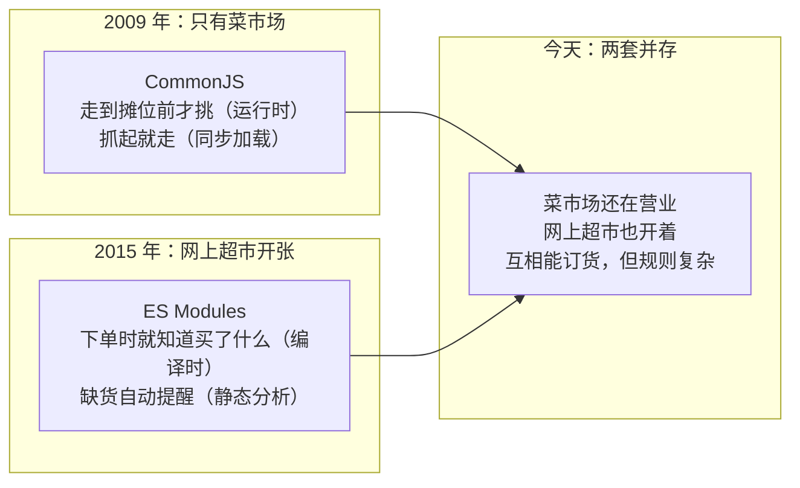
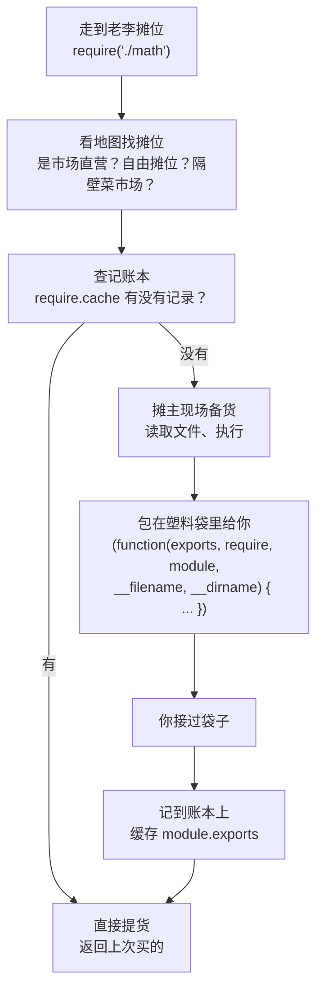

# Node.js 模块系统：菜市场 vs 网上超市——ESM 和 CommonJS 到底哪里不一样

> 基于 Node.js 22。ESM 自 v12.17 起稳定支持（实验性标志在 v8+）。

## 同一个 `import`，三种不同的行为

```javascript
import fs from 'fs';              // ① 内置模块
import express from 'express';     // ② npm 包
import { helper } from './util.js'; // ③ 本地文件
```

这段代码能不能跑，取决于 `package.json` 里有没有 `"type": "module"`、文件后缀是 `.js` 还是 `.mjs`、`express` 的 `package.json` 里有没有 `"exports"` 字段，以及你的 Node.js 版本。

类比：你去买食材，能买到什么、怎么买、付钱方式——取决于你去的是**菜市场**（CommonJS）还是**网上超市**（ES Modules）。同一个购物清单，两种完全不同的采购方式。

## 菜市场 vs 网上超市：为什么要搞两套



Node.js 2009 年诞生时选择了 CommonJS——因为那个时候 JavaScript 根本没有标准模块系统，就像只有菜市场没有网上超市。ES6 2015 年才出 `import/export` 标准，Node.js 又花了好几年才稳定支持。结果就是两种采购方式并存，而且**互操作的规则极其微妙**。

## CommonJS：菜市场买菜——走到摊位前才挑

`require` 就像在菜市场买菜——你走到一个摊位前，摊主才把菜拿出来给你。这个过程是**同步的**，你去哪个摊位买什么菜，完全可以在市场里走到一半才决定。

```javascript
// math.js —— 这是"老李的调料摊"
console.log('老李开始摆摊');
module.exports.add = (a, b) => a + b;
console.log('老李摆摊完毕');

// main.js —— 你走进菜市场
const math = require('./math');     // 走到老李的摊位前
console.log(math.add(1, 2));        // 买了调料、当场用完
// 输出：
// 老李开始摆摊         ← require 是同步的，摊主要先准备
// 老李摆摊完毕
// 3
```

`require` 的完整采购流程：



### 菜市场的五条规则

**① 记账本（缓存）是单例的——同一个摊位，第二次去直接拿**

```javascript
// a.js —— 卤味摊
module.exports = { count: 0, inc() { this.count++ } };

// b.js
const a1 = require('./a');  // 第一次去卤味摊
const a2 = require('./a');  // 第二次去——翻记账本，直接提货
console.log(a1 === a2);     // → true —— 同一份卤味
a1.inc();
console.log(a2.count);      // → 1 —— 共享状态的
```

**② `module.exports` 换老板 vs `exports` 加品类**

```javascript
// ✅ 摊主换人：module.exports 变成新老板
module.exports = function() {};   // 整个摊位换了个老板

// ❌ 挂牌子没用：exports 只是一个指向当前老板的牌子
exports = function() {};          // 你把牌子改了，但老板没变

// ✅ 在现有摊位上增加品类：没问题
exports.add = (a, b) => a + b;    // 在老李的摊位上加了"调料包"
```

原理：每个模块被包裹在 `function(exports, require, module, __filename, __dirname)` 里执行。`exports` 是参数——初始时指向 `module.exports`（老板），你给 `exports` 赋新值等于把牌子指向另一个人，但摊位本身没变。

**③ 两个摊贩互相欠货——循环引用**

```javascript
// a.js —— 老李
console.log('老李开始');
exports.b = require('./b');  // 去找老王借货 → 老王还没备好
exports.a_done = true;
console.log('老李结束');

// b.js —— 老王
console.log('老王开始');
exports.a = require('./a');  // 来找老李借货 → 老李也还没备好
exports.b_done = true;
console.log('老王结束');

// main.js
const a = require('./a');
console.log(a);
// 输出：
// 老李开始          ← 老李先被叫
// 老王开始          ← 老王被老李叫来，开始备货
// 老王结束          ← 老王备完了（但他手里老李的货是半成品）
// 老李结束          ← 老李也备完了
// { b: { a: { b_done: true }, b_done: true }, a_done: true }
//               ↑ 老王拿到的是老李的半成品货 — a_done 还没有
```

就像两个摊贩互相欠货——你先去找老李，老李说"等一下，我先去找老王借个东西"，老王说"等一下，我先去找老李……"最后两个人都勉强交差，但货不完整。**CommonJS 不报错，返回的是半成品。**

**④ 你可以在市场里走到一半才决定想买什么**

```javascript
if (process.platform === 'win32') {
    const win = require('./platform/win');   // 走到 Windows 区才买
    win.setup();
} else {
    const unix = require('./platform/unix'); // 走到 Unix 区才买
    unix.setup();
}
```

菜市场允许你边走边买——`require` 可以放在 `if` 里、函数里、循环里。

**⑤ 找摊位的规则**

```
require('./util')
  → 当前菜市场/util.js
  → 当前菜市场/util/index.js
  → 当前菜市场/util/package.json → "main" 字段（摊位指引牌）

require('express')
  → 当前菜市场/node_modules/express/index.js
  → 上一层菜市场/node_modules/express/index.js
  → ... 一直向上翻，翻到根目录
```

## ES Modules：网上超市——下单前必须选好

`import` 就像在网上下单——你必须在下单页面（文件顶层）就把所有要买的东西选好，不能下单下到一半突然加购。这是**静态的**——系统在结账时就知道了你要买什么（编译时分析）。

```javascript
// math.mjs —— 这是"网上超市的调料区"
console.log('调料区上架');
export const add = (a, b) => a + b;
console.log('调料区上架完毕');

// main.mjs —— 你打开 App 下单
import { add } from './math.mjs';
// ↑ 必须在购物车页面（顶层）选好——不能在结算途中加购
console.log(add(1, 2));
```

### 菜市场 vs 网上超市的核心差异

| | CommonJS（菜市场） | ES Modules（网上超市） |
|---|---|---|
| 下单时机 | 走到摊位前才下单（运行时） | 进入超市页面前就下单（编译时） |
| 下单位置 | 随便在哪里都能加购（`if`/函数/循环） | **必须在入口页面选好**（文件顶层） |
| 取货方式 | 给你一份复制品（值的快照） | **实时配送——下单内容变了，到手也变** |
| 摊主是谁 | `this` 指向 `module.exports` | `this` 是 `undefined` |
| 摊位位置 | `__dirname` 知道你在哪个过道 | **不提供**——用 `import.meta.url` |
| 互相欠货 | 给半成品 | **不产生半成品**——缺货订单自动挂起 |

### ESM 的实时配送

```javascript
// counter.mjs —— 订阅制调料包
export let count = 0;
export function increment() { count++; }

// main.mjs
import { count, increment } from './counter.mjs';
console.log(count);  // → 0
increment();
console.log(count);  // → 1  ← 不是 0！因为这是"订阅配送"，实时更新
```

菜市场（CJS）里 `require('./a').count` 是你买菜时**拍了张照片**——之后摊主改了货，你的照片不会变。网上超市（ESM）里 `import { count }` 是**开了个实时配送通道**——供应商那边的货一更新，你这边自动收到新的。

## 互操作：菜市场怎么从网上超市进货，反过来呢

### 菜市场（CJS）想从网上超市（ESM）进货

```javascript
// ❌ 菜市场摊贩不能"走到"网上下单
const esmModule = require('./esm-module.mjs');
// → Error [ERR_REQUIRE_ESM]: 菜市场不支持网购！

// ✅ 只能用"预约配送"（异步 import）
const esmModule = await import('./esm-module.mjs');
```

### 网上超市（ESM）想从菜市场（CJS）进货

```javascript
// ✅ 网上下单可以指定去菜市场取货
import cjsModule from './cjs-module.cjs';
// cjsModule 就是菜市场摊位上的全部货物（module.exports）

// ✅ 也可以只买摊位上的某个品类
import { add } from './cjs-module.cjs';

// ✅ 超市自营（内置模块）有标准的品类清单
import { readFile } from 'fs';
```

关键理解：当网上超市（ESM）向菜市场（CJS）下单时，Node.js 用 `cjs-module-lexer` 去**扫描菜市场摊位上挂的招牌**（`exports.xxx` 赋值）——所以它可以知道摊位上有哪些品类（具名导入）。但当摊贩用了动态挂牌（`exports[name] = ...`）时，扫描就失败了——就像摊位上的品名每天都在变，系统抓不准。

### `package.json` 的 `"type": "module"`：店招

```json
{
    "type": "module"    // ← 这家店是网上超市，.js 文件默认 ESM
}
```

没有这个字段的话，`.js` 文件默认是菜市场（CJS）。三种方式明确店招牌：

| 文件后缀 | 店招类型 | 覆盖 `"type"` 字段？ |
|---|---|---|
| `.mjs` | 网上超市招牌 | ✅ 不管 `"type"` 写什么 |
| `.cjs` | 菜市场招牌 | ✅ 不管 `"type"` 写什么 |
| `.js` | 看店门口的牌子 | N/A |

### `"exports"` 字段：菜单——只卖菜单上有的

```json
{
    "name": "my-lib",
    "exports": {
        ".": {
            "import": "./dist/index.mjs",    // 网上下单走这个
            "require": "./dist/index.cjs"    // 菜市场取货走这个
        },
        "./helpers": {
            "import": "./dist/helpers.mjs",
            "require": "./dist/helpers.cjs"
        }
    }
}
```

有了 `"exports"` 菜单后：
- `require('my-lib')` → `./dist/index.cjs`（菜市场取货口）
- `import 'my-lib'` → `./dist/index.mjs`（网上超市配送口）
- `require('my-lib/internal')` → ❌ 拒单——菜单上没有这道菜

最后一点很重要：`"exports"` 是店的**围墙**。菜单上没写的东西，顾客点不了——即使厨房里能做（文件存在）。

## 实战：把一个菜市场摊位升级成网上超市

```javascript
// ===== 之前：菜市场（CJS）=====
// package.json: 无 "type" 字段
// index.js:
const fs = require('fs');
const path = require('path');

function readConfig(name) {
    const configPath = path.join(__dirname, 'config', `${name}.json`);
    return JSON.parse(fs.readFileSync(configPath, 'utf-8'));
}

module.exports = { readConfig };
```

```javascript
// ===== 之后：网上超市（ESM）=====
// package.json: { "type": "module" }
// index.js:
import { readFileSync } from 'fs';
import { join, dirname } from 'path';
import { fileURLToPath } from 'url';

const __filename = fileURLToPath(import.meta.url);   // 网上超市不告诉你摊位在哪
const __dirname = dirname(__filename);                // 得自己用导航查

export function readConfig(name) {
    const configPath = join(__dirname, 'config', `${name}.json`);
    return JSON.parse(readFileSync(configPath, 'utf-8'));
}
```

四个必须改的地方：
1. `require` → `import`（且必须放在文件顶层——不能像菜市场一样边走边买）
2. `module.exports` → `export`
3. `__filename`、`__dirname` → `import.meta.url` + `fileURLToPath`（网上超市不提供摊位地址）
4. 所有用 `require('./xxx')` 的供货商也必须同步升级——或者保留菜市场招牌（`.cjs`），或者通过 `await import()` 桥接

## 最后的逃生口：在超市里临时搭个菜市场窗口

```javascript
import { createRequire } from 'module';
const require = createRequire(import.meta.url);
const pkg = require('./legacy-lib');  // 临时开了个菜市场取货窗口
```

只应该用于迁移过渡。长期混用只会让你每次调 `import/require` 时都要在脑子里跑一遍上面的所有规则。

## 小结

记住四件事：

1. **CJS 是菜市场——走到摊位前才买**。`require` 在任何地方都能用，拿到的是货的**照片**（值快照）。两个摊贩互相欠货时，给**半成品**。
2. **ESM 是网上超市——下单时就定了**。`import` 只能在页面顶层用，拿到的是**实时配送**（实时绑定）。互相欠货时**不产生半成品**。
3. **网上超市可以直接向菜市场下单（ESM import CJS），但反过来不行**——菜贩子去网上下单只能用 `await import()` 预约配送。
4. **店招牌（`"type"`）+ 招牌后缀（`.mjs`/`.cjs`）+ 菜单（`"exports"`）**——三者共同决定了你在任何摊位前面应该怎么买东西。
