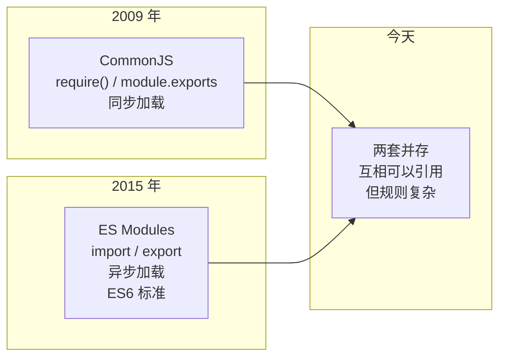
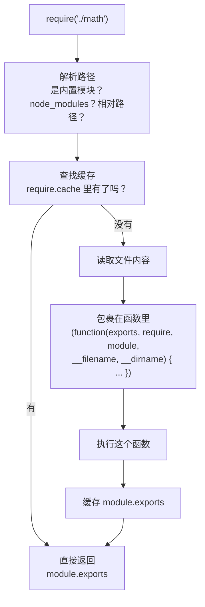

# Node.js 模块系统：ESM 和 CommonJS 到底哪里不一样

> 基于 Node.js 22。ESM 自 v12.17 起稳定支持（实验性标志在 v8+）。

## 同一个 `import`，三种不同的行为

```javascript
// 这段代码在什么条件下能运行？
import fs from 'fs';           // ① 内置模块
import express from 'express';  // ② npm 包
import { helper } from './util.js';  // ③ 本地文件
```

答案取决于你的 `package.json` 里有没有 `"type": "module"`、文件后缀是 `.js` 还是 `.mjs`、`express` 的 `package.json` 里有没有 `"exports"` 字段——以及你的 Node.js 版本。

Node.js 的模块系统是历史上积累最厚的设计债。这篇文章把四种模块格式（CJS、ESM、CJS-in-ESM、ESM-in-CJS）的加载规则一次性讲清楚。

## 两套模块系统的并存：为什么会有这个局面



Node.js 2009 年诞生时选择了 CommonJS（`require`）——因为那时候 JavaScript 还没有标准模块系统。ES6 2015 年才出了 `import/export` 标准，Node.js 又花了几年才稳定支持。结果就是两套系统同时存在，而且**互操作规则极其微妙**。

## CommonJS 的加载机制：`require` 到底做了什么

```javascript
// math.js
console.log('math.js 开始执行');
module.exports.add = (a, b) => a + b;
console.log('math.js 执行结束');

// main.js
const math = require('./math');
console.log(math.add(1, 2));
// 输出：
// math.js 开始执行         ← require 是同步的，会执行整个模块
// math.js 执行结束
// 3
```

`require` 的完整流程：



五个关键行为：

**① 缓存是单例的**

```javascript
// a.js
module.exports = { count: 0, inc() { this.count++ } };

// b.js
const a1 = require('./a');
const a2 = require('./a');
console.log(a1 === a2);  // → true —— 同一个对象
a1.inc();
console.log(a2.count);    // → 1 —— 共享状态
```

**② `module.exports` 和 `exports` 的坑**

```javascript
// ✅ 给 module.exports 赋值 —— 有效
module.exports = function() {};

// ❌ 给 exports 赋值 —— 无效，因为 exports 只是一个引用
exports = function() {};

// ✅ 给 exports 添加属性 —— 有效
exports.add = (a, b) => a + b;
```

原理：每个模块文件被包裹在 `function(exports, require, module, __filename, __dirname)` 里执行。`exports` 是这个函数的参数——初始时指向 `module.exports`，但给它赋一个新值就等于改了局部变量的引用，不再影响 `module.exports`。

**③ 循环引用是半成品**

```javascript
// a.js
console.log('a 开始');
exports.b = require('./b');
exports.a_done = true;
console.log('a 结束');

// b.js
console.log('b 开始');
exports.a = require('./a');
exports.b_done = true;
console.log('b 结束');

// main.js
const a = require('./a');
console.log(a);
// 输出：
// a 开始
// b 开始
// b 结束
// a 结束
// { b: { a: { b_done: true }, b_done: true }, a_done: true }
//                               ↑ a 在 b 里是不完整的 —— a_done 还没有
```

当 `b.js` 里 `require('./a')` 时，`a.js` 还在执行中——Node.js 返回的是**当时已经赋值到 `module.exports` 上的那部分**。循环依赖不报错，但拿到的对象可能不完整。

**④ 动态 require 可以放在任何地方**

```javascript
if (process.platform === 'win32') {
    const win = require('./platform/win');
    win.setup();
} else {
    const unix = require('./platform/unix');
    unix.setup();
}
```

因为 CJS 是同步的，`require` 可以放在 `if` 里、函数里、甚至循环里。

**⑤ 模块路径解析算法**

```
require('./util')
  → 当前目录/util.js
  → 当前目录/util/index.js
  → 当前目录/util/package.json → main 字段

require('express')
  → 当前目录/node_modules/express/index.js
  → 父目录/node_modules/express/index.js
  → ... 一直向上到根目录
```

## ES Modules 的加载机制

```javascript
// math.mjs
console.log('math.mjs 开始执行');
export const add = (a, b) => a + b;
console.log('math.mjs 执行结束');

// main.mjs
import { add } from './math.mjs';
// ↑ import 是静态的 —— 必须在文件顶层，不能在 if 里
console.log(add(1, 2));
// 输出同上，但 import 是异步加载的
```

**ESM 和 CJS 的核心差异：**

| | CommonJS | ES Modules |
|---|---|---|
| 加载时机 | 运行时同步加载 | **编译时静态分析** |
| 语法限制 | `require` 可以在任何地方 | `import` **必须在文件顶层** |
| 缓存行为 | 缓存 `module.exports` 对象 | 缓存模块实例 |
| 导出 | `module.exports` 值拷贝引用 | `export` **实时绑定** |
| `this` | 指向 `module.exports` | `undefined` |
| `__dirname` | 可用 | **不可用**——用 `import.meta.url` |
| 循环依赖 | 给半成品 | 实时绑定，不产生半成品 |

### ESM 的实时绑定

```javascript
// counter.mjs
export let count = 0;
export function increment() { count++; }

// main.mjs
import { count, increment } from './counter.mjs';
console.log(count);  // → 0
increment();
console.log(count);  // → 1  ← 不是 0！ESM export 是实时绑定
```

CJS 里 `require('./a').count` 拿到的是**值的快照**，ESM 里 `import { count }` 拿到的是**值的实时引用**。这决定了循环依赖的表现完全不同——ESM 里循环依赖不会出现"半成品"，因为每个引入的变量都是对导出模块实际值的实时引用。

## 互操作：CJS 如何导入 ESM，反过来的呢

### CJS 文件导入 ESM 模块

```javascript
// ❌ 不能直接用 require 导入 ESM 模块
const esmModule = require('./esm-module.mjs');
// → Error [ERR_REQUIRE_ESM]: require() of ES Module not supported

// ✅ 只能用动态 import()
const esmModule = await import('./esm-module.mjs');
```

### ESM 文件导入 CJS 模块

```javascript
// ✅ ESM 可以直接 import CJS 模块
import cjsModule from './cjs-module.cjs';
// cjsModule 就是 module.exports 的值

// ✅ 也可以命名导入——但只能导入 module.exports 的顶层属性
import { add } from './cjs-module.cjs';

// ✅ 内置模块有具名导出的包装
import { readFile } from 'fs';
```

关键理解：当 ESM `import` 一个 CJS 模块时，Node.js 用 `cjs-module-lexer` 去**静态扫描** CJS 文件的 `exports.xxx` 赋值——所以它可以做到具名导入支持。但当 CJS 模块用了动态 `exports[name] = ...` 或循环取属性时，这个静态分析就失败了。

### `package.json` 的 `"type": "module"` 字段

```json
{
    "type": "module"    // ← 这个目录下 .js 文件默认当 ESM
}
```

如果没有这个字段，`.js` 文件默认是 CJS。三种方式明确指定模块类型：

| 文件后缀 | 总是被当作 | 覆盖 `"type"` 字段？ |
|---|---|---|
| `.mjs` | ESM | ✅ |
| `.cjs` | CJS | ✅ |
| `.js` | 取决于 `"type"` | N/A |

### `"exports"` 字段：包的公共 API

```json
{
    "name": "my-lib",
    "exports": {
        ".": {
            "import": "./dist/index.mjs",
            "require": "./dist/index.cjs"
        },
        "./helpers": {
            "import": "./dist/helpers.mjs",
            "require": "./dist/helpers.cjs"
        }
    }
}
```

有了 `"exports"` 字段后：
- `require('my-lib')` → `./dist/index.cjs`
- `import 'my-lib'` → `./dist/index.mjs`
- `require('my-lib/internal')` → ❌ 拒绝 —— 只有 exports 里声明了才能导入

最后一点很重要：`"exports"` 是包的**围墙**。定义了 `"exports"` 但没声明 `"./internal"` 的话，外部就不能 `require('my-lib/internal.js')`——即使文件存在。

## 实战：迁移一个 CJS 包到 ESM

```javascript
// ===== 之前：CJS =====
// package.json: 无 "type" 字段
// index.js:
const fs = require('fs');
const path = require('path');

function readConfig(name) {
    const configPath = path.join(__dirname, 'config', `${name}.json`);
    return JSON.parse(fs.readFileSync(configPath, 'utf-8'));
}

module.exports = { readConfig };
```

```javascript
// ===== 之后：ESM =====
// package.json: { "type": "module" }
// index.js:
import { readFileSync } from 'fs';
import { join, dirname } from 'path';
import { fileURLToPath } from 'url';

const __filename = fileURLToPath(import.meta.url);   // ESM 里没有 __filename
const __dirname = dirname(__filename);                // ESM 里没有 __dirname

export function readConfig(name) {
    const configPath = join(__dirname, 'config', `${name}.json`);
    return JSON.parse(readFileSync(configPath, 'utf-8'));
}
```

四个必须改的地方：
1. `require` → `import`（且必须放在文件顶层）
2. `module.exports` → `export`
3. `__filename`、`__dirname` → `import.meta.url` + `fileURLToPath`
4. 所有用 `require('./xxx')` 导入的文件也必须改（或改后缀为 `.cjs`，或丢在 CJS 文件中 `await import()`）

## 你需要知道的最后一个规则

**在一个 ESM 代码文件中，不能用 `require`——除非你显式创建它：**

```javascript
import { createRequire } from 'module';
const require = createRequire(import.meta.url);
const pkg = require('./legacy-lib');  // 现在能用了，但只是权宜之计
```

这只应该用于迁移期间的临时桥接。长期来说，要么全迁移到 ESM，要么接受 CJS——混用只会让你每次调 `import/require` 时都要在脑子里跑一遍上面的所有规则。

## 小结

记住四件事就够了：

1. **CJS 是同步的、运行时的**——`require` 在任何地方都能用，返回的是 `module.exports` 的快照。循环依赖返回半成品。
2. **ESM 是静态的、编译时的**——`import` 只能在顶层用，导出是实时绑定。循环依赖不产生半成品。
3. **ESM 可以直接 import CJS，但反过来不行**——CJS 想引入 ESM 只能用 `await import()`。
4. **`"type": "module"` + `.mjs`/`.cjs` 后缀 + `"exports"` 字段**——三者共同决定了任何给定文件的模块类型。
