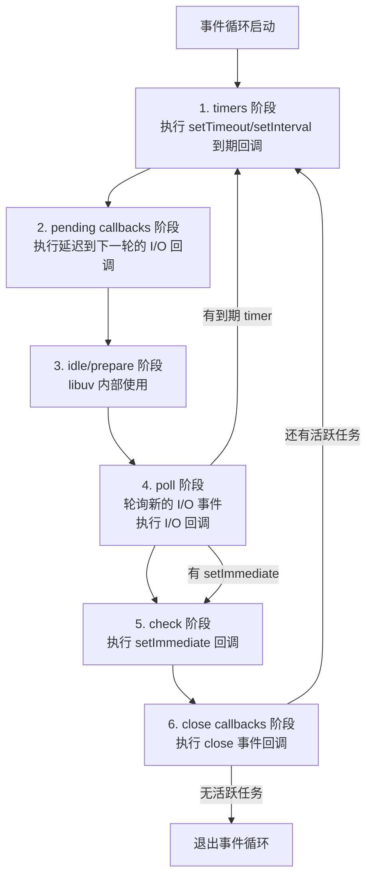

# Node.js 事件循环：理解了它才算真会用

> 本文基于 Node.js 24 LTS。

Node.js 是单线程的——这句话正确但不完整。正确的地方是：你的 JavaScript 代码确实跑在一个主线程上。不完整的地方是：I/O、文件读写、DNS 解析、加密运算全在背后的线程池或操作系统内核里跑。把这两层分开的是**事件循环**。

## 一张图说清事件循环



六个阶段，每个阶段有自己的回调队列。事件循环顺序遍历它们——一圈叫一个 tick。

## 核心阶段分解

### 1. timers

`setTimeout` 和 `setInterval` 的回调在这里执行。但要理解一个关键点：**时间到了不代表立即执行**。

```js
const start = Date.now();

setTimeout(() => {
    console.log(`延迟 ${Date.now() - start}ms`);
}, 100);

// 模拟耗时操作——阻塞 200ms
const end = Date.now();
while (Date.now() - end < 200) {}
```

输出不是 `延迟 100ms`，而是 `延迟 ~200ms`。timer 的回调在前一轮 poll 阶段结束时检查——如果 poll 被阻塞了 200ms，timer 就晚 200ms 执行。`setTimeout(cb, 0)` 从来不是真的 0ms，它是最快 1ms（浏览器中）或由 poll 阶段决定（Node.js 中）。

### 2. poll

这是事件循环的心脏。它做两件事：

1. 计算需要阻塞多久来等待 I/O
2. 处理 poll 队列中的事件

如果 poll 队列为空：
- 有 `setImmediate` 回调 → 去 check 阶段
- 有到期的 timer → 回到 timers 阶段
- 都没有 → 阻塞等待，直到新的 I/O 事件到达

这就是 Node.js 在空闲时几乎不消耗 CPU 的原因——它根本不是忙等，而是在内核里 `epoll_wait`（Linux）/`kqueue`（macOS）/`IOCP`（Windows）。

### 3. check

只有 `setImmediate` 的回调。这是唯一一个可以「插队」到下一轮最前面的机制：

```js
setTimeout(() => console.log('timeout'), 0);
setImmediate(() => console.log('immediate'));
```

输出顺序**不确定**——取决于事件循环启动时 tick 的耗时。如果启动时用时超过 1ms，timer 到期先执行；如果少于 1ms，timer 还没到期，先到 check 阶段执行 immediate。

用 `setImmediate` 的场景：你有一个 I/O 回调，想在**它之后、且在接下来的 timers 之前**执行一段逻辑。

## 微任务（microtask）：藏在水下的队列

每个阶段之间会清空微任务队列：


```js
setTimeout(() => {
    console.log('1. timeout');
    Promise.resolve().then(() => console.log('2. promise'));
    process.nextTick(() => console.log('3. nextTick'));
}, 0);

// 输出顺序：
// 1. timeout
// 3. nextTick    ← 在 Promise 之前
// 2. promise
```

`process.nextTick` 的优先级比 `Promise` 更高。两者在同一个阶段结束时清空，但 nextTick 在前。

一个经典的 vs 问题：`setTimeout(fn, 0)` 和 `setImmediate(fn)` 有什么区别？

```js
const fs = require('fs');

fs.readFile(__filename, () => {
    setTimeout(() => console.log('timeout'), 0);
    setImmediate(() => console.log('immediate'));
});

// 输出永远是：
// immediate
// timeout
```

**在 I/O 回调里，`setImmediate` 永远先于 `setTimeout(fn, 0)` 执行。** 因为在 poll 阶段处理完 I/O 回调后，事件循环直接进入 check 阶段去处理 setImmediate——它不会回头检查 timer。

## 线程池：单线程背后的多线程

Node.js 不是全网单线程。libuv 维护了一个默认 4 个线程的线程池：

```js
const crypto = require('crypto');
const start = Date.now();

// 同时启动 4 个 pbkdf2
for (let i = 0; i < 4; i++) {
    crypto.pbkdf2('password', 'salt', 100000, 512, 'sha512', () => {
        console.log(`${i}: ${Date.now() - start}ms`);
    });
}
```

4 个任务几乎同时完成——每个占一个线程。如果你加到 5 个任务：

```
0: 1200ms
1: 1250ms
2: 1280ms
3: 1310ms
4: 2400ms  ← 等线程池里有空闲才开始
```

第 5 个任务卡在队列里等到前 4 个中有完成的才开始。线程池大小可以用 `UV_THREADPOOL_SIZE` 环境变量调整：

```bash
UV_THREADPOOL_SIZE=8 node app.js
```

这解释了为什么 CPU 密集操作（加密、压缩、图片处理）会拖慢整个应用——它们占用了线程池，I/O 操作用不到线程被阻塞。

## process.nextTick 的陷阱

它的名字暗示「下一个 tick」，但实际行为是「**当前阶段结束、下一个阶段开始之前**」。递归调用会饿死事件循环：

```js
function recursiveTick() {
    process.nextTick(recursiveTick);
}
recursiveTick();

setTimeout(() => console.log('永远不会执行'), 0);
```

`setTimeout` 的回调永远不会执行——每个 tick 结束时 nextTick 队列就被新任务填满，事件循环永远到不了 timers 阶段。`process.maxTickDepth` 能限制深度（默认 1000），但更好的做法是用 `setImmediate` 替代递归的 `process.nextTick`——它把调度推迟到下一轮事件循环。

## 总结

- **6 个阶段顺序执行**：timers → pending → idle → poll → check → close
- **poll 是核心**：I/O 回调在这里处理，空闲时在内核中阻塞而非忙等
- **微任务在阶段之间清空**：nextTick 优先级高于 Promise
- **I/O 回调中 setImmediate 优于 setTimeout(fn, 0)**
- **线程池默认 4 个线程**：加密、压缩、文件 I/O 用的都是它
- **永远不要在 process.nextTick 里递归**

> 参考：[Node.js 事件循环文档](https://nodejs.org/en/learn/asynchronous-work/event-loop-timers-and-nexttick)
