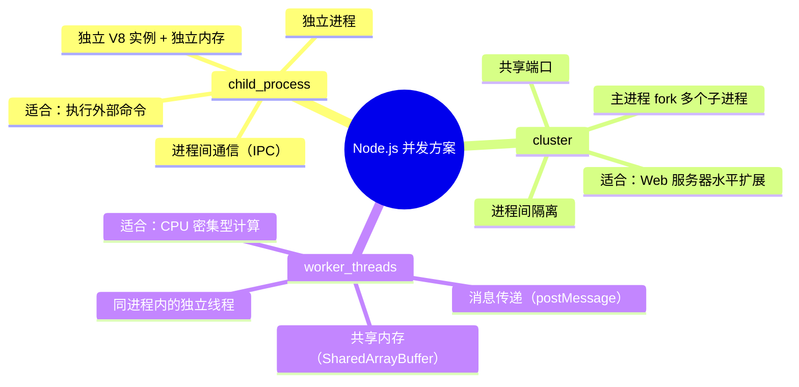
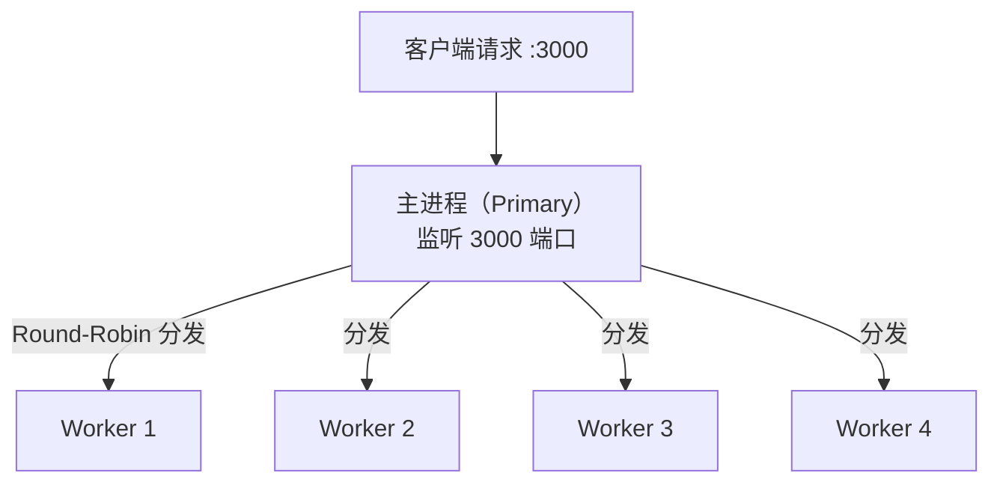
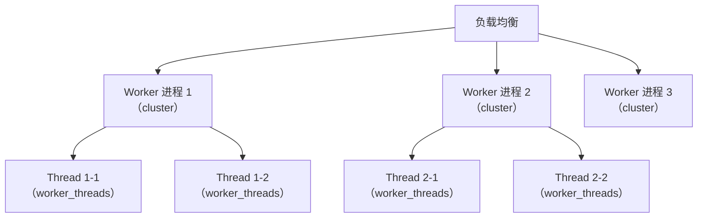
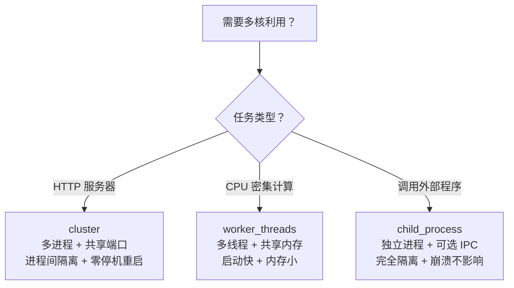

# Node.js 进程与线程：cluster、worker_threads 与 child_process 怎么选

> 本文基于 Node.js 22.x，涉及特性会标注最低支持版本。

## 一个 Node 进程只能用一个 CPU 核心

Node.js 是单线程的——你的 JavaScript 代码跑在一个主线程上。不管服务器有多少核，一个 Node 进程默认只用一个。

```javascript
// 这段代码只跑在一个 CPU 核心上
const http = require('http');

http.createServer((req, res) => {
  // 所有请求都在同一个线程处理
  res.end('Hello');
}).listen(3000);
```

如果你有一台 16 核的服务器，上面跑了一个 Node 进程——15 个核在围观，1 个核在干活。

这不是 Bug。Node.js 的设计哲学是**用异步 I/O 解决并发，而不是用多线程**。对于 I/O 密集型任务（大部分 Web 应用），单线程 + 事件循环足够高效。但对于 CPU 密集型任务（图像处理、加密、大数据计算），一个请求就能堵住所有其他请求。

Node.js 给了三种方案来利用多核：



## child_process — 跑一个完全独立的进程

`child_process` 是最原始的方案——启动一个全新的操作系统进程，有自己的 V8 实例、自己的内存空间、自己的事件循环。

```javascript
const { exec, execFile, spawn, fork } = require('child_process');

// exec：执行 shell 命令，缓冲全部输出后回调
exec('cat /proc/cpuinfo | grep "model name" | head -1', (err, stdout, stderr) => {
  console.log(stdout);  // model name: Intel(R) Core(TM) i7-9750H
});

// spawn：流式处理，适合大输出
const ls = spawn('ls', ['-la']);
ls.stdout.on('data', (chunk) => {
  console.log(`输出: ${chunk}`);
});

// execFile：执行可执行文件，不经过 shell（更安全）
execFile('/usr/bin/node', ['--version'], (err, stdout) => {
  console.log(stdout);  // v22.11.0
});
```

### exec vs spawn vs fork

| 方法 | 输出 | 适用场景 |
|------|------|----------|
| `exec` | 缓冲全部输出后回调 | 命令输出小（< 200KB）、只需最终结果 |
| `spawn` | 流式输出，逐 chunk 返回 | 输出可能很大、需要实时处理 |
| `fork` | 同 spawn，但额外建立 IPC 通道 | 需要和子进程通信（发消息） |

### fork — 可以通信的子进程

`fork` 是 `spawn` 的变体——专门为 Node.js 子进程设计，自动建立 IPC 通道：

```javascript
// parent.js
const { fork } = require('child_process');

const child = fork('./child.js');

// 发消息给子进程
child.send({ task: 'calculate', data: [1, 2, 3, 4, 5] });

// 收子进程的消息
child.on('message', (msg) => {
  console.log(`父进程收到: ${JSON.stringify(msg)}`);
  // → 父进程收到: {"result":15}
  child.disconnect();  // 关闭 IPC 通道
});

// child.js
process.on('message', (msg) => {
  if (msg.task === 'calculate') {
    const sum = msg.data.reduce((a, b) => a + b, 0);
    process.send({ result: sum });
  }
});
```

IPC 底层用的是操作系统管道（pipe）或 Unix domain socket——数据需要序列化（JSON 或 structured clone），传大对象时有性能开销。

### 什么时候用 child_process

- 执行外部命令（`ffmpeg` 转码、`git` 操作、`curl` 下载）
- 跑一个非 Node.js 的程序（Python 脚本、Go 二进制）
- 需要完全隔离子进程——崩溃不影响父进程

## cluster — 多进程 Web 服务器

`cluster` 是专门为 HTTP 服务器设计的多进程方案。它 fork 多个 worker 进程，共享同一个 TCP 端口。

```javascript
const cluster = require('cluster');
const http = require('http');
const numCPUs = require('os').cpus().length;

if (cluster.isPrimary) {
  console.log(`主进程 ${process.pid} 正在运行`);

  // Fork worker——有几个核就 fork 几个
  for (let i = 0; i < numCPUs; i++) {
    cluster.fork();
  }

  cluster.on('exit', (worker, code, signal) => {
    console.log(`Worker ${worker.process.pid} 挂了，重启`);
    cluster.fork();  // 自动重启——保证服务不中断
  });
} else {
  // Worker 进程——处理请求
  http.createServer((req, res) => {
    // 大量计算也不会阻塞其他 worker
    const result = fibonacci(40);
    res.end(`Worker ${process.pid}: ${result}`);
  }).listen(3000);

  console.log(`Worker ${process.pid} 已启动`);
}
```

执行后：

```bash
node server.js
```

```
主进程 12345 正在运行
Worker 12346 已启动
Worker 12347 已启动
Worker 12348 已启动
Worker 12349 已启动
# 8核机器 → 8个worker
```

### 共享端口怎么做到的



主进程不处理请求——它只负责 **fork worker 和分发连接**。分发算法是 Round-Robin（轮询），但操作系统层面的 SO_REUSEPORT 从 Node 16+ 开始可用，让每个 worker 直接监听同一端口（不经过主进程分发），性能更高。

### 进程间通信

```javascript
// 主进程发消息
for (const id in cluster.workers) {
  cluster.workers[id].send({ type: 'reload-config' });
}

// Worker 收消息
process.on('message', (msg) => {
  if (msg.type === 'reload-config') {
    config = loadConfig();  // 重新加载配置
  }
});

// Worker 发消息给主进程
process.send({ type: 'metric', cpu: process.cpuUsage() });
```

### 零停机重启

```javascript
// 主进程收到 SIGHUP 信号 → 逐个重启 worker
process.on('SIGHUP', () => {
  const workers = Object.values(cluster.workers);

  let i = 0;
  function restartNext() {
    if (i >= workers.length) return;
    const oldWorker = workers[i];
    const newWorker = cluster.fork();

    newWorker.on('listening', () => {
      oldWorker.disconnect();  // 不再接收新连接
      setTimeout(() => oldWorker.kill(), 5000);  // 5 秒后杀旧 worker
      i++;
      restartNext();
    });
  }
  restartNext();
});
```

每次只重启一个 worker——其他 worker 继续处理请求。这是生产环境中最常用的零停机更新方式。

### cluster 的局限

- Worker 之间**不共享内存**——不能在 worker A 里改一个全局变量、worker B 能看到
- Session 状态必须存在外部存储（Redis、数据库），不能用内存
- 每个 worker 有独立的 V8 实例，**内存占用 = 单进程 × worker 数**

## worker_threads — 真正的多线程

`cluster` 解决的是「一台机器有多个核心，一个进程用一个」——但它 fork 的是**进程**，每个进程有独立的 V8 实例，启动慢、内存占用大。

`worker_threads`（Node 10.5+ 实验性，Node 12+ 稳定）是真正的多线程——**同一个进程内跑多个线程，共享同一个 V8 实例**。

```javascript
const { Worker, isMainThread, parentPort } = require('worker_threads');

// worker.js
if (!isMainThread) {
  // 这是 Worker 线程跑的逻辑
  function heavyCompute(n) {
    let result = 0;
    for (let i = 0; i < n; i++) {
      result += Math.sqrt(i) * Math.random();
    }
    return result;
  }

  parentPort.postMessage(heavyCompute(10_000_000));
}
```

```javascript
// main.js
const { Worker } = require('worker_threads');

function runComputeInThread(iterations) {
  return new Promise((resolve, reject) => {
    const worker = new Worker('./worker.js');

    worker.on('message', resolve);
    worker.on('error', reject);
    worker.on('exit', (code) => {
      if (code !== 0) reject(new Error(`Worker 异常退出: ${code}`));
    });
  });
}

// 同时跑 4 个计算——真正并行
(async () => {
  console.time('并行计算');
  const results = await Promise.all([
    runComputeInThread(10_000_000),
    runComputeInThread(10_000_000),
    runComputeInThread(10_000_000),
    runComputeInThread(10_000_000),
  ]);
  console.timeEnd('并行计算');
  // → 并行计算: 2.3s（4 核同时算）
})();
```

同样 4 个计算如果在主线程串行：

```javascript
console.time('串行计算');
for (let i = 0; i < 4; i++) {
  heavyCompute(10_000_000);
}
console.timeEnd('串行计算');
// → 串行计算: 9.1s（一个核轮流算 4 次）
```

### SharedArrayBuffer — 线程间共享内存

每个 worker 有自己的堆（heap），但可以通过 `SharedArrayBuffer` 共享一块内存：

```javascript
// main.js
const { Worker } = require('worker_threads');

// 分配 4 字节的共享内存
const sharedBuffer = new SharedArrayBuffer(4);
const sharedArray = new Int32Array(sharedBuffer);

// 主线程初始化
sharedArray[0] = 0;

const worker = new Worker('./worker.js', {
  workerData: sharedBuffer
});

// 主线程修改共享内存（原子操作）
Atomics.store(sharedArray, 0, 42);

// worker.js
const { workerData, parentPort } = require('worker_threads');
const sharedArray = new Int32Array(workerData);

// Worker 线程读取共享内存（原子操作）
const value = Atomics.load(sharedArray, 0);
console.log(value);  // 42
```

`Atomics` 保证了多线程并发读写的安全性——不需要 mutex，硬件级的原子操作。

### worker_threads vs cluster

| | cluster | worker_threads |
|------|---------|----------------|
| 隔离级别 | 进程级（独立内存、独立 V8） | 线程级（共享 V8、独立 heap） |
| 启动代价 | 高（~30ms）+ 内存（~30MB） | 低（~5ms）+ 内存（~2MB） |
| 通信方式 | IPC（序列化） | postMessage + SharedArrayBuffer |
| 共享内存 | 不支持 | SharedArrayBuffer |
| 适合任务 | Web 服务器水平扩展 | CPU 密集型计算 |
| 崩溃影响 | 单个 worker 崩溃不影响他人 | 线程崩溃可能影响主进程 |

## 实际选型：三个场景

### 场景一：Web 服务器 → cluster

```
需求：16 核服务器，高并发 HTTP API
选择：cluster，fork 16 个 worker
理由：一个请求挂掉不影响其他请求，零停机重启
```

### 场景二：图片批量处理 → worker_threads

```javascript
const { Worker } = require('worker_threads');

async function processImages(images) {
  const chunkSize = Math.ceil(images.length / 4);
  const chunks = [0, 1, 2, 3].map(i =>
    images.slice(i * chunkSize, (i + 1) * chunkSize)
  );

  const workers = chunks.map(chunk => {
    return new Promise((resolve, reject) => {
      const worker = new Worker('./image-processor.js', {
        workerData: { images: chunk }
      });
      worker.on('message', resolve);
      worker.on('error', reject);
    });
  });

  return Promise.all(workers);
}
```

```
需求：1000 张图片需要缩放、压缩、加水印
选择：worker_threads，4 个线程各处理 250 张
理由：CPU 密集型、共享内存传小数据、启动代价低
```

### 场景三：调用外部程序 → child_process

```javascript
const { execFile } = require('child_process');

execFile('ffmpeg', [
  '-i', 'input.mp4',
  '-vf', 'scale=1280:720',
  '-c:v', 'libx264',
  'output.mp4'
], (err, stdout, stderr) => {
  if (err) console.error('转码失败', err);
  else console.log('转码完成');
});
```

```
需求：调用 ffmpeg 转码视频
选择：child_process（execFile）
理由：ffmpeg 不是 Node 程序，不需要 IPC
```

## 串联使用：cluster + worker_threads

对于 CPU 密集型的 Web 服务（比如 AI 推理接口），两种方案可以组合：

```javascript
// cluster 负责水平扩展请求处理
// worker_threads 负责单个请求内的并行计算

if (cluster.isPrimary) {
  for (let i = 0; i < numCPUs; i++) cluster.fork();
} else {
  // Worker 进程中再用 worker_thread 处理计算
  http.createServer(async (req, res) => {
    const worker = new Worker('./ml-inference.js');
    const result = await new Promise(r => worker.on('message', r));
    res.end(JSON.stringify(result));
  }).listen(3000);
}
```



## 小结



三个方案的共同点：**都绕过了单线程限制，都通过消息传递而非共享状态来通信**。这是 Node.js 对并发问题的核心态度——进程和线程是执行单元，通信靠消息，共享靠自觉。如果你发现自己频繁在 worker 之间通过 `SharedArrayBuffer` 传复杂对象，大概率是你选错了方案——换 `cluster`。

理解这三个方案的差异，比背它们的 API 重要得多。
