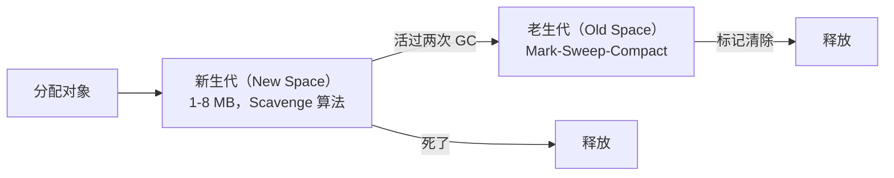

# Node.js V8 内存管理：你的内存去哪了

> 你的 Node.js 服务跑了三天，内存从 200MB 涨到 2GB。不是内存泄漏——是你不知道怎么查它到底吃了多少、吃在哪。这篇文章从 V8 的堆结构讲到 Chrome DevTools 抓 snapshot，教你看懂内存。

本文基于 Node.js v24。

## V8 内存全景图

Node.js 进程的内存不等于 V8 堆。先搞清楚谁是谁：

```text
Node.js 进程内存
├── V8 堆（Heap）         ← 你的 JS 对象在这里
│   ├── New Space          ← 新生代（1-8 MB），放短命对象
│   └── Old Space          ← 老生代，放活过两次 GC 的对象
├── 外部内存（External）    ← Buffer、ArrayBuffer（不在 V8 堆里！）
├── 代码段                 ← 编译后的机器码
├── 栈（Stack）            ← 函数调用帧、局部变量
└── C++ 对象              ← libuv、native addon
```

**最容易搞错的一件事**：`Buffer` 分配的内存不在 V8 堆里。你用 `process.memoryUsage()` 看到的 `heapUsed` 不包含 Buffer。这就是为什么「堆用了 50MB 但进程 RSS 800MB」——差别在 Buffer 和 native 内存。

```javascript
// process.memoryUsage() 告诉你什么
console.log(process.memoryUsage());
// {
//   rss: 80_000_000,        // 进程总内存（OS 视角）
//   heapTotal: 10_000_000,  // V8 堆总大小
//   heapUsed: 6_000_000,    // V8 堆已用
//   external: 2_000_000,    // Buffer 等外部内存
//   arrayBuffers: 500_000   // ArrayBuffer 专用
// }
```

## 新生代和老生代：分代回收

V8 用一个基本假设来优化 GC：**大多数对象死得很快**。



### 新生代：Scavenge（复制算法）

新生代分两半：From 空间和 To 空间。GC 时把活对象从 From 复制到 To，然后清空 From。复制只复制活对象——所以新生代死了越多越快。代价是只用了一半空间。

### 老生代：Mark-Sweep-Compact

活过两次 Scavenge 的对象晋升到老生代。老生代用三阶段 GC：

1. **Mark（标记）**——从根对象出发，遍历所有可达对象并标记
2. **Sweep（清除）**——回收没被标记的内存
3. **Compact（整理）**——碎片太多了才触发，把活对象挪到一起

## 怎么查内存问题

### 1. 先看趋势

```javascript
// 最简单的内存监控
setInterval(() => {
    const mu = process.memoryUsage();
    console.log({
        heapUsedMB: (mu.heapUsed / 1024 / 1024).toFixed(1),
        externalMB: (mu.external / 1024 / 1024).toFixed(1),
        rssMB: (mu.rss / 1024 / 1024).toFixed(1),
    });
}, 5000);
```

如果 `heapUsed` 持续上升、GC 后不下降——大概率是内存泄漏。如果 `external` 持续上升——大概率是 Buffer 没释放。

### 2. 堆快照对比

```javascript
// 在你的代码里打两个 snapshot
const v8 = require('v8');
const fs = require('fs');

// 第 1 个快照：请求前
fs.writeFileSync('heap-before.heapsnapshot', v8.writeHeapSnapshot());

// ... 跑 10000 个请求 ...

// 第 2 个快照：请求后
fs.writeFileSync('heap-after.heapsnapshot', v8.writeHeapSnapshot());
```

把两个 `.heapsnapshot` 文件拖进 Chrome DevTools（Memory → Load），对比两次之间多了什么对象。

### 3. 手动触发 GC 排查

```bash
node --expose-gc app.js
```

```javascript
// 在你的代码里手动 GC 后看内存有没有回来
global.gc();
console.log(process.memoryUsage().heapUsed);
```

GC 后内存降回来——不是泄漏，是 GC 没来得及跑。GC 后还是不降——真泄漏了。

### 4. 用 `--inspect` 远程调试

```bash
node --inspect app.js
# Chrome 打开 chrome://inspect
# Memory 面板 → Take heap snapshot → 看 Constructor 列
```

按 `Shallow Size` 或 `Retained Size` 排序。Retained Size 更重要——它代表「删了这个对象能释放多少内存」。

## 经典泄漏模式

### 1. 全局变量/闭包持有大对象

```javascript
// ❌ 泄漏：每次请求都往 cache 里塞，永不过期
const cache = {};
app.get('/data/:id', (req, res) => {
    const id = req.params.id;
    if (!cache[id]) {
        cache[id] = heavyComputation();  // 只增不减
    }
    res.json(cache[id]);
});
```

```javascript
// ✅ 加 LRU 淘汰
const { LRUCache } = require('lru-cache');
const cache = new LRUCache({ max: 500 });
```

### 2. 事件监听器不清理

```javascript
// ❌ 每次请求加一个监听器，永不摘除
const emitter = new EventEmitter();
app.get('/stream', (req, res) => {
    emitter.on('data', (chunk) => {
        res.write(chunk);
    });
});
```

```javascript
// ✅ once 或手动 removeListener
app.get('/stream', (req, res) => {
    const handler = (chunk) => res.write(chunk);
    emitter.on('data', handler);
    req.on('close', () => emitter.removeListener('data', handler));
});
```

### 3. 定时器不清理

```javascript
// ❌ 闭包引用了 response，只要定时器在跑，response 永远不会被 GC
app.get('/poll', (req, res) => {
    setInterval(() => {
        res.write('data\n');
    }, 1000);
    // 客户端断开后定时器还在跑
});
```

### 4. Buffer 泄漏

```javascript
// ❌ 每个 Buffer 的 external 内存不受 V8 堆限制
// 堆才 50MB，但 Buffer 分配已经用了 2GB
const buffers = [];
app.get('/upload', (req, res) => {
    const chunks = [];
    req.on('data', chunk => chunks.push(chunk));
    req.on('end', () => {
        buffers.push(Buffer.concat(chunks));  // 不释放
        res.end('ok');
    });
});
```

## 内存优化四招

### 1. `--max-old-space-size`——限制老生代

```bash
# V8 默认老生代上限 ~1.4GB（64 位）
# 内存够了就设小点，让 GC 早点跑
node --max-old-space-size=512 app.js
```

### 2. 对象复用——Object Pool

```javascript
class ObjectPool {
    #pool = [];
    #factory;
    #reset;
    
    constructor(factory, reset, size = 100) {
        this.#factory = factory;
        this.#reset = reset;
        for (let i = 0; i < size; i++) {
            this.#pool.push(factory());
        }
    }
    
    acquire() {
        return this.#pool.pop() || this.#factory();
    }
    
    release(obj) {
        this.#reset(obj);
        this.#pool.push(obj);
    }
}
```

### 3. Buffer 池——高频分配时

```javascript
const pool = Buffer.allocUnsafe(64 * 1024);  // 预分配 64K
let offset = 0;

function allocBuffer(size) {
    if (offset + size > pool.length) {
        offset = 0;  // 简单循环，生产环境用正经的 buffer pool
    }
    const buf = pool.subarray(offset, offset + size);
    offset += size;
    return buf;
}
```

### 4. WeakRef——缓存大数据但不阻止 GC

```javascript
const cache = new Map();

function getCached(key) {
    const ref = cache.get(key);
    if (ref) {
        const value = ref.deref();
        if (value !== undefined) return value;  // 还在
        cache.delete(key);  // 已被 GC
    }
    const value = heavyComputation(key);
    cache.set(key, new WeakRef(value));
    return value;
}
```

## 小结

V8 内存问题排查三步：

1. **`process.memoryUsage()` 看大趋势**——heapUsed、external、rss 哪个在涨
2. **堆快照对比看细节**——两个 snapshot 拖进 DevTools，对比 `(Delta)` 列
3. **`--expose-gc` + 手动 GC 验真假**——GC 后不降才是真泄漏

记住：**不是所有内存增长都是泄漏**。GC 有惰性，V8 觉得还有内存就不会急着回收。但趋势不降就是问题——把它当成泄漏来排查。

---

**返回：** [Node.js 笔记](index.md)
